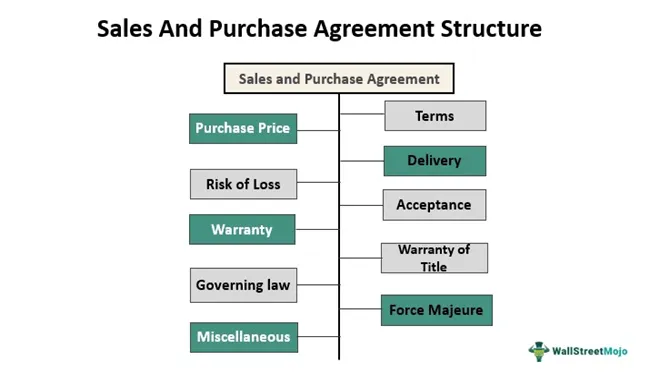

In this article, we explore the critical business documents referred to as Sales and Purchase Agreements (SPAs). SPAs serve as the backbone of numerous industries by clearly defining the terms of a transaction between a buyer and a seller. This transparency is vital for ensuring that both parties have a mutual understanding and agreement before finalizing any deal. SPAs are employed extensively in transactions that demand detailed negotiation and precision. 

The practical applications of SPAs span from real estate transactions, where they help negotiate sales prices and terms, to corporate mergers and acquisitions, which rely on these agreements to detail the exchange of assets. In addition, SPAs are indispensable in commodity markets, such as the sale of crude oil and agricultural products, by specifying the terms under which these high-value commodities are traded. Their role in international deals, especially in cross-border transactions, further underscores the importance of well-drafted SPAs to mitigate risks associated with fluctuating market conditions and diverse legal environments.

Besides traditional uses, SPAs play a significant role in modern financial practices, particularly algorithmic trading. This method involves using pre-set rules and computer algorithms to execute trades and requires robust agreements to secure the terms of large-volume trades, especially in volatile markets. Through algorithmic trading, SPAs contribute to the efficiency of financial markets by enhancing transparency and trust among parties involved.

This article provides a comprehensive understanding of how SPAs function and their significance for both buyers and sellers engaged in various forms of business transactions. It aims to equip readers with the necessary knowledge to effectively negotiate SPAs, thus allowing them to participate more confidently in business dealings. As we progress, examples and insights from both real estate and algorithmic trading will illuminate the utility and importance of SPAs, empowering readers to navigate complex transactions and achieve successful outcomes.

## Table of Contents

## Understanding Sales and Purchase Agreements (SPAs)

A Sales and Purchase Agreement (SPA) is an essential legal instrument that establishes a binding contract between a buyer and a seller, detailing the specific terms and conditions of their transaction. These agreements are integral in securing the fair and transparent progression of various financial dealings, ensuring that both parties reach a mutual understanding of the transaction framework before completion. SPAs are particularly significant in real estate and other large-scale purchasing scenarios where thorough negotiation and documentation of terms are crucial. 

The framework of an SPA is designed to furnish clear and structured guidance for executing financial transactions. Each SPA delineates the assets involved, the exact price to be paid, and any pertinent payment terms. Such prescriptive stipulations provide both parties with a roadmap for assessing the fulfillment of contract obligations, fostering trust and reducing the likelihood of disputes.

To draft an effective SPA, understanding the core components is vital. These agreements typically include the identification of parties involved, a comprehensive description of the asset or service to be exchanged, financial terms outlining the purchase price, and the method and schedule of payments. They also incorporate conditions that must be met before closing, due diligence requirements, and stipulations for terminating the agreement under certain circumstances.

In modern commerce, SPAs serve widely across sectors beyond real estate, extending their utility to mergers and acquisitions, industrial procurement, and even in cross-border transactions. Given their importance, careful drafting of SPAs is paramount. Legal professionals often advocate for incorporating representations and warranties that verify the accuracy of information provided by each party, as well as indemnification clauses that assign risk appropriately.

In conclusion, SPAs play a vital role in facilitating structured financial transactions by offering a legally enforceable document that defines the rights and responsibilities of involved entities. A well-crafted SPA not only clarifies the terms of the transaction but also serves as a legally binding reference point should any ambiguities or disputes arise post-agreement.

## Key Components of an SPA

A Sales and Purchase Agreement (SPA) serves as a contractual blueprint for transactions between buyers and sellers, encompassing several critical components that facilitate the conveyance of assets. Understanding these components is essential to crafting effective SPAs that ensure both parties' interests are protected.

Asset identification is paramount in any SPA as it precisely defines the subject of the sale. This section ensures clarity by providing detailed descriptions or specifications of the assets. It may include a list of tangible items, intellectual property, or any other relevant details necessary to avoid ambiguities.

The purchase price is another vital element and is typically negotiated upfront. This specifies the monetary compensation that the buyer agrees to pay for the assets or services in question. Payment terms are closely linked to the purchase price, outlining how and when payment will be made, including any installment plans or deferred payment structures. These terms are crucial for ensuring financial obligations are transparently understood.

Due diligence requirements detail the investigative steps both parties undergo to verify the accuracy of information presented. This aspect of an SPA is integral to uncovering potential liabilities or valuation issues and usually happens before the transaction closure. Conditions that must be fulfilled prior to closing might include regulatory approvals, financing arrangements, or other significant steps, and their inclusion serves to safeguard against incomplete or rushed agreements.

Representations, warranties, and indemnities play a protective role for transactional parties. Representations and warranties are assurances made by both parties regarding the state of the assets and the truthfulness of submitted information. Breaches of these assurances can lead to indemnities, which are compensatory clauses aimed at protecting a non-breaching party from losses incurred due to misrepresented facts or undisclosed liabilities.

Covenants, termination clauses, and governing law provisions are imperative, especially in international SPAs. Covenants are commitments to undertake or abstain from certain activities during the agreement's duration. Termination clauses outline conditions under which the SPA can be annulled, while governing law indicates the legal jurisdiction applicable to the agreement, ensuring a clear legal framework for dispute resolution.

Finally, the documentation of broker commissions, confidentiality clauses, and contingent transactions is of significant importance. Broker commissions specify fees payable to mediaries involved in facilitating the transaction. Confidentiality clauses protect sensitive information from unauthorized disclosure, preserving competitive advantage and trust. Contingent transactions are provisions that may alter or condition the primary transaction based on future events, adding an element of flexibility and responsiveness to the SPA.

Collectively, these components construct a robust framework for SPAs, ensuring that transactions are conducted with transparency and security, thus fostering confidence among all involved parties.

## Examples of SPAs in Practice

Sales and Purchase Agreements (SPAs) are instrumental in real estate transactions, corporate mergers and acquisitions, commodity trading, supply chain management, and cross-border deals. Each application involves distinct negotiations and terms, underscoring the versatile utility of SPAs.

In real estate, SPAs provide a structured framework essential for negotiating sale prices and terms. These agreements typically include conditions such as property description, sale price, payment terms, and closing date. The inclusion of contingencies, like financing approval or satisfactory inspection results, enables buyers to manage risks effectively. Real estate SPAs ensure transparency and accountability, granting both parties confidence in the deal's completion.

In corporate mergers and acquisitions, SPAs are crucial for delineating asset purchases. These agreements detail the specific assets or shares being transferred, the purchase price, and any terms related to the deal's closure. They often include representations and warranties to ensure that all disclosed information is accurate, facilitating trust between the parties. An SPA may also outline post-closing obligations, such as transition services or non-compete clauses, ensuring smooth integration post-merger.

Commodity trading frequently utilizes SPAs to regulate the sale of resources like [crude oil](/wiki/crude-oil) or agricultural products. In such cases, SPAs specify the quality, quantity, and delivery terms of the commodities involved. Given the volatile nature of commodity markets, these agreements include provisions to address price fluctuations, ensuring both parties are protected against market shifts. For instance, an SPA might stipulate price adjustments based on a benchmark, safeguarding against adverse changes in commodity prices.

Public companies rely on SPAs within their supply chains to manage substantial purchases and forecast needs effectively. These agreements help companies establish clear procurement terms, including delivery schedules, quality standards, and penalties for non-compliance. By formalizing these arrangements, companies can better control costs and enhance supplier relationships, contributing to consistent supply chain performance.

Lastly, SPAs play a pivotal role in cross-border transactions, facilitating international deals by detailing jurisdictional considerations and compliance with diverse regulatory environments. These agreements address currency exchange risks, import/export requirements, and other international trade regulations. By including governing law clauses, SPAs ensure that any disputes arising are resolved under a mutually agreed legal framework, preserving the stability and enforceability of international contracts.

In sum, SPAs are adaptable tools that accommodate the specific needs of different sectors. By providing clear, enforceable terms, they enable efficient and secure transactions across varied business contexts.

## Algorithmic Trading and SPAs

Algorithmic trading refers to a sophisticated market mechanism that utilizes pre-configured algorithms and computer programs to execute trades based on predetermined criteria, such as timing, price, or quantity. This method is characterized by its ability to manage large volumes of trades with increased speed and accuracy compared to manual trading.

Sales and Purchase Agreements (SPAs) within the context of [algorithmic trading](/wiki/algorithmic-trading) are employed to ensure that terms are clearly defined and agreed upon for the large-[volume](/wiki/volume-trading-strategy) transactions typically executed using algorithms. These agreements form the legal bedrock for algorithm-driven trades, especially in volatile market conditions, where precise execution and adherence to agreed terms are paramount.

The use of SPAs in algorithmic trading is crucial for mitigating risks associated with unexpected losses or disputes. By formalizing the conditions under which trades should occur, SPAs help in establishing a reliable framework that anticipates potential price fluctuations and market movements. In volatile markets, these agreements are indispensable for setting boundaries to trade execution, thereby minimizing exposure to financial risks.

For instance, an SPA in algorithmic trading can stipulate conditions such as maximum price slippage, trading volumes, and time frames, thus providing a safety net against adverse market conditions. This is particularly significant in highly volatile markets like [cryptocurrency](/wiki/cryptocurrency) trading, where prices can shift rapidly. Mathematical models and algorithms allow traders to incorporate these stipulations into automated systems, minimizing manual oversight and error.

Moreover, SPAs contribute to the transparency and trust in financial markets by clarifying the terms under which transactions are conducted. This transparency is vital for regulatory compliance and provides all parties involved with a clear understanding of their rights and obligations. By standardizing terms and conditions, SPAs promote smoother operations and reduce the potential for disputes between parties.

In summary, the incorporation of SPAs in algorithmic trading strengthens the operational efficiency of financial markets. It ensures that automated processes execute under clearly defined and agreed-upon conditions, thereby reinforcing market integrity and trust. Through SPAs, market participants can engage in algorithmic trading with greater confidence, knowing that their trades are protected by robust legal frameworks.

## Best Practices for Drafting SPAs

Ensuring clarity and precision in the language of Sales and Purchase Agreements (SPAs) is crucial to avoid disputes between parties. Clear language helps in minimizing ambiguities that could potentially lead to misunderstandings or legal battles. It is essential to use precise terms, clearly define any technical jargon, and ensure that all parties have a mutual understanding of the agreement's contents.

The engagement of legal counsel with expertise in the specific industries and transaction types relevant to the SPA is vital. Legal experts can provide invaluable insights into industry standards, regulatory requirements, and potential pitfalls. Experienced counsel helps draft SPAs that adhere to legal norms and encompass all necessary protections, thus safeguarding the interests of both buyer and seller.

Conducting thorough due diligence is another best practice in drafting SPAs. This process involves the meticulous verification of the information provided by both parties, including the examination of financial statements, contracts, and any claims related to the assets or services being traded. Comprehensive due diligence helps uncover inaccuracies or misrepresentations that could pose risks later in the transaction process.

Incorporating appropriate contingencies in the SPA is an effective measure for both parties to protect against unforeseen circumstances. Contingencies might include conditions that must be met before the agreement is binding or clauses that outline how parties will proceed if certain anticipated situations do not materialize. These contingencies provide mechanisms to renegotiate terms or [exit](/wiki/exit-strategy) the agreement without incurring penalties should certain scenarios arise.

Negotiation tactics play a crucial role in ensuring beneficial terms for all parties involved in an SPA. Effective negotiation requires a thorough understanding of the market value of the assets in question, as well as each party's objectives and limitations. Parties should strive to achieve a win-win outcome by identifying non-essential terms for potential concessions while firmly negotiating on crucial points that significantly impact their interests. 

Overall, these best practices collectively contribute to the creation of robust, legally sound SPAs that facilitate smoother transactions and reduce the potential for disputes.

## Conclusion

Sales and Purchase Agreements (SPAs) are indispensable in structuring and protecting business transactions across various industries. These agreements provide a framework of clarity, legal security, and risk management, crucial for participants in different market sectors. By delineating precise terms and conditions, SPAs minimize ambiguities and potential disputes between parties. This, in turn, fortifies the contractual relationship and enhances trust.

An in-depth understanding of SPAs and the ability to skilfully negotiate them empower businesses to confidently partake in high-stakes deals. Negotiation expertise not only helps in securing favorable terms but also ensures mutual benefits, reducing the likelihood of future conflicts.

In the context of modern trading practices, particularly algorithmic trading, SPAs hold a significant position. They facilitate automated, high-volume transactions by establishing pre-determined contractual frameworks, essential for navigating the rapid and sometimes volatile movements in financial markets.

With a solid grasp of SPA intricacies, businesses are better equipped to handle complex transactions efficiently, leading to successful outcomes. Mastery of SPAs not only secures a competitive edge but also instills a heightened level of assurance in business negotiations.

## References & Further Reading

[1]: Bergstra, J., Bardenet, R., Bengio, Y., & Kégl, B. (2011). ["Algorithms for Hyper-Parameter Optimization."](https://dl.acm.org/doi/10.5555/2986459.2986743) Advances in Neural Information Processing Systems 24.

[2]: ["Advances in Financial Machine Learning"](https://github.com/FIONA-Youkyung/Financial_Engineering/blob/master/Advances_in_Financial_Machine_Learning_Marcos_Lopez_de_Prado.pdf) by Marcos Lopez de Prado

[3]: ["Evidence-Based Technical Analysis: Applying the Scientific Method and Statistical Inference to Trading Signals"](https://www.amazon.com/Evidence-Based-Technical-Analysis-Scientific-Statistical/dp/0470008741) by David Aronson

[4]: ["Machine Learning for Algorithmic Trading"](https://github.com/stefan-jansen/machine-learning-for-trading) by Stefan Jansen

[5]: ["Quantitative Trading: How to Build Your Own Algorithmic Trading Business"](https://www.amazon.com/Quantitative-Trading-Build-Algorithmic-Business/dp/1119800064) by Ernest P. Chan