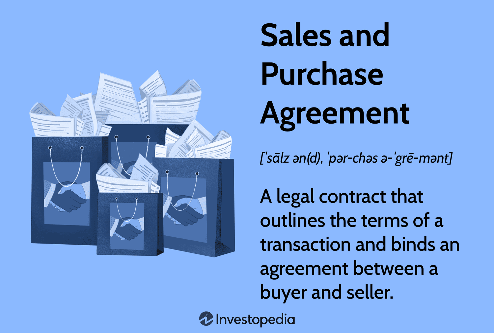

## Table of Contents

## What is a Sales and Purchase Agreement (SPA)?

A Sales and Purchase Agreement (SPA) is a legal document that outlines the terms and conditions of a transaction between a buyer and a seller. It is used when one party agrees to buy something from another party, like a business, property, or goods. The SPA includes details like the price, payment terms, and what is being bought and sold. It also covers important dates and any conditions that need to be met before the sale can go through.

The SPA is important because it protects both the buyer and the seller by making sure everyone understands and agrees to the terms of the deal. It helps prevent misunderstandings and disputes by clearly stating what each party is responsible for. For example, it might include what happens if the buyer can't get a loan or if the seller can't deliver the goods on time. By having everything written down, both sides can feel more secure about the transaction.

## Why is a Sales and Purchase Agreement important in business transactions?

A Sales and Purchase Agreement is really important in business deals because it sets clear rules for both the buyer and the seller. It says exactly what is being bought and sold, how much it costs, and how the payment will be made. This helps make sure that everyone knows what they are agreeing to, and it can stop arguments from happening later on. For example, if someone is buying a business, the SPA will list all the things that come with the business, like equipment or customer lists, so there's no confusion.

The SPA also protects both sides by laying out what should happen if things go wrong. It might say what to do if the buyer can't get the money they need or if the seller can't give the goods on time. This is important because it gives both the buyer and the seller a plan to follow if problems come up. Having everything written down in the SPA makes the whole deal feel safer and more trustworthy for everyone involved.

## What are the key components of a Sales and Purchase Agreement?

A Sales and Purchase Agreement has several important parts that make sure the deal between the buyer and seller is clear. It starts with the basic details like who the buyer and seller are, what is being bought or sold, and the price. The agreement will also say how the payment will be made, whether it's all at once or in parts over time. It's important to include the date when the sale will happen and any deadlines that need to be met.

Another key part of the SPA is the conditions that need to be met before the sale can go through. These are called conditions precedent, and they might include things like the buyer getting a loan or the seller fixing any problems with the property or goods. The agreement also covers what happens if something goes wrong, like if the buyer can't pay or the seller can't deliver. This part, called remedies, helps both sides know what to do if the deal falls apart. By having all these details in the SPA, both the buyer and seller can feel more secure about the transaction.

## How do you draft a basic Sales and Purchase Agreement?

To draft a basic Sales and Purchase Agreement, start by writing down the names and contact details of both the buyer and the seller. Next, clearly describe what is being bought or sold. This could be anything from a piece of property to a business or goods. Make sure to include the price and how the payment will be made, whether it's a lump sum or in installments. It's important to set a date for when the sale will happen and any deadlines that need to be met.

Then, list any conditions that need to be met before the sale can go through, like the buyer getting a loan or the seller fixing any issues with the item being sold. Also, include what should happen if something goes wrong, like if the buyer can't pay or the seller can't deliver. This part helps both sides know what to do if the deal falls apart. By including all these details in the agreement, you make sure that both the buyer and seller understand the terms and feel secure about the transaction.

## What are the common terms and conditions included in an SPA?

An SPA usually starts with the names and contact details of the buyer and seller. It then describes what is being bought or sold, like a house, a business, or goods. The price is a big part of the agreement, and it says how the payment will be made, whether it's all at once or in parts over time. The agreement also sets a date for when the sale will happen and any deadlines that need to be met.

The SPA also includes conditions that need to be met before the sale can go through. These might be things like the buyer getting a loan or the seller fixing any problems with what's being sold. The agreement also covers what happens if something goes wrong, like if the buyer can't pay or the seller can't deliver. This part helps both sides know what to do if the deal falls apart. By having all these details in the SPA, both the buyer and seller can feel more secure about the transaction.

## How can the terms of an SPA be negotiated?

Negotiating the terms of a Sales and Purchase Agreement starts with both the buyer and seller talking about what they want. They might discuss the price, how the payment will be made, and any conditions that need to be met before the sale can happen. For example, the buyer might want a lower price, while the seller might want to get paid faster. They can go back and forth until they find a middle ground that works for both of them.

During these talks, it's important to keep good communication and be willing to compromise. If the buyer and seller can't agree on something, they might need to find another way to solve the problem. For instance, if the buyer can't pay the full amount right away, they might agree to pay in installments instead. By working together and being open to different ideas, they can come up with an agreement that makes everyone happy.

## What are the legal implications of breaching a Sales and Purchase Agreement?

If someone breaks a Sales and Purchase Agreement, there can be serious legal consequences. When a buyer or seller doesn't follow the terms of the SPA, it's called a breach. This can happen if the buyer doesn't pay on time or if the seller doesn't deliver what was promised. The agreement usually says what should happen if there's a breach, like paying money to the other side or fixing the problem. If the agreement doesn't solve the issue, the other party might take the case to court to get what they're owed.

Going to court can lead to more problems and costs for both sides. A judge might order the person who broke the agreement to pay money to cover any losses the other side had because of the breach. This could be the money they were supposed to get from the sale, or other costs like legal fees. In some cases, the judge might even cancel the whole agreement. To avoid these issues, it's important for both the buyer and seller to read the SPA carefully and make sure they can meet all the terms before signing.

## How does an SPA differ from other types of contracts like a Memorandum of Understanding?

A Sales and Purchase Agreement (SPA) and a Memorandum of Understanding (MOU) are both types of contracts, but they serve different purposes. An SPA is a detailed and legally binding document that outlines the specific terms of a transaction between a buyer and a seller. It covers everything from the price and payment terms to what is being bought and sold, and any conditions that need to be met before the sale can happen. The SPA is used when the parties want to make sure all details are clear and agreed upon, protecting both sides by providing a clear plan for what happens if something goes wrong.

On the other hand, a Memorandum of Understanding is less formal and often not legally binding. An MOU is used to show that two or more parties have reached an understanding about a project or a goal they want to work on together. It outlines the general intentions and expectations of the parties involved but doesn't go into the specific details that an SPA would. An MOU is more like a starting point or a way to show good faith, while an SPA is the final, detailed agreement that seals the deal.

## What role does due diligence play in the process of finalizing an SPA?

Due diligence is a really important step before finalizing a Sales and Purchase Agreement. It's when the buyer checks everything about what they're buying to make sure it's worth the price and that there are no surprises. They look at things like the financial records, any legal issues, and the condition of the property or goods. This helps the buyer feel more confident about making the deal and can help them find any problems that need to be fixed before they sign the SPA.

If the due diligence finds problems, it can change the terms of the SPA. For example, if the buyer finds out the business isn't doing as well as they thought, they might want to pay less or ask the seller to fix the issues before the sale. This part of the process makes sure that both the buyer and seller are on the same page and that the agreement reflects the true value and condition of what's being sold. By doing due diligence, the buyer can avoid making a bad deal and the seller can show that they're being honest about what they're selling.

## How are disputes typically resolved under a Sales and Purchase Agreement?

When there's a problem with a Sales and Purchase Agreement, both the buyer and seller usually try to fix it by talking to each other first. They might go back to the agreement to see what it says about what should happen if something goes wrong. If they can't agree, they might use a way to solve the problem that's written in the SPA, like mediation or arbitration. In mediation, a neutral person helps them talk and find a solution. In arbitration, a neutral person listens to both sides and makes a decision that they have to follow.

If talking or using mediation or arbitration doesn't work, the buyer or seller might take the problem to court. Going to court can be expensive and take a long time, but it's a way to get a judge to decide who's right. The judge might make the person who broke the agreement pay money to the other side to cover any losses. This could be the money they were supposed to get from the sale, or other costs like legal fees. Sometimes, the judge might even cancel the whole agreement. By having clear rules in the SPA about what to do if there's a problem, both sides can try to solve it without going to court.

## What are the international considerations when drafting an SPA for cross-border transactions?

When you're drafting a Sales and Purchase Agreement for a deal that involves different countries, you need to think about a few extra things. One big thing is the law. You have to decide which country's laws will be used to handle any problems that come up. This is called the governing law, and it's important because laws can be very different from one place to another. You also need to think about how you'll handle any disagreements. Sometimes, you might choose to use a neutral place for solving problems, like arbitration in a third country, to make things fair for both sides.

Another thing to consider is taxes. When you're buying or selling across borders, you might have to pay taxes in more than one country. The SPA should say who is responsible for these taxes, so there are no surprises later. You also need to think about how you'll move the goods or money across borders. This can involve customs rules and currency exchange, which can be tricky. By planning for these things in the SPA, you can make sure the deal goes smoothly and everyone knows what to expect.

## How can technology and digital signatures impact the execution of Sales and Purchase Agreements?

Technology and digital signatures have made it much easier to create and sign Sales and Purchase Agreements. With digital tools, you don't need to be in the same place as the other person to sign the agreement. You can send the SPA through email or use special software to share it. This saves time and money because you don't have to travel or print out lots of papers. Digital signatures are just as legal as handwritten ones, so you can feel safe using them. They also make it easier to keep track of who signed and when, which can be helpful if there's a problem later.

Using technology also helps keep the SPA safe and secure. You can use special programs to protect the agreement from being changed without permission. This is important because it makes sure that the terms you agreed on stay the same. Plus, technology can help you store the SPA online, so you can find it easily whenever you need it. By using digital tools and signatures, the whole process of making and signing an SPA can be faster, easier, and more secure for everyone involved.

## References & Further Reading

[1]: Bergstra, J., Bardenet, R., Bengio, Y., & Kégl, B. (2011). ["Algorithms for Hyper-Parameter Optimization."](https://dl.acm.org/doi/10.5555/2986459.2986743) Advances in Neural Information Processing Systems 24.

[2]: ["Advances in Financial Machine Learning"](https://github.com/FIONA-Youkyung/Financial_Engineering/blob/master/Advances_in_Financial_Machine_Learning_Marcos_Lopez_de_Prado.pdf) by Marcos Lopez de Prado

[3]: ["Evidence-Based Technical Analysis: Applying the Scientific Method and Statistical Inference to Trading Signals"](https://www.amazon.com/Evidence-Based-Technical-Analysis-Scientific-Statistical/dp/0470008741) by David Aronson

[4]: ["Machine Learning for Algorithmic Trading"](https://github.com/stefan-jansen/machine-learning-for-trading) by Stefan Jansen

[5]: ["Quantitative Trading: How to Build Your Own Algorithmic Trading Business"](https://www.amazon.com/Quantitative-Trading-Build-Algorithmic-Business/dp/1119800064) by Ernest P. Chan