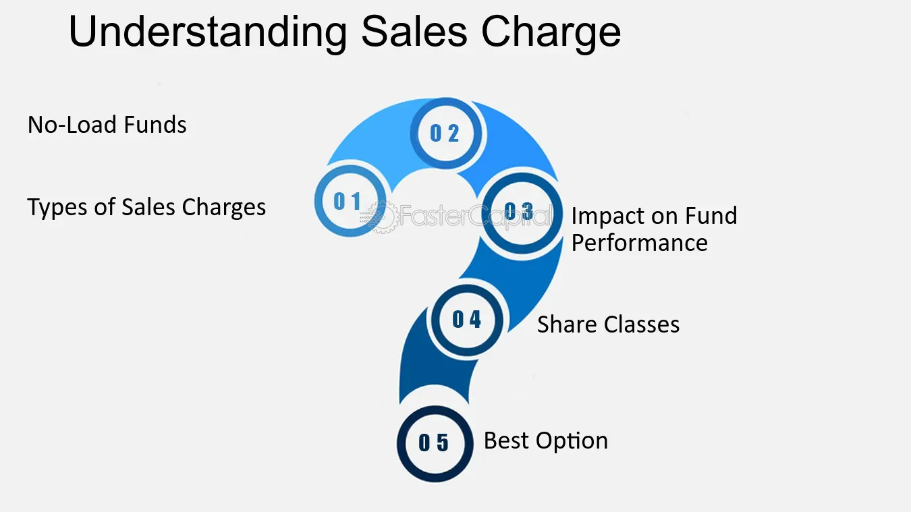

## Table of Contents

## What is a sales charge?

A sales charge is a fee that investors pay when they buy certain types of investment products, like mutual funds or annuities. It's also called a load. This fee is usually a percentage of the amount of money you invest. For example, if you invest $1,000 in a mutual fund with a 5% sales charge, you will pay $50 as a fee.

Sales charges help cover the costs of selling and marketing the investment products. They can be charged at the time of purchase, which is called a front-end load, or when you sell your investment, known as a back-end load. Some funds have no sales charges at all, and these are called no-load funds. It's important to understand the sales charge before investing, as it can affect your overall return on investment.

## What are the different types of sales charges?

Sales charges come in different types, mainly front-end loads, back-end loads, and level loads. A front-end load is a fee you pay when you buy an investment. For example, if you want to invest $1,000 in a fund with a 5% front-end load, you will pay $50 right away, and the rest of your money, $950, will be invested. A back-end load, or deferred sales charge, is a fee you pay when you sell your investment. This fee often goes down the longer you keep your money in the investment. A level load, also known as a 12b-1 fee, is a smaller fee that you pay every year you own the investment, usually to cover marketing and distribution costs.

Each type of sales charge can affect how much money you make from your investment in different ways. Front-end loads reduce the amount of money you have to invest from the start, which can lower your overall returns. Back-end loads can make it less appealing to sell your investment early, but they can be a good choice if you plan to keep your money invested for a long time. Level loads can add up over time, but they are usually smaller than front-end or back-end loads. Understanding these charges helps you pick the best investment for your goals and how long you plan to invest.

## How does a front-end load work?

A front-end load is a fee you pay when you buy an investment like a mutual fund. It's a percentage of the money you're putting in. For example, if you want to invest $1,000 and the front-end load is 5%, you'll pay $50 right away. That means only $950 of your money actually goes into the investment. This fee is used to pay the people who sell the investment, like financial advisors or brokers.

Front-end loads can affect how much money you make from your investment. Because you start with less money in the fund, your returns might be lower than if you had put all your money in without a fee. Some people choose funds with front-end loads if they believe the investment will do well enough to make up for the initial cost. It's important to look at the front-end load and think about how it might change your investment's growth over time.

## What is a back-end load and how does it differ from a front-end load?

A back-end load is a fee you pay when you sell your investment, like a mutual fund. It's different from a front-end load because you don't pay it when you buy the investment. Instead, you pay it when you decide to take your money out. The fee is usually a percentage of the money you're taking out, and it can get smaller the longer you keep your money in the investment. For example, if you invested $1,000 and the back-end load is 5% after one year, you would pay $50 when you sell, but if you wait five years, the fee might drop to 1%.

The main difference between a back-end load and a front-end load is when you pay the fee. With a front-end load, you pay right away, which means less of your money goes into the investment from the start. This can affect how much your investment grows over time. With a back-end load, all your money goes into the investment at first, but you might pay a fee when you want to take it out. This can be good if you plan to keep your money invested for a long time, because the fee might go down or even go away after a certain number of years. Both types of loads can affect your overall returns, so it's important to think about when you'll need your money back and how long you can leave it invested.

## Can you explain what a level load is?

A level load is a fee you pay every year you own an investment like a mutual fund. It's also called a 12b-1 fee. This fee is usually a small percentage of the money you have invested, and it helps pay for things like marketing and selling the investment. For example, if you have $1,000 invested and the level load is 1%, you'll pay $10 every year.

Level loads are different from front-end and back-end loads because you don't pay a big fee all at once when you buy or sell the investment. Instead, you pay a little bit every year. This can be good if you want to keep your money in the investment for a long time, because the small yearly fees might add up to less than a big one-time fee. But, if you don't keep your money in for long, the yearly fees can still add up and affect how much money you make from your investment.

## What are the typical percentage rates for different types of sales charges?

Front-end loads usually range from 3% to 6% of the amount you invest. This means if you put in $1,000, you might pay between $30 and $60 right away. The exact percentage depends on the specific fund you choose. Some funds might have lower front-end loads to attract more investors, while others might have higher loads if they think their investment is worth the extra cost.

Back-end loads can start at around 5% to 6% if you sell your investment within the first year. But, these fees often go down the longer you keep your money in the fund. For example, the fee might drop to 3% after a few years and might even go away completely after you've held the investment for a certain number of years, like five or six. This encourages investors to keep their money in the fund for a longer time.

Level loads, or 12b-1 fees, are usually smaller, typically ranging from 0.25% to 1% of your investment each year. If you have $1,000 invested, you might pay between $2.50 and $10 every year. These fees are meant to cover the costs of running and promoting the fund. While they might seem small, they can add up over time, so it's important to consider them when choosing an investment.

## How do sales charges impact the overall return on investment?

Sales charges can lower the overall return on your investment because they take money away from what you could be earning. When you pay a front-end load, you start with less money in your investment. For example, if you invest $1,000 and pay a 5% front-end load, only $950 goes into the fund. This means your investment has to grow more just to make up for the fee you paid at the start. Over time, this can make a big difference in how much money you end up with.

Back-end loads and level loads also affect your returns, but in different ways. A back-end load means you pay a fee when you take your money out, which can be smaller if you wait longer. If you sell your investment early, this fee can eat into your profits. Level loads are smaller fees you pay every year, and while they might not seem like much, they can add up over time. All these fees mean less money is working for you in the investment, so it's important to think about them when you're deciding where to put your money.

## What are the arguments in favor of sales charges?

Some people think sales charges are good because they help pay for things like selling and marketing the investment. When you pay a sales charge, you're helping the company cover the costs of telling people about their investment options. This can be important because it means more people might find out about good investment choices. Also, sales charges can help pay for advice from financial experts. If you pay a front-end load, part of that money might go to a financial advisor who helped you pick the right investment for your goals.

Another reason people support sales charges is that they can encourage investors to think carefully before buying or selling. A front-end load makes you think twice about your investment because you pay a fee right away. A back-end load might make you keep your money in the investment longer, which can be good if the investment grows over time. Level loads spread out the cost over time, which can be easier on your wallet and might help you stick with your investment plan. So, sales charges can help guide investors to make smarter choices and stay committed to their investments.

## What criticisms are commonly leveled against sales charges?

Some people don't like sales charges because they think these fees take away from the money that could be growing in an investment. For example, if you pay a front-end load, less of your money goes into the investment from the start. This means your investment has to work harder just to make up for the fee you paid. Over time, this can make a big difference in how much money you end up with. Critics say that these fees can eat into your profits and make it harder to reach your financial goals.

Another criticism is that sales charges can make it confusing for people to understand how much they're really paying for their investments. Sometimes, the fees can be hidden or hard to find, which can trick people into thinking they're getting a better deal than they really are. Critics argue that this lack of transparency can lead to bad investment choices. They believe that all fees should be clear and easy to understand so that investors can make smart decisions about where to put their money.

## How can investors minimize the impact of sales charges on their investments?

Investors can minimize the impact of sales charges by choosing no-load funds, which don't have any sales charges at all. This way, all the money you invest goes right into the fund, helping your investment grow faster. Another way to minimize the impact is to look for funds with lower sales charges. Sometimes, you can find funds with front-end loads that are less than the usual 3% to 6%, which means you pay less upfront and more of your money goes into the investment.

If you're considering funds with back-end loads, you can minimize the impact by holding onto your investment for a long time. Many funds reduce or even eliminate the back-end load if you keep your money in for a certain number of years. This can be a good choice if you don't need your money back right away. Also, be careful with level loads because they can add up over time. If you choose a fund with a level load, make sure the yearly fee is low so it doesn't eat into your returns too much.

## Are there any regulatory measures in place concerning sales charges?

Yes, there are rules that try to make sure sales charges are fair and clear for investors. In the United States, the Securities and Exchange Commission (SEC) is in charge of these rules. They say that all fees, including sales charges, have to be shown clearly in the fund's prospectus. This is a document that tells you everything you need to know about the fund before you invest. The SEC also has rules about how much funds can charge for sales. For example, they say that 12b-1 fees, which are a type of level load, can't be more than 1% of the fund's average yearly assets.

These rules help protect investors by making sure they know what they're paying for. The idea is that if investors can see all the fees clearly, they can make better choices about where to put their money. But, even with these rules, it's still important for investors to read the prospectus carefully and ask questions if they don't understand something. That way, they can make sure they're getting a good deal and not paying too much in sales charges.

## What are the latest trends and developments regarding sales charges in the investment industry?

In recent years, the investment industry has seen a big move towards lower-cost investment options. More and more people are choosing funds with no sales charges, called no-load funds, because they want to keep more of their money working for them. This trend is pushing many investment companies to offer funds with lower or no sales charges to stay competitive. Also, the rise of online platforms and robo-advisors has made it easier for people to find and invest in these low-cost options without needing to pay a financial advisor.

Another trend is that regulators are keeping a closer eye on sales charges to make sure investors are treated fairly. The SEC and other financial watchdogs are working to make sure all fees are clear and easy to understand. They're also looking at how much funds can charge for sales to make sure it's not too high. This focus on transparency and fairness is helping investors make better choices and avoid hidden costs. As a result, the investment industry is becoming more open about fees, which is good news for people trying to grow their savings.

## What is a Sales Charge?

A sales charge is a commission paid by the investor to a financial intermediary, such as a broker, for executing an investment transaction. In the context of mutual funds, this charge is commonly referred to as a "load." Loads can be charged in various ways: upfront at the time of purchase, at the time of sale, or through other structures. Sales charges are usually expressed as a percentage of the investment value, with regulatory bodies setting limits to protect investors from excessive fees.

For example, if an investor purchases $10,000 worth of mutual fund shares and the fund has a front-end load of 5%, the sales charge would be $500, and the net amount invested in the fund would be $9,500. This can be generalized with the formula:

$$
\text{Net Investment} = \text{Total Investment} \times (1 - \text{Sales Charge \%})
$$

Understanding sales charges is critical for investors, as these fees directly reduce the amount of capital that is effectively invested. By reducing the initial or eventual investment, sales charges can affect the overall rate of return on the investment. Regulatory bodies oversee these charges to ensure transparency and fairness, setting limits to protect investors while allowing financial intermediaries to earn reasonable commissions for their services.

## What are the types of sales charges?

Common sales charges in mutual funds and other investment vehicles are categorized primarily as front-end loads, back-end loads, and level loads. Each type of sales charge affects investment returns in distinct ways, thereby influencing the choice of strategies for investors seeking to optimize their portfolios.

Front-end loads are fees charged at the time of purchase. These are typically a percentage of the initial investment amount, effectively reducing the capital that is initially invested. For example, if an investor puts $10,000 into a fund with a 5% front-end load, $500 will be deducted as a sales charge, and only $9,500 will be invested in the fund. This immediate reduction in investment capital can impact the overall potential returns, especially in cases where the investment grows significantly over time. Given this reduction in invested capital, the formula for the initial investment post load is:

$$
\text{Initial Investment} = \text{Investment Amount} \times (1 - \text{Front-End Load Percentage})
$$

Back-end loads, also known as deferred sales charges, are fees incurred when selling shares. These charges often decrease over time—a method sometimes referred to as a "contingent deferred sales charge" (CDSC). This decrease is intended to incentivize investors to keep their investments within the fund for a longer duration. For instance, a back-end load might start at 5% if sold within the first year, but diminish to 0% after six or seven years. This structure allows for the full investment to grow and potentially yield greater returns, assuming the investor holds their shares long enough to avoid or minimize the charge.

Level loads are recurring charges taken on an annual basis. Unlike the one-time fees of front-end and back-end loads, level loads persist as long as the investment remains in the fund. Typically set as a percentage of the fund's current value, these charges are intended to compensate brokers or financial advisors for ongoing account maintenance and advisory services. While they do not reduce the initial or terminal amount invested directly, over time, they reduce the total value of the investment due to continuous deductions.

Understanding these sales charges is essential for investors. Strategic investment decisions often incorporate an analysis of anticipated holding periods, expected fund performance, and fee structures. By doing so, investors can select the sales charge structure that minimizes costs relative to potential returns, optimizing the overall effectiveness of their investment portfolio.

## References & Further Reading

[1]: Cumming, D. J., & Johan, S. A. (2013). ["Governance and Private Equity."](https://www.sciencedirect.com/book/9780124095373/venture-capital-and-private-equity-contracting) In The Oxford Handbook of Private Equity. Oxford University Press.

[2]: Pardo, R. (2011). ["The Evaluation and Optimization of Trading Strategies,"](https://onlinelibrary.wiley.com/doi/book/10.1002/9781119196969) 2nd Edition. Wiley.

[3]: Sharpe, W. F. (1966). ["Mutual Fund Performance."](https://www.jstor.org/stable/2351741) The Journal of Business, 39(1), Part 2: Supplement on Security Prices, pp.119–138.

[4]: Hendershott, T., Jones, C. M., & Menkveld, A. J. (2011). ["Does Algorithmic Trading Improve Liquidity?"](https://onlinelibrary.wiley.com/doi/full/10.1111/j.1540-6261.2010.01624.x) The Review of Financial Studies, 24(1), 1-25.

[5]: Hasbrouck, J., & Saar, G. (2013). ["Low-latency Trading."](https://www.sciencedirect.com/science/article/abs/pii/S1386418113000165) Journal of Financial Markets, 16(4), 646-679.

[6]: ["Unconventional Success: A Fundamental Approach to Personal Investment"](https://www.amazon.com/Unconventional-Success-Fundamental-Approach-Investment/dp/0743228383) by David F. Swensen.

[7]: Carhart, M. M. (1997). ["On Persistence in Mutual Fund Performance."](https://onlinelibrary.wiley.com/doi/full/10.1111/j.1540-6261.1997.tb03808.x) The Journal of Finance, 52(1), 57-82.