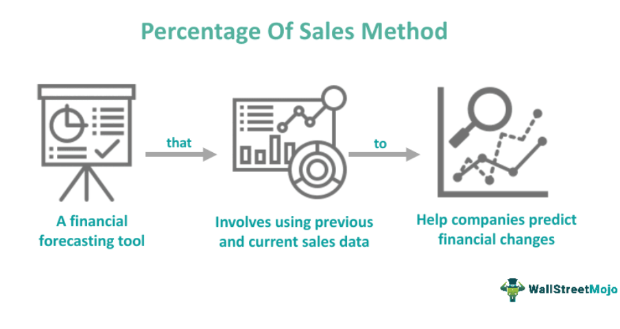

In today's fast-paced trading environment, understanding the various types of sales payment methods and their application in algorithmic trading is crucial for traders seeking efficiency and competitive advantage. The rapid evolution of financial markets has increased the demand for streamlined transactions and secure, efficient payment solutions. As algorithmic trading grows in prominence, it is vital for traders and investors to comprehend how different sales transactions and payment methods can be leveraged to enhance their trading strategies.

This article explores the intersection between sales transactions, payment methods, and algorithmic trading to enhance understanding and application for traders and investors. With the integration of technology into financial systems, there is a need for continual adaptation and innovation in payment processing and transaction methods. This convergence affects how trades are executed and the speed at which funds are transferred, ultimately influencing market dynamics and trader profitability.



We'll start by defining key concepts before discussing the specific payment methods and their relevance to algorithmic trading. By demystifying these elements, we aim to provide traders and investors with the knowledge needed to optimize their operations and maintain a competitive edge.

## Table of Contents

## What Is a Sale?

A sale is fundamentally described as a transaction in which goods, services, or property are relinquished by one party to another in exchange for monetary compensation. This transaction is foundational to all forms of commerce, underscoring nearly every economic interaction. It can occur in numerous contexts, such as retail environments where individual consumers purchase goods directly, or in broader business-to-business (B2B) exchanges involving bulk quantities or specialized services.

In the retail context, sales usually involve direct consumer interactions, either through physical storefronts or online platforms. These transactions are typically straightforward, with the seller providing a product or service and the buyer offering payment, often facilitated through various mediums such as cash, credit, or digital methods. 

B2B sales, on the other hand, often deal with larger volumes and may include more complex terms of payment and delivery. These transactions can influence the supply chain processes and require careful management to ensure smooth operations between businesses.

With the rise of technology, online sales have become increasingly prevalent, occurring through e-commerce platforms. These transactions require robust digital payment systems to facilitate swift and secure exchanges between parties across different geographical locations.

Complex sales involve high-value items such as real estate, automobiles, or other significant investments. These transactions typically entail a longer negotiation process, a variety of contractual agreements, and often require third-party mediation or verification to complete.

The process and structure of sales transactions are closely linked with the formulation of [algorithmic trading](/wiki/algorithmic-trading) strategies. In this context, the ability to rapidly execute sales and facilitate payments is paramount. Algorithmic trading leverages automated systems to conduct transactions with high speed and efficiency, minimizing the potential for human error or delay. This agility is crucial in ensuring competitive advantage and maximizing profit, as even minor delays or errors in sales execution can lead to significant financial discrepancies.

Swift execution and seamless payment facilitation are essential components, as they enable traders to quickly respond to market fluctuations and capitalize on emerging opportunities. In algorithmic trading, these transactions can be programmed to occur at specific conditions, ensuring optimal timing and pricing in line with pre-set trading strategies.

## Types of Sales Transactions

Retail sales involve direct interactions between sellers and consumers, either in physical storefronts or online settings. These transactions often focus on individual items or small quantities, catering to personal use rather than business needs. The rise of e-commerce has significantly expanded the reach and convenience of retail sales, enabling consumers to purchase goods from anywhere with internet access.

Business-to-business (B2B) sales, in contrast, are transactions between companies. These often involve bulk purchasing, long-term contracts, or services that support business operations. B2B transactions tend to be more complex due to the larger scale, negotiation processes, and contractual obligations involved. They are driven by improving business efficiency and operational goals rather than personal consumer choices.

Online sales encompass all transactions conducted over digital platforms, utilizing websites or mobile applications. These include both retail and B2B sales but are distinguished by their digital nature. The growth of online platforms has transformed how businesses interact with customers and other companies, emphasizing speed, accessibility, and diverse payment options.

Complex sales refer to high-value transactions requiring extensive negotiation and documentation. Examples include real estate, where the sale of property involves legal, financial, and regulatory considerations, and the automobile industry, where transactions might include financing arrangements and trade-in dealings. These sales are characterized by a longer sales cycle and require a more personalized sales approach and expertise due to the legal and financial complexities involved.

## Common Sales Payment Methods

Sales payment methods are central to commercial transactions, and understanding their nuances is crucial for optimizing efficiency, particularly in fast-paced markets like algorithmic trading. There are several methods commonly used worldwide, each having distinct advantages and applications.

**Cash Payments**: This method involves the immediate exchange of physical currency for goods or services. While cash payments offer the advantage of being instant and devoid of intermediary processing fees, they are becoming less common in large transactions. The limited scalability of cash due to security risks and logistical challenges makes it impractical for higher-value exchanges.

**Credit Payments**: Credit transactions follow a “buy now, pay later” principle, enabled by credit providers such as banks and credit card companies. This payment method allows consumers and businesses to purchase goods and services on credit, settling the payment at a later date, typically with interest. The advantage of credit payments is their flexibility and ability to facilitate large transactions without the immediate need for liquid cash. However, they introduce additional complexities such as credit approval processes and potential interest costs.

**Digital Payments**: As e-commerce continues to grow, digital payments have become increasingly prevalent. These payments involve online systems and applications, such as digital wallets (e.g., PayPal, Apple Pay) and mobile payment platforms. Digital payments offer several benefits, including speed, convenience, and enhanced security features like encryption and tokenization. They reduce the need for physical money handling and provide a seamless transaction experience which is crucial for algorithmic trading efficiency.

**Cryptocurrency Payments**: Emerging as a modern alternative, cryptocurrency payments leverage blockchain technology to offer decentralized, peer-to-peer transactions. Cryptocurrencies like Bitcoin and Ethereum provide benefits such as enhanced privacy and the elimination of traditional banking intermediaries, which can significantly reduce transaction fees and processing times. However, the volatility of cryptocurrencies poses a risk, and there are ongoing concerns regarding regulatory compliance and security.

Each of these payment methods plays a pivotal role in commercial transactions, with digital and [cryptocurrency](/wiki/cryptocurrency) payments showing particular promise for integration with algorithmic trading systems due to their speed and efficiency. As trading strategies evolve, leveraging these payment methods can be instrumental in reducing costs and enhancing transaction fluidity.

## Algorithmic Trading: An Overview

Algorithmic trading, often referred to as algo trading, employs computer programs to automate trading activities, reducing human intervention to enhance execution precision and efficiency. These programs are designed to execute trades based on a set of predefined criteria, such as price, timing, and [volume](/wiki/volume-trading-strategy). This systematic approach contrasts with traditional trading methods significantly, where decisions are primarily human-driven, and subject to emotions and inefficiency.

A key feature of algorithmic trading is the use of algorithms to identify and act on trading opportunities in fractions of a second, something human traders cannot achieve. These algorithms monitor market conditions incessantly and execute trades when specific conditions are met. For example, a trading algorithm might be programmed to buy a stock when its moving average crosses above a certain threshold, and sell it when the trend reverses.

One fundamental advantage of algorithmic trading is its ability to minimize the emotional biases that can influence decision-making. Trading decisions made by humans can be affected by fear, greed, and other psychological factors, which can lead to suboptimal outcomes. In contrast, algorithmic systems strictly follow programmed rules and logic, leading to consistent execution of trades as per the defined strategy.

Moreover, algorithmic trading improves market efficiencies by ensuring that prices do not deviate significantly from fair value for prolonged periods. High-frequency trading ([HFT](/wiki/high-frequency-trading-strategies)), a form of algorithmic trading, further amplifies these efficiencies by executing a large number of orders at incredibly high speeds, contributing to improved [liquidity](/wiki/liquidity-risk-premium) and tighter spreads.

An example of a simple algorithmic strategy in Python might involve using the moving average crossover method to signal trades:

```python
import pandas as pd

def moving_average_crossover(data, short_window=40, long_window=100):
    data['Short_MA'] = data['Close'].rolling(window=short_window, min_periods=1).mean()
    data['Long_MA'] = data['Close'].rolling(window=long_window, min_periods=1).mean()

    data['Signal'] = 0
    data['Signal'][short_window:] = np.where(data['Short_MA'][short_window:] > data['Long_MA'][short_window:], 1, 0)

    data['Position'] = data['Signal'].diff()
    return data

# Assume 'data' is a DataFrame with datetime index and 'Close' column
data = moving_average_crossover(data)
```

In this example, the `moving_average_crossover` function calculates the short-term and long-term moving averages of a stock's closing prices, generating buy and sell signals when they cross each other. This demonstrates a straightforward implementation of an algorithmic trading strategy, albeit many real-world strategies are more complex and incorporate various data sources and analytical methods.

In conclusion, algorithmic trading represents a shift towards more data-driven and systematic trading approaches. It leverages technological advancements to access, process, and react to market information faster and more accurately than manual trading, thus offering distinct competitive advantages.

## Integration of Payment Methods in Algo Trading

Efficient payment methods are pivotal for enhancing the fluidity and speed of transactions in algorithmic trading. In this context, digital and cryptocurrency payments stand out due to their swift processing capabilities, which align perfectly with the high-speed demands of algorithmic trading environments. Digital payment systems, such as electronic fund transfers and mobile payment applications, enable rapid settlement of trades, reducing the time lag between order execution and transaction completion. These payment methods often utilize advanced encryption and security protocols, ensuring the integrity and confidentiality of trading transactions, which is critical in high-frequency trading.

Cryptocurrency payments offer additional advantages by eliminating the need for traditional intermediaries, thereby reducing transaction costs and settlement times. Blockchain technology, the backbone of cryptocurrencies, facilitates near-instantaneous transaction verification and settlement, providing a significant edge in markets where speed is a competitive advantage. For instance, Bitcoin's Lightning Network or Ethereum's second-layer solutions can offer expedited transactions that are almost instantaneous compared to traditional banking systems.

Integration of these payment systems into trading algorithms can significantly streamline operations. By embedding payment functionalities directly into trading strategies, traders can automate not just the trade execution but also the settlement, reducing manual intervention and decreasing operational risks. For example, a trading algorithm could be programmed to execute a trade only if it predicts that a favorable exchange rate or transaction fee will be available, thereby optimizing cost-effectiveness.

The inclusion of automated payment processes also allows for enhanced liquidity management. With immediate settlement capabilities, traders can free up capital faster, permitting more agile strategy adjustments in response to market dynamics. This integration can be achieved by using Application Programming Interfaces (APIs) provided by payment service providers, enabling seamless communication between trading platforms and payment systems.

Moreover, as payment technologies evolve, they offer opportunities for cost reductions in trading operations. For instance, the use of stablecoins for paying transaction fees can help mitigate the [volatility](/wiki/volatility-trading-strategies) risk associated with cryptocurrencies, while still benefiting from the low-cost and high-speed advantages.

Overall, the integration of modern payment methods into algorithmic trading systems promises to refine transaction processes, optimize cost efficiency, and enhance overall market responsiveness. Traders utilizing these integrations can better position themselves to capitalize on rapid market shifts and operational efficiencies.

## Challenges and Opportunities

Digital and cryptocurrency payments, while offering unprecedented speed and global reach, present notable security and regulatory challenges. The decentralized nature of cryptocurrencies adds layers of security concerns, predominantly related to the potential for fraud and hacking. Traditional digital payments, although more established, continue to grapple with issues of data breaches and cybersecurity threats. For algorithmic trading, where transactions occur rapidly and frequently, ensuring the integrity and protection of financial data is paramount.

Regulatory compliance adds another layer of complexity. As governments and regulatory bodies worldwide establish frameworks to manage digital and crypto payments, algorithmic trading platforms must navigate a dynamic and often fragmented regulatory landscape. Compliance failures can lead to significant penalties, making it crucial for trading systems to incorporate adaptive compliance mechanisms.

In spite of these challenges, technological advancements hold substantial opportunities. The continuous evolution of blockchain technology, for instance, promises enhanced security features that can be integrated into payment systems, reducing fraud risks and increasing transparency. Furthermore, the development of faster transaction processing technologies can benefit algorithmic trading by minimizing latency and facilitating instant execution of trades, crucial for high-frequency trading strategies.

Innovations in payment solutions also offer new avenues for [arbitrage](/wiki/arbitrage) opportunities in algorithmic trading. The disparity between regulatory standards and technological adoption across regions can create price inefficiencies that skilled traders might exploit. Additionally, the inclusion of [artificial intelligence](/wiki/ai-artificial-intelligence) and [machine learning](/wiki/machine-learning) in analyzing transaction data can uncover patterns and predict trends, leading to more refined trading strategies.

Algorithmic traders and developers are positioned at the forefront of these technological advancements. By implementing robust, secure, and compliant payment infrastructures, they can not only mitigate risks but also harness these emerging opportunities to enhance their trading systems. This proactive approach is essential to remain competitive in the fast-evolving landscape of algorithmic trading.

## Conclusion

The evolution of sales payment methods significantly impacts the dynamics of algorithmic trading. Modern payment solutions, ranging from digital wallets to cryptocurrency transactions, present traders and investors with avenues to refine and enhance trading strategies. These advanced systems allow for faster transaction processing, reducing latency which is crucial for executing trades at optimal prices. As algorithmic trading relies on rapid execution and precision, integrating efficient payment methods can create more responsive and adaptive trading models.

Moreover, remaining informed about technological and regulatory developments in payment systems is essential for sustaining a competitive edge. As financial regulations and technologies evolve, traders must adapt to new compliance standards and leverage technological innovations. This ongoing adaptation is critical for optimizing algorithmic trading strategies and ensuring they remain secure, reliable, and profitable. Understanding these dynamics enables traders to develop systems that not only meet current demands but also anticipate future trends, maintaining their relevance and effectiveness in a rapidly changing trading environment.

## Resources

### Resources

For further understanding of sales transactions, payment methods, and algorithmic trading strategies, the following resources are recommended:

#### Sales Transactions and Payment Methods:

1. ** "Principles of Microeconomics" by N. Gregory Mankiw**: This textbook provides a foundational understanding of economic principles, including how sales transactions function within various market structures.

2. **Investopedia's Guide to Payment Methods**: Investopedia offers comprehensive articles detailing different types of payment methods, their benefits, and constraints. Access it at [Investopedia](https://www.investopedia.com/).

3. **"The Payment Systems" by P. Todd**: This book covers the infrastructure of payment systems, discussing traditional methods like cash and credit as well as digital and cryptocurrency payments.

#### Algorithmic Trading Strategies:

1. **"Algorithmic Trading & DMA" by Barry Johnson**: A detailed book on how algorithms are used in trading, focusing on market microstructure and trading strategies.

2. **Quantitative Finance Courses on Coursera**: Coursera offers various courses on quantitative trading, including "Introduction to Computational Finance and Financial Econometrics".

3. **Online Platforms such as QuantInsti**: QuantInsti offers specialized programs and modules on algorithmic trading, covering everything from the basics to advanced strategies involving machine learning.

#### Educational Resources and Courses:

1. **Coursera and edX**: Both platforms provide courses such as "Algorithmic Trading" and "Financial Markets", which are suitable for learning the basics and applied aspects of trading.

2. **Kaggle**: This platform provides datasets and kernels that are useful for practicing coding skills in finance and algorithmic trading, particularly using Python.

3. **Python for Finance by Yves Hilpisch**: This book is suitable for those looking to implement algorithmic trading strategies using Python.

#### Financial Regulatory Bodies:

1. **U.S. Securities and Exchange Commission (SEC)**: The SEC provides regulatory guidelines and compliance requirements for trading. Access their resources at [SEC.gov](https://www.sec.gov/).

2. **European Securities and Markets Authority (ESMA)**: ESMA offers extensive information about financial regulations in the European Union.

3. **Financial Conduct Authority (FCA)**: The FCA is a regulatory body in the UK that sets standards for financial markets and provides guidance on compliance. Visit [FCA.org.uk](https://www.fca.org.uk/) for more information.

Staying informed through these resources can significantly enhance one’s knowledge and application of sales transactions, payment methods, and algorithmic trading strategies.

## References & Further Reading

[1]: Mankiw, N. Gregory. ["Principles of Microeconomics"](https://archive.org/details/principles-of-microeconomics)

[2]: Todd, P. ["The Payment Systems"](https://medium.com/@cyclebit/top-10-books-about-payment-systems-read-why-the-world-is-slowly-but-surely-gravitating-towards-c5a6e87e9fbc)

[3]: Johnson, Barry. ["Algorithmic Trading & DMA: An Introduction to Direct Access Trading Strategies"](https://www.amazon.com/Algorithmic-Trading-DMA-introduction-strategies/dp/0956399207)

[4]: Lopez de Prado, Marcos. ["Advances in Financial Machine Learning"](https://www.amazon.com/Advances-Financial-Machine-Learning-Marcos/dp/1119482089)

[5]: Aronson, David. ["Evidence-Based Technical Analysis: Applying the Scientific Method and Statistical Inference to Trading Signals"](https://www.amazon.com/Evidence-Based-Technical-Analysis-Scientific-Statistical/dp/0470008741)

[6]: Jansen, Stefan. ["Machine Learning for Algorithmic Trading"](https://github.com/stefan-jansen/machine-learning-for-trading)

[7]: Chan, Ernest P. ["Quantitative Trading: How to Build Your Own Algorithmic Trading Business"](https://github.com/ftvision/quant_trading_echan_book)

[8]: U.S. Securities and Exchange Commission (SEC). [SEC.gov](https://www.sec.gov/search-filings)

[9]: European Securities and Markets Authority (ESMA). [ESMA.europa.eu](https://www.esma.europa.eu/)

[10]: Financial Conduct Authority (FCA). [FCA.org.uk](https://www.fca.org.uk/)