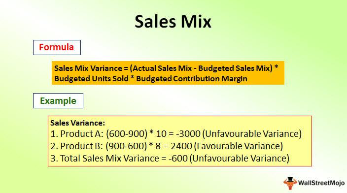

In an era characterized by rapid technological advancements and shifting consumer preferences, businesses must continuously refine their operational strategies to sustain growth and profitability. This necessitates a nuanced understanding of product assortment, strategic business planning, sales mix, and algorithmic trading. Product assortment, the variety of products a company offers, is fundamental in catering to diverse consumer demands and establishing strong brand loyalty. Meanwhile, strategic planning with a focus on product mix helps businesses align their offerings with market needs and organizational goals.

Sales mix, which refers to the proportion of each product type a company sells relative to its total sales, significantly influences profit margins. By focusing on high-margin goods and optimizing sales strategies, businesses can enhance profitability. In parallel, algorithmic trading has emerged as a transformative tool, enabling companies to automate trading processes with enhanced speed and efficiency. This technique not only aids in financial trading but also contributes to optimizing retail strategies by refining pricing and stock management practices.



The interconnectedness of these elements underscores the need for a comprehensive strategy to maintain competitiveness. Additionally, the integration of data-driven tools allows businesses to remain agile, adapting to market fluctuations and consumer demands. By strategically managing product assortment and sales mix, and incorporating algorithmic trading practices, companies can position themselves for enduring success in a dynamic business environment.

## Table of Contents

## Understanding Product Assortment

Product assortment, also termed merchandise mix, represents the collection of products a company offers to its consumers. This assortment is pivotal in determining how well a company meets customer demands and establishes brand loyalty, ultimately driving sales. A well-crafted product assortment strategy can differentiate a company from its competitors and align its offerings with consumer expectations.

A balanced product assortment is crucial as it ensures that the range of products offered satisfies diverse customer needs. This balance is achieved by assessing market trends, consumer preferences, and seasonal demands. Companies often rely on market research and consumer feedback to tailor their product offerings appropriately.

To cater to various market needs, businesses implement proactive assortment strategies. These strategies can be categorized based on breadth (the variety of different product lines) and depth (the variety within a particular product line). Some common types of assortment strategies include:

1. **Mass Market Assortment**: This strategy involves offering a wide range of products to appeal to a broad audience. Companies employing this strategy aim to capture a sizable market share by providing products that satisfy common needs across diverse consumer segments. This approach is often seen in retail giants like Walmart or Amazon, where the objective is to provide a one-stop shopping experience.

2. **Deep Assortment**: In contrast to a broad approach, a deep assortment focuses on a specific product category with an extensive range of options. This strategy is beneficial for specialized retailers who wish to dominate a niche market by offering unparalleled choices. For example, a company specializing in athletic footwear might offer an extensive range of running shoes, catering to various running styles and preferences.

3. **Localized Assortment**: Localization involves tailoring the product offerings to meet the preferences and cultural nuances of specific geographic markets. Companies using this strategy recognize the importance of regional differences in consumer behavior and adjust their product mix accordingly. For instance, a food retailer might stock different varieties of spices based on local cuisine preferences.

4. **Wide Assortment**: This strategy encompasses a significant variety of product lines without going into depth within each category. It is suited for businesses wishing to appeal to various consumer preferences but without committing substantial resources to any particular category. Department stores often adopt this approach, offering a broad spectrum of products ranging from clothing to electronics.

5. **Scrambled Assortment**: Contrary to traditional assortment strategies, scrambled assortment involves offering products that are not typically associated with the company's primary business. This eclectic mix can attract different customer sections or encourage impulse purchases. Convenience stores often use this strategy by offering a mix of groceries, toiletries, and ready-to-eat foods.

In summary, understanding and implementing the right product assortment strategy is essential for businesses seeking to optimize their market presence and strengthen brand loyalty. By aligning their product offerings with consumer needs and market dynamics, businesses can enhance their competitive edge while maximizing sales potential.

## Strategic Business Planning with Product Mix

A strategic approach to managing product mix is essential for aligning with business objectives and effectively responding to market demands. This involves several key strategies, including contraction, expansion, trading up, and trading down, which help maintain an optimal range of product lines.

### Contraction and Expansion

Contraction involves reducing the number of products in a company's lineup. This strategy can be beneficial when a business needs to focus on its most profitable products or when certain product lines are underperforming. By streamlining the product mix, companies can allocate resources more efficiently and improve overall profitability. For example, a technology company may decide to discontinue products that have low sales [volume](/wiki/volume-trading-strategy) and instead concentrate on their best-selling gadgets.

On the other hand, expansion involves increasing the number of products offered. This strategy is particularly useful when a company identifies unmet consumer needs or opportunities in the market. By introducing new products, businesses can capture additional market share and diversify their revenue streams. For instance, a beverage company might expand its product mix by introducing a new line of healthy drinks to cater to the growing demand for health-conscious products.

### Trading Up and Trading Down

Trading up refers to the practice of adding higher-quality, often more expensive, products to a company’s portfolio. This strategy can enhance brand perception and attract a more affluent customer base. For example, a car manufacturer might introduce a luxury model to complement its existing lineup of budget vehicles, thereby appealing to consumers looking for premium options.

Conversely, trading down involves adding lower-priced products to appeal to cost-sensitive consumers. This approach can increase a company's market penetration and appeal to a broader audience. For instance, a fashion brand known for its high-end attire may introduce a more affordable clothing line to reach a wider demographic.

### Balancing Product Breadth and Depth

Effective management of product breadth and depth is crucial for meeting diverse customer preferences while maintaining profitability. Product breadth refers to the number of different product lines a company offers, while product depth relates to the variety within each product line.

A balanced approach ensures that a company can cater to various market segments without overextending its resources. Too wide a product breadth can dilute a company's brand and operational focus, whereas too much depth in a specific line may lead to inventory challenges and increased costs.

To optimize the product mix, businesses can use data-driven insights to assess market trends and consumer behaviors. For instance, employing tools to analyze sales data can help identify which products contribute most to profitability and customer satisfaction, guiding strategic decisions on whether to contract or expand product lines.

In sum, a strategic approach to product mix management involves a careful balance of contraction, expansion, trading up, and trading down. By aligning product offerings with market demands and business objectives, companies can enhance their competitive advantage and drive sustained growth.

## Leveraging Sales Mix for Profit Maximization

Sales mix, a critical component in strategic business management, significantly influences a company's profitability. It reflects the proportion of each product's sales relative to total sales, providing insight into which items contribute most to revenue. Understanding and manipulating the sales mix can lead to profit maximization by focusing on high-margin products and adapting sales strategies accordingly.

A primary method to optimize profits through sales mix is directing efforts towards high-margin products. These products, due to their higher profit per unit, contribute more substantially to the bottom line. By prioritizing these products in sales strategies, companies can bolster profit margins. This might involve revising marketing campaigns, adjusting promotional strategies, or allocating more sales resources to these high-margin products.

Restructuring sales strategies could be essential when current methods do not align with profit goals. This involves analyzing sales performance data to identify underperforming products or categories. Once identified, businesses can decide whether to reduce or eliminate less profitable items from their lineup, or to devise new strategies that potentially increase their performance.

Analyzing sales mix variance is another potent tool for enhancing profit margins. This involves comparing the actual sales mix to a projected or ideal sales mix. By examining the discrepancies, businesses can identify which products exceeded or fell short of expectations. For example, if Product A is projected to comprise 30% of the sales mix but only achieves 20%, there may be an opportunity to investigate and address factors contributing to this shortfall.

The formula to calculate the variance in sales mix is:
$$
\text{Sales Mix Variance} = (\text{Actual Mix} - \text{Budgeted Mix}) \times \text{Total Sales} \times \text{Standard Margin Per Unit}
$$

By leveraging sales mix data, companies can refine their product lines and align sales efforts more closely with profitability goals. Regularly assessing sales mix variance ensures businesses remain responsive and agile, adjusting strategies to meet financial targets efficiently. In modern data-driven markets, this analytical approach is crucial for maintaining a competitive edge and ensuring robust financial health.

## Algorithmic Trading and Sales Strategies

Algorithmic trading refers to the use of complex algorithms and automated systems that execute trading orders at speeds and frequencies beyond human capacity. By setting criteria for trade execution, such as timing, price, and volume, these systems enhance trading efficiency and accuracy, significantly reducing transaction costs and minimizing market impact.

Integrating [algorithmic trading](/wiki/algorithmic-trading) into sales strategies can significantly optimize pricing and inventory management. Retailers and businesses that leverage algorithmic tools can dynamically adjust prices in response to real-time shifts in demand and market conditions. For example, employing algo-trading techniques allows companies to implement pricing models like dynamic pricing or real-time inventory adjustments that maximize revenue or profitability by addressing both overstock and stockouts effectively.

Python, widely regarded for its simplicity and vast libraries, is particularly useful in the development of algorithmic models for sales strategies. Libraries like NumPy and Pandas provide robust data manipulation capabilities, while [machine learning](/wiki/machine-learning) libraries such as scikit-learn enable predictive analytics and model training. For instance, a basic algorithmic pricing strategy could be implemented as follows:

```python
import numpy as np
import pandas as pd
from sklearn.linear_model import LinearRegression

# Sample data: historical sales and price data
data = pd.DataFrame({
    'price': [100, 150, 200, 250, 300],
    'sales': [2000, 1800, 1600, 1400, 1200]
})

# Preparing the model
X = data['price'].values.reshape(-1, 1)
y = data['sales'].values

# Linear regression model
model = LinearRegression()
model.fit(X, y)

# Predicting sales for a new price point
new_price = np.array([[220]])
predicted_sales = model.predict(new_price)

print(f"Predicted sales for price 220: {predicted_sales[0]}")
```

In this simple linear regression model, we predict sales based on historical pricing data, allowing the business to anticipate sales volumes at different pricing levels, thereby optimizing pricing strategies for maximum profitability.

The convergence of retail and trading is increasingly apparent as companies exploit algorithmic processes to forecast demand, streamline supply chains, and enhance customer satisfaction. These capabilities are indispensable in today's competitive market, transforming traditional sales roles and fostering the development of future-ready strategies. Algorithmic trading not only improves operational efficiency but also provides a scalable method for companies to adapt to intricate market dynamics and discern consumer behavior patterns. As these technologies evolve, they will likely redefine sales strategies and enable more sophisticated approaches to market engagement and revenue optimization.

## Integration of Data-Driven Tools

In an era where data drives decision-making across sectors, businesses must leverage data-driven tools to optimize their product assortment and sales mix strategies. These tools empower organizations to adapt swiftly to changing market dynamics and consumer preferences.

Competitive intelligence, derived from analyzing market data, is crucial in refining product assortment. By conducting detailed market analysis, businesses can identify consumer trends and tailor their product offerings accordingly. For instance, companies can use statistical methods such as regression analysis to understand the relationship between product features and sales performance, enabling them to prioritize high-demand products and discontinue underperforming ones.

Data analysis also plays a pivotal role in demand forecasting. By employing techniques such as time-series analysis or machine learning models, businesses can predict future product demand accurately. These forecasts enable companies to manage their inventory more effectively, minimizing overstock and stockouts. Python libraries like Pandas and Scikit-learn are extensively used in developing such predictive models:

```python
import pandas as pd
from sklearn.model_selection import train_test_split
from sklearn.ensemble import RandomForestRegressor

# Example dataset containing historical sales data
data = pd.read_csv('sales_data.csv')
X = data.drop('sales', axis=1)
y = data['sales']

# Splitting data into training and testing sets
X_train, X_test, y_train, y_test = train_test_split(X, y, test_size=0.2, random_state=42)

# Using Random Forest for demand forecasting
model = RandomForestRegressor(n_estimators=100, random_state=42)
model.fit(X_train, y_train)
predictions = model.predict(X_test)
```

Pricing strategies can be enhanced through dynamic pricing models. By continuously analyzing market trends and competitor prices, companies can adjust their pricing in real time to maximize revenue. Data-driven pricing models, such as those based on price elasticity of demand, allow for more responsive and competitive pricing strategies.

Inventory management, a critical component of sales strategies, benefits significantly from data-driven tools. Techniques such as ABC analysis help categorize products based on their importance, allowing businesses to focus resources on critical inventory items. Moreover, sophisticated algorithms can optimize reorder points and quantities, ensuring optimal stock levels.

Continuous monitoring and adaptation are essential for businesses to stay aligned with market trends and consumer preferences. This involves regularly updating data models with new information and adjusting strategies as needed. The process of data integration, encompassing data from sales, customer feedback, and market analysis, ensures a comprehensive view, aiding in the fine-tuning of business strategies. This iterative process of monitoring and adaptation is crucial for maintaining competitiveness in a fast-paced market environment. Through the strategic use of data-driven tools, businesses can achieve a robust and flexible approach to product assortment and sales optimization.

## Conclusion

In the ever-evolving business environment, the convergence of product assortment, sales mix, and algorithmic trading presents a robust framework for enhancing competitiveness. A well-curated product assortment ensures that businesses meet diverse customer demands, thereby fortifying brand loyalty and driving sales. This, combined with a strategic management of the sales mix, enables companies to focus on high-margin products that significantly impact the bottom line. Utilizing algorithmic trading further augments these strategies by optimizing pricing and inventory management, thus ensuring efficient operations.

Adapting to fluctuating market dynamics and consumer preferences is crucial for sustaining profitability. As markets shift and consumer interests evolve, businesses must remain agile, revisiting and realigning their product and sales strategies. Strategic planning, powered by data-driven insights, plays an instrumental role in this adaptation process. By leveraging competitive intelligence and advanced data analysis tools, companies can execute precise demand forecasting, develop nuanced pricing strategies, and maintain effective inventory control.

Moreover, integrating these elements into a cohesive strategy not only bolsters current operations but also sets a foundation for sustainable growth. The continuous monitoring and refinement of strategies allow businesses to stay ahead of trends and anticipate market shifts, transforming potential challenges into opportunities. Thus, businesses that effectively synergize their product assortment, sales mix, and trading methodologies, while incorporating cutting-edge data tools, are well-positioned to thrive in a competitive landscape.

## References & Further Reading

[1]: Bergstra, J., Bardenet, R., Bengio, Y., & Kégl, B. (2011). ["Algorithms for Hyper-Parameter Optimization."](https://dl.acm.org/doi/10.5555/2986459.2986743) Advances in Neural Information Processing Systems 24.

[2]: ["Advances in Financial Machine Learning"](https://www.amazon.com/Advances-Financial-Machine-Learning-Marcos/dp/1119482089) by Marcos Lopez de Prado

[3]: ["Evidence-Based Technical Analysis: Applying the Scientific Method and Statistical Inference to Trading Signals"](https://www.amazon.com/Evidence-Based-Technical-Analysis-Scientific-Statistical/dp/0470008741) by David Aronson

[4]: ["Machine Learning for Algorithmic Trading"](https://github.com/stefan-jansen/machine-learning-for-trading) by Stefan Jansen

[5]: ["Quantitative Trading: How to Build Your Own Algorithmic Trading Business"](https://www.amazon.com/Quantitative-Trading-Build-Algorithmic-Business/dp/1119800064) by Ernest P. Chan