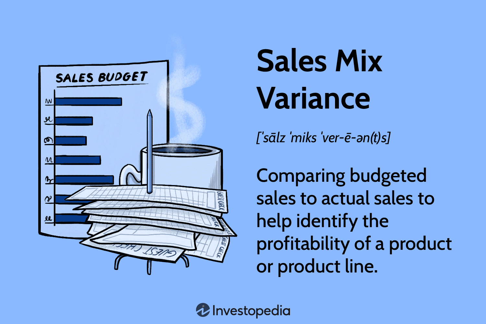

## Table of Contents

## What is sales mix variance analysis?

Sales mix variance analysis is a way to figure out how changes in the types of products sold affect a company's profits. It looks at the difference between the actual mix of products sold and the expected mix, and then calculates how this difference impacts the company's earnings. For example, if a company expected to sell more of a high-profit item but ended up selling more of a lower-profit item, the sales mix variance would show a negative impact on profits.

This type of analysis is useful for businesses that sell multiple products because it helps them understand which products are driving their profits and which ones are not performing as well. By knowing this, a company can make better decisions about what to focus on selling more of, or whether to change their product lineup. It's like a tool that helps a business keep an eye on the balance of what they're selling and make smart choices to improve their bottom line.

## Why is sales mix variance analysis important for a business?

Sales mix variance analysis is important for a business because it helps them see how selling different types of products affects their profits. Imagine a store that sells both high-profit items like electronics and lower-profit items like snacks. If the store sells more snacks than expected and fewer electronics, the sales mix variance analysis will show that this change is hurting their profits. By understanding this, the business can try to sell more of the high-profit items to make more money.

This analysis also helps businesses make better decisions about what to sell. If a company sees that one product is not selling well and is dragging down their profits, they might decide to stop selling it or find a way to make it more popular. On the other hand, if a product is doing really well, the company might focus on selling more of that item. This way, sales mix variance analysis acts like a guide, helping businesses to adjust their product mix to maximize their earnings.

## How do you calculate sales mix variance?

To calculate sales mix variance, you need to compare the actual sales mix to the budgeted sales mix. First, find out the actual quantity of each product sold and the budgeted quantity of each product that was expected to be sold. Then, figure out the sales mix percentage for both the actual and budgeted quantities. The sales mix percentage is the quantity of a product sold divided by the total quantity of all products sold. For example, if you sold 100 units of Product A and 200 units in total, the sales mix percentage for Product A would be 100/200 = 50%.

Next, you need to know the standard profit per unit for each product. Multiply the actual quantity sold by the difference between the actual sales mix percentage and the budgeted sales mix percentage, and then multiply that result by the standard profit per unit. The formula looks like this: Sales Mix Variance = (Actual Quantity Sold) x (Actual Sales Mix % - Budgeted Sales Mix %) x (Standard Profit per Unit). If the result is positive, it means the actual sales mix was better for profits than expected. If it's negative, the actual sales mix was worse for profits than expected.

## What is the difference between sales mix variance and sales volume variance?

Sales mix variance and sales volume variance are two different ways to understand how a company's sales affect its profits. Sales mix variance looks at how the mix of different products sold impacts profits. For example, if a company sells more of a low-profit item than planned and less of a high-profit item, the sales mix variance will show a negative effect on profits. It helps a business see which products are helping or hurting their bottom line and can guide them in deciding what to sell more of.

On the other hand, sales volume variance focuses on the total amount of products sold, regardless of the mix. It compares the actual total sales volume to the budgeted total sales volume. If a company sells more products than expected, the sales volume variance will be positive, showing that higher sales helped profits. If they sell less, it will be negative, indicating that lower sales hurt profits. This type of variance helps a business understand if they are selling enough overall, not just the right mix of products.

Both variances are important because they give different insights. Sales mix variance helps with product strategy, showing which items to push more or less. Sales volume variance helps with overall sales strategy, showing if the company needs to sell more in general. Together, they help a business see the full picture of how their sales are affecting their profits.

## Can you provide an example of how to apply sales mix variance analysis in a real-world scenario?

Imagine a small bakery that sells cakes and cookies. The bakery expects to sell 60% cakes and 40% cookies, based on last year's sales. Each cake brings in a profit of $5, and each cookie brings in a profit of $1. But this year, they actually sold 50% cakes and 50% cookies. To find out how this change in the mix of products affected their profits, they need to use sales mix variance analysis.

First, the bakery calculates the sales mix percentages. They expected to sell 60% cakes but sold 50%, and they expected to sell 40% cookies but sold 50%. The difference in the sales mix for cakes is 50% - 60% = -10%, and for cookies, it's 50% - 40% = +10%. Now, they look at how many products they sold. Let's say they sold a total of 1,000 items, so 500 cakes and 500 cookies. For cakes, the sales mix variance is (500 cakes) x (-10%) x ($5 per cake) = -$250. For cookies, it's (500 cookies) x (+10%) x ($1 per cookie) = +$50. Adding these together, the total sales mix variance is -$250 + $50 = -$200. This negative number shows that selling more cookies and fewer cakes than planned hurt their profits by $200.

By understanding this, the bakery can make better decisions for next year. They might decide to promote cakes more to get back to the 60% sales mix or find ways to increase the profit per cookie. This example shows how sales mix variance analysis helps a business see which products are affecting their profits and guides them in making smart choices about what to sell more of.

## What are the common causes of sales mix variances?

Sales mix variances can happen for a few different reasons. One common cause is changes in what customers want. If more people start wanting a cheaper product instead of a more expensive one, the company will sell more of the cheaper product. This change in what people buy can make the sales mix different from what the company planned. Another reason is when a company changes its prices. If they lower the price of one product more than others, people might buy more of that product, which changes the mix of what's sold.

Also, sales mix variances can come from how a company promotes its products. If they spend more money advertising one product over others, they might sell more of that product. This can make the actual sales mix different from what was expected. Lastly, things like the time of year or special events can affect what people buy. For example, during holidays, people might buy more of certain items, which can change the sales mix. Understanding these causes helps businesses plan better and adjust their strategies to meet customer needs and improve profits.

## How can a company use sales mix variance analysis to improve its profitability?

A company can use sales mix variance analysis to improve its profitability by understanding which products are driving their profits and which ones are not. By analyzing the sales mix variance, a business can see if they are selling more of the low-profit items than they planned, which hurts their profits. For example, if a company expected to sell more high-profit electronics but ended up selling more low-profit snacks, the sales mix variance analysis would show a negative impact. Knowing this, the company can focus on selling more of the high-profit items, perhaps by promoting them more or offering special deals to boost their sales.

Additionally, sales mix variance analysis helps a company make smart decisions about their product lineup. If a certain product is not selling well and is dragging down profits, the company might decide to stop selling it or find ways to make it more appealing to customers. On the other hand, if a product is doing really well, the company can try to sell even more of it. By adjusting the mix of what they sell based on the sales mix variance, a business can work towards a better balance that maximizes their earnings. This ongoing analysis and adjustment can lead to improved profitability over time.

## What are the limitations of sales mix variance analysis?

Sales mix variance analysis can be really helpful, but it also has some limits. One big limit is that it only looks at how the mix of products sold affects profits, not other important things like how much it costs to make the products or how much it costs to sell them. So, a company might see a good sales mix variance, but if the costs to make and sell those products are high, their overall profit might not be as good as they think.

Another limit is that sales mix variance analysis depends a lot on the numbers the company uses. If the company's guesses about how much they will sell or how much profit each product will make are wrong, the analysis won't be very useful. It's like trying to bake a cake with the wrong recipe; the cake might not turn out right. So, it's important for a company to have good, accurate numbers to make this analysis work well.

## How does sales mix variance analysis integrate with other financial analysis tools?

Sales mix variance analysis works together with other financial tools to give businesses a full picture of their money situation. For example, it can be used with cost variance analysis, which looks at how much it costs to make and sell products. By using both, a company can see if selling more of one product helps their profits, even if it costs more to make. They can also use sales mix variance with sales volume variance to see if they're selling enough overall and if the mix of what they're selling is right for making money.

Another way sales mix variance analysis helps is when it's used with budgeting and forecasting tools. These tools help a company plan for the future and set goals. By looking at sales mix variance, a business can adjust their plans to focus on selling more of the products that make them the most money. This helps them make better budgets and forecasts, so they can aim to make more profit. Together, all these tools help a business understand their sales and profits better, so they can make smart choices.

## What advanced techniques can be used to refine sales mix variance analysis?

To make sales mix variance analysis even better, businesses can use more advanced techniques like regression analysis. This technique helps them see how different things, like price changes or promotions, affect what people buy. By using regression analysis, a company can figure out which products are more important for their profits and adjust their sales strategies to focus on those products. It's like using a more powerful tool to understand the puzzle of what sells and why.

Another advanced way to refine sales mix variance analysis is by using data analytics and machine learning. These tools can look at a lot of data from the past and find patterns that a person might miss. They can predict what people will want to buy in the future and suggest the best mix of products to sell. By using these smart tools, a business can make their sales mix variance analysis more accurate and useful, helping them make better decisions to boost their profits.

## How can sales mix variance analysis be adapted for different industries?

Sales mix variance analysis can be adapted for different industries by understanding the unique products and services each industry offers. For example, in the fashion industry, a company might sell clothes, shoes, and accessories. If they expected to sell more high-profit shoes but ended up selling more low-profit clothes, sales mix variance analysis can show how this change hurt their profits. They can then focus on selling more shoes by promoting them more or changing their prices. In the tech industry, a company might sell different types of gadgets like smartphones and laptops. If they sold more smartphones than planned, which have lower profits, the analysis can help them see this and decide to push more laptop sales to improve their profits.

In the food and beverage industry, a restaurant might sell different types of meals, like entrees and desserts. If they expected to sell more high-profit entrees but sold more low-profit desserts, sales mix variance analysis can show the negative impact on their profits. They might then decide to promote entrees more or offer special deals to encourage customers to order them. By adapting sales mix variance analysis to the specific products and services of each industry, businesses can better understand which items drive their profits and make smarter decisions about what to focus on selling.

## What future trends might affect the application of sales mix variance analysis?

In the future, more businesses might use technology like artificial intelligence (AI) and big data to make sales mix variance analysis even better. AI can look at a lot of information quickly and find patterns that people might miss. This can help companies predict what people will want to buy and change their sales mix to make more money. Big data can give businesses a lot of details about what people are buying, so they can make smart choices about which products to sell more of. With these tools, sales mix variance analysis can be more accurate and useful, helping companies make better decisions to improve their profits.

Another trend that might affect sales mix variance analysis is the way people shop changing. More people are buying things online, and this can change what they buy and how much they buy. Companies will need to use sales mix variance analysis to understand these changes and adjust their sales strategies. For example, if more people are buying cheaper items online, a company might need to sell more of those items to keep up with what customers want. By keeping up with these trends, businesses can use sales mix variance analysis to stay ahead and make more money.

## What is Understanding Sales Mix Variance?

Sales mix variance is an important financial metric used to measure the difference between the actual sales mix and the expected sales mix of various products within a company's portfolio. This variance arises when the proportion of individual product sales deviates from forecasts, potentially impacting overall revenue and profitability.

The calculation of sales mix variance is a two-step process. First, the sales mix for each product is determined by dividing the units sold of each product by the total units sold across all products. This establishes the actual sales mix. The expected sales mix is similarly calculated based on forecasted sales. The sales mix variance is then computed as:

$$
\text{Sales Mix Variance} = (\text{Actual Sales Mix} - \text{Expected Sales Mix}) \times \text{Total Units Sold} \times \text{Standard Profit Per Unit}
$$

Analyzing sales mix variance enables businesses to pinpoint which products are performing better or worse than anticipated. For instance, if a high-margin product underperforms relative to its expected sales mix, it could significantly affect profitability. Conversely, a higher-than-expected sales mix of a lower-margin product might indicate a shift in consumer preference or market conditions that require strategic adjustments.

Example: Suppose a company sells two types of widgets: Widget A and Widget B. The company expected to sell 60% of Widget A and 40% of Widget B. However, the actual sales mix was 50% for each widget. If the standard profit per unit for Widget A is $10 and for Widget B is $7, and the total units sold were 1,000, the sales mix variance for Widget A would be calculated as:

$$
\text{Sales Mix Variance for Widget A} = (0.50 - 0.60) \times 1000 \times 10 = -1000
$$

This negative variance indicates that fewer units of the higher-profit Widget A were sold than expected, thereby reducing potential profitability.

Understanding and managing sales mix variance allows companies to better align production, marketing, and sales strategies, ultimately enhancing financial performance.

## What is the relationship between Algorithmic Trading and Financial Metrics?

Algorithmic trading employs advanced computational techniques and statistical models to perform high-speed trading decisions based on financial metrics. One of the pivotal statistical measures in this domain is variance, which not only quantifies the [dispersion](/wiki/dispersion-trading) of a set of data points but also provides critical insights into return volatility—a parameter essential for crafting effective trading strategies.

Variance is defined mathematically as the average of the squared differences from the mean. For a set of data points $x_1, x_2, \ldots, x_n$, with a mean $\mu$, the variance $\sigma^2$ is calculated as:

$$
\sigma^2 = \frac{1}{n} \sum_{i=1}^n (x_i - \mu)^2
$$

In financial markets, variance helps quantify the risk and uncertainty of returns, influencing trading decisions by highlighting potential volatility. Algorithmic trading systems integrate variance analysis to enhance the accuracy of their predictions and optimize trading strategies. By assessing the variance of asset returns, these systems can adjust their risk models and recalibrate trading strategies to maximize gains and minimize potential losses.

Python, given its robust libraries for statistical analysis, serves as a popular tool in [algorithmic trading](/wiki/algorithmic-trading). The following Python snippet demonstrates a basic calculation of variance from historical return data:

```python
import numpy as np

# Example: Historical return data for a financial asset
returns = np.array([0.05, 0.02, -0.01, 0.03, 0.04])

# Calculate the mean of returns
mean_return = np.mean(returns)

# Calculate the variance of returns
variance = np.mean((returns - mean_return) ** 2)

print("Mean Return:", mean_return)
print("Variance:", variance)
```

The role of variance analysis in algorithmic trading extends beyond simple calculations. It informs the design and implementation of risk management strategies by allowing traders to measure and interpret the stability or volatility of asset prices. Such insights enable the development of algorithms that can adapt dynamically to market conditions, either by hedging risks or by exploiting statistical [arbitrage](/wiki/arbitrage) opportunities.

Overall, variance analysis in algorithmic trading provides a refined approach to understanding market behavior, thereby enabling traders to optimize their decision-making processes and improve trading outcomes.

## How do you calculate Sales Mix Variance and Variance in Trading?

Calculating sales mix variance involves comparing the actual sales mix to the budgeted or expected sales mix to identify discrepancies in product performance. The formula for sales mix variance is:

$$
\text{Sales Mix Variance} = (\text{Actual Sales Quantity} - \text{Actual Total Sales Quantity} \times \text{Budgeted Sales Mix Ratio}) \times \text{Budgeted Contribution Margin per Unit}
$$

Here's a step-by-step guide:

1. **Identify Actual Sales Quantities**: Determine the actual quantity sold for each product.

2. **Calculate Total Sales Quantity**: Sum the actual sales quantities for all products to get the overall total.

3. **Determine Budgeted Sales Mix Ratio**: For each product, find the ratio of budgeted sales quantity to total budgeted sales quantity.

4. **Compute Variance for Each Product**: Multiply the difference between actual sales quantity and the adjusted expected quantity (using the budgeted mix ratio) by the budgeted contribution margin per unit.

5. **Sum the Variances**: Add up the sales mix variances for all products to get the total sales mix variance.

### Example:

Suppose a company sells two products, A and B. The budgeted sales are 1,000 units of A and 500 units of B. The budgeted contribution margin per unit is $10 for A and $15 for B. The actual sales are 900 units of A and 700 units of B.

**Step-by-Step Calculation:**

- **Total Budgeted Sales Quantity**: 1,000 + 500 = 1,500 units
- **Budgeted Sales Mix Ratios**: A = 1,000/1,500 = 0.67, B = 500/1,500 = 0.33

For product A:

$$
\text{Sales Mix Variance for A} = (900 - 900 \times 0.67) \times 10 = 300 \times 10 = \$3,000
$$

For product B:

$$
\text{Sales Mix Variance for B} = (700 - 1200 \times 0.33) \times 15 = 300 \times 15 = \$4,500
$$

Total Sales Mix Variance = $\$3,000 + \$4,500 = \$7,500$

#### Variance in Trading:

Variance, a statistical measure, quantifies the spread of data points in a dataset. It's crucial in trading to understand return volatility. The formula for variance is:

$$
\text{Variance} = \frac{\sum (x_i - \mu)^2}{N}
$$

Where $x_i$ is each individual return, $\mu$ is the average return, and $N$ is the total number of returns.

### Example Calculation:

For a trading scenario with daily returns: [0.01, -0.02, 0.015, -0.005, 0.02]

1. Calculate the mean return:

$$
\mu = \frac{(0.01 - 0.02 + 0.015 - 0.005 + 0.02)}{5} = 0.004
$$

2. Find squared differences from the mean:

$$
(0.01 - 0.004)^2, (-0.02 - 0.004)^2, \ldots
$$

3. Sum the squared differences:

$$
0.000036, 0.000576, 0.000121, 0.000081, 0.000256 \]  
$$
\text{Sum} = 0.00107
$$

4. Divide by the number of observations:

$$
\frac{0.00107}{5} = 0.000214
$$

The variance of returns, 0.000214, reflects the volatility of the trading strategy, informing traders about the risk associated with their strategies.

Through these examples, businesses and traders can see the practical implications of sales mix variance and variance in their financial strategies.

## What are the key differences between Variance and Volatility?

Understanding the nuances between variance and volatility is fundamental for developing effective financial strategies. Variance is a statistical measure that quantifies the dispersion of data points in a data set. It is calculated using the formula:

$$
\text{Variance} (\sigma^2) = \frac{\sum_{i=1}^{n} (x_i - \mu)^2}{n}
$$

where $x_i$ represents each data point, $\mu$ is the mean of the data, and $n$ is the number of data points. This formula provides insights into how much individual data points deviate from the mean of the data set, thereby illustrating the variability or spread of the data.

On the other hand, volatility is a concept frequently used in finance to describe the degree of variation in the price of a financial instrument over time. While variance offers a mathematical concept of spread, volatility refers to the standard deviation of returns over a specific period and is often annualized to allow for comparability. Volatility can be expressed as:

$$
\text{Volatility} = \sqrt{\text{Variance}}
$$

This relationship implies that volatility is the square root of variance, inherently connecting the two metrics but serving different practical purposes. In financial markets, volatility is seen as a practical measure of risk or uncertainty, reflecting the speed and extent of price movement in asset prices.

The distinction between variance and volatility is pivotal. Variance is primarily used in statistical contexts to assess data variability in various applications, augmenting financial reporting and analytical models. Volatility, however, facilitates a focus on observing the behavior of financial assets, rendering it essential for designing trading strategies and risk management frameworks.

Both metrics play a significant role in financial reporting and trading strategy development. Incorporating variance allows for robust analysis of performance fluctuations and assists in making informed decisions regarding budgeting and forecasting. Meanwhile, integrating volatility into trading strategies provides traders and analysts with a window into potential market movements, aiding in the anticipation of price changes and the corresponding adjustment of trading positions. Thus, a thorough comprehension of both variance and volatility empowers businesses and traders to tailor their approaches, optimizing decision-making and enhancing financial performance.

## What are the applications of variance in case studies?

Case studies demonstrate how variance analysis can be leveraged to enhance decision-making processes in both business and trading environments. Here, we explore notable examples across various sectors that highlight the strategic applications and benefits of variance analysis.

### Technology Sector: Improving Product Profitability

A leading technology company known for its diverse product line utilized sales mix variance analysis to enhance its product strategy. By examining the expected and actual sales mix, the company identified that certain high-margin products were underperforming relative to expectations. This insight prompted a strategic shift towards promoting these high-margin products through targeted marketing and bundling strategies.

#### Implementation:

The company calculated the sales mix variance using the formula:

$$

\text{Sales Mix Variance} = (\text{Actual Sales Quantity} \times \text{Actual Sales Mix}) - (\text{Actual Sales Quantity} \times \text{Budgeted Sales Mix}) 
$$

Through this analysis, the company discovered that an increased focus on Product A, which had a 20% higher profit margin than the average product, could significantly boost profitability. This finding resulted in reprioritizing resources and adjusting sales targets, ultimately yielding a 15% increase in overall profit margins within a fiscal quarter.

### Finance Sector: Enhancing Trading Strategies

In the finance sector, a quantitative [hedge fund](/wiki/hedge-fund-trading-strategies) applied variance and volatility metrics to refine its algorithmic trading strategies. By analyzing historical price data, the fund was able to identify patterns of high volatility that were predictive of future price swings. This application of variance-based measures in evaluating asset price movements enabled the firm to improve its risk-adjusted returns.

#### Implementation:

Using Python, the firm implemented a volatility-based trading strategy by calculating the standard deviation of historical returns:

```python
import numpy as np

def calculate_volatility(price_data):
    returns = np.diff(price_data) / price_data[:-1]
    volatility = np.std(returns)
    return volatility

prices = [120, 122, 121, 123, 125, 126]
volatility = calculate_volatility(prices)
print("Calculated Volatility:", volatility)
```

By focusing on assets with higher calculated volatilities, the fund was able to optimize entry and [exit](/wiki/exit-strategy) points, improving the Sharpe ratio of their trading portfolio by 10%.

### Lessons Learned

These case studies underscore the critical value of variance analysis in strategic decision-making. In the technology sector, correctly leveraging sales mix variance facilitated targeted product strategy shifts that enhanced profitability. In finance, integrating variance and volatility assessments into trading algorithms enabled more precise risk management and enhanced performance. Entities looking to adopt similar strategies should consider investing in data analytics capabilities and fostering a culture that emphasizes data-driven decision-making. By doing so, they can better position themselves to navigate and capitalize on dynamic market conditions.

## What is the conclusion?

As financial markets evolve, understanding and managing variance becomes increasingly essential for businesses and traders striving to maintain a competitive edge. Variance, as a measure of dispersion in financial data, provides critical insights that guide decision-making across various facets of business and trading activities. Emphasizing the importance of mastering these concepts, it's evident that entities adept in analyzing variance can better respond to market dynamics and fluctuations.

Integrating insights from sales mix variance and algorithmic trading further empowers organizations to refine their strategies. Sales mix variance allows businesses to pinpoint the performance of individual products, enabling a focus on enhancing profitability by optimizing product offerings. By doing so, companies can align their production and marketing efforts more effectively, ensuring resources are allocated to the most lucrative segments. For instance, calculating sales mix variance using the formula:

$$
\text{Sales Mix Variance} = (\text{Actual Mix Quantity} - \text{Standard Mix Quantity}) \times \text{Standard Price}
$$

provides a clear quantitative measure of the deviation from expected profit contributions, guiding strategic adjustments.

Similarly, algorithmic trading relies heavily on precise financial metrics, like variance, to inform trading strategies. Variance in this context measures the volatility of asset returns, influencing key decisions around buying and selling in financial markets. Through the application of sophisticated algorithms, traders can automate decisions that consider such variance metrics, leading to optimized trading performance and risk mitigation.

By mastering the application of variance in sales analyses and trading strategies, companies and traders alike enhance their ability to execute strategic initiatives effectively. This proficiency translates into improved risk management, optimized profitability, and a strengthened capacity to navigate the complexities of modern financial markets. As such, businesses and traders equipped with a robust understanding of variance are better poised to capitalize on opportunities and mitigate challenges within dynamic environments.

## References & Further Reading

1. **Books:**
   - *"Cost and Management Accounting: An Introduction"* by Bhimani, Horngren, Datar, and Rajan - This book provides foundational knowledge of cost accounting and introduces concepts like sales mix variance and its impact on a company's financials.
   - *"Quantitative Trading: How to Build Your Own Algorithmic Trading Business"* by Ernest P. Chan - Explores algorithmic trading, focusing on statistical methods and variance analysis to improve trading strategies.
   - *"Financial Analysis: A Business Decision Guide"* by Philip O'Regan - Offers insights into utilizing various financial analysis techniques to assess company performance, including the use of variance.

2. **Academic Articles:**
   - "Analyzing Sales Mix Variance" in *The Accounting Review* - This article breaks down the mathematical formula and methodology behind calculating sales mix variance.
   - "The Role of Variance Analysis in Managerial Decision-Making" in *Journal of Management Accounting Research* - Discusses the application of variance analysis in strategic planning and financial decision-making.

3. **Online Resources:**
   - Investopedia's page on [Sales Mix Variance](https://www.investopedia.com/terms/s/sales-mix-variance.asp) - Provides a clear definition and practical examples of sales mix variance.
   - Khan Academy's [Financial Analysis and Algorithmic Trading](https://www.khanacademy.org/finance.html) section - Offers free educational content on financial analysis techniques, including variance and its role in algorithmic trading.

4. **Industry Publications:**
   - The *Financial Times* regularly publishes articles on algorithmic trading and financial analysis techniques, providing current industry trends and updates.

5. **Software and Tools:**
   - Python libraries such as NumPy and Pandas can be used to calculate and analyze variance in datasets, essential for financial analysis and algorithmic trading. The following Python snippet demonstrates how to calculate variance using these libraries:

     ```python
     import numpy as np
     import pandas as pd

     # Example data
     data = [100, 150, 200, 250, 300]

     # Calculate variance using NumPy
     variance_np = np.var(data)
     print(f"Variance using NumPy: {variance_np}")

     # Calculate variance using Pandas
     df = pd.DataFrame(data, columns=['Values'])
     variance_pd = df['Values'].var()
     print(f"Variance using Pandas: {variance_pd}")
     ```

These resources are recommended for readers eager to expand their comprehension and application of sales mix variance, financial analysis, and algorithmic trading, equipping them with the tools to improve both business operations and trading strategies.

