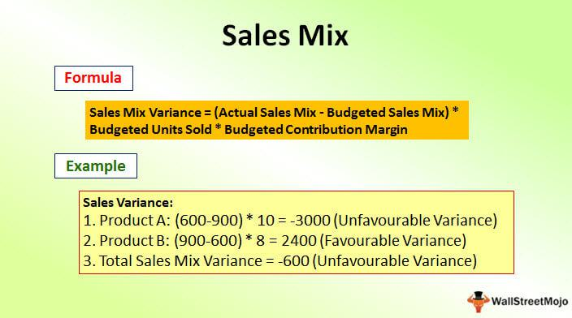

In today's fast-paced financial world, understanding the components that affect profitability and risk is key. Businesses navigate complex environments where strategic clarity is paramount for sustaining growth and competitiveness. A crucial aspect of this strategic clarity is financial analysis, with sales mix variance playing a significant role. Sales mix variance measures how actual sales deviate from the expected sales mix, particularly focusing on the proportion of products sold. This enables companies to assess which products are driving revenues as anticipated and which are underperforming. Rigorous analysis of this variance helps companies pinpoint product lines that bolster profitability, offering a detailed view into the operational dynamics affecting their bottom line.

Simultaneously, the rise of algorithmic trading, or algo trading, has transformed financial markets by leveraging computational algorithms to execute trading decisions. These algorithms rely heavily on financial metrics, incorporating sophisticated statistical analyses to enhance trading strategies. Variance, as a measure of the dispersion around an expected value, serves as a key statistical tool within this framework. It influences decisions by assessing the volatility of returns, hence refining risk management within trading strategies. Algo trading utilizes these insights to optimize market positions and improve the return profiles of trading portfolios. 



This article explores the intersection of sales mix variance, financial analysis, and algorithmic trading, shedding light on how these elements intertwine to inform strategic financial decisions. By understanding their interplay, businesses and traders can better position themselves for success in dynamic financial environments, ensuring robust strategies that align with evolving market conditions.

## Table of Contents

## Understanding Sales Mix Variance

Sales mix variance is an important financial metric used to measure the difference between the actual sales mix and the expected sales mix of various products within a company's portfolio. This variance arises when the proportion of individual product sales deviates from forecasts, potentially impacting overall revenue and profitability.

The calculation of sales mix variance is a two-step process. First, the sales mix for each product is determined by dividing the units sold of each product by the total units sold across all products. This establishes the actual sales mix. The expected sales mix is similarly calculated based on forecasted sales. The sales mix variance is then computed as:

$$
\text{Sales Mix Variance} = (\text{Actual Sales Mix} - \text{Expected Sales Mix}) \times \text{Total Units Sold} \times \text{Standard Profit Per Unit}
$$

Analyzing sales mix variance enables businesses to pinpoint which products are performing better or worse than anticipated. For instance, if a high-margin product underperforms relative to its expected sales mix, it could significantly affect profitability. Conversely, a higher-than-expected sales mix of a lower-margin product might indicate a shift in consumer preference or market conditions that require strategic adjustments.

Example: Suppose a company sells two types of widgets: Widget A and Widget B. The company expected to sell 60% of Widget A and 40% of Widget B. However, the actual sales mix was 50% for each widget. If the standard profit per unit for Widget A is $10 and for Widget B is $7, and the total units sold were 1,000, the sales mix variance for Widget A would be calculated as:

$$
\text{Sales Mix Variance for Widget A} = (0.50 - 0.60) \times 1000 \times 10 = -1000
$$

This negative variance indicates that fewer units of the higher-profit Widget A were sold than expected, thereby reducing potential profitability.

Understanding and managing sales mix variance allows companies to better align production, marketing, and sales strategies, ultimately enhancing financial performance.

## The Role of Variance in Financial Analysis

Variance in financial analysis is a crucial metric that measures the fluctuations in an organization’s financial performance. It is used to evaluate the unpredictability or inconsistency in different financial elements such as sales, costs, and profit margins. Understanding variance enables businesses to assess the risks associated with these financial metrics, providing a clearer view of the areas requiring attention or adjustment.

### Assessing Risk Through Variance

Variance aids in risk assessment by identifying the degree of deviation from expected performance metrics. For instance, examining the variance in sales can reveal how actual sales figures compare to budgeted or forecasted sales. A high variance might indicate more considerable unpredictability, suggesting underlying issues that could impact future revenues. Similarly, variance in profit margins can help businesses identify inefficiencies or cost variations affecting profitability.

By evaluating variance, organizations can become aware of potential risks and take necessary preemptive measures. This understanding is especially important for [volatility](/wiki/volatility-trading-strategies) management, where minimizing unexpected fluctuations can stabilize earnings and improve long-term financial health.

### Importance in Budgeting and Forecasting

Variance analysis plays a significant role in both budgeting and forecasting processes. It offers insights into whether a business's financial strategies and operations are aligned with its goals. For example, variance analysis helps in identifying discrepancies between budgeted and actual financial outcomes, enabling businesses to adjust their plans or operations to remain on track.

In forecasting, variance analysis enhances accuracy by continuously comparing forecasts with actual outcomes and refining prediction models based on these insights. This iterative process ensures that forecasts remain relevant and reliable, contributing to more effective strategic planning and resource allocation.

### Strategic Planning

Through variance analysis, companies can perform thorough strategic planning. Understanding the variances allows companies to review past performance comprehensively and make informed decisions for future actions. It facilitates the identification of patterns and trends, enabling businesses to capitalize on favorable conditions while mitigating adverse effects.

Strategic planning benefits from variance analysis by integrating historical data into models that forecast future scenarios. This integration assists businesses in setting realistic targets, anticipating potential challenges, and crafting strategies resilient to both expected and unexpected changes in financial circumstances.

In conclusion, the role of variance in the context of financial analysis is pivotal. By serving as a tool to measure fluctuations in financial performance, variance analysis enhances a business's capacity to manage risk, optimize budgeting and forecasting efforts, and conduct strategic planning with a data-driven approach. Understanding these fluctuations not only aids in immediate risk management but also positions businesses for sustained growth and profitability.

## Algorithmic Trading and Financial Metrics

Algorithmic trading employs advanced computational techniques and statistical models to perform high-speed trading decisions based on financial metrics. One of the pivotal statistical measures in this domain is variance, which not only quantifies the [dispersion](/wiki/dispersion-trading) of a set of data points but also provides critical insights into return volatility—a parameter essential for crafting effective trading strategies.

Variance is defined mathematically as the average of the squared differences from the mean. For a set of data points $x_1, x_2, \ldots, x_n$, with a mean $\mu$, the variance $\sigma^2$ is calculated as:

$$
\sigma^2 = \frac{1}{n} \sum_{i=1}^n (x_i - \mu)^2
$$

In financial markets, variance helps quantify the risk and uncertainty of returns, influencing trading decisions by highlighting potential volatility. Algorithmic trading systems integrate variance analysis to enhance the accuracy of their predictions and optimize trading strategies. By assessing the variance of asset returns, these systems can adjust their risk models and recalibrate trading strategies to maximize gains and minimize potential losses.

Python, given its robust libraries for statistical analysis, serves as a popular tool in [algorithmic trading](/wiki/algorithmic-trading). The following Python snippet demonstrates a basic calculation of variance from historical return data:

```python
import numpy as np

# Example: Historical return data for a financial asset
returns = np.array([0.05, 0.02, -0.01, 0.03, 0.04])

# Calculate the mean of returns
mean_return = np.mean(returns)

# Calculate the variance of returns
variance = np.mean((returns - mean_return) ** 2)

print("Mean Return:", mean_return)
print("Variance:", variance)
```

The role of variance analysis in algorithmic trading extends beyond simple calculations. It informs the design and implementation of risk management strategies by allowing traders to measure and interpret the stability or volatility of asset prices. Such insights enable the development of algorithms that can adapt dynamically to market conditions, either by hedging risks or by exploiting statistical [arbitrage](/wiki/arbitrage) opportunities.

Overall, variance analysis in algorithmic trading provides a refined approach to understanding market behavior, thereby enabling traders to optimize their decision-making processes and improve trading outcomes.

## Calculating Sales Mix Variance and Variance in Trading

Calculating sales mix variance involves comparing the actual sales mix to the budgeted or expected sales mix to identify discrepancies in product performance. The formula for sales mix variance is:

$$
\text{Sales Mix Variance} = (\text{Actual Sales Quantity} - \text{Actual Total Sales Quantity} \times \text{Budgeted Sales Mix Ratio}) \times \text{Budgeted Contribution Margin per Unit}
$$

Here's a step-by-step guide:

1. **Identify Actual Sales Quantities**: Determine the actual quantity sold for each product.

2. **Calculate Total Sales Quantity**: Sum the actual sales quantities for all products to get the overall total.

3. **Determine Budgeted Sales Mix Ratio**: For each product, find the ratio of budgeted sales quantity to total budgeted sales quantity.

4. **Compute Variance for Each Product**: Multiply the difference between actual sales quantity and the adjusted expected quantity (using the budgeted mix ratio) by the budgeted contribution margin per unit.

5. **Sum the Variances**: Add up the sales mix variances for all products to get the total sales mix variance.

### Example:

Suppose a company sells two products, A and B. The budgeted sales are 1,000 units of A and 500 units of B. The budgeted contribution margin per unit is $10 for A and $15 for B. The actual sales are 900 units of A and 700 units of B.

**Step-by-Step Calculation:**

- **Total Budgeted Sales Quantity**: 1,000 + 500 = 1,500 units
- **Budgeted Sales Mix Ratios**: A = 1,000/1,500 = 0.67, B = 500/1,500 = 0.33

For product A:

$$
\text{Sales Mix Variance for A} = (900 - 900 \times 0.67) \times 10 = 300 \times 10 = \$3,000
$$

For product B:

$$
\text{Sales Mix Variance for B} = (700 - 1200 \times 0.33) \times 15 = 300 \times 15 = \$4,500
$$

Total Sales Mix Variance = $\$3,000 + \$4,500 = \$7,500$

#### Variance in Trading:

Variance, a statistical measure, quantifies the spread of data points in a dataset. It's crucial in trading to understand return volatility. The formula for variance is:

$$
\text{Variance} = \frac{\sum (x_i - \mu)^2}{N}
$$

Where $x_i$ is each individual return, $\mu$ is the average return, and $N$ is the total number of returns.

### Example Calculation:

For a trading scenario with daily returns: [0.01, -0.02, 0.015, -0.005, 0.02]

1. Calculate the mean return:

$$
\mu = \frac{(0.01 - 0.02 + 0.015 - 0.005 + 0.02)}{5} = 0.004
$$

2. Find squared differences from the mean:

$$
(0.01 - 0.004)^2, (-0.02 - 0.004)^2, \ldots
$$

3. Sum the squared differences:

$$
0.000036, 0.000576, 0.000121, 0.000081, 0.000256 \]  
$$
\text{Sum} = 0.00107
$$

4. Divide by the number of observations:

$$
\frac{0.00107}{5} = 0.000214
$$

The variance of returns, 0.000214, reflects the volatility of the trading strategy, informing traders about the risk associated with their strategies.

Through these examples, businesses and traders can see the practical implications of sales mix variance and variance in their financial strategies.

## Managing Variance in Business and Trading

Managing sales mix variance is crucial for businesses seeking to enhance profitability. By analyzing and adjusting the sales mix, companies can focus on high-margin products, which contribute more significantly to profits. This requires regular assessment of product performance and strategic allocation of resources toward products that generate higher margins. For instance, a company might discover that a small portion of its product line is responsible for a substantial portion of its profits. Consequently, shifting marketing efforts and resources toward these products can lead to improved financial outcomes.

In the context of algorithmic trading, managing variance is essential for mitigating risk and refining trading strategies. Variance, as a statistical measure, provides insights into the volatility of returns, which is integral for risk management. Traders utilize variance to adjust their strategies in response to changing market conditions, ensuring that the risk taken is commensurate with potential rewards. This involves developing algorithms that can react dynamically to variance changes, maintaining a balance between risk exposure and potential profits.

Diversification is one of the key techniques for managing variance both in business and trading. By diversifying product lines or investment portfolios, businesses and traders can spread risk across multiple assets or products, reducing the impact of poor performance in any single area. This approach ensures that fluctuations in individual product performance or asset returns do not disproportionately affect the overall financial outcome.

Risk assessment tools play a pivotal role in managing variance. These tools analyze historical data to predict future fluctuations, enabling businesses and traders to make informed decisions. In trading, tools such as Value at Risk (VaR) models are frequently used to estimate the potential loss in value of an asset or portfolio under normal market conditions, over a set time frame. This provides a quantifiable measure of risk, which helps in setting appropriate thresholds for trading activities.

Adaptive trading algorithms are designed to respond to changes in variance by automatically adjusting trading strategies. These algorithms utilize real-time data analysis to monitor market conditions and execute trades based on pre-set criteria that consider variance levels. By doing so, they aim to exploit opportunities while minimizing risk, ensuring that trading strategies remain effective even in volatile markets.

In summary, effectively managing variance in business through strategic focus on high-margin products, and in trading through diversification, risk assessment tools, and adaptive algorithms, allows for better risk management and optimized profitability.

## Variance vs. Volatility: Key Differences

Understanding the nuances between variance and volatility is fundamental for developing effective financial strategies. Variance is a statistical measure that quantifies the dispersion of data points in a data set. It is calculated using the formula:

$$
\text{Variance} (\sigma^2) = \frac{\sum_{i=1}^{n} (x_i - \mu)^2}{n}
$$

where $x_i$ represents each data point, $\mu$ is the mean of the data, and $n$ is the number of data points. This formula provides insights into how much individual data points deviate from the mean of the data set, thereby illustrating the variability or spread of the data.

On the other hand, volatility is a concept frequently used in finance to describe the degree of variation in the price of a financial instrument over time. While variance offers a mathematical concept of spread, volatility refers to the standard deviation of returns over a specific period and is often annualized to allow for comparability. Volatility can be expressed as:

$$
\text{Volatility} = \sqrt{\text{Variance}}
$$

This relationship implies that volatility is the square root of variance, inherently connecting the two metrics but serving different practical purposes. In financial markets, volatility is seen as a practical measure of risk or uncertainty, reflecting the speed and extent of price movement in asset prices.

The distinction between variance and volatility is pivotal. Variance is primarily used in statistical contexts to assess data variability in various applications, augmenting financial reporting and analytical models. Volatility, however, facilitates a focus on observing the behavior of financial assets, rendering it essential for designing trading strategies and risk management frameworks.

Both metrics play a significant role in financial reporting and trading strategy development. Incorporating variance allows for robust analysis of performance fluctuations and assists in making informed decisions regarding budgeting and forecasting. Meanwhile, integrating volatility into trading strategies provides traders and analysts with a window into potential market movements, aiding in the anticipation of price changes and the corresponding adjustment of trading positions. Thus, a thorough comprehension of both variance and volatility empowers businesses and traders to tailor their approaches, optimizing decision-making and enhancing financial performance.

## Case Studies: Application of Variance

Case studies demonstrate how variance analysis can be leveraged to enhance decision-making processes in both business and trading environments. Here, we explore notable examples across various sectors that highlight the strategic applications and benefits of variance analysis.

### Technology Sector: Improving Product Profitability

A leading technology company known for its diverse product line utilized sales mix variance analysis to enhance its product strategy. By examining the expected and actual sales mix, the company identified that certain high-margin products were underperforming relative to expectations. This insight prompted a strategic shift towards promoting these high-margin products through targeted marketing and bundling strategies.

#### Implementation:

The company calculated the sales mix variance using the formula:

$$

\text{Sales Mix Variance} = (\text{Actual Sales Quantity} \times \text{Actual Sales Mix}) - (\text{Actual Sales Quantity} \times \text{Budgeted Sales Mix}) 
$$

Through this analysis, the company discovered that an increased focus on Product A, which had a 20% higher profit margin than the average product, could significantly boost profitability. This finding resulted in reprioritizing resources and adjusting sales targets, ultimately yielding a 15% increase in overall profit margins within a fiscal quarter.

### Finance Sector: Enhancing Trading Strategies

In the finance sector, a quantitative [hedge fund](/wiki/hedge-fund-trading-strategies) applied variance and volatility metrics to refine its algorithmic trading strategies. By analyzing historical price data, the fund was able to identify patterns of high volatility that were predictive of future price swings. This application of variance-based measures in evaluating asset price movements enabled the firm to improve its risk-adjusted returns.

#### Implementation:

Using Python, the firm implemented a volatility-based trading strategy by calculating the standard deviation of historical returns:

```python
import numpy as np

def calculate_volatility(price_data):
    returns = np.diff(price_data) / price_data[:-1]
    volatility = np.std(returns)
    return volatility

prices = [120, 122, 121, 123, 125, 126]
volatility = calculate_volatility(prices)
print("Calculated Volatility:", volatility)
```

By focusing on assets with higher calculated volatilities, the fund was able to optimize entry and [exit](/wiki/exit-strategy) points, improving the Sharpe ratio of their trading portfolio by 10%.

### Lessons Learned

These case studies underscore the critical value of variance analysis in strategic decision-making. In the technology sector, correctly leveraging sales mix variance facilitated targeted product strategy shifts that enhanced profitability. In finance, integrating variance and volatility assessments into trading algorithms enabled more precise risk management and enhanced performance. Entities looking to adopt similar strategies should consider investing in data analytics capabilities and fostering a culture that emphasizes data-driven decision-making. By doing so, they can better position themselves to navigate and capitalize on dynamic market conditions.

## Conclusion

As financial markets evolve, understanding and managing variance becomes increasingly essential for businesses and traders striving to maintain a competitive edge. Variance, as a measure of dispersion in financial data, provides critical insights that guide decision-making across various facets of business and trading activities. Emphasizing the importance of mastering these concepts, it's evident that entities adept in analyzing variance can better respond to market dynamics and fluctuations.

Integrating insights from sales mix variance and algorithmic trading further empowers organizations to refine their strategies. Sales mix variance allows businesses to pinpoint the performance of individual products, enabling a focus on enhancing profitability by optimizing product offerings. By doing so, companies can align their production and marketing efforts more effectively, ensuring resources are allocated to the most lucrative segments. For instance, calculating sales mix variance using the formula:

$$
\text{Sales Mix Variance} = (\text{Actual Mix Quantity} - \text{Standard Mix Quantity}) \times \text{Standard Price}
$$

provides a clear quantitative measure of the deviation from expected profit contributions, guiding strategic adjustments.

Similarly, algorithmic trading relies heavily on precise financial metrics, like variance, to inform trading strategies. Variance in this context measures the volatility of asset returns, influencing key decisions around buying and selling in financial markets. Through the application of sophisticated algorithms, traders can automate decisions that consider such variance metrics, leading to optimized trading performance and risk mitigation.

By mastering the application of variance in sales analyses and trading strategies, companies and traders alike enhance their ability to execute strategic initiatives effectively. This proficiency translates into improved risk management, optimized profitability, and a strengthened capacity to navigate the complexities of modern financial markets. As such, businesses and traders equipped with a robust understanding of variance are better poised to capitalize on opportunities and mitigate challenges within dynamic environments.

## References & Further Reading

1. **Books:**
   - *"Cost and Management Accounting: An Introduction"* by Bhimani, Horngren, Datar, and Rajan - This book provides foundational knowledge of cost accounting and introduces concepts like sales mix variance and its impact on a company's financials.
   - *"Quantitative Trading: How to Build Your Own Algorithmic Trading Business"* by Ernest P. Chan - Explores algorithmic trading, focusing on statistical methods and variance analysis to improve trading strategies.
   - *"Financial Analysis: A Business Decision Guide"* by Philip O'Regan - Offers insights into utilizing various financial analysis techniques to assess company performance, including the use of variance.

2. **Academic Articles:**
   - "Analyzing Sales Mix Variance" in *The Accounting Review* - This article breaks down the mathematical formula and methodology behind calculating sales mix variance.
   - "The Role of Variance Analysis in Managerial Decision-Making" in *Journal of Management Accounting Research* - Discusses the application of variance analysis in strategic planning and financial decision-making.

3. **Online Resources:**
   - Investopedia's page on [Sales Mix Variance](https://www.investopedia.com/terms/s/sales-mix-variance.asp) - Provides a clear definition and practical examples of sales mix variance.
   - Khan Academy's [Financial Analysis and Algorithmic Trading](https://www.khanacademy.org/finance.html) section - Offers free educational content on financial analysis techniques, including variance and its role in algorithmic trading.

4. **Industry Publications:**
   - The *Financial Times* regularly publishes articles on algorithmic trading and financial analysis techniques, providing current industry trends and updates.

5. **Software and Tools:**
   - Python libraries such as NumPy and Pandas can be used to calculate and analyze variance in datasets, essential for financial analysis and algorithmic trading. The following Python snippet demonstrates how to calculate variance using these libraries:

     ```python
     import numpy as np
     import pandas as pd

     # Example data
     data = [100, 150, 200, 250, 300]

     # Calculate variance using NumPy
     variance_np = np.var(data)
     print(f"Variance using NumPy: {variance_np}")

     # Calculate variance using Pandas
     df = pd.DataFrame(data, columns=['Values'])
     variance_pd = df['Values'].var()
     print(f"Variance using Pandas: {variance_pd}")
     ```

These resources are recommended for readers eager to expand their comprehension and application of sales mix variance, financial analysis, and algorithmic trading, equipping them with the tools to improve both business operations and trading strategies.