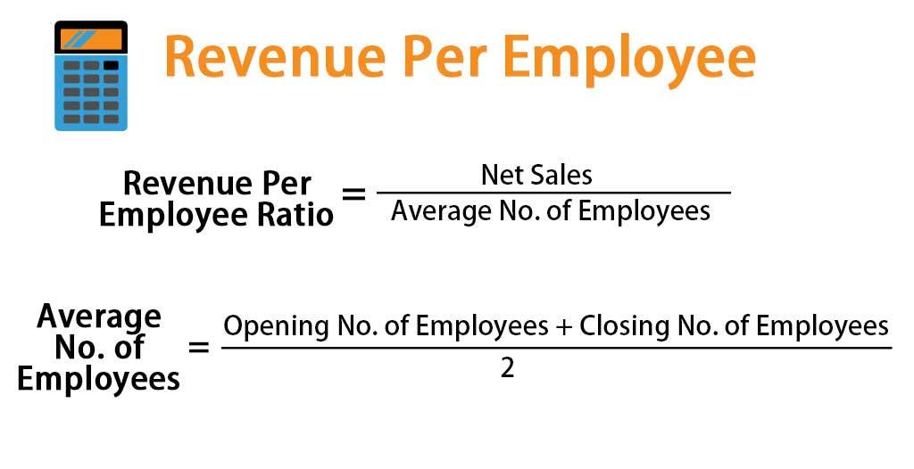

In the evolving landscape of business and finance, comprehending the interplay between sales performance, financial metrics, employee productivity, and algorithmic trading is essential. These elements collectively influence a company’s ability to thrive in competitive markets. Sales performance, measured through key metrics, serves as a direct indicator of a company's market position and operational efficiency. Financial metrics, such as the Sharpe Ratio and Compound Annual Growth Rate (CAGR), provide critical insights into a company’s financial health and investment capabilities, reflecting its capacity to balance risk and reward.

Employee productivity, often assessed using metrics like output per hour, is a crucial determinant of business success, as it directly impacts the bottom line and operational effectiveness. Additionally, the advent of algorithmic trading introduces a paradigm shift in the financial sector. By utilizing pre-defined rules and automated systems, businesses can execute trades with greater precision and speed, minimizing emotional bias and enhancing decision-making.



Understanding these relationships is not merely academic; it enables businesses to make informed strategic decisions, thereby enhancing their competitive edge. By dissecting these components, this article aims to provide valuable insights into optimizing business processes and achieving superior financial performance. Such a multifaceted approach is integral to sustaining growth and achieving long-term success in today's fast-paced business environment.

## Table of Contents

## Importance of Sales Performance Metrics

Sales performance metrics are essential for understanding the overall health of a company. One of the most critical metrics is the Sales-per-Employee Ratio, which provides a clear cost-benefit analysis relative to the size of the workforce. This ratio is calculated as:

$$
\text{Sales-per-Employee} = \frac{\text{Total Sales}}{\text{Number of Employees}}
$$

A higher Sales-per-Employee Ratio is typically indicative of efficient operations characterized by lower overhead costs, contributing to increased profitability. This metric is especially useful in sectors heavily reliant on labor, such as retail and services. In these industries, controlling labor costs while maximizing revenue per employee is crucial.

The significance of the Sales-per-Employee Ratio extends beyond simple efficiency. It serves as a critical tool for identifying operational bottlenecks and optimizing workforce deployment. A consistent upward trend in this metric may signal effective management and operational scalability, while a declining trend might highlight issues such as overstaffing or inefficiencies within the sales process.

Moreover, ongoing analysis of sales performance metrics provides businesses with insights that are invaluable for strategic planning. By understanding the relationship between sales outputs and workforce inputs, companies can make informed decisions about future investments in human capital and technology. They can also align their sales strategies with broader operational goals, ensuring that every aspect of the business is geared toward sustainable growth and competitiveness.

In summary, sales performance metrics like the Sales-per-Employee Ratio are indispensable tools for assessing a company's operational effectiveness. They offer a window into the efficiency of the workforce and help identify areas for improvement, ultimately supporting long-term strategic planning and decision-making processes.

## Key Financial Metrics for Evaluating Business Success

Financial metrics are fundamental in assessing a business's success and guiding strategic decisions. Key metrics such as the Sharpe Ratio and Compound Annual Growth Rate (CAGR) provide essential insights for evaluating investment performance and risk management. By examining these metrics, businesses can benchmark their achievements against market standards, enabling a balance between risk and reward.

The Sharpe Ratio is a measure of risk-adjusted return, calculated as the difference between the portfolio return and the risk-free rate, divided by the standard deviation of the portfolio's excess return. This formula is expressed as:

$$
\text{Sharpe Ratio} = \frac{R_p - R_f}{\sigma_p}
$$

where $R_p$ is the expected portfolio return, $R_f$ is the risk-free rate of return, and $\sigma_p$ is the standard deviation of the portfolio return. A higher Sharpe Ratio indicates a more favorable risk-adjusted return, which is crucial for comparing different investment opportunities and ensuring that the portfolio achieves the best possible outcomes with the least risk.

The Compound Annual Growth Rate (CAGR) is another essential metric, representing the mean annual growth rate of an investment over a specified time period longer than one year. The formula for CAGR is:

$$
\text{CAGR} = \left( \frac{V_f}{V_i} \right)^{\frac{1}{n}} - 1
$$

where $V_f$ is the final value, $V_i$ is the initial value, and $n$ is the number of years. CAGR offers a smoothed annual rate of growth, eliminating the effects of volatility and allowing businesses to understand growth trends better.

These financial metrics play a significant role in shaping investment strategies and optimizing business performance. By understanding and applying these tools, companies can make informed decisions regarding capital investment and resource allocation, enhancing their strategic planning processes and ensuring alignment with long-term objectives.

Incorporating these metrics into regular evaluations provides businesses with a comprehensive analysis of their investment performance. This practice aids in identifying areas for improvement and ensuring the allocation of resources aligns with strategic goals. Ultimately, leveraging financial metrics like the Sharpe Ratio and CAGR empowers organizations to pursue growth opportunities confidently, manage risks effectively, and sustain competitive advantages in the marketplace.

## Enhancing Employee Productivity Through Metrics

Employee productivity is a key determinant of business efficiency and profitability. By effectively measuring productivity, organizations can gain insights into how workforce effectiveness aligns with broader business objectives. Among the important metrics for gauging employee productivity are output per hour and project completion rates, both of which provide valuable information about an individual's or team's contribution to the company's overall performance.

Output per hour, or labor productivity, is calculated by dividing the total output of goods or services by the total number of labor hours worked:

$$
\text{Output per Hour} = \frac{\text{Total Output}}{\text{Total Labor Hours}}
$$

This metric is crucial for identifying inefficiencies in production processes and for benchmarking employee performance against industry standards. A higher output per hour indicates that the workforce is generating more value in less time, which is desirable in a competitive marketplace. Conversely, a lower output per hour may signal the need for process improvements or additional training.

Project completion rates, on the other hand, measure the ability of employees or teams to complete assigned tasks within a specific timeframe. This metric can be expressed as:

$$
\text{Project Completion Rate} = \left(\frac{\text{Number of Completed Projects}}{\text{Total Number of Assigned Projects}}\right) \times 100\%
$$

Understanding these metrics enables organizations to develop strategies that enhance productivity and morale. For instance, a company observing a decline in project completion rates might investigate project management methodologies or reconsider resource allocation. It can also lead to initiatives aimed at incentivizing employees or adjusting workload assignments to better align with individual strengths.

When productivity metrics are integrated with financial performance data, organizations can achieve a comprehensive view of their operational health. For instance, comparing labor costs against output per hour provides insights into the economic efficiency of the workforce. This integration can reveal which departments or teams are exceeding performance expectations and which need interventions to raise their productivity levels.

Harnessing employee productivity metrics to drive business success involves several approaches. Firstly, organizations should foster a transparent communication culture, where employees understand how their productivity metrics impact the company's bottom line. Clear goals and feedback loops can be established to maintain high performance standards.

Secondly, leveraging technology and automation can alleviate routine tasks, allowing employees to focus on value-added activities that improve productivity. For instance, automating data entry or routine analysis tasks can free up time for critical problem-solving and innovation.

Lastly, continuous professional development and training programs are essential for bolstering productivity. Investing in the skills and competencies of the workforce ensures that employees are equipped to meet evolving business needs and technological advancements.

In summary, effectively measuring and understanding employee productivity metrics is vital for implementing strategies that enhance operational efficiency and profitability. By integrating these metrics with financial data, businesses can optimize their processes, allocate resources more effectively, and cultivate a work environment conducive to achieving strategic goals.

## Algorithmic Trading: Transforming Financial Performance

Algorithmic trading relies on the use of pre-defined rules to execute trades efficiently, capitalizing on market opportunities that might be missed by manual trading. This method leverages computer algorithms to analyze market data and execute trades at high speeds and frequencies, surpassing human capabilities. The basis of [algorithmic trading](/wiki/algorithmic-trading) is to utilize mathematical models and computational resources to identify and act upon trading signals systematically, minimizing human errors and emotional biases.

An essential aspect of algorithmic trading is the evaluation of algorithm performance through various metrics. The Sharpe Ratio, a key metric in trading, measures risk-adjusted return and is calculated as:

$$
\text{Sharpe Ratio} = \frac{E[R_p - R_f]}{\sigma_p}
$$

where $R_p$ is the return of the portfolio, $R_f$ is the risk-free rate, and $\sigma_p$ is the standard deviation of the portfolio's excess return. A higher Sharpe Ratio indicates more desirable risk-adjusted performance.

Another vital metric is the Winning Percentage, which denotes the ratio of profitable trades to the total number of trades executed. This percentage offers insights into the algorithm's effectiveness in identifying profitable trades. A higher Winning Percentage suggests that the algorithm successfully captures profitable opportunities.

The Maximum Drawdown metric evaluates the peak-to-trough decline during a specific period for a portfolio, providing a measure of downside risk. It is expressed as a percentage, representing the largest loss from a peak before a new high is achieved. This metric helps traders understand the worst-case scenario in terms of losses and aids in setting appropriate risk management strategies.

Algorithmic trading systems enhance market efficiency by executing trades with precision and speed that humans cannot match. They eliminate emotional decision-making, which can often lead to suboptimal trading outcomes, and ensure consistent execution of trades according to the pre-established criteria.

To illustrate the application of algorithmic trading, consider a simple Python script that uses a moving average crossover strategy to trade stocks:

```python
import pandas as pd
import numpy as np

# Load historical stock price data
data = pd.read_csv('stock_data.csv')
short_window = 40
long_window = 100

# Generate short and long moving averages
data['Short_Moving_Avg'] = data['Close'].rolling(window=short_window).mean()
data['Long_Moving_Avg'] = data['Close'].rolling(window=long_window).mean()

# Create signal where short MA is greater than long MA
data['Signal'] = 0.0
data['Signal'][short_window:] = np.where(data['Short_Moving_Avg'][short_window:] > 
                                         data['Long_Moving_Avg'][short_window:], 1.0, 0.0)

# Generate trading orders
data['Positions'] = data['Signal'].diff()

# Output the trading signals
print(data[['Close', 'Short_Moving_Avg', 'Long_Moving_Avg', 'Signal', 'Positions']].tail())
```

The above script calculates a short-term and a long-term moving average of stock prices and generates buy and sell signals based on their crossover. When the short-term average rises above the long-term average, a buy signal is generated, and vice-versa for a sell signal. This algorithmic approach supports decision-making that is consistent with predefined rules and minimizes emotional impact.

In summary, algorithmic trading represents a transformative tool in modern finance, offering significant advantages in trade execution, efficiency, and risk management. By systematically applying financial metrics like the Sharpe Ratio, Winning Percentage, and Maximum Drawdown, traders can better align their strategies with their risk tolerance and performance objectives, thereby enhancing overall financial outcomes.

## Conclusion

Integrating sales performance, financial metrics, and employee productivity into strategic planning is crucial for modern businesses seeking sustained growth and profitability. These elements provide a comprehensive framework for assessing and enhancing business operations. By systematically evaluating sales performance metrics, such as sales-per-employee ratios, companies can optimize labor efficiency and reduce overhead costs, leading to improved profitability. Similarly, monitoring financial metrics, like the Sharpe Ratio and Compound Annual Growth Rate (CAGR), guides investment strategies and resource allocation, ensuring that risk and reward are balanced effectively.

Algorithmic trading plays a transformative role by eliminating human biases from trading decisions, demonstrating the power of technology within the financial industry. This approach leverages predefined algorithms to execute trades with precision and consistency, aligning trading strategies with desired risk tolerance and performance objectives. Key performance indicators (KPIs) such as Winning Percentage and Maximum Drawdown further aid in tailoring these strategies to market conditions.

Furthermore, continuous evaluation and adaptation of these metrics ensure businesses remain aligned with their objectives and are responsive to market dynamics. This ongoing analysis enables real-time strategic adjustments, empowering companies to maintain a competitive edge. In essence, a multifaceted approach that integrates these components not only optimizes operations but also enhances the overall sustainability and success of businesses in an ever-evolving marketplace. By thoroughly understanding and utilizing these factors, businesses can not only achieve but also sustain superior financial performance.

## References & Further Reading

[1]: Bergstra, J., Bardenet, R., Bengio, Y., & Kégl, B. (2011). ["Algorithms for Hyper-Parameter Optimization."](https://dl.acm.org/doi/10.5555/2986459.2986743) Advances in Neural Information Processing Systems 24.

[2]: ["Advances in Financial Machine Learning"](https://www.amazon.com/Advances-Financial-Machine-Learning-Marcos/dp/1119482089) by Marcos Lopez de Prado

[3]: ["Evidence-Based Technical Analysis: Applying the Scientific Method and Statistical Inference to Trading Signals"](https://www.amazon.com/Evidence-Based-Technical-Analysis-Scientific-Statistical/dp/0470008741) by David Aronson

[4]: ["Machine Learning for Algorithmic Trading"](https://github.com/stefan-jansen/machine-learning-for-trading) by Stefan Jansen

[5]: ["Quantitative Trading: How to Build Your Own Algorithmic Trading Business"](https://github.com/LucindaYa/quant-resources/blob/master/Quantitative%20Trading%20How%20to%20Build%20Your%20Own%20Algorithmic%20Trading%20Business.pdf) by Ernest P. Chan

[6]: Bodie, Z., Kane, A., & Marcus, A. J. (2014). ["Investments and Portfolio Management,"](https://www.mheducation.com/highered/product/Investments-Bodie.html) McGraw-Hill Education.

[7]: Sharpe, W. F. (1966). ["Mutual Fund Performance."](https://www.jstor.org/stable/2351741) Journal of Business, 39(1), 119–138.

[8]: Harris, L. (2002). ["Trading and Exchanges: Market Microstructure for Practitioners,"](https://academic.oup.com/book/52292) Oxford University Press.

[9]: Kaplan, R. S., & Norton, D. P. (1996). ["The Balanced Scorecard: Translating Strategy into Action,"](https://www.hbs.edu/faculty/Pages/item.aspx?num=8831) Harvard Business Review Press.

[10]: Piketty, T. (2014). ["Capital in the Twenty-First Century,"](https://www.jstor.org/stable/j.ctt6wpqbc) Harvard University Press.