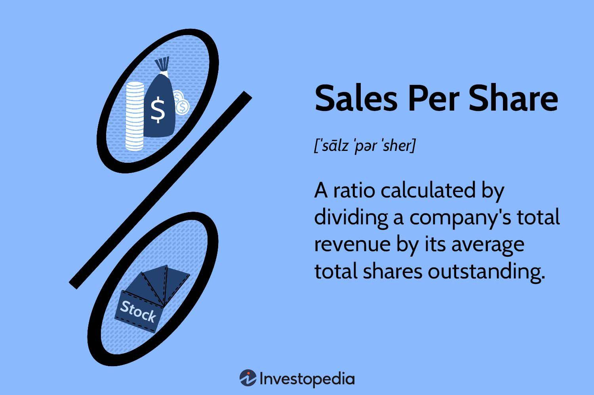

Investing and trading have undergone significant transformations with the integration of financial metrics and algorithmic trading. As technology advances, the methods by which investors evaluate the performance of companies have become increasingly sophisticated. Among the plethora of financial metrics available, Sales Per Share (SPS) emerges as a pivotal indicator, providing insights into a company's effectiveness in generating revenue relative to its share count. This metric enables investors to assess a company's operational efficiency by indicating how much sales revenue is attributed to each share of stock.

Sales Per Share serves as a window into a company’s performance, offering a detailed view that aids investors in making informed decisions. As financial markets grow more complex, understanding SPS becomes crucial for evaluating potential investments. Moreover, the fusion of SPS with algorithmic trading can elevate trading strategies by providing data-driven insights. Algorithmic trading, characterized by its use of pre-programmed algorithms to execute trades, can leverage SPS to refine its models and optimize outcomes.



This article explores the intersection of Sales Per Share metrics with both traditional investment analysis and modern algorithmic trading frameworks. By understanding how these metrics function and their significance, traders and investors can enhance their decision-making processes and strategies. As we progress, we aim to illuminate the critical role of SPS in the contemporary financial landscape, thus paving the way for better trading and investment outcomes.

## Table of Contents

## Understanding Sales Per Share

Sales per share (SPS) is a financial metric that quantifies the total revenue earned by a company for each outstanding share over a specific period, typically a fiscal quarter or year. This ratio serves as a barometer of a company's operational productivity on a per-share basis, allowing investors to evaluate how effectively a company generates revenue relative to its equity base.

The SPS is calculated by dividing the company's total revenue by the average number of shares outstanding during the period under consideration. The formula is as follows:

$$
\text{SPS} = \frac{\text{Total Revenue}}{\text{Average Total Shares Outstanding}}
$$

This straightforward calculation offers a clear snapshot of revenue performance, making it an appealing gauge for investors seeking to assess a company's market position and growth potential. A higher SPS suggests that a company is generating substantial revenue per share, which may indicate superior performance and efficiency in its operations relative to its peers.

However, while SPS is a valuable metric, it is not without its limitations. Notably, it fails to account for the company's operating costs, expenses, and debt obligations. As a result, SPS should not be viewed in isolation. A high SPS does not necessarily translate to profitability, as a company could be generating significant revenue while incurring equally high expenses, leading to minimal or negative net earnings.

Therefore, while SPS provides useful insights into revenue generation, it is essential to consider it alongside other financial metrics, such as net income, earnings per share (EPS), and financial ratios that [factor](/wiki/factor-investing) in profitability, cost management, and debt levels, to gain a comprehensive understanding of a company's financial health and operational efficiency.

## Importance of SPS in Investment Analysis

Sales Per Share (SPS) is a critical metric that investors utilize to quickly assess a company's revenue performance relative to its peers. By providing a per-share breakdown of total revenue, SPS offers insight into a company's operational efficiency and potential market strength. This metric serves as a straightforward way to compare companies, especially those within the same sector, as it neutralizes the variations arising from differing scales of operation and capital structures.

The calculation of SPS is straightforward:
$$
\text{Sales Per Share (SPS)} = \frac{\text{Total Revenue}}{\text{Average Total Shares Outstanding}}
$$

A higher SPS value suggests that a company is generating more revenue per share, indicating stronger revenue-generating capabilities, which can be attractive to investors seeking growth opportunities. By analyzing SPS, investors can discern historical revenue trends, aiding in the evaluation of a company’s growth trajectory over time.

Particularly within sectors characterized by similar business models and financial structures, SPS becomes an invaluable tool. It facilitates a clear side-by-side comparison, allowing investors to identify which companies are managing to convert their market presence into tangible revenue results. This comparative analysis can inform decisions on capital allocation, directing investment towards companies with favorable SPS metrics.

However, while SPS is a potent indicator of revenue performance, it should not be relied upon in isolation. The metric does not account for the various expenses a company incurs, including cost of goods sold, operational costs, or debt obligations. For a holistic understanding of a company's financial health, SPS must be used in conjunction with other financial metrics, such as earnings per share (EPS), price-to-earnings (P/E) ratio, and return on equity (ROE). Combining SPS with these measures allows investors to form a comprehensive picture of both revenue efficiency and overall financial stability, ensuring more informed and balanced investment decisions.

## Algorithmic Trading: An Overview

Algorithmic trading, commonly known as algo trading, is a highly efficient method of executing trades through the use of computer programs. This approach allows for trades to be conducted at an extraordinary speed and [volume](/wiki/volume-trading-strategy), significantly surpassing human capabilities. The core of [algorithmic trading](/wiki/algorithmic-trading) lies in its ability to identify market opportunities and execute transactions with precision. This precision stems from sophisticated algorithms that analyze multiple market conditions in real-time, allowing traders to capitalize on advantageous situations that may only exist momentarily.

One of the primary advantages of algorithmic trading is the removal of emotional bias from trading decisions. Emotions such as fear and greed often impact human traders, potentially leading to errors in judgment. By employing algorithms that are grounded in logic and predetermined criteria, trading can be executed based on objective data, thus enhancing decision-making accuracy and efficiency.

Financial metrics are integral to developing and refining trading strategies within algorithmic systems. Metrics such as Sales Per Share (SPS) provide valuable insights into a company's performance, aiding algorithms in making informed decisions. These metrics help in filtering and selecting stocks with promising revenue per share, thus optimizing trading strategies to achieve better returns.

Understanding the various algo trading metrics is crucial for optimizing automated trading systems. These metrics not only influence the algorithms' decision-making processes but also play a significant role in evaluating the performance of trading strategies. When combined with the strategic integration of financial metrics, algorithmic trading can effectively enhance both execution quality and profitability in the financial markets.

## Integrating SPS into Algo Trading Strategies

In algorithmic trading, incorporating Sales Per Share (SPS) as a financial metric can significantly refine and enhance trading strategies. As a performance indicator, SPS offers insights into the revenue generated by a company relative to the number of shares outstanding. By programming algorithms to consider SPS trends, traders can efficiently filter stocks that exhibit strong revenue performance per share, thus identifying potentially lucrative trading opportunities.

To automate decision-making processes, algorithms can be designed to buy or sell stocks based on SPS indicators. For instance, an algorithm might be programmed to initiate a buy order if a company's SPS surpasses a certain threshold, suggesting robust revenue performance. Conversely, a sell order might be triggered if the SPS falls below a predefined benchmark, potentially signaling declining revenue. This automation minimizes human error and emotional bias, ensuring trades are executed based solely on quantitative analysis.

Here's a simple Python code snippet illustrating how SPS could be integrated into a basic trading algorithm:

```python
def calculate_sps(total_revenue, shares_outstanding):
    return total_revenue / shares_outstanding

def trading_decision(sps, sps_threshold):
    if sps > sps_threshold:
        return "Buy"
    elif sps < sps_threshold:
        return "Sell"
    return "Hold"

# Example usage
total_revenue = 1_000_000  # Example total revenue
shares_outstanding = 100_000  # Example shares outstanding
sps_threshold = 10  # Example threshold

sps_value = calculate_sps(total_revenue, shares_outstanding)
decision = trading_decision(sps_value, sps_threshold)
print(f"SPS: {sps_value}, Decision: {decision}")
```

While SPS offers valuable insights, relying solely on it could lead to oversights, as it does not account for the cost management or debt liabilities of a company. Therefore, traders should integrate SPS with other critical evaluation metrics such as the Sharpe Ratio and Maximum Drawdown to optimize algorithmic trading performance. The Sharpe Ratio offers insights into risk-adjusted returns, ensuring that the strategy provides a balanced risk-to-reward profile. Maximum Drawdown highlights the potential downside risk, quantifying the maximum loss from a previous peak, which is crucial for maintaining capital preservation.

By using SPS in conjunction with these metrics, traders can enhance the robustness and profitability of their strategies, ensuring a comprehensive assessment of investment opportunities. Integrating SPS into algorithmic trading strategies demands a thoughtful approach, balancing it with other measures to achieve sustainable trading success.

## Key Metrics for Evaluating Algo Trading Performance

Evaluating the performance of algorithmic trading strategies is crucial for optimizing returns and managing risk. Several key metrics are instrumental in assessing the effectiveness of these strategies:

1. **Sharpe Ratio**: This is one of the most widely used metrics for evaluating risk-adjusted returns. It measures the excess return per unit of risk, calculated as:
$$
   \text{Sharpe Ratio} = \frac{E[R_p] - R_f}{\sigma_p}

$$

   where $E[R_p]$ is the expected return of the portfolio, $R_f$ is the risk-free rate, and $\sigma_p$ is the standard deviation of the portfolio's excess return. A higher Sharpe Ratio indicates a more efficient risk exposure, as it reflects the return generated per unit of risk taken.

2. **Maximum Drawdown (MDD)**: This metric quantifies the largest loss observed from a peak to a trough of a portfolio before a new peak is attained. It is a critical measure of downside risk, providing insight into the worst-case scenario for an investment strategy. It is expressed as:
$$
   \text{MDD} = \frac{\max(\text{Peak} - \text{Trough})}{\text{Peak}}

$$

   where "Peak" refers to the highest portfolio value and "Trough" is the subsequent lowest value. A lower MDD indicates better risk management and resilience of the strategy against market downturns.

3. **Win Rate**: This measures the proportion of profitable trades executed by the algorithm out of the total number of trades. It is calculated as:
$$
   \text{Win Rate} = \frac{\text{Number of Profitable Trades}}{\text{Total Number of Trades}}

$$

   A higher win rate suggests a more accurate and reliable trading strategy, although it should be complemented with other metrics such as the average profit per trade to get a full picture of performance.

Regularly reviewing and analyzing these metrics is essential for ensuring the effectiveness of algorithmic trading strategies. By doing so, traders can identify strengths and weaknesses within their systems, allowing for continuous improvement and adaptation to changing market conditions.

## Conclusion

Sales Per Share (SPS) remains a valuable metric that can significantly enhance both traditional and algorithmic trading strategies. By integrating SPS into trading approaches, investors gain a better understanding of company performance, allowing for more informed decision-making. In the context of algorithmic trading, the combination of SPS with other comprehensive financial metrics is crucial for optimizing returns. As the financial landscape continues to evolve with technological advancements and market dynamics, staying abreast of relevant metrics such as SPS can contribute to more successful trading results. Strategically incorporating SPS can thus play a key role in achieving sustainable investment outcomes, as it provides a clear perspective on revenue per share, guiding investment decisions toward more profitable ventures. Balancing this metric with other evaluation tools fosters a holistic analysis of market opportunities, ultimately aiding in the development of resilient, effective trading strategies.

## References & Further Reading

[1]: ["Advances in Financial Machine Learning"](https://www.amazon.com/Advances-Financial-Machine-Learning-Marcos/dp/1119482089) by Marcos Lopez de Prado

[2]: ["Evidence-Based Technical Analysis: Applying the Scientific Method and Statistical Inference to Trading Signals"](https://www.amazon.com/Evidence-Based-Technical-Analysis-Scientific-Statistical/dp/0470008741) by David Aronson

[3]: ["Machine Learning for Algorithmic Trading"](https://github.com/stefan-jansen/machine-learning-for-trading) by Stefan Jansen

[4]: ["Quantitative Trading: How to Build Your Own Algorithmic Trading Business"](https://www.amazon.com/Quantitative-Trading-Build-Algorithmic-Business/dp/1119800064) by Ernest P. Chan

[5]: Bergstra, J., Bardenet, R., Bengio, Y., & Kégl, B. (2011). ["Algorithms for Hyper-Parameter Optimization."](https://dl.acm.org/doi/10.5555/2986459.2986743) Advances in Neural Information Processing Systems 24.