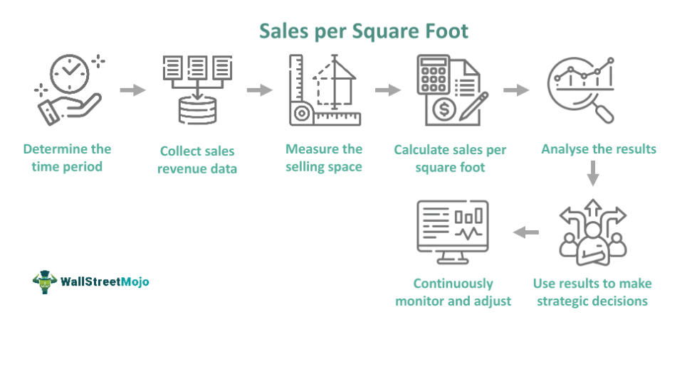

The retail industry has undergone a substantial transformation, driven significantly by advancements in technology. This evolution has reshaped business landscapes, influencing how retailers engage with customers and how operations are conducted. In this dynamic environment, comprehending sales performance and conducting thorough sales analysis are pivotal for retail success. Retail metrics, the quantitative measures reflecting various aspects of business operations, have emerged as essential tools for retailers to gauge their performance, understand customer behaviors, and refine business strategies.

Sales performance is a primary indicator of a retailer's success, reflecting the effectiveness of retail strategies in converting prospects into sales. As technology has permeated the retail sector, tools for measuring and analyzing sales performance have advanced, enabling retailers to capture detailed insights into their operations. Key metrics such as sales per square foot, customer conversion rates, and average transaction values serve as benchmarks for efficiency and effectiveness. By analyzing these metrics, retailers can assess their operational health and align their strategies with market demands.



In parallel, algorithmic trading—a practice primarily associated with financial markets—has found significant applications in retail. It leverages sophisticated algorithms for making data-driven decisions, optimizing inventory levels, and adjusting pricing strategies in near real-time. The integration of retail metrics with algorithmic trading can significantly enhance the agility and effectiveness of retail operations.

This article investigates the crossroads where retail metrics meet algorithmic trading. It highlights how retail metrics can be paired with algorithmic strategies to improve decision-making processes and drive profitability. As technology continues to advance, retailers must embrace these innovative approaches to maintain a competitive edge. The future of retail lies in harnessing the combined power of traditional metrics and advanced computational techniques to navigate an ever-evolving commercial landscape.

## Table of Contents

## Sales Performance in Retail

Sales performance is a crucial determinant of a retailer's success, directly impacting profitability and long-term viability. A significant metric employed to evaluate this performance is sales per square foot. Sales per square foot is calculated by dividing the total sales by the square footage of retail space utilized. This metric provides valuable insights into the efficiency of a retail environment, highlighting how effectively space is utilized to generate revenue. 

A higher sales per square foot indicates superior management and optimal utilization of retail space, reflecting a retailer's ability to convert foot traffic into sales effectively. Retailers aim to maximize this metric by strategically leveraging store layout, product placement, and inventory management. Consistent monitoring and analysis of sales per square foot can guide retailers in identifying underperforming areas and making informed decisions to enhance the overall layout and customer experience.

Understanding the implications of sales per square foot goes beyond internal assessments. By comparing this metric with industry averages, retailers can benchmark their performance against competitors, identifying areas where improvements can be made to gain a competitive edge. In a rapidly evolving retail landscape, optimizing sales performance through efficient use of physical space is a critical strategy for sustained success.

## Retail Metrics That Matter

Retail metrics play a pivotal role in defining the success of businesses by providing critical insights that inform strategic decisions. Key metrics such as sales per square foot, customer conversion rate, and average transaction value serve as essential tools for understanding customer behavior and optimizing retail strategies.

**Sales per Square Foot:**
Sales per square foot is a fundamental metric that evaluates the effectiveness of retail space utilization. It is calculated by dividing the total sales revenue by the total square footage of retail space and is expressed as:

$$
\text{Sales per Square Foot} = \frac{\text{Total Sales Revenue}}{\text{Total Retail Space (sq ft)}}
$$

A higher value indicates efficient space management and effective product placement, often leading to higher profitability. Retailers use this metric to compare different locations or departments within a store, allowing for targeted improvements to underperforming areas.

**Customer Conversion Rate:**
The customer conversion rate measures the percentage of visitors to a retail store who make a purchase, offering insights into the effectiveness of marketing strategies and store layout. It is computed using the formula:

$$
\text{Customer Conversion Rate} = \left( \frac{\text{Number of Purchases}}{\text{Number of Visitors}} \right) \times 100\%
$$

A higher conversion rate indicates successful engagement with customers and effective sales strategies, signaling that the business is meeting consumer demands effectively.

**Average Transaction Value (ATV):**
The average transaction value provides an understanding of how much customers spend on average per transaction. It is calculated by dividing the total revenue by the number of transactions, as shown below:

$$
\text{Average Transaction Value} = \frac{\text{Total Revenue}}{\text{Number of Transactions}}
$$

This metric helps businesses assess their pricing strategies and identify opportunities to increase sales through upselling or cross-selling techniques. By tracking ATV, retailers can optimize product offers and marketing campaigns to maximize revenue.

Comparing these metrics against industry standards enables retailers to gauge their performance relative to competitors, identify growth opportunities, and enhance their competitive positioning. Employing these metrics effectively allows retailers to make informed decisions that improve operational efficiency and drive business growth.

## Sales Analysis Techniques

Effective sales analysis requires a detailed review of data to identify trends and patterns that can drive strategic business decisions. One of the primary techniques employed by retailers is cohort analysis. This method involves segmenting customers into groups who share common characteristics or experiences within a defined time frame. For example, a retailer might analyze cohorts based on the month of first purchase. By tracking how different cohorts behave over time, businesses can gain insights into customer retention, lifetime value, and the success of marketing efforts. Cohort analysis helps in pinpointing periods of high customer attrition or determining the impact of external factors on sales.

Another important technique is RFM analysis, which stands for Recency, Frequency, and Monetary value. This model categorizes customers based on how recently they purchased, how often they purchase, and how much they spend. By analyzing these three dimensions, retailers can identify high-value customers, tailor marketing strategies, and prioritize customer engagement efforts. RFM analysis is highly effective in improving customer segmentation and targeting, ultimately enhancing loyalty and increasing sales.

Predictive analytics also plays a significant role in sales analysis by anticipating future sales trends based on historical data. Utilizing statistical algorithms and [machine learning](/wiki/machine-learning) models, predictive analytics can forecast future demand, optimize inventory levels, and tailor marketing campaigns. For example, a retailer might use time series forecasting to predict sales in the upcoming quarter, allowing for better resource allocation and strategic planning.

Incorporating these techniques, businesses can derive actionable insights, enabling them to make informed decisions and adapt to changing market conditions. By leveraging cohort and RFM analysis alongside predictive analytics, retailers can improve operational efficiency, enhance customer satisfaction, and drive sustained growth.

## The Role of Algorithmic Trading in Retail

Algorithmic trading, commonly referred to as algo trading, makes use of sophisticated mathematical models and algorithms to automate trading decisions, enabling traders to execute orders at speeds and frequencies that are otherwise impossible for human traders. In retail, the concept extends beyond mere stock trading to encompass operations such as inventory management and dynamic pricing.

In the retail context, algorithms are employed to optimize inventory levels, ensuring that products are restocked in sync with demand fluctuations. By analyzing vast datasets, algorithms can predict demand with greater accuracy, minimizing the risk of overstocking or stockouts. For example, algorithms may process historical sales data, current market trends, seasonality factors, and even external inputs such as economic indicators to forecast future inventory needs. This predictive power allows retailers to balance supply with expected demand effectively.

Pricing strategy optimization is another area where [algorithmic trading](/wiki/algorithmic-trading) techniques prove beneficial. Dynamic pricing algorithms analyze competitive pricing, consumer demand elasticity, and market conditions in real-time to determine optimal pricing points at any given moment. This ability is crucial in an era where online retail competition requires prices to be regularly adjusted to remain competitive while maintaining margins.

The automation aspect of algorithmic trading ensures that these processes react instantaneously to market changes, enhancing operational efficiency. For instance, in response to a sudden spike in demand for a particular product, an algorithm can automatically adjust inventory orders and pricing to capitalize on the opportunity. Similarly, should a competitor lower prices significantly, an algorithm can quickly adapt a retailer's pricing to maintain competitiveness.

In conclusion, by integrating algorithmic trading into retail operations, businesses gain the ability to make informed, data-driven decisions quickly and efficiently. This enhances their capability to adapt to market [volatility](/wiki/volatility-trading-strategies), optimize resource allocation, and ultimately drive profitability.

## Evaluating Trading Algorithms

Evaluating trading algorithms involves measuring various performance metrics to understand the risk-return dynamics of a strategy. Key metrics often used for this purpose include the Sharpe Ratio, maximum drawdown, and win rate. These metrics collectively provide a comprehensive view of the algorithm's effectiveness and reliability.

The Sharpe Ratio is a measure of risk-adjusted return, providing an indication of how much excess return is achieved for a given level of risk (volatility). It is calculated as:

$$
\text{Sharpe Ratio} = \frac{\overline{R} - R_f}{\sigma}
$$

where $\overline{R}$ is the average return of the algorithm, $R_f$ is the risk-free rate, and $\sigma$ is the standard deviation of returns. A higher Sharpe Ratio suggests a more attractive risk-adjusted return.

Maximum drawdown measures the largest percentage drop from a peak to a trough of an algorithm’s equity curve before a new peak is attained. It evaluates the biggest potential loss during a specified period, offering insights into the algorithm's vulnerability to significant losses. A lower maximum drawdown is usually preferable as it indicates better capital preservation.

Win rate is the proportion of trades that result in a profit over the total number of trades made. It provides an indication of the algorithm’s consistency, with a higher win rate reflecting better chances of making successful trades. However, a high win rate alone may not suffice for a profitable strategy without considering the average size of winning versus losing trades.

Regular evaluation of these metrics is essential. For instance, in Python, one can use libraries such as `pandas` and `numpy` for calculating these metrics. Here's a simple code snippet for calculating the Sharpe Ratio:

```python
import numpy as np

def calculate_sharpe_ratio(returns, risk_free_rate=0.01):
    excess_returns = returns - risk_free_rate
    return np.mean(excess_returns) / np.std(excess_returns)

# Example usage with hypothetical returns
returns = np.array([0.01, 0.02, 0.015, -0.005, 0.03])
sharpe_ratio = calculate_sharpe_ratio(returns)
print(f"Sharpe Ratio: {sharpe_ratio}")
```

Through these evaluations, traders can identify underperforming algorithms and make necessary adjustments to optimize performance, thereby mitigating the risk of financial losses. Regular monitoring and recalibration ensure that trading strategies adapt to market changes effectively, maintaining a balanced risk-return profile.

## Integrating Retail Metrics with Algo Trading

Integrating retail metrics with algorithmic trading offers retailers a robust strategy for optimizing operations and maximizing profits. This integration leverages advanced data analytics and automated decision-making to respond swiftly to market fluctuations.

One of the key advantages of integrating retail metrics with algorithmic trading is the capability for real-time data analysis. By employing sophisticated algorithms, retailers can process large volumes of data from both physical stores and online platforms instantaneously. This enables businesses to adjust their inventory and pricing strategies dynamically, aligning them with current market conditions and consumer demands.

For instance, retailers can leverage data from sales per square foot, customer conversion rates, and average transaction values to feed into predictive models. These metrics provide a comprehensive overview of in-store performance, while web analytics offer insights into online consumer behavior. Combining this data can lead to actionable insights, such as stocking high-demand items more efficiently or adjusting prices in real-time to stay competitive.

Moreover, the amalgamation of retail metrics and algorithmic trading provides a competitive advantage by enabling cross-channel integration. Retailers can unify data from traditional brick-and-mortar analytics with digital channels, creating a holistic view of their operations. This synchronization helps in optimizing supply chains, enhancing customer experiences, and improving overall business agility.

For example, Python can be utilized to implement these analytics and trading algorithms. The `pandas` library can handle data processing and analysis, while `numpy` and `scipy` offer robust tools for numerical computations. The following simplified Python code demonstrates how one might utilize these libraries for basic data preparation and analysis:

```python
import pandas as pd
import numpy as np

# Sample data for retail metrics
data = {
    'sales_per_sq_ft': [300, 350, 310, 400],
    'customer_conversion_rate': [0.20, 0.22, 0.18, 0.25],
    'avg_transaction_value': [50, 55, 52, 60]
}

# Create a DataFrame
df = pd.DataFrame(data)

# Calculate average metrics
average_metrics = df.mean()

print("Average Metrics:", average_metrics)
```

In summary, the synthesis of retail metrics with algorithmic trading equips retailers with the tools to refine their market strategies, elevate customer satisfaction, and increase profitability. By embracing a data-driven approach, businesses can seamlessly adapt to the digital age's ever-evolving retail landscape and attain a sustainable competitive edge.

## Conclusion

Incorporating sales performance analysis and retail metrics with algorithmic trading can significantly enhance retail operations. By embracing technology and data-driven strategies, retailers are better positioned to respond to the ever-evolving market environment. The seamless integration of traditional retail metrics such as sales per square foot, customer conversion rate, and average transaction value with advanced algorithmic trading techniques allows retailers to make informed decisions rapidly.

Algorithmic trading, which utilizes mathematical models and high-speed computing to execute trades, provides a robust framework for optimizing inventory management and pricing strategies. Retailers can benefit from automation and the ability to instantly adjust to real-time market shifts, thereby enhancing operational efficiency and profitability.

The future of retail is set to be characterized by this convergence, where harnessing the power of data from both physical and online channels becomes a critical element of success. It is no longer sufficient to rely solely on historical sales data or isolated metric analysis. Instead, a comprehensive approach that incorporates predictive analytics and continuous evaluation of both retail performance and trading algorithms is essential.

By adopting these methodologies, retailers can not only anticipate market trends but also craft strategies that are proactive rather than reactive. This positions them to not only survive but thrive in a highly competitive landscape, ensuring that they remain agile, responsive, and at the forefront of the industry.

## References & Further Reading

[1]: Bergstra, J., Bardenet, R., Bengio, Y., & Kégl, B. (2011). ["Algorithms for Hyper-Parameter Optimization."](https://papers.nips.cc/paper/4443-algorithms-for-hyper-parameter-optimization) Advances in Neural Information Processing Systems 24.

[2]: ["Advances in Financial Machine Learning"](https://www.amazon.com/Advances-Financial-Machine-Learning-Marcos/dp/1119482089) by Marcos Lopez de Prado

[3]: ["Evidence-Based Technical Analysis: Applying the Scientific Method and Statistical Inference to Trading Signals"](https://www.amazon.com/Evidence-Based-Technical-Analysis-Scientific-Statistical/dp/0470008741) by David Aronson

[4]: ["Machine Learning for Algorithmic Trading"](https://github.com/stefan-jansen/machine-learning-for-trading) by Stefan Jansen

[5]: ["Quantitative Trading: How to Build Your Own Algorithmic Trading Business"](https://www.amazon.com/Quantitative-Trading-Build-Algorithmic-Business/dp/1119800064) by Ernest P. Chan