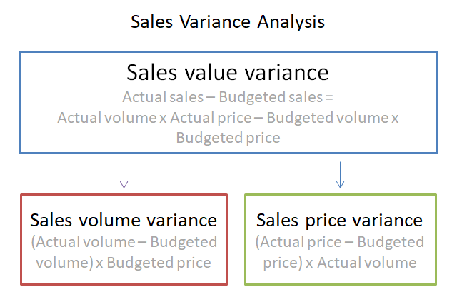

In the ever-evolving world of finance and trading, understanding pricing and variances is essential for financial success. As markets become increasingly complex, the ability to accurately analyze and react to sales price variance becomes crucial for investors, traders, and business owners alike. This article focuses on the pricing analysis of sales price variance, examining its role and implications in algorithmic trading. By exploring key concepts, formulas, and effective management strategies, readers will gain valuable insights into optimizing financial performance and enhancing strategic decision-making.

Sales price variance forms a fundamental aspect of pricing analysis, serving as a measure of the discrepancy between an expected selling price and the actual price achieved. This variance can reveal critical information about pricing effectiveness and market competitiveness. In algorithmic trading, where automated systems execute trades based on predefined strategies, understanding these variances plays a pivotal role in optimizing trading outcomes. Tools and methodologies to manage these pricing variances can significantly bolster an entity's financial strategy by providing a clearer view of market dynamics and performance.

A thorough understanding of price variances can greatly contribute to more informed strategic planning and execution, whether in optimizing product pricing, enhancing trade strategies, or improving overall business profitability. Analyzing these variances not only aids in performance benchmarking but also assists in risk assessment and mitigation, ensuring that financial decisions are both data-driven and strategically sound.

## Table of Contents

## Understanding Pricing and Sales Price Variance

Sales price variance is a financial metric that quantifies the difference between the anticipated selling price of a product and its actual selling price. It serves as a key performance indicator for businesses to evaluate pricing strategies and market positioning. The variance indicates whether a company has successfully achieved its pricing objectives or if adjustments are necessary to remain competitive.

The formula for calculating sales price variance is defined as:

$$

\text{Sales Price Variance} = (\text{Actual Price} - \text{Standard Price}) \times \text{Units Sold} 
$$

Where:
- **Actual Price** is the price at which the product was actually sold.
- **Standard Price** is the price the company intended or planned to sell the product at.
- **Units Sold** represents the quantity of goods sold.

Understanding sales price variance is crucial because it highlights inefficiencies or effectiveness in pricing strategy. A positive variance suggests that products were sold at a higher price than expected, potentially increasing profitability. Conversely, a negative variance could indicate underperformance in sales or mispricing relative to competitors.

Several factors contribute to sales price variance:

1. **Market Demand**: Fluctuations in consumer demand can lead to price changes. High demand might allow businesses to increase prices, while low demand may force price reductions.

2. **Competition**: The pricing strategies of competitors significantly affect sales price variance. Entering a highly competitive market may necessitate price adjustments to secure market share.

3. **Economic Conditions**: Economic indicators such as inflation, currency exchange rates, and fiscal policies can impact pricing. Firms must adapt their pricing strategies in response to these conditions to maintain profitability.

Through precise analysis of these factors, businesses can better tailor their pricing strategies to market conditions, thereby managing sales price variance effectively. Understanding these dynamics not only aids in pricing optimization but also assists in forecasting future financial performance and strategic planning.

## Algorithmic Trading and Variance Analysis

Algorithmic trading utilizes advanced computational models and algorithms to automate and enhance trading efficiency. A critical component of this process is variance analysis, which addresses the variations in asset prices to refine trading strategies. This analysis focuses on three main aspects: performance variance, risk variance, and execution variance, all essential for optimizing trading outcomes.

Performance variance in [algorithmic trading](/wiki/algorithmic-trading) measures the discrepancy between expected and actual returns. By evaluating this variance, traders can modify their strategies to achieve better alignment with market expectations. Performance analysis assists in identifying anomalies in trading algorithms, enabling data-driven decisions to enhance strategy performance.

Risk variance analysis examines the deviations from expected risk levels, providing insights into the potential exposure of trading strategies to market [volatility](/wiki/volatility-trading-strategies). By assessing risk variance, traders can adjust their risk management frameworks, incorporating measures such as value-at-risk (VaR) models, to mitigate potential losses and optimize returns.

Execution variance pertains to the differences between theoretical and actual trade executions, often influenced by market conditions, latency, and [liquidity](/wiki/liquidity-risk-premium). Understanding execution variance is vital for reducing slippage and improving transaction costs, thereby enhancing the overall efficiency of algorithmic trading. Traders utilize frameworks like the implementation shortfall approach to analyze and improve execution quality.

To conduct variance analysis effectively in algorithmic trading, traders leverage a range of tools and technologies. Statistical software and programming languages such as Python are frequently employed for data analysis and visualization. Libraries like NumPy, Pandas, and SciPy in Python facilitate statistical computations and variance analysis, providing traders with the necessary resources to process large datasets efficiently.

Incorporating [machine learning](/wiki/machine-learning) techniques further enhances variance analysis by accommodating more complex, nonlinear relationships in data. Machine learning models can adapt to evolving market conditions, offering predictive insights that traditional statistical approaches might not capture. These models, trained to recognize patterns indicative of variance, empower traders to optimize their strategies continuously.

Variance analysis plays a pivotal role in algorithmic trading, offering insights that guide strategic decision-making and performance benchmarking. By analyzing performance, risk, and execution variances, traders can tailor their strategies to navigate the complexities of dynamic markets, enhancing both profitability and competitiveness. As technology continues to evolve, so too will the tools and methods available for conducting comprehensive variance analysis in trading algorithms.

## Factors Influencing Price Variance

Market demand and supply dynamics are fundamental to understanding price variance. The interaction between what consumers want and what the market can supply directly impacts pricing. When demand surpasses supply, prices tend to increase, causing a positive price variance. Conversely, if supply exceeds demand, prices generally decrease, leading to a negative price variance. This dynamic is crucial in industries with fluctuating consumer preferences or seasonal trends.

Economic factors such as inflation, interest rates, and regulatory changes significantly affect pricing. Inflation erodes purchasing power, often leading businesses to adjust prices upwards to maintain profitability, thus contributing to price variance. Interest rates also play a role; higher rates can reduce consumer spending and investment, potentially decreasing demand and affecting prices. Regulatory changes, such as new tariffs or tax laws, can alter production costs or market accessibility, causing businesses to reassess their pricing strategies.

Competition is another key determinant of price variance. In a highly competitive market, firms may lower prices to attract customers, resulting in a negative price variance compared to the expected standard price. Conversely, limited competition or a monopolistic market allows for higher pricing power and potentially higher positive price variance. Production costs, influenced by factors like raw material prices or labor costs, also impact price variance. For example, a sudden increase in material costs due to supply chain disruptions can force companies to raise prices.

Technological advancements can both exacerbate and mitigate price variance. Innovations can lead to cost reductions and efficiency improvements, potentially lowering prices. However, new technology can also create shifts in consumer demand, affecting the overall pricing structure in the market.

A strategic understanding of these factors allows businesses to better manage and mitigate price variance. By analyzing market trends and economic indicators, companies can predict potential pricing pressures and adjust accordingly. For instance, businesses can hedge against inflation through financial instruments or adapt their cost structures to remain competitive. Using tools such as scenario planning and sensitivity analysis, firms can anticipate how different factors will influence price variance and prepare proactive strategies to address them.

## Managing and Mitigating Price Variance

Implementing strategic measures to manage and mitigate price variance is essential for maintaining stability and competitiveness in volatile markets. A key approach involves engaging in supplier negotiations to secure favorable pricing and terms. By fostering strong relationships with suppliers, businesses can gain better insight into cost structures and negotiate more flexible agreements, such as [volume](/wiki/volume-trading-strategy) discounts or long-term contracts, which can stabilize input costs and reduce variance.

The utilization of technology also plays a crucial role in managing price variance. Advanced analytics and data management systems enable businesses to track pricing trends, monitor market fluctuations, and swiftly respond to changes. By leveraging machine learning algorithms, companies can predict future price movements and adjust their pricing strategies proactively to minimize variance impact.

Financial instruments offer another approach for hedging against price changes. Instruments such as futures contracts, options, and swaps allow businesses to lock in prices for commodities or other inputs, thus reducing exposure to adverse price movements. Hedging strategies need to be carefully designed and aligned with the company's overall risk management objectives to effectively safeguard against price volatility.

Scenario planning and sensitivity analysis are important techniques for preparing for price fluctuations. Scenario planning involves creating detailed narratives about possible future conditions and their potential impact on prices. Sensitivity analysis, on the other hand, assesses how different variables affect outcomes under various scenarios. Both methods help businesses anticipate potential price movements and develop contingency plans, ensuring they are better equipped to navigate uncertainties.

Collaboration across functions is vital for minimizing the impact of price variance. Cross-functional teams, including finance, procurement, and operations, can work together to identify variance sources and devise comprehensive strategies to address them. Continuous improvement practices, such as regular variance analysis and feedback loops, enable organizations to refine their processes and enhance their ability to manage price changes effectively over time.

Incorporating these strategies not only helps in managing price variance but also contributes to informed decision-making, greater financial stability, and sustained growth in dynamic market environments.

## Case Studies on Price Variance Analysis

Examining real-world case studies reveals the essential role of price variance analysis across diverse industries, shedding light on its impact on pricing strategies and profitability.

### Retail Industry

In the retail industry, understanding price variance is crucial for maintaining a competitive edge. A widely cited example includes a leading global retailer that utilized price variance analysis to optimize its pricing strategy. By analyzing deviations between expected and actual sales prices, the retailer identified overpricing in several product lines. This analysis prompted a strategic price adjustment that resulted in an increase in market share and a marked improvement in customer satisfaction. The implementation of dynamic pricing models, powered by real-time sales data, demonstrated the efficacy of continuous price variance monitoring.

### Manufacturing Industry

The manufacturing sector also benefits significantly from price variance analysis. A case study from a major automobile manufacturer highlights the application of sales price variance to enhance profitability. The company assessed price variances across its range of vehicles, unveiling discrepancies attributed to production costs and market demand fluctuations. By recalibrating their pricing models and employing techniques such as linear regression to predict future price adjustments, the manufacturer succeeded in aligning its prices with market conditions. This strategic initiative led to cost savings and an increase in profit margins.

### Service Industry

In the service industry, price variance analysis plays a pivotal role in refining pricing strategies. A prominent telecommunications provider utilized variance analysis to tackle pricing inconsistencies across its service plans. By examining the variance, the provider discovered a misalignment between forecasted and actual prices, influenced by competitive market factors and varying customer needs. The insights gained facilitated the introduction of flexible pricing models, tailored to different customer segments, thereby enhancing customer acquisition and retention rates. The company's adoption of predictive analytics tools further empowered its decision-making process, showcasing the importance of technology in variance analysis.

Across these industries, the application of price variance analysis has contributed significantly to developing informed pricing strategies and maximizing profitability. By leveraging data analytics and advanced statistical methodologies, businesses can better understand price disparities and implement strategic responses to navigate pricing challenges effectively.

## Conclusion and Key Takeaways

Price variance is a critical metric that significantly influences business performance and strategic decisions. It represents the difference between expected and actual selling prices, providing insights into the effectiveness of pricing strategies. A precise understanding of the causes and effects of price variances enables organizations to foster enhanced profitability and gain a competitive edge in the market. By identifying the underlying factors that lead to price fluctuations, businesses can devise strategies to anticipate and capitalize on these changes.

Implementing effective strategies for managing variance is imperative for achieving financial stability and driving growth. This involves utilizing methods such as supplier negotiations and technological advancements to stabilize pricing, along with employing financial instruments like hedging to protect against adverse price movements. Strategic scenario planning and sensitivity analysis further aid in preparing for market dynamics, allowing businesses to remain resilient in the face of fluctuations.

Continuous monitoring, analysis, and adaptation are vital for effectively managing pricing challenges in dynamic markets. By consistently analyzing price variances, organizations can identify trends and make informed pricing decisions. This ongoing process helps in aligning pricing strategies with market conditions, thereby optimizing financial performance. Additionally, fostering collaboration across business functions and emphasizing continuous improvement practices ensure that variance management remains a focal point for achieving long-term success. Through these concerted efforts, businesses can secure a stable financial future and adapt swiftly to changing market landscapes.

## References & Further Reading

[1]: Bergstra, J., Bardenet, R., Bengio, Y., & Kégl, B. (2011). ["Algorithms for Hyper-Parameter Optimization."](https://papers.nips.cc/paper/4443-algorithms-for-hyper-parameter-optimization) Advances in Neural Information Processing Systems 24.

[2]: ["Advances in Financial Machine Learning"](https://www.amazon.com/Advances-Financial-Machine-Learning-Marcos/dp/1119482089) by Marcos Lopez de Prado

[3]: ["Evidence-Based Technical Analysis: Applying the Scientific Method and Statistical Inference to Trading Signals"](https://books.google.com/books/about/Evidence_Based_Technical_Analysis.html?id=MeoJAQAAMAAJ) by David Aronson

[4]: ["Machine Learning for Algorithmic Trading"](https://github.com/stefan-jansen/machine-learning-for-trading) by Stefan Jansen

[5]: ["Quantitative Trading: How to Build Your Own Algorithmic Trading Business"](https://www.amazon.com/Quantitative-Trading-Build-Algorithmic-Business/dp/1119800064) by Ernest P. Chan