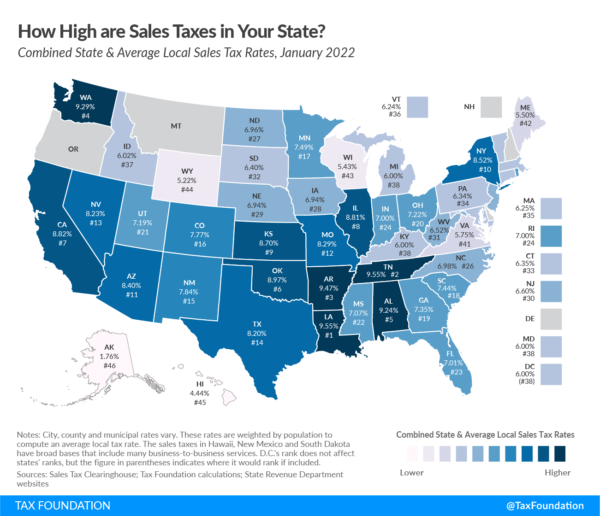

## Table of Contents

## What is sales tax?

Sales tax is a tax that people pay when they buy things. It is added to the price of the item at the store. Different places have different sales tax rates. For example, the sales tax in one state might be 6%, while in another state it might be 8%. This means that if you buy something that costs $100, you might have to pay an extra $6 or $8, depending on where you are.

The money collected from sales tax goes to the government. The government uses this money to pay for things like roads, schools, and other public services. Not all items are taxed the same way. Some things, like food or medicine, might have a lower tax rate or no tax at all. It's important to know the sales tax rate where you live so you can understand how much extra you will need to pay when you shop.

## How do sales tax rates vary across different U.S. states?

Sales tax rates in the United States can be very different from one state to another. Some states have a high sales tax, like California, where the state sales tax rate is about 7.25%. Other states, like Colorado, have a lower state sales tax rate, around 2.9%. But the sales tax you pay can be even higher because many cities and counties add their own local sales taxes on top of the state rate. For example, in some places in California, the total sales tax can go over 10% when you add up the state and local taxes.

There are also five states that don't have any state sales tax at all: Alaska, Delaware, Montana, New Hampshire, and Oregon. But even in these states, some local areas might still have their own sales taxes. For example, in Alaska, some cities and boroughs can add their own sales taxes, which can range from 1% to 7%. This means that even though there's no state sales tax, you might still have to pay some sales tax depending on where you are in the state.

Understanding sales tax rates can be tricky because they can change and because they can be different even within the same state. It's a good idea to check the current sales tax rate in your area before you buy something, especially if you're buying something big or if you're traveling to a different state. This way, you can know exactly how much you'll need to pay.

## Which U.S. state has the highest sales tax rate?

The U.S. state with the highest combined state and local sales tax rate is Louisiana. In some parts of Louisiana, the total sales tax can be as high as 9.55%. This rate is a mix of the state sales tax and the local sales taxes that cities and parishes add on top.

Sales tax rates can change and can be different even within the same state. So, the highest rate might be different in another part of the state or might change over time. It's always a good idea to check the current sales tax rate where you are before you buy something big.

## Which U.S. state has the lowest sales tax rate?

The U.S. state with the lowest sales tax rate is Colorado. The state sales tax rate in Colorado is 2.9%. But, the total sales tax you pay can be different because cities and counties can add their own local sales taxes on top of the state rate.

There are also five states that don't have any state sales tax at all: Alaska, Delaware, Montana, New Hampshire, and Oregon. But, even in these states, some local areas might still have their own sales taxes. For example, in Alaska, some cities and boroughs can add their own sales taxes, which can range from 1% to 7%.

So, if you're looking for the lowest sales tax, you might want to check out Colorado or one of the states with no state sales tax. Just remember, the total sales tax can still be different depending on where you are in the state.

## How are sales tax rates determined in each state?

Sales tax rates in each state are decided by the state government. They can choose to set a state sales tax rate, and they can also let cities and counties add their own local sales taxes on top of the state rate. This is why the total sales tax you pay can be different even within the same state. The state government might look at things like how much money they need for public services, what other states are doing, and what people in the state think about sales tax when they decide on the rate.

Some states have no state sales tax at all. These states are Alaska, Delaware, Montana, New Hampshire, and Oregon. Even in these states, some local areas might still have their own sales taxes. For example, in Alaska, cities and boroughs can add their own sales taxes, which can range from 1% to 7%. This means that even though there's no state sales tax, you might still have to pay some sales tax depending on where you are in the state.

Sales tax rates can change over time. The state government might decide to raise or lower the sales tax rate if they need more or less money for public services. They might also change the sales tax rate because of new laws or because of what people in the state want. It's a good idea to check the current sales tax rate where you are before you buy something big, especially if you're traveling to a different state.

## What is the difference between state sales tax and local sales tax?

State sales tax is a tax set by the state government. It is the same across the whole state. For example, if a state has a sales tax rate of 6%, you pay that 6% no matter where you are in the state. The state uses this money to pay for things like schools, roads, and other public services.

Local sales tax is different. It is set by cities or counties within a state. They can add their own sales tax on top of the state sales tax. This means the total sales tax you pay can be different depending on where you are in the state. For example, one city might add a 1% local sales tax, while another city might add a 2% local sales tax. The money from local sales tax usually goes to the city or county to help pay for local services like parks, libraries, and local roads.

So, when you buy something, you might pay both state and local sales tax. The state sales tax is the same everywhere in the state, but the local sales tax can be different even within the same state. This is why it's a good idea to check the total sales tax rate where you are before you buy something big.

## How often do sales tax rates change in the U.S. states?

Sales tax rates in the U.S. states can change, but it doesn't happen all the time. Usually, the state government decides when to change the sales tax rate. They might do this if they need more money for things like schools or roads, or if they want to lower the tax to help people save money. Changes can happen once a year, or sometimes they might not change for several years. It all depends on what the state government decides.

Local sales tax rates can also change, and sometimes they change more often than state rates. Cities and counties can decide to raise or lower their local sales tax to help pay for local services like parks or libraries. These changes can happen at different times in different places, so the total sales tax you pay can be different even within the same state. It's a good idea to check the current sales tax rate where you are before you buy something big, especially if you're traveling to a different state.

## What are the economic impacts of varying sales tax rates among states?

Varying sales tax rates among states can affect how people shop and where businesses choose to set up. If a state has a high sales tax, people might go to a nearby state with a lower sales tax to buy things. This can hurt businesses in the high-tax state because they lose customers. On the other hand, states with lower sales taxes might see more shoppers coming from other states, which can help their local businesses. This can also make it harder for businesses that sell things online because they have to figure out different sales tax rates for customers in different states.

Sales tax rates can also affect how much money states have to spend on things like schools and roads. If a state has a high sales tax, it might collect more money to pay for these services. But if the sales tax is too high, people might not want to shop there, and the state might not collect as much money as it thought. States with no sales tax might have to find other ways to get money, like raising other taxes or cutting back on services. This can make it tricky for state governments to balance what they need with what people want.

## How do sales tax holidays work and which states offer them?

Sales tax holidays are special times when you don't have to pay sales tax on certain things you buy. These holidays usually happen for a few days or a week, and they are set by the state government. The things that are tax-free during a sales tax holiday can be different in each state. Some states might not charge sales tax on clothes, school supplies, or energy-saving items during these times. The idea is to help people save money on things they need, like back-to-school supplies or hurricane preparedness items.

Many states offer sales tax holidays, but not all of them do. Some states that have sales tax holidays include Alabama, Arkansas, Florida, Massachusetts, Missouri, New Mexico, Ohio, South Carolina, Tennessee, Texas, and Virginia. Each state decides when their sales tax holiday will happen and what items will be tax-free. For example, Florida might have a sales tax holiday for hurricane supplies in June, while Massachusetts might have one for back-to-school items in August. It's a good idea to check with your state's government to see if they have a sales tax holiday and what you can buy without paying sales tax during that time.

## What are the exemptions and special rules for sales tax in different states?

Sales tax exemptions and special rules can be different in each state. Some things, like food or medicine, might not have any sales tax at all. This is because the state government wants to help people save money on things they need. Other things, like clothes or school supplies, might be tax-free during certain times of the year, like during a sales tax holiday. Some states also let certain groups of people, like people with disabilities or seniors, not pay sales tax on some things. The rules can be tricky, so it's a good idea to check with your state's government to see what is tax-free and what is not.

Businesses also have to follow special rules for sales tax. They have to collect sales tax from customers and then send it to the state government. Some states let businesses not pay sales tax on things they buy to use in their business, like equipment or supplies. This is called a sales tax exemption for businesses. But, businesses have to follow a lot of rules to get these exemptions, like filling out special forms or keeping good records. If a business doesn't follow the rules, they might have to pay the sales tax anyway. It's important for businesses to know the sales tax rules in their state so they can do things the right way.

## How do businesses handle sales tax collection and remittance across multiple states?

Businesses that sell things in more than one state have to collect sales tax from customers and send it to the right state government. This can be hard because each state has its own sales tax rate and rules. Some states might have a high sales tax, while others might have a low one. Some states might not have any sales tax at all. Businesses need to know the sales tax rate for each state they sell in and make sure they collect the right amount of tax from their customers. They also need to keep good records of how much sales tax they collect so they can send it to the right state at the right time.

Sending the sales tax to the state government is called remittance. Businesses usually have to send the sales tax they collect to the state once a month or once a quarter, depending on the state's rules. They have to fill out special forms and follow the state's rules for sending the money. If a business doesn't send the sales tax on time or sends the wrong amount, they might have to pay a fine. It can be tricky for businesses to keep track of all the different rules and rates, especially if they sell in a lot of states. Some businesses use special software to help them keep track of sales tax and make sure they do everything right.

## What future trends can we expect in U.S. state sales tax policies?

In the future, we might see more states using technology to make it easier for businesses to handle sales tax. Right now, businesses have to keep track of different sales tax rates and rules for each state they sell in. This can be hard, especially for small businesses. But with new technology, like special software, businesses might be able to do this more easily. This could help them save time and money, and it could also help states collect more sales tax because businesses will be able to do things the right way.

Another trend we might see is more states changing their sales tax rules to keep up with how people shop now. More and more people are buying things online, and this can make it tricky for states to collect sales tax. Some states might start making businesses collect sales tax even if they don't have a store in the state. This is called an economic nexus, and it means that if a business sells a lot of things to people in a state, they have to collect sales tax for that state. This could help states get more money from online sales, but it might also make things more complicated for businesses.

## What is the Role of Algorithmic Trading?

Algorithmic trading, a method that utilizes computer algorithms to automate and optimize trading decisions, has increasingly become a dominant force in the financial markets. This technology-driven approach to trading leverages mathematical models and complex algorithms to dictate strategies based on predetermined criteria, such as timing, price, and [volume](/wiki/volume-trading-strategy). By executing trades at speeds and frequencies human traders cannot match, [algorithmic trading](/wiki/algorithmic-trading) maximizes efficiency and can lead to significant financial gain.

The operation of algorithmic trading involves breaking down large orders into smaller opportunities, minimizing market impact and optimizing execution prices. For instance, a Volume Weighted Average Price (VWAP) algorithm might aim to execute an order close to the overall VWAP over a certain period. The underlying mathematical representation can be simplified as:

$$

VWAP = \frac{\sum_{i} (P_i \times Q_i)}{\sum_{i} Q_i} 
$$

Where $P_i$ and $Q_i$ represent the price and quantity of each trade, respectively. 

Algorithmic trading offers several benefits: speed, accuracy, and the removal of emotional biases that can affect human decision-making. These advantages contribute to its growing prevalence among institutional investors and hedge funds.

The tax implications of algorithmic trading are complex and multifaceted, primarily due to the sheer volume and frequency of transactions. Each trade potentially triggers taxable events, which require careful accounting to ensure compliance with taxation authorities. Taxes on capital gains can impact the profitability of algorithmic trading, especially if strategies involve short-term trades that are typically taxed at higher rates than long-term investments.

Furthermore, algorithmic trading can affect tax policies indirectly by influencing market dynamics. High-frequency trading, a subset of algorithmic trading, has been subject to scrutiny and debate, with some advocating for a financial transaction tax to curb its impact and potential instabilities caused within financial markets.

The rise of algorithmic trading has reshaped the landscape of financial markets, necessitating updates and innovations in tax policy frameworks. Policymakers face challenges in balancing the benefits of algorithmic trading with considerations of market fairness, stability, and revenue generation. As this trading approach continues to evolve, it remains critical to monitor its implications closely for effective regulation and taxation strategies.

## References & Further Reading

[1]: ["State Tax Policy and Economic Growth"] (https://taxpolicycenter.org/briefing-book) - Tax Policy Center

[2]: Brueckner, Jan K., & Neumark, David. (2021). ["Taxes and Economic Growth"](https://scholar.google.com/citations?user=nQoMIN4AAAAJ) - National Bureau of Economic Research

[3]: Marcos López de Prado. (2018). ["Advances in Financial Machine Learning"](https://www.amazon.com/Advances-Financial-Machine-Learning-Marcos/dp/1119482089) - John Wiley & Sons

[4]: ["Algorithmic Trading and the Impact on Market Structure"](https://www.researchgate.net/publication/378548435_Algorithmic_Trading_and_AI_A_Review_of_Strategies_and_Market_Impact) - CFA Institute

[5]: Chen, J., & Cumming, D. (2010). ["The Financial Nature of Algorithmic Trading: A Literature Review"](https://www.taylorfrancis.com/books/mono/10.1201/9781003087595/detecting-regime-change-computational-finance-edward-tsang-jun-chen) - Journal of Computational Intelligence in Finance

[6]: ["South Dakota v. Wayfair, Inc."](https://en.wikipedia.org/wiki/South_Dakota_v._Wayfair%2C_Inc.) - Supreme Court of the United States

[7]: ["Financial Services: Algorithmic Trading and Its Impact on Financial Industry"](https://www.sciencedirect.com/science/article/pii/S1319157824001046) - Frontiers in Artificial Intelligence

[8]: ["State and Local Fiscal Policies and Economic Growth"](https://onlinelibrary.wiley.com/doi/abs/10.1111/grow.12717) - The Brookings Institution