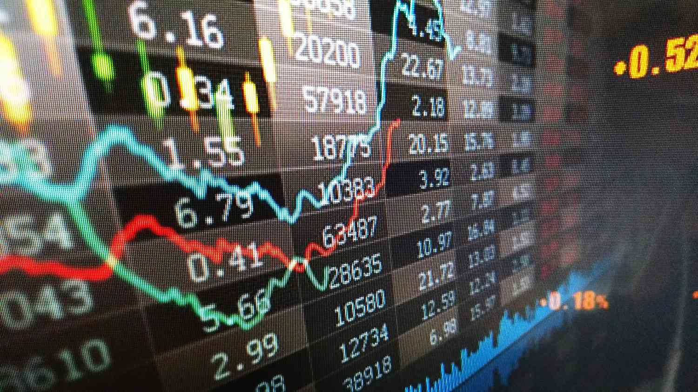

## Table of Contents

## What is the Salomon Brothers World Equity Index?

The Salomon Brothers World Equity Index is a tool that measures how well stock markets around the world are doing. It looks at the performance of stocks in many different countries to give investors a broad view of the global market. This index helps people who invest in stocks to understand how their investments might be doing compared to the overall world market.

The index includes stocks from major markets like the United States, Europe, and Asia. By tracking these stocks, the index gives a snapshot of global economic health. Investors use this information to make decisions about where to put their money, hoping to get the best returns on their investments.

## Who created the Salomon Brothers World Equity Index?

The Salomon Brothers World Equity Index was created by Salomon Brothers, a famous investment bank. They started this index to help investors see how stock markets all around the world were doing. By looking at the index, people could understand if the world's economy was doing well or not.

Salomon Brothers wanted to give investors a simple way to check the health of global stock markets. They included stocks from many countries in the index, like the United States, Europe, and Asia. This made it easier for investors to make smart choices about where to put their money.

## When was the Salomon Brothers World Equity Index first introduced?

The Salomon Brothers World Equity Index was first introduced in 1970. This was a time when people were becoming more interested in investing their money in stocks from around the world, not just in their own country. Salomon Brothers saw a need for a tool that could help investors understand how the global stock market was doing.

The index included stocks from major markets like the United States, Europe, and Asia. By tracking these stocks, the index gave investors a clear picture of the world's economic health. This helped them make better decisions about where to invest their money, hoping to get good returns on their investments.

## What is the purpose of the Salomon Brothers World Equity Index?

The Salomon Brothers World Equity Index helps investors see how stock markets all around the world are doing. It looks at stocks from many countries, like the United States, Europe, and Asia, to give a big picture of the global market. This helps people who invest in stocks understand if their investments are doing well compared to the world's economy.

Investors use the index to make smart choices about where to put their money. By seeing how different markets are doing, they can decide if they should invest more in one country or another. The index makes it easier for people to see the overall health of the world's stock markets and plan their investments better.

## How is the Salomon Brothers World Equity Index calculated?

The Salomon Brothers World Equity Index is calculated by looking at the performance of stocks from many countries around the world. They pick stocks from big markets like the United States, Europe, and Asia. Each stock's price is tracked over time, and then these prices are put together to make the index. The index is like a big basket where each stock's performance adds to the total value of the basket.

To make sure the index shows a fair picture of the world's stock markets, each country's stocks are given a certain weight. This weight depends on how big that country's economy is compared to others. So, if a country has a bigger economy, its stocks will have a bigger say in the index's total value. This way, the index gives a balanced view of how well the global stock market is doing.

## What types of stocks are included in the Salomon Brothers World Equity Index?

The Salomon Brothers World Equity Index includes a wide variety of stocks from around the world. These stocks come from big companies in major markets like the United States, Europe, and Asia. The index looks at stocks from different industries, such as technology, finance, and manufacturing. This mix helps the index show a true picture of the global economy.

Each country's stocks are chosen based on how important that country's economy is to the world. This means that countries with bigger economies will have more of their stocks included in the index. By including stocks from different countries and industries, the index gives investors a broad view of how well the world's stock markets are doing.

## How does the Salomon Brothers World Equity Index compare to other global equity indices?

The Salomon Brothers World Equity Index is similar to other global equity indices like the MSCI World Index and the FTSE All-World Index because they all look at how stock markets around the world are doing. These indices include stocks from many countries, like the United States, Europe, and Asia, to give a big picture of the global economy. The main difference is in how each index picks its stocks and weighs them. For example, the Salomon Brothers Index might give more weight to stocks from countries with bigger economies, while the MSCI World Index might use a different method to decide which stocks to include and how important they are.

Another way the Salomon Brothers World Equity Index compares to other indices is in what they aim to show investors. All these indices help people understand if their investments are doing well compared to the world's stock markets. But each index might focus on different things. The FTSE All-World Index, for instance, tries to cover almost every stock market in the world, while the Salomon Brothers Index might focus more on major markets. This means that depending on what an investor wants to know, they might choose one index over another to guide their investment decisions.

## What are the historical performance trends of the Salomon Brothers World Equity Index?

The Salomon Brothers World Equity Index has had its ups and downs over the years, just like any other stock market index. When the global economy is doing well, the index usually goes up because more people are buying stocks and companies are making more money. For example, during the 1980s and 1990s, the index saw a lot of growth as the world economy boomed. But when there are big problems, like the financial crisis in 2008, the index can drop a lot because people are scared and start selling their stocks.

Looking at longer periods, the Salomon Brothers World Equity Index has generally gone up over time. This is because, over many years, the world economy tends to grow. Even though there are times when the index goes down, like during economic downturns, it usually recovers and keeps climbing. Investors use the historical performance of the index to understand how their investments might do in the future, but they know that past results don't guarantee what will happen next.

## How can investors use the Salomon Brothers World Equity Index in their investment strategies?

Investors can use the Salomon Brothers World Equity Index to see how their investments are doing compared to the whole world's stock markets. If the index is going up, it means the global economy is doing well, and investors might feel good about keeping their money in stocks. But if the index is going down, it could be a sign that the world economy is having problems, and investors might want to be more careful. They could use this information to decide if they should buy more stocks, sell some, or maybe even move their money to safer investments like bonds.

Another way investors use the index is to look at how different countries or regions are doing. The index includes stocks from places like the United States, Europe, and Asia, so investors can see which parts of the world are doing better than others. If one region is doing really well, investors might decide to put more of their money there, hoping to get better returns. On the other hand, if a region is not doing so well, they might choose to invest less there or look for other opportunities. By using the Salomon Brothers World Equity Index, investors can make smarter choices about where to put their money and how to spread out their investments to lower risk.

## What are the risks associated with investing in products linked to the Salomon Brothers World Equity Index?

Investing in products linked to the Salomon Brothers World Equity Index can be risky because the index goes up and down with the world's stock markets. If the global economy has problems, like a financial crisis, the index can drop a lot. This means that if you have money in products that follow the index, you could lose money. Also, since the index includes stocks from many different countries, things like political problems or natural disasters in one country can affect the whole index.

Another risk is that the index might not match exactly with the stocks you pick. Even if you invest in a product that follows the index, the specific stocks in that product might not do as well as the index overall. This is called tracking error. Plus, investing in global markets means you have to think about currency changes. If the value of one country's money goes down compared to another, it can make your investment worth less, even if the stocks are doing okay. So, it's important to understand these risks before putting your money into products linked to the Salomon Brothers World Equity Index.

## How has the methodology of the Salomon Brothers World Equity Index evolved over time?

The Salomon Brothers World Equity Index has changed a lot since it started in 1970. At first, it just looked at big companies in major markets like the United States, Europe, and Asia. But as more countries started having their own stock markets, the index began to include stocks from more places. This made the index a better tool for showing how the whole world's economy was doing. The way the index picks stocks and decides how important each one is also got better over time. Now, it uses a more detailed way to make sure it gives a fair picture of the global market.

Over the years, the index has also started to use new technology to keep track of stocks better. This means the index can update more quickly and show more accurate information. Another big change is how the index thinks about different industries. In the beginning, it might have just looked at the biggest companies, but now it tries to include a good mix of different kinds of businesses. This makes the index a more useful tool for investors who want to understand how different parts of the world's economy are doing.

## What are the future prospects and potential changes for the Salomon Brothers World Equity Index?

The future of the Salomon Brothers World Equity Index looks bright as more people around the world start investing in stocks. The index might include even more countries and companies to give a better picture of the global economy. With new technology, the index could update faster and be more accurate. This means investors can get the latest information quickly and make better decisions about where to put their money. The index might also start to focus more on things like environmental, social, and governance ([ESG](/wiki/esg-investing)) factors, which are becoming important to many investors.

There could also be changes in how the index picks and weighs its stocks. As the world economy changes, the index might need to adjust to make sure it still shows a true picture of the global market. For example, if new industries like technology or renewable energy become bigger, the index might include more companies from those areas. This would help the index stay relevant and useful for investors who want to know how different parts of the world's economy are doing.

## What is the Understanding of the Salomon Brothers World Equity Index (SBWEI)?

Launched in the 1980s, the Salomon Brothers World Equity Index (SBWEI) emerged as a significant reference for global equity indices by encompassing a diverse selection of over 6,000 stocks from 22 countries. This comprehensive representation aimed to provide a broad snapshot of the international equity markets. The SBWEI was notable for its use of a float-adjusted market capitalization methodology, a significant innovation at the time. This method focused exclusively on the shares that were publicly tradable, excluding those held by insiders, governments, and other restricted categories. This approach offered a more precise reflection of market dynamics compared to traditional market capitalization indices, which might include non-tradeable shares.

A float-adjusted market capitalization can be expressed mathematically as:

$$
\text{Float-adjusted Market Capitalization} = \sum_{i=1}^{n} P_i \times Q_i \times F_i
$$

Where:
- $P_i$ is the price of the i-th stock.
- $Q_i$ is the total number of outstanding shares for the i-th stock.
- $F_i$ is the float factor, representing the proportion of a stock's total shares that are available for public trading.

The primary goal of using a float-adjusted system was to improve the accuracy of the market representation by accounting only for the [liquidity](/wiki/liquidity-risk-premium) and availability of the shares that are truly traded in open markets.

Although the SBWEI was discontinued in the early 2000s, it set an important benchmark for global equity measurement. Its methodology influenced subsequent indices and contributed to the broader understanding and development of equity indices that provide a more realistic view of market capitalizations, enhancing transparency for investors worldwide. This legacy is observed in the techniques employed by current indices, which continue to rely on float-adjusted methods introduced by pioneering indices like the SBWEI.

## References & Further Reading

[1]: ["Liar's Poker: Rising Through the Wreckage on Wall Street"](https://www.amazon.com/Liars-Poker-25th-Anniversary-Wreckage/dp/0393246108) by Michael Lewis

[2]: Fabozzi, F. J., Fuss, R., & Kaiser, D. G. (2008). ["The Handbook of Commodity Investing."](https://onlinelibrary.wiley.com/doi/book/10.1002/9781118267004) Wiley.

[3]: Aldridge, I. (2013). ["High-Frequency Trading: A Practical Guide to Algorithmic Strategies and Trading Systems,"](https://www.amazon.com/High-Frequency-Trading-Practical-Algorithmic-Strategies/dp/1118343506) 2nd Edition. Wiley.

[4]: ["Algorithmic Trading: Winner's Guide to Success."](https://www.liberatedstocktrader.com/how-to-algo-trade/) by Mark W. Elliott

[5]: Gomber, P., Arndt, B., Lutat, M., & Uhle, T. (2011). ["High-Frequency Trading."](https://papers.ssrn.com/sol3/papers.cfm?abstract_id=1858626) Research Report, Goethe University.