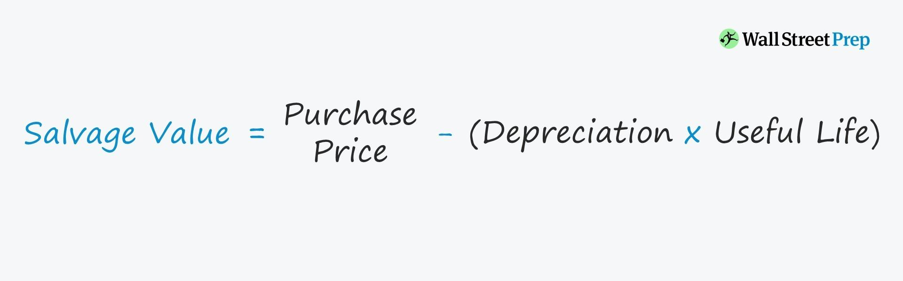

In modern financial landscapes, the fusion of traditional accounting principles and cutting-edge algorithmic trading has emerged as a critical strategy. This integration is particularly evident in the alignment of asset valuation, salvage value, and depreciation frameworks with the dynamics of market behavior to create robust trading algorithms. 

Asset valuation, which fundamentally represents the determination of an asset's value, is vital in assessing market worth and potential returns. Meanwhile, salvage value serves as an estimated residual worth of an asset once it reaches the end of its useful life, influencing the calculation of depreciation—the systematic allocation of the cost of tangible assets over their useful life. Together, these components play a crucial role in altering the landscape of algorithmic trading by providing precise insights into asset performance and underlying market trends.



Algorithmic trading, heavily reliant on data accuracy and timeliness, benefits significantly from the inclusion of these accounting concepts. The consistency and accuracy of financial data inputs, particularly regarding asset depreciation and revaluation, enhance the precision of trading algorithms. This adoption allows for a comprehensive understanding of market movements, augmented trading accuracy, and a detailed assessment of asset performance.

Integrating these accounting principles into financial models and trading algorithms is increasingly becoming a necessity. As markets evolve with technological advancements, the combination of traditional accounting methodologies and algorithmic trading strategies signifies a transformative shift in financial strategies, paving the way for more informed and effective trading decisions.

## Table of Contents

## Understanding Asset Valuation

Asset valuation is crucial in financial reporting, as it plays a significant role in determining a company's worth and influencing strategic decisions. The assessment of asset value is essential for providing stakeholders with a clear view of a company's financial health and performance. It involves estimating the current value of assets, which affects financial reporting and strategic investment choices.

Various methods of asset valuation exist, with historical cost and fair value being two predominant approaches. Historical cost refers to the original purchase price of an asset, recorded on the balance sheet and adjusted for depreciation or impairments. This method provides stability and consistency in financial reporting, allowing companies to track the asset's cost over time. However, it may not reflect the current market value, thereby potentially misleading stakeholders about an asset's true worth.

Fair value, on the other hand, represents the estimated market price of an asset at a given time, providing a more dynamic and realistic valuation. It aligns with the International Financial Reporting Standards (IFRS) and accommodates market fluctuations, reflecting the potential selling price. This method offers greater transparency and real-time relevance but can introduce [volatility](/wiki/volatility-trading-strategies) and subjectivity into financial statements due to its reliance on market conditions and valuation models.

The selection of a valuation method impacts key financial ratios and the overall company valuation. For example, using fair value may inflate asset values and thus, the company’s total equity, affecting ratios such as return on assets (ROA) and debt-to-equity. These ratios are critical in evaluating a company’s performance and risk profile, influencing investor perceptions and strategic decision-making.

Additionally, asset valuation affects transparency in financial reports, providing valuable insights for stakeholders. Accurate valuations ensure that investors, creditors, and management can make informed decisions regarding investments, resource allocation, and strategic direction. They also facilitate better compliance with accounting standards and regulations, enhancing trust and credibility in financial disclosures.

Understanding asset valuation allows stakeholders to interpret financial statements more effectively, aligning with broader corporate strategies and market expectations. Accurate and transparent asset valuations underpin robust investment decisions, support risk management, and drive strategic growth objectives.

## The Role of Salvage Value in Depreciation

Salvage value represents the estimated value that an asset is expected to realize upon the conclusion of its useful life. This value is a crucial determinant in the calculation of depreciation, as it dictates the total amount of depreciation that will be allocated over the asset's lifespan. The formula for determining the depreciable amount is given by:

$$
\text{Depreciable Amount} = \text{Cost of Asset} - \text{Salvage Value}
$$

Understanding salvage value is paramount in shaping financial statements and gauging an asset's long-term viability. It serves as a fundamental component in financial accounting, directly influencing the depreciation method applied and, consequently, the financial depiction of an asset’s life cycle. When an asset is expected to have a significant salvage value, the depreciable amount is lower, affecting net income and taxes.

Moreover, salvage value holds significance in strategic decision-making processes, particularly concerning tax calculations and the formation of selling or leasing agreements. From a tax perspective, determining depreciation using accurate estimates of salvage value can impact the tax liabilities throughout an asset's operational period. Organizations aim to optimize tax strategies by forecasting appropriate salvage values to align with regulatory standards.

In selling or leasing agreements, salvage value acts as a determinant in negotiations, providing a future value assessment that can influence the terms and perceived value of transactions. Having a reliable estimate of salvage value aids stakeholders in forecasting potential returns, ultimately guiding investment strategies and decisions on whether to retain or dispose of an asset at the end of its useful life. Thus, accurate salvage value estimation is a critical aspect of financial modeling, ensuring transparency and contributing to efficient capital management.

## Depreciation and Its Impact on Financial Statements

Depreciation is a fundamental concept in accounting, representing the systematic allocation of the cost of a tangible asset over its useful life. This process is vital for reflecting the reduction in value of an asset over time due to wear and tear, obsolescence, or other factors that may impact its utility. There are several methods used to calculate depreciation, each affecting financial statements differently and thereby influencing various aspects of business decision-making.

The straight-line method is one of the most commonly used approaches due to its simplicity. It involves dividing the initial cost of the asset, minus any salvage value, by its useful life. This yields a constant annual depreciation expense. The formula for straight-line depreciation is:

$$
\text{Depreciation Expense} = \frac{\text{Cost} - \text{Salvage Value}}{\text{Useful Life}}
$$

An alternative method is the double declining balance, an accelerated approach that front-loads depreciation expenses. By applying a constant depreciation rate to the asset's declining book value, more depreciation occurs in the early years of an asset's life. The formula for this method is:

$$
\text{Depreciation Expense} = 2 \times \text{Straight-Line Rate} \times \text{Book Value at Beginning of Year}
$$

The units of production method allocates depreciation based on the asset's actual usage or output, aligning expenses more closely with revenue generation. This method is particularly useful for assets whose wear is more accurately reflected by usage rather than time.

Each depreciation method impacts financial statements in distinct ways. For instance, accelerated depreciation methods such as double declining balance reduce taxable income more in the initial years compared to the straight-line method, affecting cash flow and tax liability. This influence on net income impacts managerial decisions, such as budgeting and investment strategies, and shapes investor perceptions. 

Accurate understanding and application of depreciation are crucial for forecasting and managing resources efficiently. It allows companies to set aside funds for future asset replacement and ensure the accuracy of financial statements, which is vital for maintaining stakeholder confidence and making informed investment decisions.

Overall, the method of depreciation selected by a business can have significant implications, not just for financial reporting and tax outcomes, but also for strategic planning and operational management. Adjusting to changes in the depreciation schedule provides insights into asset performance and enhances the ability to make forward-looking business decisions.

## Integrating Depreciation into Algorithmic Trading

Algorithmic trading hinges on the integration of precise and timely data inputs, with depreciation data playing a crucial role. By incorporating depreciation into asset valuations, trading algorithms can recalibrate values accurately, which is particularly vital for high-frequency trading. This recalibration enables algorithms to reflect the true economic value of assets, thereby aligning trading strategies with current market conditions.

Depreciation impacts predictive trading models by enhancing their accuracy and reliability. As assets depreciate over time, their book value decreases, affecting financial statements and subsequently the valuation models incorporated into trading algorithms. By updating these models with real-time depreciation data, traders can maintain competitive advantage through informed pricing and trading decisions.

The integration of depreciation into algorithmic systems does pose certain challenges, particularly in the domain of real-time data processing. However, leveraging advanced computational tools like Python can mitigate these challenges. Python's extensive libraries, such as NumPy and pandas, facilitate the efficient handling of large datasets, enabling continuous updates of asset values as they depreciate.

For instance, a Python snippet to adjust asset valuation based on depreciation could look like this:

```python
import numpy as np
import pandas as pd

# Example dataframe with initial asset values and depreciation rates
data = {'asset_id': [1, 2, 3],
        'initial_value': [100000, 150000, 200000],
        'depreciation_rate': [0.10, 0.08, 0.05]}

df = pd.DataFrame(data)

# Function to calculate current asset value after depreciation
def calculate_depreciated_value(initial_value, depreciation_rate, years):
    return initial_value * ((1 - depreciation_rate) ** years)

# Assume depreciation is calculated annually
years = 5
df['current_value'] = np.vectorize(calculate_depreciated_value)(df['initial_value'], df['depreciation_rate'], years)

print(df)
```

This script demonstrates how to efficiently recalculate asset values over time, thereby keeping trading models aligned with actual asset worth. By embedding such calculations into [algorithmic trading](/wiki/algorithmic-trading) models, firms can enhance decision-making processes, optimize risk assessment, and ultimately improve trading outcomes. This integration marks a significant advancement in the precision and adaptability of financial strategies in algorithmic trading.

## Case Study: Trading Models Leveraging Asset Depreciation

Quantitative hedge funds increasingly adopt sophisticated algorithmic trading strategies that utilize detailed asset depreciation data for dynamic model adjustments. This approach allows these funds to enhance trading accuracy and improve risk assessment by incorporating real-time updates into their algorithms. A key aspect of this integration involves leveraging updated depreciation schedules to refine asset valuations, which in turn optimizes trading decisions and minimizes financial risks.

Incorporating asset depreciation data into trading algorithms can be particularly advantageous in sectors with high capital expenditures, such as manufacturing or technology. For example, firms investing heavily in machinery or equipment require precise depreciation estimates to understand the true value of their assets over time. This understanding directly influences trading strategies, particularly when assets are liquidated or repurposed.

By frequently updating depreciation schedules, quantitative models can better assess the residual value of assets and adjust portfolios accordingly. Consider a [hedge fund](/wiki/hedge-fund-trading-strategies) utilizing the straight-line method of depreciation, where the annual depreciation is calculated as:

$$
\text{Annual Depreciation} = \frac{\text{Cost of Asset} - \text{Salvage Value}}{\text{Useful Life of Asset}}
$$

Real-time recalculations of this value allow for automated adjustments in the algorithm, ensuring that asset valuations in trading models are current. For example, if an asset's lifespan is shortened due to technological obsolescence, the revised depreciation schedule can trigger algorithmic adjustments to liquidate or reallocate assets, maximizing investment returns and minimizing exposure to outdated capital.

Trading models leveraging depreciation data can also include risk management techniques by incorporating variations in depreciation methods, such as double-declining balance or units of production, to forecast potential tax liabilities and project cash flows more accurately. Python, a preferred language in financial technology, facilitates these calculations with its robust libraries like NumPy and Pandas, which handle large datasets and complex financial computations efficiently.

```python
import numpy as np
import pandas as pd

# Example of calculating depreciation using the straight-line method in Python
def calculate_depreciation(cost, salvage_value, useful_life):
    return (cost - salvage_value) / useful_life

# Asset details
cost_of_asset = 100000
salvage_value = 10000
useful_life_years = 10

# Calculate annual depreciation
annual_deprecation = calculate_depreciation(cost_of_asset, salvage_value, useful_life_years)
print("Annual Depreciation:", annual_deprecation)
```

In summary, hedge funds that integrate detailed asset depreciation data into their algorithmic trading models gain a competitive advantage by making more informed investment decisions. This practice not only enhances trading accuracy and risk management but also contributes to improved investment returns and reduced financial risks, aligning asset management strategies with the complexities of modern markets.

## Conclusion

Integrating asset valuation, salvage value, and depreciation into algorithmic trading models offers a distinct competitive advantage. Accurate financial data input is crucial for developing robust trading strategies and anticipating market movements with precision. As technology and traditional accounting principles converge, this integration represents a transformative shift in financial strategies.

The incorporation of asset valuation methods provides a sound basis for understanding market dynamics. Whether through historical cost or fair value approaches, asset valuation impacts financial health assessments and investor perception. It shapes financial ratios, company valuation, and enhances transparency, ultimately informing strategic investment decisions.

Salvage value, an often-overlooked aspect, plays a significant role in calculating depreciation. As the residual worth of an asset after its useful life, it affects the total depreciable amount, long-term asset value, and financial statements. This, in turn, influences decision-making processes, notably in tax calculations and agreements concerning selling or leasing assets.

Depreciation methodologies, whether straight-line, double-declining, or units of production, variably impact financial statements by altering net income and tax obligations. A thorough understanding of depreciation aids in accurate forecasting and efficient resource management.

When integrated into algorithmic trading, these elements enhance model accuracy. Algorithms that incorporate depreciation data recalibrate asset valuations crucial for high-frequency trading decisions. Real-time integration continues to present challenges, yet tools like Python streamline the processing of complex data efficiently.

In essence, leveraging these fundamental accounting principles within trading models aligns market strategies with the evolving financial technology landscape. It ensures informed and effective trading decisions, offering a substantial edge in the competitive trading environment.

## References & Further Reading

[1]: ["Advances in Financial Machine Learning"](https://www.amazon.com/Advances-Financial-Machine-Learning-Marcos/dp/1119482089) by Marcos Lopez de Prado

[2]: ["Evidence-Based Technical Analysis: Applying the Scientific Method and Statistical Inference to Trading Signals"](https://www.amazon.com/Evidence-Based-Technical-Analysis-Scientific-Statistical/dp/0470008741) by David Aronson

[3]: ["Machine Learning for Asset Managers"](https://www.amazon.com/Machine-Learning-Managers-Elements-Quantitative/dp/1108792898) by Marcos Lopez de Prado

[4]: ["Quantitative Trading: How to Build Your Own Algorithmic Trading Business"](https://www.amazon.com/Quantitative-Trading-Build-Algorithmic-Business/dp/1119800064) by Ernest P. Chan

[5]: ["Valuation: Measuring and Managing the Value of Companies"](https://www.amazon.com/Valuation-Measuring-Managing-Companies-Finance/dp/1119610885) by McKinsey & Company Inc.