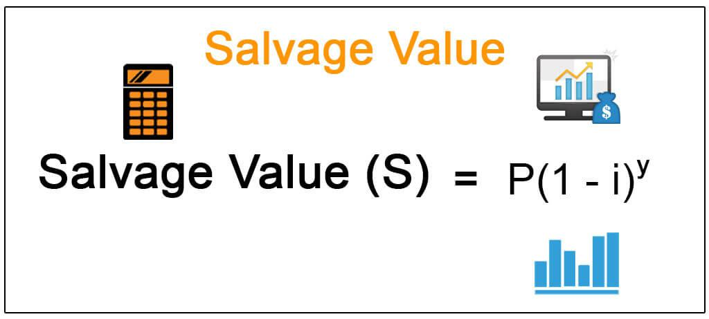

The interplay between financial accounting and algorithmic trading has increasingly captured the attention of industry experts and academics alike. As financial markets evolve with technological advancements, the integration of algorithmic trading strategies with robust financial accounting principles becomes crucial. Central to these discussions are concepts such as residual value and salvage value, which are integral to asset management and valuation. These financial terms not only affect corporate financial health but also shape the development of algorithmic trading models.

Residual value and salvage value serve as pivotal components in the determination of an asset's remaining worth at the end of its useful life. Both concepts are essential for accurate depreciation calculations and asset replacement strategies. Robust asset valuation practices depend on understanding these values, as they reflect the asset's ultimate return or potential salvage. This understanding is foundational in financial accounting practices, where residual and salvage values influence depreciation entries that affect net income and asset turnover ratios.



Algorithmic trading, driven by complex algorithms and vast amounts of financial data, relies heavily on solid financial accounting inputs to build and optimize trading strategies. Thorough knowledge and precise estimation of salvage and residual values enhance trading algorithms by improving asset risk assessments and influencing decisions on asset allocation. In today's market, where rapid executions and strategic trades define success, these accounting principles aid in constructing data-driven strategies that align with market conditions.

Recognizing the significance of these key financial metrics provides businesses with the analytical capabilities to align their financial strategies with operational goals. By integrating knowledge of residual and salvage values into accounting and trading practices, businesses can facilitate sustainable growth and improve strategic decision-making in increasingly competitive markets.

## Table of Contents

## Understanding Salvage Value

Salvage value represents the expected residual worth of an asset at the conclusion of its useful life. This estimation is pivotal for accurate depreciation calculations and the effective scheduling of asset replacements. The salvage value offers a basis upon which organizations can determine the depreciation expense allocated annually over an asset's useful life. Consequently, this affects net income and the overall portrayal of an entity's financial position.

To derive an accurate estimate for salvage value, companies typically employ a combination of historical data, thorough market analyses, and expert appraisals. Historical data provides insights into the typical residual value of similar assets at the end of their useful lifespan, while market analyses can help incorporate current economic conditions and the specific dynamics of the industry. Expert appraisals lend a professional perspective, often accounting for variables that raw data and market trends cannot fully address.

The salvage value directly affects financial statements by influencing the depreciation expense. The formula to calculate the depreciation using straight-line method is:

$$
\text{Depreciation Expense} = \frac{\text{Cost of Asset} - \text{Salvage Value}}{\text{Useful Life of Asset}}
$$

This relationship highlights that a higher salvage value results in a lower annual depreciation expense, which in turn can increase the net income reported by a company, assuming other factors remain constant. In contrast, a lower estimated salvage value would result in higher annual depreciation, reducing reported net income.

Understanding and accurately estimating salvage value is crucial for sound financial decision-making, impacting both asset management and financial reporting. Properly recognizing this value ensures companies maintain not only compliance with accounting standards but also the integrity of their financial strategies, ultimately supporting sustainable growth and operational efficiency.

## Residual Value in Financial Accounting

Residual value, often synonymous with salvage value, is a crucial element in the valuation of assets within financial accounting. It represents the estimated amount that an entity expects to obtain from disposing of an asset at the end of its useful life, after deducting any disposal costs. This value is fundamental in calculating depreciation, which impacts financial reporting and informs asset management strategies.

### Importance in Financial Reporting

Residual value is essential for accurately determining the depreciation expense associated with long-term assets. Depreciation is an accounting method that allocates the cost of a tangible asset over its useful life, thereby matching the expense with the revenue generated by the asset. The formula for calculating annual depreciation is given by:

$$
\text{Depreciation Expense} = \frac{\text{Cost of Asset} - \text{Residual Value}}{\text{Useful Life}}
$$

By influencing depreciation calculations, residual value affects a company's financial statements, particularly the balance sheet and income statement. An inaccurate estimation of residual value can lead to misrepresented asset values and financial performance, affecting stakeholder decisions.

### Methods for Calculating Residual Value

1. **Historical Cost Method**: This approach estimates residual value based on the historical cost of similar assets. It considers past transactions and adjustments for inflation or market changes to project the future value.

2. **Market Value Approach**: This method relies on current market conditions to determine the likely value of an asset at the end of its life. It involves analyzing market trends, demand forecasts, and economic conditions.

3. **Averaging Method**: Companies sometimes use averages of residual values from similar assets within an industry or portfolio to estimate the residual value. This method reduces the impact of outliers and provides a balanced estimate.

### Benefits of Accurate Estimation

Accurate residual value estimation in financial accounting is vital for several reasons:

- **Budgeting and Forecasting**: Knowing the expected salvage value of assets helps companies more accurately plan future capital expenditures and manage cash flows.

- **Decision-Making**: Accurate predictions enable better-informed strategic decisions, such as when to retire assets or invest in new ones.

- **Compliance and Reporting**: Reliable estimates ensure compliance with accounting standards and improve the credibility of financial statements.

In sum, the estimation of residual value is a foundational aspect of effective asset management and financial accounting practices. By utilizing established methods and industry insights, companies can enhance accuracy in financial reporting, thereby supporting sound economic decision-making and strategic planning.

## Depreciation Methods and Their Impacts

Depreciation is a fundamental accounting procedure used to allocate the cost of tangible assets over their useful lives. This concept is crucial for understanding how asset valuation impacts financial statements and strategic business decisions. Different methods of depreciation include straight-line, declining balance, and sum-of-years-digits, each with unique implications for financial accounting and asset management.

### Straight-Line Depreciation

The straight-line method is the simplest and most commonly used depreciation method. It involves dividing the cost of an asset, minus its salvage value, equally across its useful life. The formula for calculating straight-line depreciation is:

$$

\text{Depreciation Expense per Year} = \frac{\text{Cost of Asset} - \text{Salvage Value}}{\text{Useful Life of Asset}}
$$

By providing a consistent annual expense, the straight-line method simplifies budgeting and financial reporting, making it suitable for assets with predictable usage patterns.

### Declining Balance Method

The declining balance method accelerates depreciation, resulting in higher expenses in the earlier years of an asset's life. This approach is beneficial for assets that quickly lose value or become obsolete. The most common form is the double-declining balance method, calculated as:

$$

\text{Depreciation Expense per Year} = \text{Book Value at Beginning of Year} \times \frac{2}{\text{Useful Life of Asset}}
$$

This method can provide tax advantages and reflect the rapid technological obsolescence of certain assets, though it complicates financial forecasting and may affect net income differently compared to straight-line depreciation.

### Sum-of-Years-Digits Method

The sum-of-years-digits method is another accelerated depreciation strategy. It applies a decreasing fraction of the depreciable cost to each year of an asset's useful life. The expense is calculated using the formula:

$$

\text{Depreciation Expense for Year t} = \frac{\text{(Remaining Life in Years)}}{\text{Sum of Years Digits}} \times (\text{Cost of Asset} - \text{Salvage Value})
$$

Where the sum of years digits is the sum of digits of the numbers corresponding to each year of an asset's useful life. This method is less commonly used but is useful for assets with diminishing returns or decreasing productivity over time.

### Impacts on Financial Statements

Choosing the appropriate depreciation method affects financial statements significantly. The method determines the timing and amount of depreciation expense recognized each year, influencing net income, asset book values, and tax liabilities. Businesses must carefully select a method that aligns with their financial goals, asset usage patterns, and industry standards.

### Strategic Business Decisions

The choice of depreciation method can also affect investment and asset management decisions. It influences financial ratios, cash flow projections, and capital budgeting, thereby impacting strategic planning and performance evaluation. Companies aiming for aggressive growth may prefer accelerated methods to benefit from deferred tax liabilities, while those focusing on stability might favor straight-line depreciation for its simplicity and consistency.

In conclusion, understanding the nuances of different depreciation methods is crucial for effective asset management and accurate financial reporting. By aligning depreciation strategies with business objectives, organizations can optimize their financial outcomes and ensure sustainable success.

## Algorithmic Trading and Financial Accounting Interactions

Algorithmic trading leverages sophisticated mathematical models and financial data to execute trades at high speeds and volumes. A crucial component of developing effective trading algorithms is the accurate incorporation of financial accounting data, including depreciation and salvage/residual value considerations. These financial metrics are integral in constructing models that can assess asset value and performance, thereby enabling traders to make risk-adjusted decisions.

Accurate asset valuation plays a vital role in creating well-balanced trading strategies. The determination of salvage and residual values helps traders evaluate the long-term profitability and usage duration of an asset. For instance, the expected lifespan and end-of-life value of financial instruments or physical assets can influence portfolio diversification strategies and risk management protocols. Incorporating these values into algorithmic models allows traders to predict potential depreciation impacts accurately and adjust their strategies accordingly.

Algorithmic trading systems require integration with financial accounting systems to ensure that all relevant data is up-to-date and reflective of current market conditions. This involves using historical financial data, current market valuations, and projections to create robust algorithms. For example, an algorithm might be designed to optimize portfolio returns based on the net book value of assets, calculated by subtracting accumulated depreciation from the asset's initial cost. This requires real-time access to accurate depreciation schedules and salvage value estimates.

Here is a simplified Python example demonstrating how salvage value might influence a trading decision:

```python
def calculate_book_value(initial_cost, depreciation_rate, years, salvage_value):
    accumulated_depreciation = initial_cost * (depreciation_rate * years)
    book_value = initial_cost - accumulated_depreciation
    return max(book_value, salvage_value)

# Example asset values
initial_cost = 10000  # Initial cost of the asset
depreciation_rate = 0.1  # 10% yearly depreciation
years = 5  # Asset held for 5 years
salvage_value = 2000  # Estimated salvage value

# Calculate current book value
current_value = calculate_book_value(initial_cost, depreciation_rate, years, salvage_value)
print("Current Book Value of Asset:", current_value)
```

Effective integration of financial data into [algorithmic trading](/wiki/algorithmic-trading) models ensures that decisions are aligned with market realities. Accurate capture and processing of asset valuations enable the timely execution of trades optimized for profitability and risk mitigation. Through this integration, algorithmic trading can harness the full potential of financial accounting data, enhancing both strategic planning and operational efficiency.

## Challenges in Estimating Salvage and Residual Values

Estimating salvage and residual values is a critical task in financial accounting, often complicated by various external and internal factors. Market fluctuations significantly impact these estimates. Changes in economic conditions, such as shifts in supply and demand or sudden economic downturns, can alter the market value of assets, making it challenging to predict their end-of-life worth. 

Technological advancements also play a crucial role. Rapid innovations can render certain assets obsolete faster than anticipated, decreasing their expected residual value. For instance, in industries like information technology or telecommunications, where technological obsolescence is common, predicting the salvage value becomes particularly complex. 

The condition of the asset itself introduces additional variability. Assets degrade at different rates based on usage, maintenance, and exposure to environmental factors, such as weather conditions or chemical exposure. These factors contribute to discrepancies between the estimated and actual salvage or residual values at the asset's end of life.

Regulatory environments further complicate estimations. Changes in tax laws, depreciation rules, or environmental regulations can influence the calculation of residual values. For instance, governmental incentives for recycling or penalties for non-compliance with disposal regulations can alter the end-of-life financial calculations for various assets.

Economic conditions, including inflation and interest rates, impact the assessment of salvage and residual values. High inflation can erode the purchasing power and thereby reduce the expected salvage value. Additionally, varying interest rates affect the discount rates used in net present value calculations, which adjust future salvage value estimates to present terms.

Addressing these challenges is essential for reliable financial reporting and effective asset management. Companies might employ statistical models or [machine learning](/wiki/machine-learning) algorithms to predict future market trends and adjust their estimations dynamically. For example, a simple linear regression model in Python could be used to forecast salvage values based on historical data:

```python
import numpy as np
from sklearn.linear_model import LinearRegression

# Example data
historical_years = np.array([1, 2, 3, 4, 5]).reshape(-1, 1)
historical_values = np.array([10000, 8000, 6000, 4000, 2000])

# Create and train the model
model = LinearRegression().fit(historical_years, historical_values)

# Predict future salvage value
future_year = np.array([[6]])
predicted_value = model.predict(future_year)
print(f"Predicted Salvage Value: {predicted_value[0]}")
```

Such approaches help refine estimations and adapt to varying external and internal conditions. By tackling these challenges, businesses ensure that their financial statements remain accurate and that asset management strategies are effective.

## Conclusion

Salvage and residual values play a crucial role in financial accounting by influencing depreciation calculations and asset management strategies. These values are used to estimate the future worth of an asset after it has reached the end of its useful life, thereby impacting financial statements and influencing business decisions related to investments and resource allocation.

Incorporating salvage and residual values into algorithmic trading strategies enhances the analytical capabilities of trading models. Accurate estimations allow traders to develop risk-adjusted strategies that align with market conditions, optimizing trading outcomes. By leveraging the precise financial data that these values provide, algorithms can be fine-tuned to improve decision-making processes, increasing the chances of achieving desirable trading results.

Understanding and accurately estimating salvage and residual values ensure operational efficiency and financial health for businesses. These values affect key financial metrics, such as net income and return on investment, by influencing depreciation expenses reported on financial statements. As such, accurate estimations become paramount for effective budgeting, forecasting, and strategic planning, allowing businesses to allocate resources more efficiently and optimize their asset management processes.

Finally, by comprehending the significance of salvage and residual values, businesses can optimize their financial strategies to achieve sustainable growth. These values assist in identifying when assets should be replaced or maintained, thereby reducing unnecessary expenditures and improving overall financial performance. An adept appreciation and integration of these concepts into financial and trading strategies empower businesses to enhance their analytical frameworks, achieve better financial outcomes, and foster long-term growth and stability.

## References & Further Reading

[1]: ["Advances in Financial Machine Learning"](https://www.amazon.com/Advances-Financial-Machine-Learning-Marcos/dp/1119482089) by Marcos Lopez de Prado

[2]: ["Evidence-Based Technical Analysis: Applying the Scientific Method and Statistical Inference to Trading Signals"](https://www.amazon.com/Evidence-Based-Technical-Analysis-Scientific-Statistical/dp/0470008741) by David Aronson

[3]: ["Machine Learning for Algorithmic Trading"](https://github.com/stefan-jansen/machine-learning-for-trading) by Stefan Jansen

[4]: ["Quantitative Trading: How to Build Your Own Algorithmic Trading Business"](https://www.amazon.com/Quantitative-Trading-Build-Algorithmic-Business/dp/1119800064) by Ernest P. Chan

[5]: Khan, M.Y., & Jain, P.K. (2005). ["Financial Management: Text, Problems and Cases."](https://books.google.com/books/about/Financial_Management.html?id=-FakDwAAQBAJ) Tata McGraw-Hill Education.

[6]: Petty, J.W., Titman, S., Keown, A.J., Martin, J.D., & Martin, P. (2020). ["Financial Management: Principles and Applications"](https://archive.org/details/financialmanagem0011titm) Pearson.

[7]: Wild, J.J., & Shaw, K.W. (2020). ["Financial Accounting Information for Decisions."](https://archive.org/details/financialmanager0000wild_k9p7) McGraw-Hill Education.