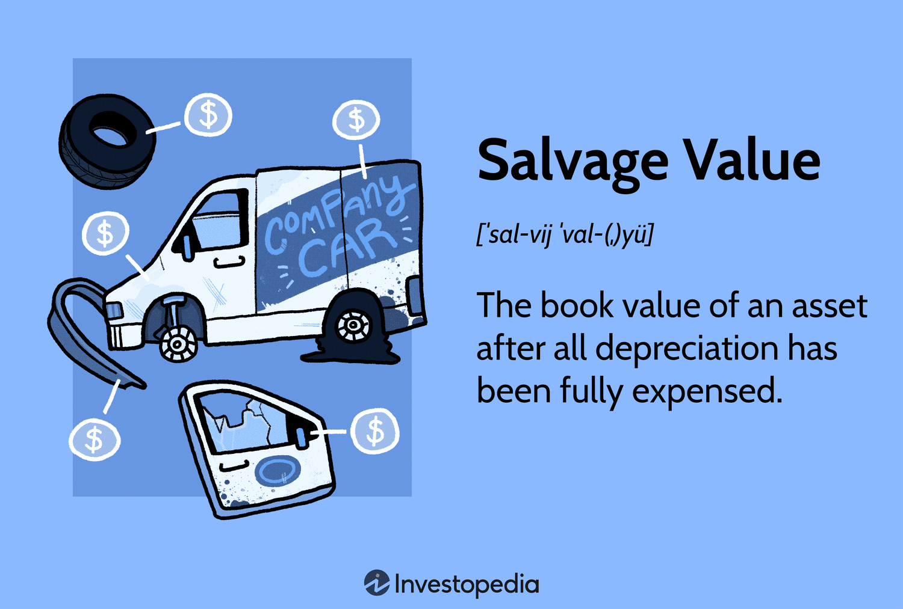

## Table of Contents

## What is salvage value?

Salvage value is the estimated value of an asset at the end of its useful life. It's what you can expect to get for the asset after it has been used for a while and is no longer needed for its original purpose. For example, if a company buys a truck for deliveries, the salvage value would be what they could sell the truck for after they are done using it.

This value is important for businesses because it helps them figure out how much an asset will cost over time. When calculating depreciation, which is how the value of an asset goes down over time, the salvage value is subtracted from the original cost of the asset. This way, businesses can spread out the cost of the asset over its useful life and plan their finances better.

## Why is salvage value important in accounting?

Salvage value is important in accounting because it helps businesses figure out how much an asset will cost them over time. When a company buys something big like a machine or a truck, they don't just pay for it all at once. Instead, they spread out the cost over the years they use it. This is called depreciation. To calculate depreciation, you need to know the salvage value, which is how much the asset will be worth at the end of its useful life. By knowing the salvage value, a business can figure out how much of the asset's cost they need to account for each year.

This information is really helpful for planning and managing money. If a business knows the salvage value, they can make better guesses about their future costs and profits. It also helps them decide when it might be time to sell or replace an asset. For example, if the salvage value of a machine is high, it might make sense to keep using it longer. On the other hand, if the salvage value is low, it might be better to sell it sooner and buy a new one. Understanding salvage value helps businesses make smarter choices and keep their finances in good shape.

## How is salvage value calculated?

Salvage value is usually guessed by looking at what similar used items are selling for. For example, if a company wants to know the salvage value of a truck, they might look at what other used trucks of the same age and condition are selling for. They might also talk to people who buy and sell used trucks to get a good idea of what the truck will be worth at the end of its useful life.

Sometimes, businesses use a percentage of the original cost to guess the salvage value. For example, if a machine costs $100,000 and the company thinks it will be worth 10% of that at the end of its life, the salvage value would be $10,000. This method is simple but might not always be very accurate because it doesn't take into account how well the machine was taken care of or changes in the market.

In some cases, businesses might use more detailed methods to calculate salvage value. They might hire experts to look at the asset and give a professional estimate. Or they might use special formulas that take into account things like how long the asset will be used, how much it will be used, and how well it's been maintained. These methods can give a more accurate guess but they take more time and money to do.

## Can you provide a simple example of how to determine salvage value?

Let's say a company buys a delivery van for $30,000. They plan to use it for 10 years. To figure out the salvage value, they look at what similar used vans are selling for after 10 years of use. They find out that these vans usually sell for around $3,000 at that age. So, the company decides that the salvage value of their van will be $3,000.

Now, the company can use this salvage value to calculate how much the van will cost them each year. They subtract the salvage value from the original cost to get the total amount that needs to be depreciated. In this case, it's $30,000 minus $3,000, which equals $27,000. They then divide this amount by the number of years the van will be used, which is 10 years. So, the company will account for $2,700 of the van's cost each year.

## What factors influence the salvage value of an asset?

Several things can affect how much an asset is worth at the end of its life. One big [factor](/wiki/factor-investing) is how well the asset was taken care of. If a machine was kept clean and fixed regularly, it might be worth more when it's time to sell it. Another factor is how much people want that kind of asset. If lots of people need used trucks, the salvage value of a truck might be higher. The age of the asset also matters. Older assets usually have a lower salvage value because they've been used more and might not work as well.

Changes in the market can also change the salvage value. If new technology comes out that makes old machines less useful, their salvage value might go down. On the other hand, if something becomes rare or hard to find, its salvage value might go up. The location where the asset is sold can make a difference too. In some places, there might be more buyers for used equipment, which can increase the salvage value. All these things together help decide how much an asset will be worth at the end of its life.

## How does salvage value affect depreciation?

Salvage value is important when figuring out depreciation. Depreciation is how much an asset loses value over time. To find out depreciation, you take the original cost of the asset and subtract the salvage value. This gives you the total amount that needs to be spread out over the years the asset is used. For example, if a machine costs $100,000 and has a salvage value of $10,000, you would depreciate $90,000 over its useful life.

The way you calculate depreciation can change based on the salvage value. If the salvage value is higher, the amount you depreciate each year will be lower. This is because you're spreading out a smaller total cost over the same number of years. For instance, if a company uses a machine for 10 years and the salvage value is high, they'll have smaller yearly depreciation costs. This can affect how much money the company has to set aside each year for the asset's cost, which can help with planning and managing finances.

## What is the difference between salvage value and residual value?

Salvage value and residual value are similar ideas but they are used a bit differently. Salvage value is what you think an asset will be worth at the end of its useful life. It's used a lot in accounting to figure out how much an asset will cost over time. For example, if a company buys a truck, they might guess the salvage value to be what they can sell the truck for after using it for many years.

Residual value is often used when talking about leasing things, like cars or equipment. It's the value of the asset at the end of the lease term. If you lease a car for three years, the residual value is what the car is expected to be worth at the end of those three years. While both terms deal with the value of an asset at the end of a period, salvage value is more about the end of the asset's useful life, and residual value is more about the end of a lease or a specific period.

## How do different depreciation methods impact the calculation of salvage value?

Different ways of figuring out depreciation don't really change the salvage value itself. The salvage value is what you think an asset will be worth at the end of its life, and that guess stays the same no matter how you calculate depreciation. But, the way you calculate depreciation can change how you spread out the cost of the asset over time. For example, if you use a method that spreads the cost evenly each year, like straight-line depreciation, the salvage value is just subtracted from the original cost to find out how much to depreciate each year.

On the other hand, if you use a method that lets you take bigger depreciation amounts in the early years, like the declining balance method, the salvage value still matters. You stop depreciating the asset when it reaches its salvage value. So, even though the salvage value doesn't change, the method you use for depreciation can affect how quickly you reach that value and how you account for the asset's cost over time.

## What are the tax implications of salvage value?

When it comes to taxes, the salvage value of an asset can affect how much a business can deduct each year. When a company buys something big like a machine, they can't deduct the whole cost right away. Instead, they spread it out over time through depreciation. The salvage value is subtracted from the original cost to find out how much to depreciate. A higher salvage value means less to depreciate each year, which can mean smaller tax deductions. On the other hand, a lower salvage value lets a business take bigger deductions, which can lower their taxes.

When it's time to sell the asset, the salvage value can also affect taxes. If a company sells the asset for more than its book value, which is the original cost minus all the depreciation taken so far, they might have to pay taxes on the difference. This is called a capital gain. If they sell it for less than the book value, they might be able to take a loss on their taxes. Knowing the salvage value helps businesses plan for these tax effects and make smart decisions about when to sell or replace their assets.

## How can businesses maximize the salvage value of their assets?

Businesses can maximize the salvage value of their assets by taking good care of them. This means fixing things when they break, keeping them clean, and making sure they are used the right way. When an asset is well-maintained, it lasts longer and is worth more when it's time to sell it. For example, if a company has a truck and they keep it in good shape, they might be able to sell it for more money at the end of its useful life than if they let it get old and broken down.

Another way to increase salvage value is to keep up with what's happening in the market. If a business knows that certain types of assets are in high demand, they might be able to sell theirs for a better price. For instance, if there's a shortage of used trucks, a company might be able to get more money for their old truck. Also, selling an asset at the right time can make a big difference. If a business waits until a new technology makes their old equipment less useful, the salvage value might go down. But if they sell it before that happens, they could get a better price.

## What role does salvage value play in lease agreements?

Salvage value is important in lease agreements because it helps decide how much the person leasing the asset will pay over time. When a company leases something like a car or a piece of equipment, they don't own it, but they use it for a certain period. At the end of the lease, the asset might be returned to the owner or there might be an option to buy it. The salvage value is what the asset is expected to be worth at the end of the lease. This value is used to figure out the monthly lease payments. If the salvage value is high, the monthly payments might be lower because the asset will be worth more at the end of the lease.

In some lease agreements, the lessee (the person leasing the asset) might have the chance to buy the asset at the end of the lease for its salvage value. This can be a good deal if the salvage value is lower than what the asset is actually worth on the market. For example, if a company leases a truck and the salvage value at the end of the lease is $5,000, but similar used trucks are selling for $7,000, the company could buy the truck for less than its market value. This way, knowing the salvage value helps both the company leasing the asset and the owner plan their finances and make smart decisions about the lease.

## How do industry standards and regulations affect the determination of salvage value?

Industry standards and regulations can really change how businesses figure out the salvage value of their assets. For example, in some industries, there are rules about how long certain machines can be used safely. If a machine has to be taken out of service after a certain number of years because of these rules, its salvage value might be lower. Also, some industries have standards for how well assets need to be taken care of. If a business follows these standards, their assets might be worth more at the end of their life because they're in better shape.

On top of that, government regulations can also play a big role. For instance, if there are new laws about what can be done with old equipment, like recycling or disposing of it in a certain way, this can affect the salvage value. If it costs a lot to get rid of an asset the right way, the salvage value might go down. But if there are programs or incentives for recycling old equipment, the salvage value could go up because the asset might be worth more to someone who can use those programs. So, businesses need to keep an eye on these standards and regulations to make good guesses about their assets' salvage value.

## What is Understanding Salvage Value?

Salvage value represents the expected residual worth of an asset at the conclusion of its useful life. This estimation is pivotal for accurate depreciation calculations and the effective scheduling of asset replacements. The salvage value offers a basis upon which organizations can determine the depreciation expense allocated annually over an asset's useful life. Consequently, this affects net income and the overall portrayal of an entity's financial position.

To derive an accurate estimate for salvage value, companies typically employ a combination of historical data, thorough market analyses, and expert appraisals. Historical data provides insights into the typical residual value of similar assets at the end of their useful lifespan, while market analyses can help incorporate current economic conditions and the specific dynamics of the industry. Expert appraisals lend a professional perspective, often accounting for variables that raw data and market trends cannot fully address.

The salvage value directly affects financial statements by influencing the depreciation expense. The formula to calculate the depreciation using straight-line method is:

$$
\text{Depreciation Expense} = \frac{\text{Cost of Asset} - \text{Salvage Value}}{\text{Useful Life of Asset}}
$$

This relationship highlights that a higher salvage value results in a lower annual depreciation expense, which in turn can increase the net income reported by a company, assuming other factors remain constant. In contrast, a lower estimated salvage value would result in higher annual depreciation, reducing reported net income.

Understanding and accurately estimating salvage value is crucial for sound financial decision-making, impacting both asset management and financial reporting. Properly recognizing this value ensures companies maintain not only compliance with accounting standards but also the integrity of their financial strategies, ultimately supporting sustainable growth and operational efficiency.

## What is Residual Value in Financial Accounting?

Residual value, often synonymous with salvage value, is a crucial element in the valuation of assets within financial accounting. It represents the estimated amount that an entity expects to obtain from disposing of an asset at the end of its useful life, after deducting any disposal costs. This value is fundamental in calculating depreciation, which impacts financial reporting and informs asset management strategies.

### Importance in Financial Reporting

Residual value is essential for accurately determining the depreciation expense associated with long-term assets. Depreciation is an accounting method that allocates the cost of a tangible asset over its useful life, thereby matching the expense with the revenue generated by the asset. The formula for calculating annual depreciation is given by:

$$
\text{Depreciation Expense} = \frac{\text{Cost of Asset} - \text{Residual Value}}{\text{Useful Life}}
$$

By influencing depreciation calculations, residual value affects a company's financial statements, particularly the balance sheet and income statement. An inaccurate estimation of residual value can lead to misrepresented asset values and financial performance, affecting stakeholder decisions.

### Methods for Calculating Residual Value

1. **Historical Cost Method**: This approach estimates residual value based on the historical cost of similar assets. It considers past transactions and adjustments for inflation or market changes to project the future value.

2. **Market Value Approach**: This method relies on current market conditions to determine the likely value of an asset at the end of its life. It involves analyzing market trends, demand forecasts, and economic conditions.

3. **Averaging Method**: Companies sometimes use averages of residual values from similar assets within an industry or portfolio to estimate the residual value. This method reduces the impact of outliers and provides a balanced estimate.

### Benefits of Accurate Estimation

Accurate residual value estimation in financial accounting is vital for several reasons:

- **Budgeting and Forecasting**: Knowing the expected salvage value of assets helps companies more accurately plan future capital expenditures and manage cash flows.

- **Decision-Making**: Accurate predictions enable better-informed strategic decisions, such as when to retire assets or invest in new ones.

- **Compliance and Reporting**: Reliable estimates ensure compliance with accounting standards and improve the credibility of financial statements.

In sum, the estimation of residual value is a foundational aspect of effective asset management and financial accounting practices. By utilizing established methods and industry insights, companies can enhance accuracy in financial reporting, thereby supporting sound economic decision-making and strategic planning.

## What are depreciation methods and what impacts do they have?

Depreciation is a fundamental accounting procedure used to allocate the cost of tangible assets over their useful lives. This concept is crucial for understanding how asset valuation impacts financial statements and strategic business decisions. Different methods of depreciation include straight-line, declining balance, and sum-of-years-digits, each with unique implications for financial accounting and asset management.

### Straight-Line Depreciation

The straight-line method is the simplest and most commonly used depreciation method. It involves dividing the cost of an asset, minus its salvage value, equally across its useful life. The formula for calculating straight-line depreciation is:

$$

\text{Depreciation Expense per Year} = \frac{\text{Cost of Asset} - \text{Salvage Value}}{\text{Useful Life of Asset}}
$$

By providing a consistent annual expense, the straight-line method simplifies budgeting and financial reporting, making it suitable for assets with predictable usage patterns.

### Declining Balance Method

The declining balance method accelerates depreciation, resulting in higher expenses in the earlier years of an asset's life. This approach is beneficial for assets that quickly lose value or become obsolete. The most common form is the double-declining balance method, calculated as:

$$

\text{Depreciation Expense per Year} = \text{Book Value at Beginning of Year} \times \frac{2}{\text{Useful Life of Asset}}
$$

This method can provide tax advantages and reflect the rapid technological obsolescence of certain assets, though it complicates financial forecasting and may affect net income differently compared to straight-line depreciation.

### Sum-of-Years-Digits Method

The sum-of-years-digits method is another accelerated depreciation strategy. It applies a decreasing fraction of the depreciable cost to each year of an asset's useful life. The expense is calculated using the formula:

$$

\text{Depreciation Expense for Year t} = \frac{\text{(Remaining Life in Years)}}{\text{Sum of Years Digits}} \times (\text{Cost of Asset} - \text{Salvage Value})
$$

Where the sum of years digits is the sum of digits of the numbers corresponding to each year of an asset's useful life. This method is less commonly used but is useful for assets with diminishing returns or decreasing productivity over time.

### Impacts on Financial Statements

Choosing the appropriate depreciation method affects financial statements significantly. The method determines the timing and amount of depreciation expense recognized each year, influencing net income, asset book values, and tax liabilities. Businesses must carefully select a method that aligns with their financial goals, asset usage patterns, and industry standards.

### Strategic Business Decisions

The choice of depreciation method can also affect investment and asset management decisions. It influences financial ratios, cash flow projections, and capital budgeting, thereby impacting strategic planning and performance evaluation. Companies aiming for aggressive growth may prefer accelerated methods to benefit from deferred tax liabilities, while those focusing on stability might favor straight-line depreciation for its simplicity and consistency.

In conclusion, understanding the nuances of different depreciation methods is crucial for effective asset management and accurate financial reporting. By aligning depreciation strategies with business objectives, organizations can optimize their financial outcomes and ensure sustainable success.

## References & Further Reading

[1]: ["Advances in Financial Machine Learning"](https://www.amazon.com/Advances-Financial-Machine-Learning-Marcos/dp/1119482089) by Marcos Lopez de Prado

[2]: ["Evidence-Based Technical Analysis: Applying the Scientific Method and Statistical Inference to Trading Signals"](https://www.amazon.com/Evidence-Based-Technical-Analysis-Scientific-Statistical/dp/0470008741) by David Aronson

[3]: ["Machine Learning for Algorithmic Trading"](https://github.com/stefan-jansen/machine-learning-for-trading) by Stefan Jansen

[4]: ["Quantitative Trading: How to Build Your Own Algorithmic Trading Business"](https://www.amazon.com/Quantitative-Trading-Build-Algorithmic-Business/dp/1119800064) by Ernest P. Chan

[5]: Khan, M.Y., & Jain, P.K. (2005). ["Financial Management: Text, Problems and Cases."](https://books.google.com/books/about/Financial_Management.html?id=-FakDwAAQBAJ) Tata McGraw-Hill Education.

[6]: Petty, J.W., Titman, S., Keown, A.J., Martin, J.D., & Martin, P. (2020). ["Financial Management: Principles and Applications"](https://archive.org/details/financialmanagem0011titm) Pearson.

[7]: Wild, J.J., & Shaw, K.W. (2020). ["Financial Accounting Information for Decisions."](https://archive.org/details/financialmanager0000wild_k9p7) McGraw-Hill Education.