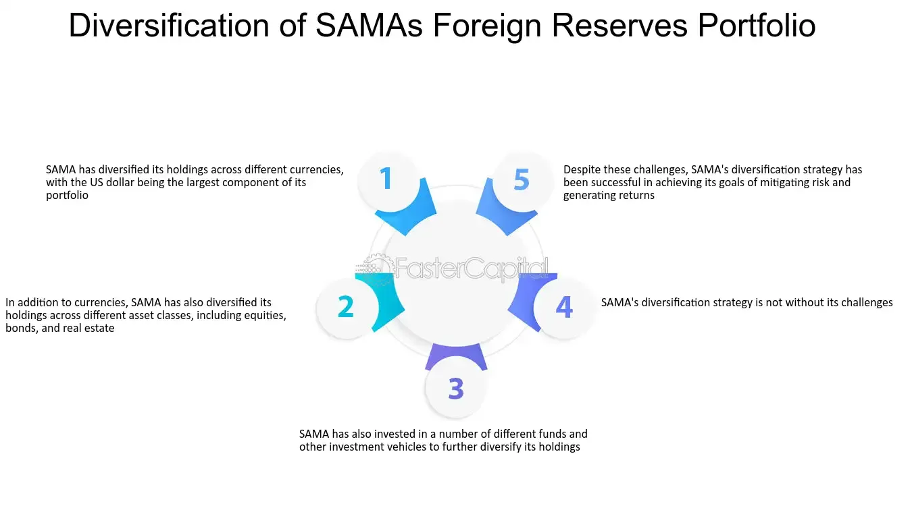

## Table of Contents

## What is Sama Foreign Holdings?

Sama Foreign Holdings is a company that helps other businesses grow internationally. They do this by investing money and giving advice on how to do business in different countries. The company works with businesses from many different industries, like technology, health care, and manufacturing. They help these businesses understand new markets and make smart decisions about where to expand.

The main goal of Sama Foreign Holdings is to make it easier for companies to succeed in foreign countries. They use their knowledge and experience to help businesses avoid common problems when entering new markets. By working closely with their clients, Sama Foreign Holdings can create plans that fit each company's unique needs and goals. This helps businesses grow faster and more successfully around the world.

## Where is Sama Foreign Holdings located in Saudi Arabia?

Sama Foreign Holdings has its main office in Riyadh, the capital city of Saudi Arabia. Riyadh is a big and busy city in the center of the country. The office is in a tall building in the business area of the city. This location makes it easy for Sama Foreign Holdings to meet with other businesses and clients.

The company also has smaller offices in other cities in Saudi Arabia, like Jeddah and Dammam. Jeddah is on the Red Sea coast, and Dammam is near the Persian Gulf. These offices help Sama Foreign Holdings reach more clients in different parts of the country. Having offices in these cities helps the company work better with businesses all over Saudi Arabia.

## What are the main objectives of Sama Foreign Holdings in Saudi Arabia?

Sama Foreign Holdings aims to help businesses in Saudi Arabia grow and succeed in other countries. They want to make it easier for these businesses to understand and enter new markets. By giving money and advice, Sama Foreign Holdings helps companies make smart choices about where to expand. They work with businesses from many industries, like technology, health care, and manufacturing, to create plans that fit each company's needs.

Another goal of Sama Foreign Holdings is to build strong relationships with businesses in Saudi Arabia. They want to be a trusted partner that companies can rely on for help with international growth. By having offices in Riyadh, Jeddah, and Dammam, Sama Foreign Holdings can reach more clients and offer better support. This helps them work closely with businesses all over the country and help them succeed around the world.

## How does Sama Foreign Holdings contribute to the Saudi economy?

Sama Foreign Holdings helps the Saudi economy by supporting local businesses to grow and succeed in other countries. They give money and advice to these businesses, helping them understand new markets and make smart choices about where to expand. When these businesses do well in other countries, they can bring more money back to Saudi Arabia. This helps create more jobs and makes the economy stronger.

The company also builds strong relationships with businesses in Saudi Arabia, becoming a trusted partner for international growth. By having offices in Riyadh, Jeddah, and Dammam, Sama Foreign Holdings can reach more clients and offer better support. This helps businesses all over the country succeed around the world, which in turn boosts the Saudi economy. When local businesses grow internationally, it helps the whole country's economy to grow too.

## What industries does Sama Foreign Holdings invest in within Saudi Arabia?

Sama Foreign Holdings invests in many different industries in Saudi Arabia. They help businesses in technology, health care, and manufacturing to grow in other countries. By giving money and advice, they help these companies understand new markets and make smart choices about where to expand.

The company also works with businesses in the energy and financial sectors. They support these businesses to succeed internationally, which helps bring more money back to Saudi Arabia. This investment in various industries helps create more jobs and makes the economy stronger.

## What is the business strategy of Sama Foreign Holdings in the Saudi market?

Sama Foreign Holdings focuses on helping businesses in Saudi Arabia grow in other countries. They do this by giving money and advice to these companies. Their strategy is to work closely with businesses from many industries, like technology, health care, and manufacturing. By understanding each company's needs, Sama Foreign Holdings can create plans that help these businesses enter new markets and make smart choices about where to expand.

The company also aims to build strong relationships with businesses in Saudi Arabia. They want to be a trusted partner that companies can rely on for help with international growth. By having offices in Riyadh, Jeddah, and Dammam, Sama Foreign Holdings can reach more clients and offer better support. This helps them work closely with businesses all over the country and help them succeed around the world.

## How does Sama Foreign Holdings adapt to the regulatory environment in Saudi Arabia?

Sama Foreign Holdings works hard to follow the rules in Saudi Arabia. They know the laws and regulations very well. They make sure all their business activities meet these rules. This helps them avoid problems and keep their work smooth. By understanding the regulatory environment, Sama Foreign Holdings can give good advice to the businesses they help.

The company also keeps up with changes in the laws. They watch for new rules and adjust their plans to fit these changes. This way, they can keep helping businesses grow in other countries while staying within the law. By being careful and smart about regulations, Sama Foreign Holdings can be a reliable partner for businesses in Saudi Arabia.

## What are the key challenges faced by Sama Foreign Holdings in Saudi Arabia?

Sama Foreign Holdings faces some big challenges in Saudi Arabia. One big challenge is the changing rules and laws. They need to keep up with these changes to make sure they are following them. This can be hard because the rules can change often. They also need to help the businesses they work with understand and follow these rules too.

Another challenge is the competition. There are other companies in Saudi Arabia that want to help businesses grow in other countries. Sama Foreign Holdings needs to show that they are the best choice. They do this by giving good advice and building strong relationships with their clients. This can be hard work, but it is important for their success.

Lastly, understanding the different markets where they want to help businesses grow can be tough. Each country has its own way of doing things. Sama Foreign Holdings needs to learn about these different places to give the best advice. This takes a lot of time and effort, but it is key to helping their clients succeed.

## How does Sama Foreign Holdings engage with local communities in Saudi Arabia?

Sama Foreign Holdings cares about the communities in Saudi Arabia. They do this by helping local businesses grow. When these businesses do well, they can hire more people from the community. This means more jobs and a stronger local economy. Sama Foreign Holdings also works with schools and universities to help students learn about business and how to work in other countries. This helps young people get ready for good jobs in the future.

The company also takes part in community events and projects. They support things like sports events, charity work, and cultural festivals. By doing this, they show that they care about more than just making money. They want to help make the communities in Saudi Arabia better places to live. This makes people trust Sama Foreign Holdings and see them as a good partner for the future.

## What are the long-term goals of Sama Foreign Holdings in the region?

Sama Foreign Holdings wants to help businesses in Saudi Arabia grow and succeed in other countries for a long time. They plan to keep giving money and advice to these businesses. By doing this, they hope to help more and more companies enter new markets and make smart choices about where to expand. Their goal is to be the best partner for businesses that want to grow internationally. They want to build strong relationships with these businesses and help them succeed around the world.

Another long-term goal is to make the economy in Saudi Arabia stronger. When local businesses do well in other countries, they bring more money back to Saudi Arabia. This helps create more jobs and makes the economy grow. Sama Foreign Holdings wants to keep working with businesses from many industries, like technology, health care, and manufacturing. By helping these businesses, they can make a big difference in the region's economy over time.

## How does Sama Foreign Holdings measure the success of its operations in Saudi Arabia?

Sama Foreign Holdings measures the success of its operations in Saudi Arabia by looking at how well the businesses they help are doing in other countries. They check if these businesses are making more money and growing in new markets. They also see if the businesses are happy with the advice and money they get from Sama Foreign Holdings. If the businesses are doing well and are happy, then Sama Foreign Holdings knows they are successful.

Another way they measure success is by looking at the impact on the Saudi economy. They see if the businesses they help are creating more jobs and bringing more money back to Saudi Arabia. If the economy is getting stronger because of their work, then Sama Foreign Holdings knows they are doing a good job. They also look at how well they are working with local communities and if they are helping to make these communities better places to live.

## What future expansions or projects does Sama Foreign Holdings have planned in Saudi Arabia?

Sama Foreign Holdings is planning to open more offices in Saudi Arabia. They want to have offices in more cities to help more businesses. This will make it easier for them to work with companies in different parts of the country. They are also looking to start new projects that help businesses learn about new markets. These projects will give businesses the tools and knowledge they need to grow in other countries.

Another plan is to work more with schools and universities. Sama Foreign Holdings wants to help students learn about business and how to work in other countries. This will help young people get ready for good jobs in the future. They also want to do more community projects. By helping with sports events, charity work, and cultural festivals, they can show that they care about the people in Saudi Arabia. This will make people trust Sama Foreign Holdings more and see them as a good partner for the future.

## What is your investment strategy and philosophy?

SAMA Foreign Holdings, overseen by the Saudi Arabian Monetary Agency, emphasizes a cautious investment strategy centered around low-risk, fixed-income securities. This approach reflects the fund's commitment to preserving capital while aiming for steady returns, a common trait amongst sovereign wealth funds seeking to secure national financial stability.

Despite the lack of transparency regarding its specific asset allocations, SAMA is recognized for its market proficiency and technical acumen. This reputation suggests a sophisticated understanding of global economic dynamics, which informs its investment decisions. A significant element underpinning SAMA's strategy is diversification. By spreading investments across various asset classes and geographies, SAMA seeks to mitigate risks associated with market [volatility](/wiki/volatility-trading-strategies). Diversification serves as a hedge against potential downturns in any single market or asset type, thereby contributing to a balanced and resilient portfolio.

Diversification can be mathematically expressed in terms of portfolio variance, which is minimized according to the formula:

$$
\sigma_p^2 = \sum_{i=1}^{n}\sum_{j=1}^{n} w_i w_j \sigma_{ij}
$$

In this equation, $\sigma_p^2$ represents the portfolio variance, $w_i$ and $w_j$ are the weights of assets $i$ and $j$ in the portfolio, and $\sigma_{ij}$ is the covariance between the returns of assets $i$ and $j$. By adjusting the weights $w_i$ appropriately across different low-correlation assets, SAMA aims to minimize the overall portfolio risk.

The fund’s prudent investment philosophy reflects a broader commitment to ensuring stable, long-term returns. This approach not only underscores the necessity of protecting national wealth but also demonstrates adaptability in leveraging financial expertise and market insights, allowing SAMA to navigate complex global financial landscapes effectively.

## References & Further Reading

[1]: Bergstra, J., Bardenet, R., Bengio, Y., & Kégl, B. (2011). ["Algorithms for Hyper-Parameter Optimization."](https://dl.acm.org/doi/10.5555/2986459.2986743) Advances in Neural Information Processing Systems 24.

[2]: ["Advances in Financial Machine Learning"](https://www.amazon.com/Advances-Financial-Machine-Learning-Marcos/dp/1119482089) by Marcos Lopez de Prado

[3]: ["Evidence-Based Technical Analysis: Applying the Scientific Method and Statistical Inference to Trading Signals"](https://www.amazon.com/Evidence-Based-Technical-Analysis-Scientific-Statistical/dp/0470008741) by David Aronson

[4]: ["Machine Learning for Algorithmic Trading"](https://github.com/stefan-jansen/machine-learning-for-trading) by Stefan Jansen

[5]: ["Quantitative Trading: How to Build Your Own Algorithmic Trading Business"](https://www.amazon.com/Quantitative-Trading-Build-Algorithmic-Business/dp/1119800064) by Ernest P. Chan