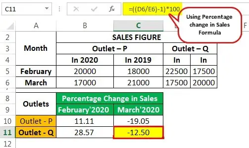

Retail performance is a multifaceted domain influenced by a range of metrics, with same-store sales being one of the most crucial indicators. Same-store sales, also known as comparable-store sales, measure the revenue generated by a retailer from its existing stores that have been operational for a minimum of one year. By excluding revenue from new store openings, this metric provides a more accurate representation of a store's organic growth, unattached from expansion activities.

The importance of same-store sales lies in its ability to serve as a reliable gauge of a retail business's health. It reflects consumer loyalty, the effectiveness of current business strategies, and operational efficiency. For investors and analysts, same-store sales are instrumental in assessing the stability and potential profitability of retail companies. Robust increases in same-store sales can indicate a strong market position and consumer preference, while declines may signal challenges in retaining customer interest and market share.



Moreover, same-store sales are pivotal in the context of algorithmic trading and retail analysis. For algorithmic traders, integrating same-store sales data into financial models enhances the accuracy of predictions related to stock movements in the retail sector. This data enables traders to identify trends and make informed decisions about trading opportunities.

Overall, through its ability to highlight both growth and challenges within retail businesses, same-store sales remain an essential metric for comprehensively evaluating retail performance.

## Table of Contents

## Understanding Same-Store Sales

Same-store sales, often abbreviated as SSS, represent a significant metric for determining the performance of retail outlets that have been operational for at least a year. This measurement focuses exclusively on revenue growth from these existing stores, thus excluding data from recently opened or closed locations. This exclusion is critical, as it provides a more accurate assessment of organic growth within a retail business. By concentrating on stores with more than a year of operational history, same-store sales mitigate anomalies introduced by expansion-driven sales fluctuations, allowing analysts and investors to better understand underlying growth trends.

The analysis of same-store sales is pivotal in tracking customer loyalty, as consistent or growing sales figures in established stores indicate that customer retention strategies are effective. It also serves as a barometer for current business strategies, reflecting whether marketing initiatives, store operations, and product offerings resonate well with the target market. A positive same-store sales figure suggests that consumers are returning due to satisfaction with their shopping experience, while a decline may signal underlying issues that need addressing.

For example, a hypothetical retail chain reports a 5% increase in same-store sales over the past fiscal year. This uptick may result from successful loyalty programs, effective inventory management, or improved customer service. Retailers often scrutinize such figures to tailor business practices toward enhancing customer experiences and maximizing profitability.

Mathematically, same-store sales growth can be formulated as follows:

$$
\text{Same-store sales growth} = \frac{\text{Sales in current period} - \text{Sales in previous period}}{\text{Sales in previous period}} \times 100\%
$$

This formula reflects the percentage change in sales for stores that have been open continuously for more than a year. This calculation provides retailers with a clear view of their current trajectory, enabling them to make strategic decisions based on solid data.

## Importance of Same-Store Sales in Retail

Same-store sales are a critical metric in retail analysis, providing investors and analysts a valuable measure to assess the stability and financial health of a retail business. By focusing solely on the performance of stores that have been operational for at least one year, same-store sales offer a clear view of organic growth, eliminating the effects of newly opened or closed stores. This focus on existing locations helps to highlight the true performance and effectiveness of a retailer's strategies without the noise introduced by external expansion factors.

For investors, same-store sales serve as a reliable indicator of consumer spending behaviors and retailer efficiency. This metric allows them to assess whether a business is successfully maintaining or increasing sales within its existing operations, which is a strong indicator of customer loyalty and satisfaction. A consistent increase in same-store sales often suggests a healthy market presence and robust operational strategies, while a decline may signal underlying issues such as waning customer interest or rising competition.

In strategic business decision-making, same-store sales play a pivotal role. Retailers use this data to inform decisions about possible expansions, such as opening new locations or improving current ones. It guides operational changes and improvements, aligning inventory and staffing strategies with customer demand trends reflected in the sales data. For instance, if same-store sales are increasing, a retailer might consider expanding inventory or enhancing store facilities to capitalize on heightened customer interest. Conversely, stagnant or declining same-store sales might prompt a focus on marketing or customer retention initiatives.

Same-store sales also provide a valuable benchmark for performance comparisons with competitors. By examining this metric across the retail industry, businesses can evaluate their competitive position. A retailer that consistently outperforms its industry peers in same-store sales is likely employing successful strategies that could be emulated or further developed to sustain its market lead.

Overall, same-store sales are indispensable for a nuanced analysis of retail business performance for both internal strategists and external investors. Their role in measuring customer engagement, operational effectiveness, and market position makes them a cornerstone in understanding retail dynamics.

## Factors Influencing Same-Store Sales Growth

Same-store sales growth is influenced by a myriad of factors, each playing a crucial role in shaping the retail landscape. These factors include economic conditions, store location, marketing strategies, and competition. Retailers are required to maintain a keen awareness of these elements and adapt accordingly to sustain and improve their performance.

Economic conditions are one of the primary determinants of same-store sales growth. Changes in macroeconomic variables such as consumer confidence, disposable income, and unemployment rates directly affect consumer spending habits. A robust economy generally leads to increased consumer spending, resulting in higher same-store sales. Conversely, during economic downturns, consumers may restrict their discretionary spending, negatively impacting sales. Retailers must be agile, adjusting their strategies to accommodate fluctuating economic climates, perhaps by offering promotions during tougher times to encourage spending.

The location of a store substantially impacts its sales performance. Stores situated in high-traffic areas with easy accessibility tend to attract more customers, boosting same-store sales. Additionally, the demographic profile of the area can influence purchasing patterns; stores located in affluent neighborhoods may experience higher sales volumes of premium products. Retailers should consider these geographical and demographic factors when selecting store locations or when deciding which product lines to emphasize in particular stores.

Marketing strategies also play a pivotal role in influencing same-store sales. Effective marketing can enhance brand visibility and customer engagement, leading to increased foot traffic and sales. Both traditional marketing methods, such as print ads and billboards, and modern digital strategies, like social media campaigns and email marketing, can be employed. Targeted marketing efforts that resonate with the local customer base can significantly improve store performance. Retailers need to analyze the effectiveness of these strategies continuously and adjust them to match consumer preferences and behaviors.

Competition is another critical [factor](/wiki/factor-investing) that affects same-store sales growth. Retailers operate in a dynamic environment where they constantly compete for consumer attention and spending. Competitive pricing, superior customer service, and unique product offerings are essential to maintain a competitive edge. Retailers must keep a close watch on their competitors' actions and market trends to devise strategies that differentiate their stores and enhance their appeal to customers.

To effectively respond to these influencing factors, retailers can utilize data analytics to glean insights from sales patterns, customer feedback, and market trends. By understanding these factors, retailers can make informed decisions that align with their operational goals and market conditions. The adaptability and strategic acumen of a retailer can define their ability to drive same-store sales growth in a competitive and ever-evolving retail market.

## Analyzing Sales Data for Same-Store Sales

Analyzing sales data is crucial for understanding same-store sales, as it helps retailers identify underlying trends and patterns. Employing data analysis techniques allows businesses to extract valuable insights from their sales figures, contributing to informed decision-making processes. 

One of the primary methods for analyzing sales data is through time series analysis, which involves examining data points collected or recorded at specific times. This approach helps retailers understand seasonal variations and recognize long-term trends. For instance, retailers can apply moving averages to smooth out short-term fluctuations and highlight long-term trends. A simple moving average can be calculated using the following formula:

$$
SMA = \frac{1}{n} \sum_{i=0}^{n-1} P_{i}
$$

where $SMA$ is the simple moving average, $n$ is the number of periods, and $P_{i}$ represents the sales figure at each period.

Beyond traditional statistical methods, advanced analytics employing [machine learning](/wiki/machine-learning) algorithms can enhance the predictive accuracy of sales forecasts. Techniques, such as regression analysis, clustering, and anomaly detection, enable retailers to segment customer data, detect patterns, and identify unusual sales behaviors. Modern analytical tools allow retailers to perform these tasks on large datasets efficiently, extracting insights that drive strategic decisions.

For instance, regression analysis can help model relationships between sales and variables like marketing spend or economic indicators. This enables retailers to predict how changes in these variables might impact sales. A simple linear regression can be expressed as:

$$

Y = a + bX + \epsilon 
$$

where $Y$ represents the sales figure, $a$ is the intercept, $b$ is the coefficient for the independent variable $X$, and $\epsilon$ is the error term.

Retailers also leverage algorithms for demand forecasting, which aids in optimizing product offerings and pricing strategies. These predictions inform inventory management, ensuring that stock levels are aligned with consumer demand. Moreover, machine learning models, such as random forests or neural networks, can improve forecast accuracy by incorporating complex patterns in data and adapting to new information quickly.

In summary, analyzing sales data through various statistical and computational methods enables retailers to gain a competitive edge by optimizing their business strategies and predicting future growth more accurately. By integrating these insights into their operations, retailers can tailor their offerings to meet the evolving needs of their consumers and sustain their market position.

## Algo Trading: Leveraging Same-Store Sales Data

Algorithmic trading integrates same-store sales data to enhance stock prediction models. This metric is pivotal due to its focus on the performance of established retail locations, providing a clearer picture of a retailer's organic growth. By analyzing same-store sales figures, traders can extract valuable insights into a retail company's health, which can, in turn, influence stock prices.

Retail performance data reveals underlying trends in consumer behavior and company operations. When this data shows positive same-store sales growth, it often indicates increased profitability and operational efficiency, attracting investors and influencing stock valuation positively. Conversely, declining same-store sales may signal potential issues within the company, posing risks to investors. Thus, algorithmic traders use this data to identify trading opportunities, adjusting their positions based on anticipated market movements.

Seasonality also plays a significant role, as consumer spending varies throughout the year. For instance, retail sales typically surge during holiday seasons, affecting same-store sales metrics. Algorithmic trading systems incorporate these seasonal trends to refine predictions. By applying statistical models such as ARIMA (AutoRegressive Integrated Moving Average) or machine learning techniques like Random Forests, these systems can account for seasonal fluctuations, providing more accurate forecasts.

Python is often used for developing trading algorithms due to its robust libraries, such as pandas for data manipulation and scikit-learn for machine learning. Consider the following Python snippet, which illustrates the incorporation of same-store sales data with seasonal adjustment for prediction:

```python
import pandas as pd
from statsmodels.tsa.seasonal import seasonal_decompose
from sklearn.ensemble import RandomForestRegressor
from sklearn.model_selection import train_test_split

# Load dataset
data = pd.read_csv('same_store_sales_data.csv')

# Decompose to observe seasonality
decomposition = seasonal_decompose(data['sales'], model='multiplicative', period=12)
seasonal = decomposition.seasonal

# Prepare dataset including seasonal component
data['seasonal'] = seasonal
X = data.drop('sales', axis=1)
y = data['sales']

# Split data
X_train, X_test, y_train, y_test = train_test_split(X, y, test_size=0.2, random_state=42)

# Model training with Random Forest
model = RandomForestRegressor(n_estimators=100, random_state=42)
model.fit(X_train, y_train)

# Predict
predictions = model.predict(X_test)
```

Incorporating consumer trends further enhances prediction accuracy. Analyzing indicators like foot traffic, product preferences, and external economic factors contributes to a comprehensive understanding of likely future sales figures. Machine learning algorithms are particularly adept at sifting through complex datasets to identify patterns and correlations that human analysts might miss.

As [algorithmic trading](/wiki/algorithmic-trading) continues to evolve, the integration of same-store sales data with advanced analytics offers significant advantages. By leveraging this metric, traders can develop strategies that are both reactive to short-term market shifts and aligned with long-term retail performance trends.

## Improving Same-Store Sales: Strategies and Innovations

Retailers seeking to improve same-store sales must focus on strategies that elevate the customer experience and tailor the shopping journey. The personalization of shopping experiences can significantly contribute to growth, as it addresses consumer preferences and builds loyalty. By analyzing consumer data, retailers can offer personalized recommendations and promotions, thereby enhancing the shopping experience and increasing conversion rates.

Investing in technology is critical for the modern retailer aiming to boost same-store sales. Advanced data analytics and AI-driven solutions can offer deep insights into consumer behavior, making it easier to target marketing efforts and optimize product assortments. Implementing an omnichannel approach, which seamlessly integrates online and offline channels, can further enhance customer engagement. This strategy ensures consistency in customer interaction and provides greater convenience, ultimately leading to increased sales.

Moreover, employee training in customer service and sales techniques remains a fundamental aspect of improving same-store sales. Trained employees can enhance the in-store experience by providing superior customer service, reinforcing brand loyalty, and encouraging repeat visits.

Effective inventory management is another critical factor. Retailers must leverage technology to maintain optimal stock levels, ensuring the availability of products without overstocking, which can lead to markdowns and reduced profitability. This balance can be achieved through data-driven inventory systems that forecast demand based on past sales patterns and current market trends.

Ultimately, the synchronization of these strategies—personalization, technological investment, omnichannel integration, employee training, and inventory management—can lead to substantial improvements in same-store sales and sustainable growth for retailers.

## Case Studies of Successful Same-Store Sales Strategies

In analyzing same-store sales strategies, several retailers have stood out for their innovative approaches, contributing to improved performance and customer satisfaction. This section examines a few real-world examples, showcasing effective methods employed by leading brands and emphasizing the critical roles of innovation and customer engagement.

**Starbucks: Leveraging Technology and Customer Loyalty**

Starbucks has consistently demonstrated innovative strategies to enhance same-store sales, primarily through technology adoption and an effective loyalty program. The Starbucks Rewards program enables personalized marketing, offering discounts and promotions tailored to individual customer preferences. This personalization fosters customer loyalty, encouraging repeat business and increasing overall sales. Additionally, Starbucks integrates technology through its mobile app, allowing customers to order and pay ahead, reducing wait times and enhancing the customer experience. This seamless integration of technology and customer engagement has been pivotal in boosting Starbucks' same-store sales.

**Walmart: Omnichannel Strategy Implementation**

Walmart's successful deployment of an omnichannel strategy exemplifies how integrating online and offline experiences can drive same-store sales growth. By combining in-store shopping with online purchasing options, Walmart has effectively increased its customer base and improved sales. The introduction of services like online order pickup and delivery has enhanced customer convenience, resulting in increased store traffic and higher sales. Furthermore, Walmart's robust data analytics capabilities enable it to optimize inventory and pricing strategies, ensuring that customer needs are met efficiently and effectively.

**Target: Focusing on Private Labels and Store Remodeling**

Target's approach to elevating same-store sales includes focusing on private labels and extensive store remodeling. By developing a range of exclusive private label products, Target differentiates itself from competitors and provides unique offerings that attract customers. These products often yield higher profit margins, contributing positively to overall sales performance. Additionally, Target's investment in store remodeling creates a refreshed and appealing shopping environment, boosting customer engagement and satisfaction. These strategies combined have contributed to Target's improved sales metrics.

**Best Buy: Emphasizing Employee Expertise and Customer Experience**

Best Buy has improved its same-store sales by focusing on enhancing the customer experience through employee expertise. By investing in employee training, Best Buy ensures that its staff can provide informed and personalized recommendations, improving customer satisfaction and driving sales. Additionally, Best Buy's Focus on Services initiative, which includes offerings like Geek Squad support and in-home consultations, caters to the growing demand for tech support and installation services. This strategy not only increases sales but also builds long-term customer relationships.

These case studies illustrate that successful same-store sales strategies are often rooted in innovation and a deep understanding of customer needs. By adopting technology, harnessing data analytics, implementing effective loyalty programs, and enhancing the customer experience, retailers can achieve significant improvements in same-store sales performance.

## The Future of Same-Store Sales and Retail Performance

Digital transformation is radically reshaping retail performance, with same-store sales at the forefront of this evolution. As technology continues to advance, retailers are increasingly relying on digital tools and processes to optimize their operations and generate more accurate forecasts. This shift is primarily driven by the integration of predictive analytics and machine learning, which are transforming how retailers understand and anticipate consumer behavior, ultimately affecting same-store sales metrics.

Predictive analytics utilizes vast amounts of data to forecast future outcomes, and when combined with machine learning, it becomes a powerful tool for predicting same-store sales. Algorithms can analyze historical sales data, customer demographics, purchase patterns, and even external factors like economic indicators and seasonal trends. For example, a machine learning model could input features such as average transaction value, foot traffic, and promotional activities, and output a forecast for future sales. This data-driven approach allows retailers to anticipate changes in demand and adjust their strategies to optimize sales and inventory management.

The potential of predictive analytics in retail is illustrated by the increasing use of machine learning models such as time-series forecasting, regression analysis, and clustering. In Python, libraries like scikit-learn, TensorFlow, and Prophet are frequently used for such tasks. For instance, using Prophet, a time-series model developed by Facebook, retailers can identify daily, weekly, and yearly sales patterns, facilitating more informed decision-making. Here's a simple example in Python using Prophet:

```python
from fbprophet import Prophet
import pandas as pd

# Load sales data
sales_data = pd.read_csv('same_store_sales.csv')
sales_data['ds'] = pd.to_datetime(sales_data['date'])
sales_data['y'] = sales_data['sales']

# Initialize and fit the model
model = Prophet()
model.fit(sales_data)

# Make future predictions
future = model.make_future_dataframe(periods=90)  # Predicting next 90 days
forecast = model.predict(future)

# Plot forecast
model.plot(forecast)
```

The landscape of retail and consumer behavior trends is also evolving rapidly. Consumers are increasingly expecting personalized experiences, seamless integration of online and offline shopping, and ethical business practices. This shift demands that retailers not only adapt to technological innovations but also remain attuned to changing consumer preferences. The rise in e-commerce and mobile shopping, coupled with the demand for sustainability, has prompted retailers to innovate continually.

Digital transformation enables a more integrated and responsive retail strategy. Omnichannel retailing, where online and offline channels are synchronized, provides a cohesive customer experience that can enhance same-store sales. Retailers must leverage these digital capabilities to maintain relevance in a competitive market. The future of retail performance will likely depend on how effectively retailers can harness these innovations to meet consumer demands and drive growth.

## Conclusion

Same-store sales analysis is indispensable for assessing retail success, providing insights into organic growth and consumer preferences. By focusing on stores that have been open for at least a year, this metric eliminates the noise of new store openings and expansions, offering a clearer picture of a business's stability and consumer loyalty. For retailers aiming to thrive in a competitive market, continuous innovation is crucial. This involves not only enhancing the product offering and customer experience but also integrating cutting-edge technologies.

The integration of advanced data analytics in retail strategies is essential for modern businesses. Analytical tools can process vast amounts of data, uncovering patterns and trends that inform strategic decisions. These insights help retailers optimize inventory, price products competitively, and tailor marketing strategies. Moreover, predictive analytics and machine learning can forecast future sales trends, allowing businesses to adapt swiftly to evolving consumer behaviors and market conditions.

In a rapidly changing retail landscape, the ability to harness data effectively provides a significant competitive edge. Retailers equipped with robust analytical capabilities and a commitment to innovation are better positioned to enhance their same-store sales performance, ensuring long-term success and resilience in a dynamic economic environment.

## References & Further Reading

[1]: Bergstra, J., Bardenet, R., Bengio, Y., & Kégl, B. (2011). ["Algorithms for Hyper-Parameter Optimization."](https://dl.acm.org/doi/10.5555/2986459.2986743) Advances in Neural Information Processing Systems 24.

[2]: ["Advances in Financial Machine Learning"](https://www.amazon.com/Advances-Financial-Machine-Learning-Marcos/dp/1119482089) by Marcos Lopez de Prado

[3]: ["Evidence-Based Technical Analysis: Applying the Scientific Method and Statistical Inference to Trading Signals"](https://www.amazon.com/Evidence-Based-Technical-Analysis-Scientific-Statistical/dp/0470008741) by David Aronson

[4]: ["Machine Learning for Algorithmic Trading"](https://github.com/stefan-jansen/machine-learning-for-trading) by Stefan Jansen

[5]: ["Quantitative Trading: How to Build Your Own Algorithmic Trading Business"](https://www.amazon.com/Quantitative-Trading-Build-Algorithmic-Business/dp/1119800064) by Ernest P. Chan