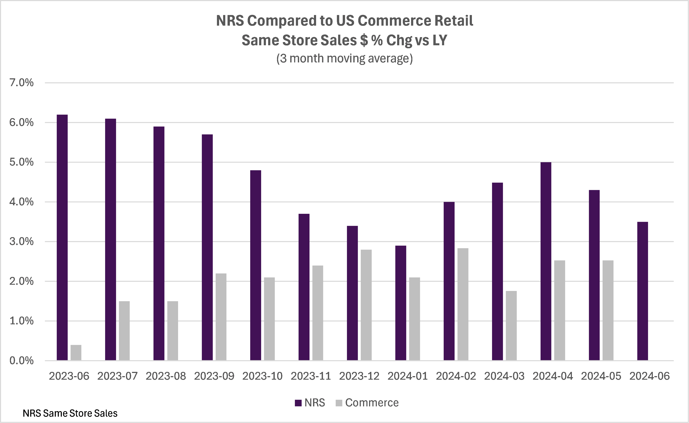

## Table of Contents

## What is same-store sales and why is it important in retail?

Same-store sales, also known as comparable store sales, is a measure used in retail to track the sales performance of stores that have been open for a certain period, usually at least a year. This means that new stores opened within the last year are not included in this calculation. By focusing on the sales of these established stores, businesses can get a clearer picture of their growth or decline, without the results being skewed by the addition of new stores.

This measure is important because it helps retailers understand how well their existing stores are performing. It shows whether customers are coming back and buying more, or if they are losing interest. This information is crucial for making decisions about things like store improvements, marketing strategies, and product offerings. By keeping an eye on same-store sales, retailers can better manage their business and plan for the future.

## How is same-store sales calculated?

Same-store sales are calculated by comparing the sales of stores that have been open for at least a year to the sales of those same stores in the previous year. For example, if a store made $100,000 in sales last March and $110,000 this March, the same-store sales growth for that store would be 10%.

This calculation helps businesses see if their existing stores are doing better or worse than before. It doesn't include sales from new stores opened within the last year because those could make the numbers look better than they really are. By looking at same-store sales, a company can tell if their regular customers are buying more or if they need to make changes to keep their business growing.

## What are the key metrics used in retail data analysis?

Retail data analysis uses several key metrics to understand how a business is doing. One important metric is sales revenue, which shows the total amount of money made from selling products. Another metric is average transaction value, which tells you how much money customers spend on average each time they buy something. Inventory turnover is also crucial as it measures how quickly products are sold and replaced, helping retailers know if they have too much or too little stock.

Another set of metrics focuses on customer behavior and satisfaction. Customer retention rate shows how many customers keep coming back to shop, which is important for long-term success. The conversion rate is the percentage of visitors who actually buy something, which can help improve store layout or marketing. Finally, net promoter score measures customer satisfaction and loyalty by asking customers how likely they are to recommend the store to others.

These metrics help retailers make smart decisions. By looking at sales revenue and average transaction value, they can see if they are making enough money. Inventory turnover helps them manage stock better. Customer retention and conversion rates show if their marketing and store experience are working well. And the net promoter score tells them if customers are happy and likely to spread the word about their store.

## How does same-store sales differ from total sales?

Same-store sales and total sales are two different ways to look at how a store is doing. Same-store sales only count the money made from stores that have been open for at least a year. This helps businesses see if their regular stores are doing better or worse than last year without being confused by new stores. Total sales, on the other hand, include all the money made from every store, no matter how long it has been open. This means total sales can go up just because new stores are added, even if the old stores are not doing as well.

Because of this difference, same-store sales give a clearer picture of how well the business is really doing. If same-store sales are going up, it means the business is doing a good job with its existing stores. But if total sales are going up because of new stores, but same-store sales are going down, it might mean the business needs to focus on making its old stores better. Both numbers are important, but they tell different stories about the health of the business.

## What are the common challenges in collecting and analyzing retail data?

Collecting and analyzing retail data can be tough because there's a lot of information to handle. Retailers need to keep track of sales, inventory, and customer information from many different stores and online. This means they need good systems to gather all this data without mistakes. If the data is not correct or complete, it can lead to wrong decisions. Also, it can be hard to make sure all the data from different places is the same, so it can be compared easily.

Another challenge is making sense of all the data once it's collected. Retailers need people who know how to use special tools and software to look at the data and find important patterns. Sometimes, the data can be confusing or hard to understand. Retailers also need to be careful about keeping customer information safe and following the rules about data privacy. All these things make it hard to use retail data to make the best choices for the business.

## How can same-store sales data be used to assess a company's performance?

Same-store sales data helps a company see if their stores that have been open for a while are doing better or worse than last year. By looking at this data, a company can tell if their regular customers are buying more stuff or if they are losing interest. If same-store sales are going up, it means the company is doing a good job keeping their old stores successful. But if same-store sales are going down, it might mean the company needs to make changes to get customers to come back and buy more.

This data is really important because it shows the true health of the business, without being affected by new stores. If a company opens a bunch of new stores, their total sales might go up, but that doesn't tell them if their old stores are doing well. By focusing on same-store sales, a company can make smart decisions about things like improving their stores, changing what they sell, or trying new ways to get customers to buy more. This helps them plan for the future and keep their business growing.

## What role does seasonality play in same-store sales analysis?

Seasonality is important when looking at same-store sales because it can affect how much people buy at different times of the year. For example, people might buy more during the holiday season in December, so same-store sales might go up. But if you compare December sales to January sales, it might look like sales are going down, even if the store is doing well overall. That's why it's important to compare the same months from different years, like December this year to December last year, to see if there's real growth or not.

By understanding seasonality, a company can see if changes in same-store sales are because of the time of year or because of other things like new products or better marketing. If a store knows that sales always go down in January, they won't be surprised or worried when it happens. They can plan for it and maybe have sales or special events to keep customers coming in. This helps the company make better decisions and keep their business strong all year round.

## How can retailers use same-store sales data to make strategic decisions?

Retailers can use same-store sales data to see if their stores are doing better or worse than last year. This helps them know if their regular customers are buying more or if they need to make changes. If same-store sales are going up, it means the store is doing a good job and can keep doing what they are doing. But if same-store sales are going down, it might mean the store needs to try new things to get customers to come back and buy more. This could be changing what they sell, making the store look nicer, or doing more advertising.

By looking at same-store sales, retailers can also decide where to spend their money. If some stores are doing really well, they might want to put more money into those stores to make them even better. But if other stores are not doing so well, they might need to fix those stores or even close them if they can't make them better. Same-store sales data helps retailers make smart choices about how to grow their business and keep their customers happy.

## What advanced statistical methods can be applied to enhance retail data analysis?

Retailers can use advanced statistical methods like regression analysis to understand how different things affect their sales. Regression analysis helps them see if changes in price, the time of year, or even the weather can make people buy more or less. By using this method, retailers can figure out the best time to have sales or when to change the price of their products to make more money. It's like trying to find a recipe for success by looking at lots of different ingredients and seeing which ones make the biggest difference.

Another useful method is cluster analysis, which helps retailers group their stores or customers into different categories based on how they act. For example, they might find that some stores do better in the summer, while others do better in the winter. Or they might see that some customers always buy a lot during sales, while others buy the same amount no matter what. By understanding these groups, retailers can make special plans for each one, like sending different ads or changing what they sell in different stores. This way, they can make sure they are doing the right things for each group to keep their business growing.

## How do external factors like economic conditions affect same-store sales?

External factors like economic conditions can have a big impact on same-store sales. When the economy is doing well, people usually have more money to spend, so they might buy more things at the store. This can make same-store sales go up because more customers are coming in and spending more money. On the other hand, if the economy is not doing well, people might be worried about money and decide to spend less. This can make same-store sales go down because fewer people are buying things or they are buying less expensive items.

Retailers need to pay attention to these economic conditions to understand why their same-store sales might be changing. For example, if there's a recession and same-store sales drop, it might not mean the store is doing a bad job. It could just be that people have less money to spend. By knowing this, retailers can make smart decisions like having sales to attract more customers or focusing on selling cheaper products that people are more likely to buy during tough times. Understanding how the economy affects their sales helps retailers plan better and keep their business strong.

## What are the best practices for forecasting same-store sales?

Forecasting same-store sales is important for planning and making smart decisions. One of the best ways to do this is by looking at past sales data. Retailers should look at how their sales changed over time, especially during different seasons or holidays. By understanding these patterns, they can guess how sales might go in the future. For example, if sales always go up in December, they can plan for that and make sure they have enough stock.

Another good practice is to use statistical methods like regression analysis. This helps retailers see how things like price changes, the economy, or even the weather can affect their sales. By using these methods, they can make better guesses about what might happen next. It's also important to keep an eye on what's happening in the world, like economic conditions or big events, because these can change how much people want to buy. By combining past data, statistical methods, and an understanding of external factors, retailers can make more accurate forecasts and plan better for the future.

## How can machine learning models improve the accuracy of same-store sales predictions?

Machine learning models can help make same-store sales predictions more accurate by learning from lots of past data. These models can look at things like how sales changed in different seasons, what happened when prices went up or down, and even how the economy was doing. By finding patterns in all this information, machine learning can guess what might happen next better than just looking at past numbers. It's like having a smart friend who can see connections and make better guesses about the future.

Using machine learning also helps because it can keep learning and getting better over time. As new sales data comes in, the model can update itself to make even better predictions. This means that the more data the model sees, the smarter it gets. Retailers can use these improved guesses to plan better, like knowing how much stuff to order or when to have sales. This can help them make more money and keep their customers happy.

## What is the importance of understanding same-store sales?

Same-store sales, often abbreviated as SSS, represent a significant metric for determining the performance of retail outlets that have been operational for at least a year. This measurement focuses exclusively on revenue growth from these existing stores, thus excluding data from recently opened or closed locations. This exclusion is critical, as it provides a more accurate assessment of organic growth within a retail business. By concentrating on stores with more than a year of operational history, same-store sales mitigate anomalies introduced by expansion-driven sales fluctuations, allowing analysts and investors to better understand underlying growth trends.

The analysis of same-store sales is pivotal in tracking customer loyalty, as consistent or growing sales figures in established stores indicate that customer retention strategies are effective. It also serves as a barometer for current business strategies, reflecting whether marketing initiatives, store operations, and product offerings resonate well with the target market. A positive same-store sales figure suggests that consumers are returning due to satisfaction with their shopping experience, while a decline may signal underlying issues that need addressing.

For example, a hypothetical retail chain reports a 5% increase in same-store sales over the past fiscal year. This uptick may result from successful loyalty programs, effective inventory management, or improved customer service. Retailers often scrutinize such figures to tailor business practices toward enhancing customer experiences and maximizing profitability.

Mathematically, same-store sales growth can be formulated as follows:

$$
\text{Same-store sales growth} = \frac{\text{Sales in current period} - \text{Sales in previous period}}{\text{Sales in previous period}} \times 100\%
$$

This formula reflects the percentage change in sales for stores that have been open continuously for more than a year. This calculation provides retailers with a clear view of their current trajectory, enabling them to make strategic decisions based on solid data.

## How can we analyze sales data for same-store sales?

Analyzing sales data is crucial for understanding same-store sales, as it helps retailers identify underlying trends and patterns. Employing data analysis techniques allows businesses to extract valuable insights from their sales figures, contributing to informed decision-making processes. 

One of the primary methods for analyzing sales data is through time series analysis, which involves examining data points collected or recorded at specific times. This approach helps retailers understand seasonal variations and recognize long-term trends. For instance, retailers can apply moving averages to smooth out short-term fluctuations and highlight long-term trends. A simple moving average can be calculated using the following formula:

$$
SMA = \frac{1}{n} \sum_{i=0}^{n-1} P_{i}
$$

where $SMA$ is the simple moving average, $n$ is the number of periods, and $P_{i}$ represents the sales figure at each period.

Beyond traditional statistical methods, advanced analytics employing [machine learning](/wiki/machine-learning) algorithms can enhance the predictive accuracy of sales forecasts. Techniques, such as regression analysis, clustering, and anomaly detection, enable retailers to segment customer data, detect patterns, and identify unusual sales behaviors. Modern analytical tools allow retailers to perform these tasks on large datasets efficiently, extracting insights that drive strategic decisions.

For instance, regression analysis can help model relationships between sales and variables like marketing spend or economic indicators. This enables retailers to predict how changes in these variables might impact sales. A simple linear regression can be expressed as:

$$

Y = a + bX + \epsilon 
$$

where $Y$ represents the sales figure, $a$ is the intercept, $b$ is the coefficient for the independent variable $X$, and $\epsilon$ is the error term.

Retailers also leverage algorithms for demand forecasting, which aids in optimizing product offerings and pricing strategies. These predictions inform inventory management, ensuring that stock levels are aligned with consumer demand. Moreover, machine learning models, such as random forests or neural networks, can improve forecast accuracy by incorporating complex patterns in data and adapting to new information quickly.

In summary, analyzing sales data through various statistical and computational methods enables retailers to gain a competitive edge by optimizing their business strategies and predicting future growth more accurately. By integrating these insights into their operations, retailers can tailor their offerings to meet the evolving needs of their consumers and sustain their market position.

## References & Further Reading

[1]: Bergstra, J., Bardenet, R., Bengio, Y., & Kégl, B. (2011). ["Algorithms for Hyper-Parameter Optimization."](https://dl.acm.org/doi/10.5555/2986459.2986743) Advances in Neural Information Processing Systems 24.

[2]: ["Advances in Financial Machine Learning"](https://www.amazon.com/Advances-Financial-Machine-Learning-Marcos/dp/1119482089) by Marcos Lopez de Prado

[3]: ["Evidence-Based Technical Analysis: Applying the Scientific Method and Statistical Inference to Trading Signals"](https://www.amazon.com/Evidence-Based-Technical-Analysis-Scientific-Statistical/dp/0470008741) by David Aronson

[4]: ["Machine Learning for Algorithmic Trading"](https://github.com/stefan-jansen/machine-learning-for-trading) by Stefan Jansen

[5]: ["Quantitative Trading: How to Build Your Own Algorithmic Trading Business"](https://www.amazon.com/Quantitative-Trading-Build-Algorithmic-Business/dp/1119800064) by Ernest P. Chan