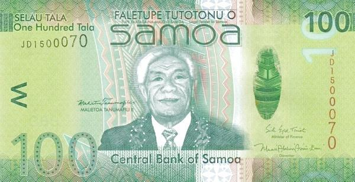

The Samoan Tala (WST) serves as the official currency of the Independent State of Samoa, a nation known for its rich cultural heritage and a resilient economy largely based on agriculture, tourism, and remittances. Established in 1967 to replace the New Zealand pound, the Tala represents not just a monetary unit but a symbol of national identity and economic sovereignty. Its introduction marked a significant step in Samoa's post-independence journey, empowering the country to exercise greater control over its monetary policy and economic planning.

The Tala's stability over the decades reflects Samoa's steady economic environment, managed effectively by the Central Bank of Samoa. This stability is crucial not only for domestic transactions but also for international trade and foreign exchange markets. As global financial systems grow increasingly complex, the need to understand the implications of such a currency on international trade becomes vital.



Moreover, the rise of algorithmic trading has revolutionized the way currencies are traded across global platforms. Employing computer algorithms to automate trading decisions, this method enhances efficiencies and precision in the Forex market. When applied to the Samoan Tala, algorithmic trading presents both opportunities and challenges for traders. It allows for rapid analysis of market trends and the swift execution of trades, a necessity in the dynamic world of currency markets.

Understanding the intricate balance between these technological advancements and the economic context of the Samoan Tala is essential for any trader or investor looking to engage in the Samoan market. This article aims to provide a comprehensive overview of these interconnections, offering readers valuable insights to navigate the complexities of trading and transacting in WST effectively using modern financial technologies.

## Table of Contents

## Understanding the Samoan Tala (WST)

The Samoan Tala (WST) is the official currency of Samoa, introduced in 1967, replacing the New Zealand pound. This transition marked a significant milestone in Samoa's economic history, granting the nation monetary sovereignty. The Tala is subdivided into 100 sene and is commonly symbolized as T or WS$, facilitating its usage in financial transactions domestically and internationally.

Administration of the Tala falls under the jurisdiction of the Central Bank of Samoa. The bank is tasked with maintaining the currency's stability, supporting Samoa's economic environment, and influencing its relationship with global financial markets. The Tala's exchange rate has historically demonstrated stability, suggesting a reflection of the country's consistent economic performance. This stability is critical as it helps in fostering confidence among investors and stakeholders who engage in financial dealings with Samoa.

The design of Samoan Tala banknotes carries significant cultural weight. Each banknote is adorned with images that underscore the rich cultural heritage of Samoa. These depictions range from traditional Samoan symbols to historical figures and motifs that celebrate its identity and history. The intent behind these designs is to instill national pride and preserve the cultural narratives that define Samoa.

In sum, the Samoan Tala serves not only as a medium of exchange but also as a symbol of national identity and economic autonomy. Its administration by the Central Bank of Samoa underscores the country's commitment to sustainable economic management and cultural preservation.

## Economic Factors Influencing the Samoan Tala

The value of the Samoan Tala is intricately connected to Samoa's economic fabric, with agriculture, tourism, and remittances being the primary pillars underpinning the currency's strength. Agriculture forms the backbone of Samoa's economy, contributing significantly to GDP. Key agricultural exports such as fish products and fruit juices are vital in [earning](/wiki/earning-announcement) foreign exchange, thereby positively influencing the Tala's valuation. The export of these goods is dependent on international demand, which can be affected by global market trends and trade agreements. 

Tourism is another cornerstone of Samoa's economic landscape, providing substantial revenue inflow. The sector's contribution extends beyond direct earnings from tourism activities to include indirect support of local businesses and employment. The influx of visitors also enhances demand for the Tala, supporting its currency value. Moreover, globally competitive tourism offerings paired with effective marketing strategies have the potential to bolster this sector further, thereby strengthening the Tala.

Remittances from Samoans living abroad form a significant portion of national income, often matching or exceeding external trade revenues. These remittances provide a stable inflow of foreign currency, aiding in maintaining a balanced exchange rate for the Tala. Changes in economic conditions in countries with large Samoan expatriate communities could impact the flow of remittances, thus influencing the Tala's valuation.

Economic policies set by the government and the Central Bank of Samoa play crucial roles in stabilizing and fostering growth in these sectors. Inflation control measures, fiscal policies, and initiatives to boost productivity can affect consumer and investor confidence, thereby impacting the Tala's value. Furthermore, maintaining a favorable trade balance is essential for currency stability. A surplus could indicate strong export performance or effective import controls, while a deficit might suggest an overreliance on imports or underperformance in export sectors.

Inflation rates are critical as well; high inflation might erode the purchasing power of the Tala, necessitating adjustments in exchange rates or monetary policies to counteract this effect. By keeping inflation within manageable limits, the Central Bank can ensure sustained economic stability, which is pivotal for the Tala's strength.

In conclusion, the Samoan Tala is influenced by a multifaceted economic framework where agriculture, tourism, and remittances play substantial roles alongside economic policies and inflation management. All these factors collectively determine the currency's strength and stability on the global stage.

## Algorithmic Trading with the Samoan Tala

Algorithmic trading, a sophisticated method utilized by traders, involves deploying complex algorithms to automate the trading process. This approach enhances trading efficiency and minimizes human errors, offering significant advantages over manual trading. Traders working with the Samoan Tala (WST) can employ [algorithmic trading](/wiki/algorithmic-trading) to leverage the currency's stability within foreign exchange markets.

The primary advantage of algorithmic trading is its ability to rapidly analyze market trends and execute trades based on pre-set criteria. Algorithms, essentially a set of mathematical rules, process a multitude of market signals, including price movements, trading [volume](/wiki/volume-trading-strategy), and other economic indicators, in real-time. This rapid analysis allows traders to capitalize on trading opportunities that humans might miss due to slower processing speeds.

For example, in the context of trading the WST, a trader could develop an algorithm to identify favorable trading conditions. The algorithm might monitor the exchange rate of the Tala against major currencies like the US Dollar (USD) or the Euro (EUR), and execute buy or sell orders when the Tala's value surpasses a predetermined threshold. Such strategies can be expressed in Python with libraries like Pandas and NumPy to handle data, and libraries like TA-Lib for technical analysis.

```python
import pandas as pd
import talib

# Example data: exchange rates for the WST-USD
data = {"exchange_rate": [0.38, 0.39, 0.40, ...]}  # hypothetical exchange rate data
df = pd.DataFrame(data)

# Simple Moving Average as a decision criterion
df['SMA'] = talib.SMA(df['exchange_rate'], timeperiod=5)

# Buy signal: When current rate > SMA
df['signal'] = df['exchange_rate'] > df['SMA']

# Function to execute trade
def execute_trade(df):
    for index, row in df.iterrows():
        if row['signal']:
            print("Execute Buy Order at rate:", row['exchange_rate'])
        else:
            print("No trade")

execute_trade(df)
```

Additionally, algorithmic trading provides the capacity to simulate trades under different market conditions, also known as [backtesting](/wiki/backtesting). By utilizing historical data, traders can assess the potential success of their strategies before deploying them in real situations.

However, creating robust algorithms requires a profound understanding of both the technical aspects of algorithmic trading and the specific economic context of the Samoan Tala. Factors such as Samoa's economic health, policy changes, and global market trends all impact the currency exchange rates and must be considered when devising trading algorithms.

Algorithmic trading with the Samoan Tala presents opportunities to exploit the currency's stable performance in [forex](/wiki/forex-system) markets, making it an attractive option for traders focused on this currency. With a well-crafted strategy, supported by historical analysis and real-time data processing, traders can achieve highly refined trading decisions that mitigate risk and enhance profitability.

## Benefits and Risks of Algo Trading with WST

Algorithmic trading with the Samoan Tala (WST) offers both significant advantages and considerable risks. The implementation of sophisticated algorithms allows traders to achieve increased trading accuracy. Algorithms can process and analyze vast amounts of market data quickly, executing trades based on predefined criteria without the need for human intervention. This capability is particularly beneficial when dealing with the WST due to its stable historical performance, presenting unique opportunities for developing innovative trading strategies.

One key benefit of algorithmic trading is the ability to react almost instantaneously to market changes. Rapid execution of trades ensures that traders can capitalize on fleeting opportunities that may arise from currency fluctuations or economic indicators. Moreover, trading accuracy is enhanced as algorithms can be programmed to execute trades at the optimal price by considering multiple variables simultaneously, which would be challenging for a human trader to achieve manually.

The stable performance of the WST also adds to its allure for algorithmic trading. Its historical steadiness might attract traders seeking to minimize risk while experimenting with various algorithms designed to exploit minor market inefficiencies.

However, there are risks associated with algorithmic trading. Technological dependencies are a major concern; the reliability of trading outcomes heavily depends on the integrity and performance of the underlying software and infrastructure. Technical glitches, software bugs, or hardware failures can lead to significant financial losses.

Another risk lies in the potential for systemic errors within the algorithm setups. Poorly designed strategies or incorrect parameterization can result in trades being executed under unfavorable conditions, leading to a loss. Furthermore, the fast-paced nature of algorithmic trading means that errors can propagate quickly, amplifying potential losses if not detected and corrected promptly.

Understanding the regulatory backdrop is vital to mitigate risks. Different countries have varying regulations concerning algorithmic and foreign currency trading. Ensuring compliance with these regulations is essential to avoid legal complications and potential sanctions. Traders must stay informed about current laws and any changes, especially those impacting forex trading with the Tala, to manage risks effectively.

In summary, while algorithmic trading with the Samoan Tala offers enticing opportunities due to its benefits in accuracy and speed, careful consideration of associated risks and regulatory factors is crucial. By balancing these elements, traders can better position themselves to succeed in the niche market of WST trading.

## Practical Steps for Engaging in Tala Trading

Assessing current economic conditions and projections for Samoa forms the foundation for making informed trading decisions with the Samoan Tala. It is crucial to have a comprehensive understanding of Samoa's economic indicators such as GDP growth, inflation rates, and trade balances. Monitoring these indicators helps in predicting potential currency movements. Additionally, understanding Samoa's primary economic sectors—agriculture, tourism, and remittances—will provide insights into factors that might affect the Tala's value. For instance, fluctuations in global tourism trends or agricultural output can have significant impacts.

When engaging in forex activities involving the Tala, traders must utilize reliable forex platforms and tools. These platforms should offer accurate, real-time data and robust analytical tools. Such resources enable traders to execute trades efficiently and capitalize on market opportunities. Platforms like MetaTrader 4 or 5 are popular options, offering comprehensive charting tools and algorithmic trading capabilities. 

In addition to economic indicators, staying abreast of political developments is essential. Changes in Samoa's fiscal or monetary policies, political stability, and international relations can influence the Tala's exchange rate. Traders should regularly review updates from sources like the Central Bank of Samoa and reputable financial news outlets to remain informed of any developments that could impact the currency. By maintaining an awareness of these critical factors, traders can enhance their ability to anticipate changes in the Tala's value, thus improving their trading strategies.

Overall, successful engagement in Tala trading requires an informed approach supported by effective use of technology and timely information. Understanding and responding to economic and political signals are vital components of crafting a robust trading strategy.

## Conclusion

Trading the Samoan Tala, particularly through algorithmic strategies, offers a niche but potentially rewarding endeavor. The Tala's stability and representation of Samoa’s economic health make it an interesting currency for algorithmic traders seeking diversification. However, the journey is not without its challenges.

Investors must thoroughly understand the economic landscape of Samoa. The Samoan economy is influenced by several factors, such as agriculture, tourism, and remittances, with these sectors directly impacting the Tala's value. Traders need to stay informed about these economic drivers, including any fluctuations in tourism trends or changes in export volumes, as temporary disturbances can alter the currency's valuation.

The intricacies of algorithmic trading demand a deep comprehension of its mechanisms and potential pitfalls. Algorithmic strategies offer the advantages of rapid data processing and the capability to execute trades based on pre-determined criteria. However, the dependence on technology introduces risks such as algorithmic glitches and systemic errors. A sophisticated understanding of these systems is essential to mitigate such risks effectively.

Successful engagement in trading the Tala using algorithmic strategies requires meticulous planning and robust risk management practices. This includes setting precise algorithm parameters and closely monitoring trading environments to adjust strategies as needed. Traders must implement rigorous back-testing and validation of algorithms to ensure they function as intended under different market conditions.

Risk management also entails continuously assessing the regulatory environment. Foreign exchange markets are subject to change, and remaining compliant with evolving regulations is crucial to avoid legal repercussions. By maintaining a disciplined approach and staying informed, traders can potentially unlock the benefits of trading the Samoan Tala while mitigating associated risks.

## References & Further Reading

[1]: ["Algorithmic Trading: Winning Strategies and Their Rationale"](https://books.google.com/books/about/Algorithmic_Trading.html?id=WAlFDwAAQBAJ) by Ernest P. Chan

[2]: ["Advances in Financial Machine Learning"](https://www.amazon.com/Advances-Financial-Machine-Learning-Marcos/dp/1119482089) by Marcos Lopez de Prado

[3]: ["Machine Learning for Algorithmic Trading"](https://github.com/stefan-jansen/machine-learning-for-trading) by Stefan Jansen

[4]: ["Quantitative Trading: How to Build Your Own Algorithmic Trading Business"](https://www.amazon.com/Quantitative-Trading-Build-Algorithmic-Business/dp/1119800064) by Ernest P. Chan

[5]: ["Evidence-Based Technical Analysis: Applying the Scientific Method and Statistical Inference to Trading Signals"](https://www.amazon.com/Evidence-Based-Technical-Analysis-Scientific-Statistical/dp/0470008741) by David Aronson

[6]: Bergstra, J., Bardenet, R., Bengio, Y., & Kégl, B. (2011). ["Algorithms for Hyper-Parameter Optimization."](https://dl.acm.org/doi/10.5555/2986459.2986743) Advances in Neural Information Processing Systems 24.