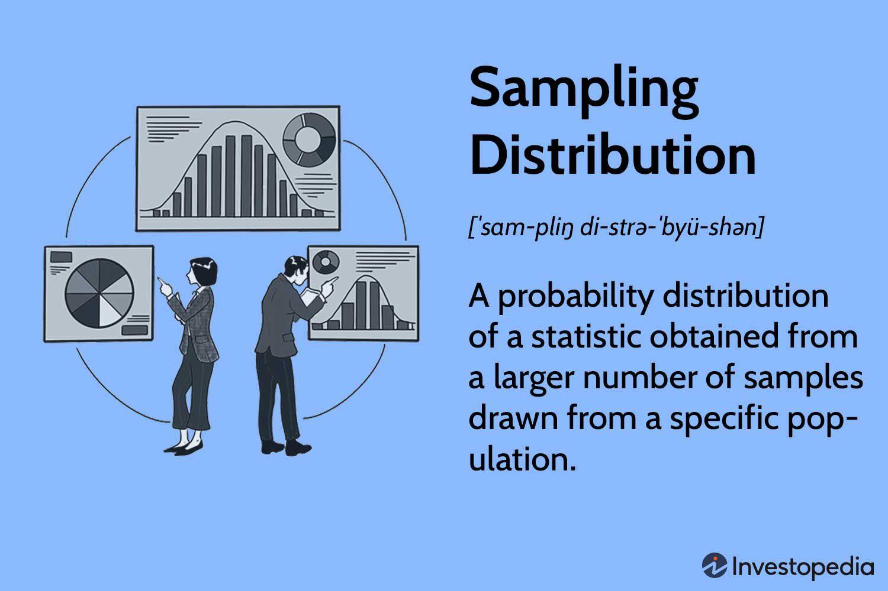

Algorithmic trading has increasingly become a cornerstone in the financial industry, enabling traders to execute orders with exceptional speed and efficiency. This sophisticated method relies heavily on statistical analysis to formulate data-driven strategies and make informed trading decisions. At the heart of this analytical process lies a profound understanding of sample distributions, which are essential for extracting meaningful insights from market data.

Sample distributions form the backbone of statistical inference in trading, allowing traders to predict market trends and assess risks with greater accuracy. By leveraging these statistical tools, traders can quantify uncertainties and optimize trading algorithms to adjust dynamically to various market conditions.



Moreover, algorithmic trading utilizes Monte Carlo simulations, a powerful probabilistic analysis technique. Monte Carlo methods enable the simulation of numerous scenarios to evaluate potential outcomes and assess the impact of uncertainty on trading strategies. This approach provides traders with a robust framework for understanding the complexities of market environments and making more reliable forecasts.

This article investigates how statistical sampling distributions and Monte Carlo simulations can be employed in algorithmic trading to refine strategies and enhance decision-making processes. We will present practical examples to demonstrate how these techniques support traders in navigating the unpredictable financial landscape.

## Table of Contents

## Understanding Statistical Sample Distributions

A sampling distribution is the probability distribution of a given statistic derived from a large number of samples drawn from a particular population. These distributions form the backbone for statistical inference in trading, enabling traders to make informed decisions based on data trends rather than mere speculation.

### Types of Sampling Distributions

**1. Mean Distribution:**
The sampling distribution of the mean occurs when a sample mean is calculated from repeated random samples of a population. This distribution is pivotal for traders aiming to determine the expected value of an asset's return over time. By analyzing the sample mean, traders can ascertain the average trend of asset prices, which is significant for long-term investment strategies.

The Central Limit Theorem (CLT) provides that the sampling distribution of the sample mean will tend to be normally distributed, regardless of the original population distribution, provided the sample size is sufficiently large. This theorem is mathematically expressed as:

$$
\bar{X} \sim N\left(\mu, \frac{\sigma}{\sqrt{n}}\right)
$$

where $\bar{X}$ is the sample mean, $\mu$ is the population mean, $\sigma$ is the population standard deviation, and $n$ is the sample size.

**2. Proportion Distribution:**
Proportion distributions involve the percentage of samples exhibiting a particular characteristic within a population. In trading, this can be exemplified by the proportion of profitable trades over a given period. Knowing the distribution of such a proportion allows traders to determine the likelihood of achieving a certain success rate in future trades. This can guide decisions on whether to pursue a certain strategy based on historical data.

**3. T-distribution:**
When the population standard deviation is unknown and the sample size is small, the T-distribution is more applicable than the normal distribution. This distribution is used in testing hypotheses concerning the population mean, especially when dealing with small sample sizes. In trading models, T-distributions are useful for estimating market [volatility](/wiki/volatility-trading-strategies) and assessing risks for assets where limited data is available, thereby providing a confidence interval for predictions.

### Relevance in Trading Models

Understanding these statistical constructs gives traders an advantage in anticipating market movements and developing data-driven strategies. For example, by utilizing the sampling distribution of the mean, traders can identify if a stock's price movement is part of a random fluctuation or a significant trend. 

In [algorithmic trading](/wiki/algorithmic-trading), these distributions enable quantitative models that automatically process vast amounts of market data, rendering real-time trading decisions that are statistically backed. By having precise statistical measures, trading algorithms can predict price movements with higher reliability and adjust strategies in response to changing market conditions.

Recognizing the importance of these distributions empowers traders to interpret past data more accurately and helps establish the trustworthiness of their predictive models. It reinforces the critical role of [statistics](/wiki/bayesian-statistics) in making sound, data-driven investment decisions, ultimately optimizing trading performance.

## Example Applications in Algo Trading

Algorithmic traders rely heavily on statistical sampling to effectively forecast market movements and simulate trading strategies under varied market conditions. This practice enhances the precision and efficacy of their decision-making processes.

### Example 1: Machine Learning and Sampling Distributions

Machine learning algorithms are integral to managing and analyzing large data sets within algorithmic trading. By utilizing sampling distributions, these algorithms can efficiently process vast amounts of financial data in real-time. Sampling distributions are essential in enabling these algorithms to generalize from data samples to the broader market dynamics, thus offering more accurate predictions and insights.

A practical application of this involves using resampling techniques like bootstrapping to estimate the sampling distribution of a statistic. This method provides insights into the estimate’s variability by repeatedly sampling from the data set with replacement, ensuring that the [machine learning](/wiki/machine-learning) model is both robust and capable of predicting real-world market behavior. For instance, bootstrapping can be used to evaluate the expected return of a trading strategy by simulating many subsets of historical data, thus providing an empirical distribution of potential returns.

Moreover, algorithms such as random forests or gradient boosting machines often incorporate sampling methods, helping in selecting diverse subsets of data during the training process. This process aids in improving the model's performance by reducing overfitting and enhancing its ability to handle the complexity of market movements.

### Example 2: T-Distribution and Market Volatility

In quantitative finance, estimating market volatility accurately is crucial for risk management and strategy development. The T-distribution, known for its thicker tails, is particularly useful in scenarios where the sample size is small, or the data exhibit heavy-tailed characteristics. By integrating T-distribution into their models, algorithmic traders can better estimate market volatility, which aids in developing and aligning strategies for futures trading.

A case study in employing T-distribution involves its application in beta estimation for portfolio management. Given historical returns data, a trader can model the returns using a T-distribution to account for extreme market conditions that occur infrequently but have significant impacts. The thicker tails of the T-distribution provide a more conservative estimate of risk, crucial for futures trading, where leverage can amplify losses.

For a practical implementation, consider using Python's `scipy.stats` library to fit a T-distribution to the returns data:

```python
import scipy.stats as stats
import numpy as np

# Example returns data
returns = np.random.normal(loc=0, scale=1, size=100)

# Fit a t-distribution to the data
params = stats.t.fit(returns)

# Output the estimated parameters
df, loc, scale = params
print(f"Degrees of Freedom: {df}, Location: {loc}, Scale: {scale}")
```

Using this fitted distribution, traders can simulate future returns and assess risk metrics such as Value at Risk (VaR) or Expected Shortfall, which are instrumental in the decision-making process for futures trading strategies.

In conclusion, algorithmic trading significantly benefits from incorporating statistical sampling methods. With the aid of machine learning and appropriate statistical distributions like the T-distribution, traders can enhance the accuracy of their forecasts, effectively manage risks, and build smarter, data-driven trading strategies.

## Monte Carlo Simulations: Enhancing Trading Strategies

Monte Carlo simulations are a crucial tool in evaluating the probability of various outcomes in trading strategies, considering both risk and uncertainty. This technique allows traders to create robust models by simulating thousands of scenarios, enabling them to assess probabilities for key metrics such as the risk of ruin, which is essential in capital allocation and risk management.

### Simulating Market Scenarios

In financial markets, where future price movements are highly uncertain, Monte Carlo simulations provide an effective method for forecasting by generating random samples from a specified probability distribution. These samples simulate potential market price paths, which can then be analyzed to determine the likelihood of different outcomes based on current market conditions and historical data.

#### Using Python for Monte Carlo Simulations

Python, with its extensive libraries, is particularly suited for conducting Monte Carlo simulations. One common application in trading is simulating the future price of a stock using Geometric Brownian Motion (GBM), a widely used model to describe stock price movements. Here is a simple example using Python:

```python
import numpy as np
import matplotlib.pyplot as plt

# Parameters for the simulation
S0 = 100  # Initial stock price
mu = 0.1  # Expected return
sigma = 0.2  # Volatility
T = 1  # Time period in years
dt = 0.01  # Time step
N = int(T/dt)  # Number of steps
M = 1000  # Number of simulations

# Simulate stock prices
S = np.zeros((N, M))
S[0] = S0

for t in range(1, N):
    dW = np.random.normal(0, np.sqrt(dt), M)
    S[t] = S[t-1] * np.exp((mu - 0.5 * sigma**2) * dt + sigma * dW)

# Plot
plt.figure(figsize=(10, 6))
plt.plot(S)
plt.title('Simulated Stock Price Paths')
plt.xlabel('Time Steps')
plt.ylabel('Stock Price')
plt.show()
```

In this example, `S0` is the initial stock price, `mu` is the expected return, `sigma` is the volatility, `T` is the time period, and `dt` is the time increment. The code generates `M` price paths, allowing traders to analyze the distribution of potential outcomes for the stock price over time.

### Evaluating Risk of Ruin

One of the critical uses of Monte Carlo simulations in trading is evaluating the risk of ruin, which refers to the probability that a trading strategy will lead to significant losses. By simulating multiple market scenarios, traders can quantify the likelihood of their strategy underperforming, helping them to make more informed capital allocation decisions.

### Advantages in Portfolio Management

Monte Carlo simulations offer traders an enhanced ability to manage risk by providing a statistical framework to predict outcomes and measure them against risk tolerance levels. The method's adaptability allows it to incorporate various statistical distributions and real-world data, ensuring that simulations represent potential market conditions. By leveraging these simulations, traders can better forecast returns, optimize portfolio management, and improve trading performance in varied market environments.

Overall, Monte Carlo simulations provide a systematic and quantitative approach to understanding the complexities of market movements, equipping traders with the necessary tools to navigate uncertain financial landscapes with greater confidence.

## Pros and Cons of Using Statistical Analysis in Trading

Statistical analysis in trading marries the precision of algorithmic processes with the analytical power of statistics, offering traders significant advantages. One notable benefit is the rigor that statistics bring, which helps transform raw data into actionable insights. This process allows traders to enhance risk management by quantifying risks more accurately and devising strategies to mitigate them. For example, by utilizing statistical models, traders can identify anomalies or patterns that might indicate potential risks or opportunities, thus improving their decision-making process.

Moreover, statistical analysis provides a robust mechanism to test trading hypotheses. By leveraging techniques like regression analysis or hypothesis testing, traders can validate their strategies against historical data. This form of [backtesting](/wiki/backtesting) ensures that strategies have a sound statistical basis and are not merely derived from anecdotal evidence or intuition. The ability to identify statistically significant relationships in data sets is invaluable for crafting strategies that are theoretically sound and empirically validated.

However, the use of statistical analysis in trading is not without its drawbacks. A major challenge is the dependency on accurate historical data. The assumption that past market behavior will provide a reliable indicator of future conditions is fraught with risk. Market dynamics can change due to unforeseen factors, rendering historical models less predictive. This reliance can lead traders to make decisions based on outdated or irrelevant information.

Furthermore, the misuse of statistical tools can lead to overconfidence and potential pitfalls. One such issue is overfitting, where a model is too closely tailored to historical data and fails to generalize to new data. Overfitting often results in models that are overly complex and capture noise rather than genuine market signals. For example, a trader might develop a model that performs exceptionally well on historical data but fails to account for changes in market structure or behavior, leading to poor performance in live trading situations.

Misapplying statistical methodologies can also create a false sense of security. Traders might misinterpret statistical significance or make erroneous assumptions about the independence of variables without rigorous validation. This can result in misguided confidence in trading strategies, leading to substantial financial losses. It is crucial for traders to understand the limitations of statistical models and remain cautious about their applicability in ever-evolving markets.

In summary, while statistical analysis provides powerful tools for enhancing algorithmic trading strategies, it requires careful data handling and model validation. Traders must be aware of the limitations and potential pitfalls associated with statistical techniques to avoid being misled by overfitted or poorly applied models. By maintaining a critical approach and continuously adapting to new data, traders can better harness the benefits of statistical analysis in the pursuit of more effective trading strategies.

## Conclusion

Statistical analysis and sample distributions are crucial components for crafting algorithmic trading strategies that rely on data and exhibit robustness. By systematically employing statistical methodologies, traders can navigate uncertainty more effectively and predict potential market conditions with greater precision. These techniques, combined with simulations like Monte Carlo methods, allow for the quantification and visualization of risk, enabling a comprehensive understanding of varying market dynamics.

Through the practical application of these statistical tools, traders gain the advantage of forecasting possible market scenarios, which is pivotal for informed decision-making. This translates to a more strategic approach in portfolio management, where resources are allocated based on data-driven insights rather than intuition alone. For instance, by analyzing historical price data through a probabilistic lens, traders can identify patterns and trends that inform entry and [exit](/wiki/exit-strategy) strategies, hence refining their trading performances.

Additionally, the capability to simulate a multitude of potential outcomes equips traders to prepare for a variety of market conditions, enhancing flexibility and adaptability in their strategies. This foresight into possible fluctuations minimizes the risk of unforeseen losses and maximizes the potential for informed, timely reactions to market changes. Such preparation is essential for maintaining an edge in competitive trading environments.

Ultimately, embracing statistical analysis and sample distribution techniques places traders in a position to enhance their strategy's performance, ensuring they are robust under diverse market conditions. By coupling these approaches with contemporary computational tools, traders refine their ability to anticipate, respond, and thrive in an ever-evolving financial landscape.

## References & Further Reading

[1]: Bergstra, J., Bardenet, R., Bengio, Y., & Kégl, B. (2011). ["Algorithms for Hyper-Parameter Optimization."](https://dl.acm.org/doi/10.5555/2986459.2986743) Advances in Neural Information Processing Systems 24.

[2]: ["Advances in Financial Machine Learning"](https://www.amazon.com/Advances-Financial-Machine-Learning-Marcos/dp/1119482089) by Marcos Lopez de Prado

[3]: ["Evidence-Based Technical Analysis: Applying the Scientific Method and Statistical Inference to Trading Signals"](https://www.amazon.com/Evidence-Based-Technical-Analysis-Scientific-Statistical/dp/0470008741) by David Aronson

[4]: ["Machine Learning for Algorithmic Trading"](https://github.com/stefan-jansen/machine-learning-for-trading) by Stefan Jansen

[5]: ["Quantitative Trading: How to Build Your Own Algorithmic Trading Business"](https://www.amazon.com/Quantitative-Trading-Build-Algorithmic-Business/dp/1119800064) by Ernest P. Chan

[6]: Glasserman, P. (2004). ["Monte Carlo Methods in Financial Engineering."](https://link.springer.com/book/10.1007/978-0-387-21617-1) Springer.

[7]: Tsay, R. S. (2010). ["Analysis of Financial Time Series."](https://onlinelibrary.wiley.com/doi/book/10.1002/9780470644560) John Wiley & Sons.

[8]: Hull, J. C. (2018). ["Options, Futures, and Other Derivatives."](https://www.semanticscholar.org/paper/Options%2C-Futures%2C-and-Other-Derivatives-Hull/89bdee500c8623864fc9eb7a471546aa713acc44) Pearson. 

[9]: Haugh, M. B. (2004). ["Monte Carlo Methods in Finance."](https://www.sfu.ca/~rjones/bus864/readings/Haugh%20%282004%29%20Monte%20Carlo%20Framework.pdf) (pdf file) Columbia University Lecture Notes.

[10]: Ruppert, D. (2004). ["Statistics and Data Analysis for Financial Engineering."](https://link.springer.com/book/10.1007/978-1-4939-2614-5) Springer.