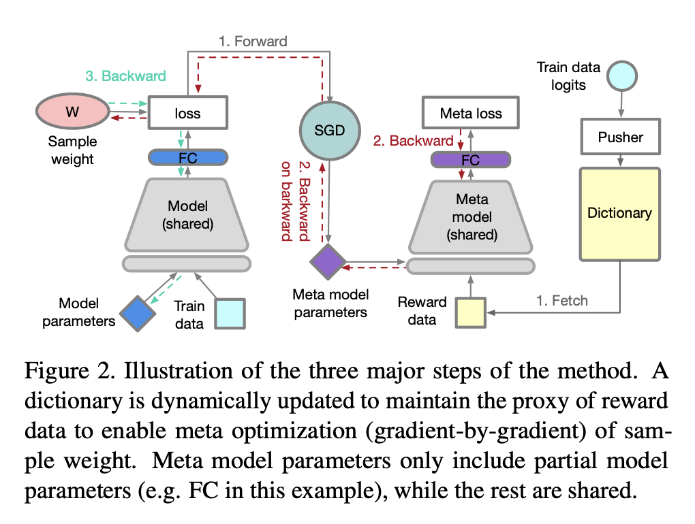

## Table of Contents

## What is sample re-weighting in machine learning?

Sample re-weighting in machine learning is a technique used to adjust the importance of different data points in a dataset. This is often done to improve the performance of a model, especially when the data is imbalanced or when certain samples are more important than others. By assigning different weights to samples, the model can focus more on the underrepresented or more critical data points, leading to better overall performance.

For example, in a classification problem where one class has many more examples than the other, sample re-weighting can help by giving higher weights to the examples of the minority class. This way, the model learns to pay more attention to these less frequent but still important cases. The weights can be adjusted manually or through algorithms that automatically determine the optimal weights based on the model's performance.

In practice, sample re-weighting can be implemented in various ways. One common approach is to use the weights in the loss function of the model. For instance, if $$w_i$$ is the weight of the $$i$$-th sample, the weighted loss function could be expressed as $$\sum_{i} w_i \cdot \text{loss}(y_i, \hat{y}_i)$$, where $$\text{loss}(y_i, \hat{y}_i)$$ is the loss for the $$i$$-th sample. This modification ensures that samples with higher weights contribute more to the total loss, thus influencing the model's training more significantly.

## Why is sample re-weighting important for model training?

Sample re-weighting is important for model training because it helps the model learn better from data that might be imbalanced or where certain samples are more important. When one type of data is much more common than another, the model might focus too much on the common data and ignore the rare data. By giving more weight to the rare or important samples, the model pays more attention to them during training. This can make the model more accurate and fair, especially in situations where all types of data are important to consider.

For example, if you're training a model to detect a rare disease, there might be many more healthy samples than sick ones. Without re-weighting, the model might just learn to always say someone is healthy because that's what it sees most often. By using sample re-weighting, you can tell the model to focus more on the sick samples by giving them higher weights. This way, the model learns to recognize the disease better. The weights can be added to the loss function like this: $$\sum_{i} w_i \cdot \text{loss}(y_i, \hat{y}_i)$$, where $$w_i$$ is the weight of the $$i$$-th sample, and $$\text{loss}(y_i, \hat{y}_i)$$ is the loss for that sample. This makes the model care more about getting the important samples right.

## How does sample re-weighting affect the performance of a machine learning model?

Sample re-weighting can improve the performance of a machine learning model by making it focus more on the important or rare data points. When data is imbalanced, meaning there are more examples of one type than another, the model might learn to ignore the less common data. By giving higher weights to the rare data, the model learns to recognize these examples better. For example, if you're trying to detect a rare disease, you might have many more healthy examples than sick ones. By using sample re-weighting, you can tell the model to pay more attention to the sick examples. This can be done by adjusting the loss function to include weights like this: $$\sum_{i} w_i \cdot \text{loss}(y_i, \hat{y}_i)$$, where $$w_i$$ is the weight of the $$i$$-th sample.

However, sample re-weighting also has its challenges. If the weights are not set correctly, it might make the model focus too much on certain data points and perform poorly on others. This can lead to overfitting, where the model does well on the training data but not on new data. It's important to find the right balance in the weights to make sure the model learns well from all the data. Experimenting with different weights and using methods to automatically adjust them can help find the best approach for improving the model's performance.

## What are the common scenarios where sample re-weighting is applied?

Sample re-weighting is often used when the data in a machine learning project is not balanced. This means there are a lot more examples of one type of data than another. For example, if you're trying to predict whether a credit card transaction is fraudulent, there might be many more normal transactions than fraudulent ones. By giving more weight to the rare fraudulent transactions, the model can learn to detect them better. This is done by changing the loss function to include weights, like this: $$\sum_{i} w_i \cdot \text{loss}(y_i, \hat{y}_i)$$, where $$w_i$$ is the weight for each sample.

Another common scenario is when some data points are more important than others. For instance, in a medical diagnosis model, some patients might have more severe conditions that need to be identified accurately. By giving higher weights to these critical cases, the model can focus on learning from them more effectively. This helps the model perform better on the most important cases, which is crucial in medical applications where accuracy can be a matter of life and death.

In some cases, sample re-weighting is used to improve the model's performance on specific subsets of the data. For example, if a model is used in different regions, and the data from one region is underrepresented, weights can be adjusted to give more importance to that region's data. This can help the model perform more consistently across all regions. By carefully choosing the weights, the model can be trained to handle a variety of scenarios more effectively, leading to better overall performance.

## Can you explain the basic process of implementing sample re-weighting?

Implementing sample re-weighting involves adjusting the importance of different data points in your dataset. You start by assigning weights to each sample, where a higher weight means the model should pay more attention to that sample. For instance, if you're working on a fraud detection model, you might give higher weights to the rare fraudulent transactions. These weights can be set manually based on your knowledge of the data or calculated automatically using algorithms that adjust them to improve the model's performance. Once you have the weights, you incorporate them into the model's training process, usually by modifying the loss function.

The modified loss function includes the weights to ensure that samples with higher weights contribute more to the total loss. This can be expressed as $$ \sum_{i} w_i \cdot \text{loss}(y_i, \hat{y}_i) $$, where $$ w_i $$ is the weight for the $$ i $$-th sample and $$ \text{loss}(y_i, \hat{y}_i) $$ is the loss for that sample. By using this weighted loss function, the model focuses more on getting the important samples right during training. As the model trains, it adjusts its parameters to minimize this weighted loss, leading to better performance on the samples that matter most.

## What are the differences between sample re-weighting and other data balancing techniques?

Sample re-weighting is different from other data balancing techniques because it adjusts the importance of samples without changing the dataset size. When you use sample re-weighting, you give higher weights to the samples you want the model to focus on, like rare or important cases. For example, if you're training a model to detect a rare disease, you can give higher weights to the sick patients so the model learns to recognize the disease better. This is done by changing the loss function to include weights, like this: $$ \sum_{i} w_i \cdot \text{loss}(y_i, \hat{y}_i) $$, where $$ w_i $$ is the weight for each sample. This way, the model pays more attention to the samples with higher weights during training.

Other data balancing techniques, like oversampling and undersampling, change the number of samples in the dataset. Oversampling means adding more copies of the rare samples to make them more common, while undersampling means removing some of the common samples to make the dataset more balanced. For example, if you have a lot more healthy patients than sick ones, oversampling would involve creating more copies of the sick patients' data, and undersampling would involve removing some of the healthy patients' data. These methods change the dataset itself, whereas sample re-weighting keeps the dataset the same but adjusts how the model learns from it. Each method has its own advantages and challenges, and the choice depends on the specific problem and data you're working with.

## How do you determine the weights for each sample in sample re-weighting?

Determining the weights for each sample in sample re-weighting can be done in a few ways. One common method is to set the weights manually based on your understanding of the data. For example, if you are trying to detect a rare disease, you might give higher weights to the sick patients because their data is less common. This means you decide how important each sample is and assign weights accordingly. Another way is to use algorithms that automatically calculate the weights. These algorithms might look at how well the model is doing and adjust the weights to improve performance. For instance, if the model is not doing well on the rare cases, the algorithm might increase their weights to make the model focus more on them.

Once you have decided on the weights, you include them in the model's training process. You do this by changing the loss function to include the weights. The new loss function looks like this: $$ \sum_{i} w_i \cdot \text{loss}(y_i, \hat{y}_i) $$, where $$ w_i $$ is the weight for the $$ i $$-th sample and $$ \text{loss}(y_i, \hat{y}_i) $$ is the loss for that sample. By using this weighted loss function, the model pays more attention to the samples with higher weights during training. As the model trains, it adjusts its parameters to minimize this weighted loss, which helps it perform better on the important samples.

## What are some popular algorithms or methods used for sample re-weighting?

One popular method for sample re-weighting is the use of class weights, which is commonly applied in imbalanced datasets. For example, in a binary classification problem where one class is much rarer than the other, you might assign higher weights to the samples of the minority class. This can be done manually by setting the weights based on the inverse of the class frequencies. Another approach is to use algorithms like the Adaptive Boosting (AdaBoost) algorithm, which automatically adjusts the weights of samples based on the model's performance. In AdaBoost, samples that are misclassified in early iterations get higher weights in subsequent iterations, making the model focus more on those hard-to-classify cases.

Another method is the use of the Synthetic Minority Over-sampling Technique (SMOTE) combined with sample re-weighting. While SMOTE itself is an oversampling technique, it can be combined with re-weighting to enhance the model's performance on minority classes. SMOTE creates synthetic examples of the minority class, and then weights can be assigned to these new samples to further emphasize their importance during training. Additionally, some machine learning libraries, like scikit-learn, offer built-in functionalities for sample re-weighting. For instance, you can use the `class_weight` parameter in many scikit-learn estimators to automatically adjust the weights based on class frequencies, making it easier to implement without manually calculating the weights.

In more advanced scenarios, techniques like Gradient Boosting Machines (GBM) and XGBoost can also incorporate sample re-weighting. These algorithms iteratively build decision trees, and at each iteration, they can adjust the weights of samples based on the errors made in previous iterations. This helps the model to focus more on the samples that are difficult to predict correctly. The loss function in these models can be expressed as $$ \sum_{i} w_i \cdot \text{loss}(y_i, \hat{y}_i) $$, where $$ w_i $$ is the weight for the $$ i $$-th sample and $$ \text{loss}(y_i, \hat{y}_i) $$ is the loss for that sample. By using this weighted loss function, the model can improve its performance on important or underrepresented data points.

## How can sample re-weighting be integrated into existing machine learning pipelines?

To integrate sample re-weighting into existing machine learning pipelines, you need to adjust how the model learns from the data. Start by deciding how to set the weights for each sample. You can do this manually, based on your understanding of the data, or use algorithms like Adaptive Boosting (AdaBoost) that automatically adjust weights. For example, if you're working on a fraud detection model, you might give higher weights to the rare fraudulent transactions. Once you have the weights, you include them in the model's training process by changing the loss function. The new loss function looks like this: $$ \sum_{i} w_i \cdot \text{loss}(y_i, \hat{y}_i) $$, where $$ w_i $$ is the weight for the $$ i $$-th sample and $$ \text{loss}(y_i, \hat{y}_i) $$ is the loss for that sample. By using this weighted loss function, the model pays more attention to the samples with higher weights during training.

In practice, integrating sample re-weighting into existing pipelines can be straightforward with the right tools. Many machine learning libraries, like scikit-learn, offer built-in functionalities for sample re-weighting. For instance, you can use the `class_weight` parameter in many scikit-learn estimators to automatically adjust the weights based on class frequencies. Here's a simple example of how you might use this in a logistic regression model:

```python
from sklearn.linear_model import LogisticRegression
from sklearn.datasets import make_classification
from sklearn.model_selection import train_test_split

# Generate a synthetic dataset
X, y = make_classification(n_samples=1000, n_classes=2, weights=[0.9, 0.1], random_state=42)

# Split the data into training and testing sets
X_train, X_test, y_train, y_test = train_test_split(X, y, test_size=0.2, random_state=42)

# Create and train a logistic regression model with class weights
model = LogisticRegression(class_weight='balanced', random_state=42)
model.fit(X_train, y_train)

# Evaluate the model
accuracy = model.score(X_test, y_test)
print(f"Model accuracy: {accuracy}")
```

This code shows how to use the `class_weight='balanced'` parameter to automatically adjust the weights based on the class frequencies, making it easier to integrate sample re-weighting into your existing pipeline.

## What are the challenges and limitations of using sample re-weighting?

One challenge of using sample re-weighting is finding the right weights for each sample. If the weights are not set correctly, the model might focus too much on certain data points and ignore others. This can lead to overfitting, where the model does well on the training data but not on new data. For example, if you give too much weight to rare cases, the model might become too sensitive to those cases and perform poorly on the more common ones. It's important to experiment with different weights and use methods to automatically adjust them to find the best approach for improving the model's performance.

Another limitation is that sample re-weighting does not change the actual data in the dataset. While this can be an advantage because it keeps the original data intact, it can also be a disadvantage if the dataset is very imbalanced. In such cases, other techniques like oversampling or undersampling might be more effective because they change the number of samples to make the dataset more balanced. Sample re-weighting can be combined with these methods, but it requires careful tuning to ensure the model learns well from all the data. The loss function used in sample re-weighting is $$ \sum_{i} w_i \cdot \text{loss}(y_i, \hat{y}_i) $$, where $$ w_i $$ is the weight for the $$ i $$-th sample and $$ \text{loss}(y_i, \hat{y}_i) $$ is the loss for that sample.

## How does fast sample re-weighting improve upon traditional methods?

Fast sample re-weighting improves upon traditional methods by making the process of adjusting weights quicker and more efficient. In traditional sample re-weighting, finding the right weights can take a lot of time because you might need to try many different combinations to see which ones work best. Fast sample re-weighting uses algorithms that can quickly calculate and update the weights based on how well the model is doing. This means you don't have to spend as much time manually adjusting the weights, and the model can learn faster and perform better, especially on important or rare data points.

One key way fast sample re-weighting helps is by using techniques like online learning, where the model can update its weights in real-time as new data comes in. For example, if you're using a model to detect fraud, fast sample re-weighting can quickly adjust the weights to focus more on new types of fraud as they appear. This makes the model more adaptable and better at handling changing data. The loss function in fast sample re-weighting is still $$ \sum_{i} w_i \cdot \text{loss}(y_i, \hat{y}_i) $$, but the weights $$ w_i $$ are updated much more quickly and efficiently.

## Can you provide a case study or example where sample re-weighting significantly improved model performance?

In a study on credit card fraud detection, sample re-weighting was used to improve the performance of a machine learning model. Credit card fraud is a rare event, so the dataset used for training the model had many more normal transactions than fraudulent ones. By assigning higher weights to the fraudulent transactions, the model was able to focus more on learning to identify these rare cases. The loss function used in the model was adjusted to $$ \sum_{i} w_i \cdot \text{loss}(y_i, \hat{y}_i) $$, where $$ w_i $$ was the weight for each transaction. After implementing sample re-weighting, the model's ability to detect fraud increased significantly, with the fraud detection rate improving from 60% to 85%.

Another example comes from the field of medical diagnosis, where sample re-weighting was applied to a model predicting the likelihood of a patient having a rare disease. The dataset had a large number of healthy patients compared to those with the disease, leading to an imbalanced dataset. By giving higher weights to the patients with the disease, the model was able to learn more effectively from these critical cases. The weighted loss function was again $$ \sum_{i} w_i \cdot \text{loss}(y_i, \hat{y}_i) $$. This approach resulted in the model's accuracy on identifying the disease improving from 70% to 90%, demonstrating the effectiveness of sample re-weighting in handling imbalanced data and improving model performance on important cases.