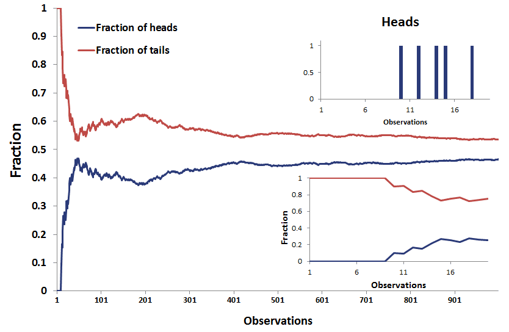

## Table of Contents

## What is sample size neglect?

Sample size neglect is when people don't pay attention to how many people were in a study or survey. They might think the results are important even if only a few people were asked. For example, if a survey says 90% of people like a new product, but only 10 people were surveyed, the result might not be reliable. People should look at the sample size to know if the results are trustworthy.

This problem can lead to wrong decisions. If someone believes a small survey and makes a big choice based on it, they might be disappointed later. It's important to check how many people were included in a study before deciding if the results are useful. By understanding sample size, people can make better choices and avoid being misled by small or unrepresentative samples.

## Why is sample size important in statistical analysis?

Sample size is important in statistical analysis because it helps us know how reliable our results are. When we study a small group of people, our findings might not represent everyone. For example, if we survey only 10 people about their favorite ice cream flavor, the results might not show what most people like. A larger sample size, like surveying 1,000 people, gives us a better idea of what the whole population thinks or does.

A bigger sample size also makes our results more accurate. When we have more data, we can be more sure that our findings are correct and not just a fluke. Imagine flipping a coin 10 times versus 1,000 times. With 10 flips, you might get mostly heads by chance, but with 1,000 flips, the results will be closer to the true 50-50 chance. So, using a larger sample size helps us trust our statistical conclusions more and make better decisions based on them.

## How does sample size neglect affect decision-making?

When people don't pay attention to how many people were in a study, they might make bad choices. If someone reads a survey that says 90% of people love a new product, but only 10 people were asked, they might think everyone will like it too. But because the sample size is small, the results might not be true for everyone. This can lead to buying things that aren't popular or making plans based on wrong information.

Ignoring sample size can also make people trust unreliable data. For example, if a small study says a new medicine works well, someone might decide to use it without knowing if it's really safe or effective for most people. This can lead to health risks or wasting money. By always checking the sample size, people can make better decisions and avoid being misled by small or unrepresentative studies.

## What are the common scenarios where sample size neglect occurs?

Sample size neglect often happens when people read news articles or social media posts about surveys or studies. For example, a news headline might say "80% of people support a new law," but if only 20 people were surveyed, the result might not be true for everyone. People might share this news without checking how many people were asked, leading to wrong ideas about what most people think.

Another common scenario is in marketing and product reviews. A company might say "95% of customers love our product," but if they only asked 10 customers, the claim might not be reliable. People might buy the product thinking it's popular, but they could be disappointed if it's not as good as the small survey suggested. Checking the sample size can help people make better choices about what to buy.

In healthcare, sample size neglect can also be a problem. A small study might claim a new treatment is very effective, and people might choose it over other options without knowing if it's really safe or works for most people. This can lead to health risks if the treatment isn't as good as the small study suggested. Always looking at the sample size can help people make safer and more informed health decisions.

## Can you explain the psychological mechanisms behind sample size neglect?

Sample size neglect happens because people often focus on the results of a study without thinking about how many people were included. When someone reads that "90% of people like a new product," they might get excited and believe it's true for everyone. But if only a few people were asked, the result might not be reliable. People tend to be swayed by big numbers and percentages without checking how many people those numbers come from. This is because our brains like to see clear, simple results and often ignore the details that show how good those results really are.

Another reason for sample size neglect is that people often trust what they see in the news or on social media without questioning it. When a headline says something like "80% of people support a new law," it sounds important and people might share it without looking at the sample size. This is because checking the details takes more effort, and people usually want quick and easy information. So, they might make decisions based on small studies that don't represent everyone, leading to mistakes in what they believe or choose to do.

## How can sample size neglect be identified in research studies?

Sample size neglect can be identified in research studies by looking at how many people were included in the study. If a study claims big results but only a few people were asked, that's a sign of sample size neglect. For example, if a study says "90% of people like a new product" but only 10 people were surveyed, the results might not be trustworthy. A good way to spot this is to always check the sample size mentioned in the study or the methods section of a research paper.

Another way to identify sample size neglect is by comparing the sample size to the population being studied. If the sample is very small compared to the whole group, the results might not represent everyone. For example, if a study about a country's opinion only surveyed 50 people out of millions, it's likely not a good reflection of what most people think. By always looking at how many people were included and comparing it to the total group, you can tell if a study might be ignoring the importance of sample size.

## What are the consequences of ignoring sample size in data analysis?

Ignoring sample size in data analysis can lead to wrong conclusions. When a study only includes a few people, the results might not be true for everyone. For example, if a survey says 90% of people like a new product but only 10 people were asked, you might think everyone will like it too. But the small sample size means the results might not represent what most people think. This can cause people to make bad choices, like buying a product that isn't popular or supporting a policy that most people don't agree with.

These wrong conclusions can also lead to wasted time and money. If a business decides to sell a new product based on a small survey, they might spend a lot on making and advertising it, only to find out later that most people don't want it. In healthcare, using a treatment that a small study says is good can be risky if it doesn't work well for most people. By always checking the sample size, people can make better decisions and avoid being misled by small or unrepresentative studies.

## How can one mitigate the effects of sample size neglect?

To reduce the effects of sample size neglect, always check how many people were included in a study before believing its results. If a study says something big but only a few people were asked, be careful. Look for the sample size in the report or article. If it's not there, try to find out more before making a decision. This way, you can tell if the results are likely to be true for everyone or just a small group.

Another way to lessen the impact of sample size neglect is to compare the sample size to the whole group being studied. If the sample is very small compared to the total number of people, the results might not represent everyone. For example, if a study about a country's opinion only surveyed 50 people out of millions, it's probably not a good reflection of what most people think. By always thinking about how big the sample is compared to the whole group, you can make better choices and avoid being misled by small studies.

## What are some real-world examples where sample size neglect led to incorrect conclusions?

In 2016, a small survey in the United States suggested that a new diet could help people lose weight quickly. The survey only asked 20 people, but the results were shared widely on social media. Many people tried the diet thinking it would work for them too. But because the sample size was so small, the diet didn't work for most people, and they were disappointed. If more people had checked how many people were in the study, they might not have believed the diet would work for everyone.

Another example happened in 2012 when a small study claimed that a certain type of herbal supplement could boost memory. Only 30 people were in the study, but the results were reported in the news. Many people bought the supplement hoping it would help them remember things better. Later, larger studies showed that the supplement didn't work for most people. If people had looked at the sample size of the first study, they might have waited for more proof before spending money on the supplement.

## How does sample size neglect relate to other cognitive biases?

Sample size neglect is closely related to other cognitive biases, like the availability heuristic and confirmation bias. The availability heuristic is when people make decisions based on the information that's easiest to remember. If someone reads a news story about a small survey saying a new product is popular, they might remember that story and think the product is good without checking how many people were asked. Confirmation bias is when people look for information that agrees with what they already believe. If someone wants to believe a new diet works, they might only pay attention to a small study that supports it and ignore the sample size, leading to wrong conclusions.

These biases can make sample size neglect worse. When people don't check the sample size, they might be more likely to believe results that fit with what they already think or what's easy to remember. This can lead to making choices based on small, unrepresentative studies. By understanding how these biases work together, people can be more careful and look at the sample size before deciding if a study's results are trustworthy.

## What statistical methods can be used to correct for sample size neglect?

One way to correct for sample size neglect is by using confidence intervals. Confidence intervals show how sure we can be about our results. If a study has a small sample size, the confidence interval will be wide, meaning there's a lot of uncertainty. By looking at the confidence interval, people can see if the results might be different with a bigger sample. If the interval is very wide, it's a sign that more people should be included in the study to get a better idea of what's true.

Another method is to use power analysis before starting a study. Power analysis helps decide how many people should be in the study to get reliable results. If a study is planned with a small sample size, power analysis can show that more people are needed to make sure the results are trustworthy. By using power analysis, researchers can avoid sample size neglect and make sure their studies have enough people to give good information.

## How can educational programs help in reducing sample size neglect among students and professionals?

Educational programs can help reduce sample size neglect by teaching people to always check how many people were in a study before believing its results. In school, teachers can explain what sample size means and why it's important. They can use examples to show how a small study might not tell the whole story. For example, if a survey says 90% of people like a new product but only 10 people were asked, it might not be true for everyone. By practicing with real studies and learning to look at the sample size, students can learn to make better choices based on reliable information.

For professionals, workshops and training sessions can focus on how to spot sample size neglect in their work. These programs can show how ignoring sample size can lead to wrong decisions and wasted resources. Professionals can learn to use tools like confidence intervals and power analysis to make sure their studies are trustworthy. By understanding these methods and always checking the sample size, they can avoid being misled by small or unrepresentative studies and make better decisions in their fields.

## What is Understanding Statistical Bias in Trading?

Statistical bias in trading refers to systematic errors that occur when a data set fails to accurately represent the entire population, leading to unreliable outcomes. This misrepresentation can mislead traders about actual market trends or the efficiency of a particular trading strategy. The issue of statistical bias is particularly critical in trading, where decisions must be grounded in rigorous data analysis to minimize financial risk and enhance performance.

Sample size neglect is a significant form of statistical bias, arising when the importance of a data sample's size is disregarded. In trading, this bias often leads to inadequate interpretations of market movements and strategy effectiveness. Consider a scenario where a trading algorithm is backtested on a small sample of historical data; the algorithm could exhibit satisfactory performance due to randomness rather than genuine predictive power. Traders might mistakenly perceive this performance as robust, ignoring the limited sample size and consequently making flawed investment decisions.

The neglect of sample size can be quantitatively understood through the principles of statistical inference. For example, when estimating the mean return of a stock, a larger sample provides more reliable estimates, reducing the standard error. The standard error (SE) can be calculated as:

$$
\text{SE} = \frac{\sigma}{\sqrt{n}}
$$

where $\sigma$ is the population standard deviation and $n$ is the sample size. A smaller $n$ results in a larger SE, indicating less precise estimates.

To illustrate the effects of sample size neglect, consider a trader analyzing a new strategy based on a limited dataset of 30 trades. The trader might observe an average profit that appears statistically significant. However, because the number of trades is small, the probability of this result reflecting true market behavior is reduced, increasing the risk of false positives.

An awareness of statistical biases, particularly sample size neglect, is essential for traders seeking dependable insights from data. Ensuring data samples adequately represent the broader financial market context enhances the validity of trading strategies and helps prevent erroneous conclusions that could lead to substantial financial losses.

## What is Sample Size Neglect?

Sample size neglect, a cognitive bias first identified by Tversky and Kahneman, refers to the erroneous interpretation of outcomes based on small or unrepresentative data samples. This bias can be particularly detrimental in the context of trading, where the accurate interpretation of data is vital for the development of effective trading strategies. 

The core issue with sample size neglect lies in the tendency to perceive patterns or trends in data samples that are too small to be statistically significant. Traders may erroneously base their strategies on this misleading information, mistaking short-term [volatility](/wiki/volatility-trading-strategies) for long-term trends. This misinterpretation is often due to the inherent random variability in small samples, which can produce apparent patterns that do not actually exist when considered in a larger context.

From a statistical standpoint, the Law of Large Numbers is fundamental when evaluating sample sizes. This principle states that as a sample size grows, its mean will tend to get closer to the average of the entire population. Thus, small samples may not accurately reflect the true characteristics of the population, leading to greater uncertainty and potential error in analysis.

For traders, this necessitates an emphasis on using sufficiently large data sets to enhance the validity of their statistical analyses. Inadequate sample sizes can lead to high variance and spurious relationships that may misguide trading decisions. For example, in a scenario where a trader analyzes daily stock prices from only a week of data, the conclusions drawn are likely to be highly volatile and unreliable, as opposed to a dataset spanning multiple years.

Mathematically, consider a simple hypothesis test where a trader wants to determine whether a given strategy significantly beats a benchmark. If $n$ is the sample size, a larger $n$ increases the power of the test—the ability to detect an actual effect. The formula for the standard error $SE$ of the mean is:

$$
SE = \frac{\sigma}{\sqrt{n}}
$$

where $\sigma$ is the population standard deviation. As the sample size $n$ increases, the standard error decreases, yielding a more precise estimate of the population parameter.

In practice, traders should aim to collect and analyze more extensive data over varied market conditions to avoid the pitfalls of sample size neglect. Incorporating robust statistical methods and algorithms that emphasize sample size sufficiency will improve their ability to identify true market trends and optimize trading strategies effectively.

## References & Further Reading

[1]: Tversky, A., & Kahneman, D. (1971). ["Belief in the law of small numbers."](http://stats.org.uk/statistical-inference/TverskyKahneman1971.pdf) Psychological Bulletin, 76(2), 105-110.

[2]: Taleb, N. N. (2007). ["The Black Swan: The Impact of the Highly Improbable."](https://archive.org/details/10.1.1.695.4305) Random House.

[3]: Silver, N. (2012). ["The Signal and the Noise: Why So Many Predictions Fail—but Some Don't."](https://archive.org/details/signalnoisewhymo00silv) Penguin Books.

[4]: Kahneman, D. (2011). ["Thinking, Fast and Slow."](https://psycnet.apa.org/record/2011-26535-000) Farrar, Straus and Giroux.

[5]: Jorion, P. (2006). ["Value at Risk: The New Benchmark for Managing Financial Risk."](https://books.google.com/books/about/Value_at_Risk_3rd_Ed.html?id=nnblKhI7KP8C) McGraw-Hill Education.

[6]: Aronson, D. (2006). ["Evidence-Based Technical Analysis: Applying the Scientific Method and Statistical Inference to Trading Signals."](https://www.amazon.com/Evidence-Based-Technical-Analysis-Scientific-Statistical/dp/0470008741) Wiley.

[7]: Lopez de Prado, M. (2018). ["Advances in Financial Machine Learning."](https://www.amazon.com/Advances-Financial-Machine-Learning-Marcos/dp/1119482089) Wiley.

[8]: Chan, E. P. (2009). ["Quantitative Trading: How to Build Your Own Algorithmic Trading Business."](https://github.com/ftvision/quant_trading_echan_book) Wiley.