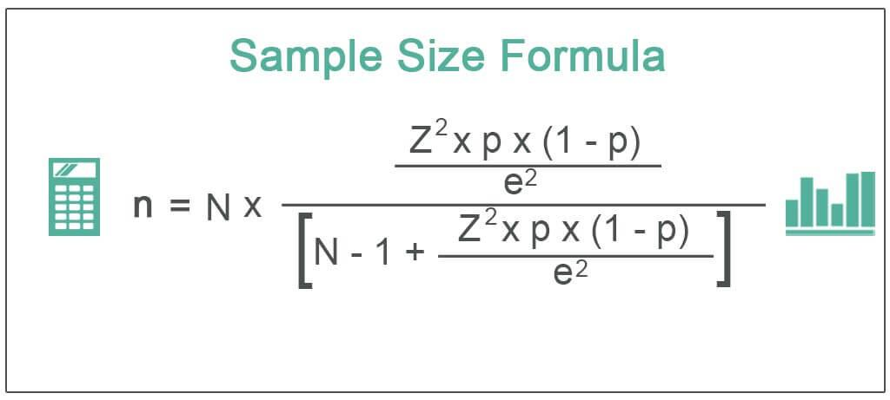

Algorithmic trading, commonly known as algo trading, has surged in popularity due to its capacity to execute trades with speed and precision, leveraging complex algorithms to make data-driven decisions. Central to the efficacy of algorithmic trading is the sample size used in backtesting and strategy development. The sample size plays a pivotal role in determining the accuracy and robustness of trading strategies, directly impacting the reliability of results obtained during backtesting.

This article examines the critical importance of sample size within algorithmic trading, with a focus on determining the optimal sample size for various trading strategies. Achieving the right sample size fosters strategic optimization, reduces risk exposure, and boosts performance outcomes. Inadequate sample sizes can lead to erroneous conclusions, such as overfitting, where a strategy appears profitable based on historical data but fails in live markets.



We will explore key principles related to sample sizes, such as statistical power analysis, and the significance of achieving statistical significance when fine-tuning trading algorithms. A robust sample size is essential for ensuring realistic simulations of a strategy's historical performance, enabling traders to make informed decisions.

By the conclusion of this article, readers will gain insights into accurate sample size calculations, leading to enhanced backtesting reliability and more effective strategy development. This understanding is vital for traders seeking to refine their trading approach and maintain a competitive advantage in the fast-evolving landscape of algorithmic trading.

## Table of Contents

## Why Sample Size Matters in Algo Trading

Sample size is a critical component in [algorithmic trading](/wiki/algorithmic-trading) for several reasons. It directly impacts the reliability and validity of trading strategies, ensuring that the results of [backtesting](/wiki/backtesting) and other assessments provide an accurate representation of a strategy's potential performance.

Larger sample sizes tend to yield more statistically significant results, reducing the likelihood that observed outcomes are due to random chance rather than genuine effects. This can be expressed mathematically using statistical measures, such as the p-value, which indicates the probability of obtaining an effect at least as extreme as the one observed, assuming the null hypothesis is true. Mathematically, this can be represented as:

$$
P(\text{Data} | \text{Null Hypothesis})
$$

As the sample size increases, the standard error decreases, making the estimates of the population parameter more precise. The standard error ($SE$) is calculated as:

$$
SE = \frac{\sigma}{\sqrt{n}}
$$

where $\sigma$ is the standard deviation of the population, and $n$ is the sample size. A smaller standard error implies a more accurate reflection of the population, providing greater confidence in the findings of the backtesting process.

Inadequate sample size can lead to several issues, including overfitting, where a strategy performs exceptionally well on historical data but fails in real-world scenarios due to its excessive complexity or reliance on specific dataset anomalies. This is because a small sample size may not encapsulate the full variability in market conditions, leading to strategies that are tailored too closely to the sample data. The consequence is false conclusions about a strategy's effectiveness, which can be financially disastrous when the strategy is implemented live.

Understanding and determining the correct sample size help avoid these pitfalls by ensuring that backtesting accurately reflects a strategy's viability across different periods and market conditions. This understanding is crucial not just for accuracy but also for minimizing risks associated with financial loss. An adequately-sized sample provides a robust framework for decision-making, thereby safeguarding capital against abrupt market changes.

The accuracy of backtesting results directly correlates with the sample size, playing a vital role in a strategy's simulated historical performance. A well-calibrated sample size means that traders can rely on their backtest outputs to guide trading decisions, ensuring confidence in both the strategy's design and its application in live trading environments.

Overall, determining the appropriate sample size is an essential part of ensuring that an algorithmic trading strategy is both reliable and effective, ultimately contributing to more sustainable financial outcomes and strategic success.

## Determining Sample Size Using Statistical Power Analysis

Statistical power analysis is instrumental in determining the appropriate sample size for algorithmic trading strategies. It provides a framework for estimating the likelihood of detecting a true effect within a dataset, thereby ensuring that the sample size is neither excessively large nor inadequately small. Achieving this balance is crucial for both the precision of the analysis and the conservation of resources.

Central to power analysis are three key concepts: effect size, significance level, and statistical power. The effect size measures the magnitude of the difference or relationship that the analysis aims to detect. A larger effect size generally requires a smaller sample size to detect, while a smaller effect size necessitates a larger sample size due to the subtler nature of the difference.

The significance level, often denoted as alpha (α), represents the probability of rejecting the null hypothesis when it is true. Commonly set at 0.05, it indicates a 5% risk of a Type I error—incorrectly concluding that an effect exists. Balancing the significance level with an appropriate sample size prevents overestimating the reliability of a trading strategy while managing the risk of false positives.

Statistical power, typically set at 0.80 or higher, indicates the probability of correctly rejecting the null hypothesis when a true effect is present. High statistical power reduces the likelihood of a Type II error, which is failing to detect an effect when it actually exists. This is particularly important in trading, where missed signals can result in overlooked opportunities.

To [carry](/wiki/carry-trading) out a power analysis, traders can apply Python-based statistical libraries such as `statsmodels` or `SciPy`. Here's a basic example using `statsmodels` to calculate sample size:

```python
from statsmodels.stats.power import TTestIndPower

# Parameters for power analysis
effect_size = 0.5  # anticipated effect size
alpha = 0.05       # significance level
power = 0.8        # desired power

# Initialize power analysis object
analysis = TTestIndPower()

# Calculate sample size required
required_sample_size = analysis.solve_power(effect_size=effect_size, alpha=alpha, power=power)
print(f'Required sample size: {required_sample_size}')
```

Through statistical power analysis, traders can refine their sample sizes to ensure that their backtesting and optimization processes are as efficient and effective as possible. This ensures that trading strategies are based on robust and statistically significant results, ultimately leading to better decision-making and resource allocation in algorithmic trading.

## Challenges and Solutions in Sample Size Determination

Determining the appropriate sample size in algorithmic trading presents several challenges, particularly due to the inherent [volatility](/wiki/volatility-trading-strategies) and ever-changing conditions of financial markets. Market volatility can cause fluctuations in asset prices, making it difficult to determine a sample size that accurately reflects a strategy's performance across various conditions. Additionally, changing market conditions—such as economic shifts, geopolitical events, or sudden regulatory changes—can all influence market dynamics, further complicating sample size determination.

One solution to address these challenges is the incorporation of robust statistical techniques that can mitigate the impact of such variances. For example, traders can utilize bootstrapping methods, which involve repeatedly resampling a dataset with replacement to estimate the distribution of a statistic. This technique allows traders to better assess the variability of their trading strategy's performance, providing more consistent and reliable results even in volatile markets.

Moreover, traders can consider using rolling window analysis to adjust sample sizes dynamically. This method involves applying the trading strategy to a moving window of data, which continuously updates as new data becomes available. By doing so, traders can ensure that their sample sizes are responsive to recent market conditions, thereby maintaining the effectiveness of their strategies over time.

In practical terms, traders may employ code to implement such techniques. For instance, in Python, one could use libraries like `pandas` and `numpy` to perform bootstrapping and rolling window analysis. Here is a simple example:

```python
import pandas as pd
import numpy as np

# Example of a rolling window calculation
data = pd.Series(np.random.randn(1000))  # Simulated market data
window_size = 50  # Define the rolling window size

rolling_mean = data.rolling(window=window_size).mean()  # Calculate rolling mean

# Example of bootstrapping
bootstrap_samples = 1000
sample_means = []

for _ in range(bootstrap_samples):
    sample = np.random.choice(data, size=len(data), replace=True)
    sample_means.append(np.mean(sample))

# Calculate confidence intervals from bootstrapped means
confidence_interval = np.percentile(sample_means, [2.5, 97.5])
```

Traders should continuously evaluate and refine their approaches in response to evolving market dynamics. This may include testing strategies over different time periods, performing stress testing under various simulated market scenarios, and remaining vigilant to external market influences. By proactively adjusting their sample size calculations in line with market conditions, traders can better manage risk and enhance the robustness of their trading strategies.

## Practical Tips for Traders

Traders engaging in algorithmic trading should prioritize the regular assessment and adjustment of their sample size requirements. This ongoing evaluation is crucial because trading strategies need to align with both specific strategic objectives and prevailing market conditions, which are often subject to rapid changes. By optimizing sample size, traders can bolster the statistical reliability of their backtesting results, consequently minimizing risks associated with overfitting or underfitting their models.

To achieve accurate sample size calculations, leveraging robust statistical software is essential. Software such as R, Python's SciPy, or dedicated trading platforms equipped with statistical tools can facilitate sophisticated analyses, providing traders with more precise insights. Moreover, staying updated on new analytical techniques is beneficial. The field of [statistics](/wiki/bayesian-statistics) and data analysis is continually evolving, with new methodologies and algorithms being developed that can further improve sample size precision and analytical accuracy.

An empirical approach is also recommended for traders aiming to refine their strategies. This involves rigorously testing and analyzing results across various market environments to understand the nuances that different conditions impose on strategy performance. By comparing performance metrics such as the Sharpe ratio, maximum drawdown, or alpha generation under differing conditions, traders can identify patterns and potential adjustments to their strategies. 

This empirical testing can be systematically implemented using a framework that iterates over various market scenarios. For example, in Python, a trader might utilize backtesting libraries to run simulations under multiple market datasets, adjusting sample sizes accordingly and evaluating performance metrics against predefined success criteria. Ultimately, such a methodical approach allows for the continuous optimization of trading strategies, ensuring robustness and adaptability in an ever-changing market landscape.

## Conclusion

Understanding the importance of sample size in algorithmic trading is essential for crafting strategies that are both reliable and effective. A well-determined sample size allows traders to mitigate risks associated with small data sets, such as overfitting and false positives. By employing statistical power analysis, traders can ascertain the probability of correctly detecting true effects within their trading strategies, thus ensuring that the chosen sample size is neither too small nor excessively large. This approach not only enhances the robustness of the results but also optimizes the use of resources.

Statistical power analysis utilizes key concepts like effect size, significance level, and statistical power. Traders can apply these concepts to strike an optimal balance between precision and resource efficiency. For instance, choosing an appropriate effect size—often determined by domain knowledge and preliminary research—helps in configuring the sample size needed to detect meaningful changes in trading strategies. Python libraries like `statsmodels` can be employed to perform power analyses, providing practical tools for determining sample sizes.

Continual learning and adaptation to ever-changing market conditions are crucial for maintaining a competitive edge in algo trading. As markets evolve, so too should the parameters governing the determination of sample size. An adaptive approach, which involves revisiting and refining sample size calculations in light of new market data and technological advancements, will support long-term success.

Ultimately, accurate sample size determination serves as a cornerstone for success in algorithmic trading. By focusing on proper statistical methodologies and remaining agile in response to market shifts, traders can develop strategies that stand the test of time, ensuring both robustness and resilience in their trading endeavors.

## References & Further Reading

[1]: Bergstra, J., Bardenet, R., Bengio, Y., & Kégl, B. (2011). ["Algorithms for Hyper-Parameter Optimization."](https://dl.acm.org/doi/10.5555/2986459.2986743) Advances in Neural Information Processing Systems 24.

[2]: ["Advances in Financial Machine Learning"](https://www.amazon.com/Advances-Financial-Machine-Learning-Marcos/dp/1119482089) by Marcos Lopez de Prado

[3]: ["Evidence-Based Technical Analysis: Applying the Scientific Method and Statistical Inference to Trading Signals"](https://www.amazon.com/Evidence-Based-Technical-Analysis-Scientific-Statistical/dp/0470008741) by David Aronson

[4]: ["Machine Learning for Algorithmic Trading"](https://github.com/PacktPublishing/Machine-Learning-for-Algorithmic-Trading-Second-Edition) by Stefan Jansen

[5]: ["Quantitative Trading: How to Build Your Own Algorithmic Trading Business"](https://books.google.com/books/about/Quantitative_Trading.html?id=j70yEAAAQBAJ) by Ernest P. Chan