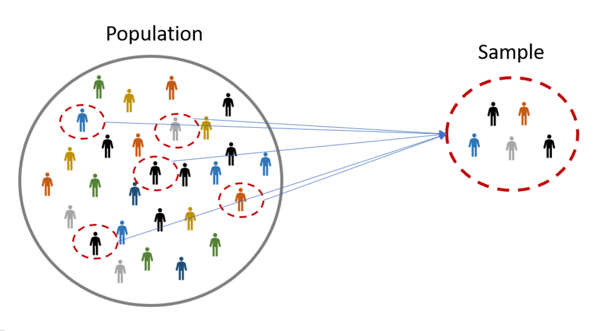

## Table of Contents

## What is sample size in research?

Sample size in research refers to the number of individuals or items included in a study. It is an important aspect of research because it affects the accuracy and reliability of the results. A larger sample size generally provides more precise estimates of the population, while a smaller sample size may lead to less accurate conclusions.

Choosing the right sample size is crucial for the validity of the study. Researchers use various methods and formulas to determine the appropriate sample size, often considering factors like the expected effect size, the desired level of precision, and the variability within the population. If the sample size is too small, the study might not detect important effects or differences, leading to false negatives. Conversely, an unnecessarily large sample size can waste resources and time.

## Why is sample size important in statistical analysis?

Sample size is important in statistical analysis because it helps make sure the results of a study are accurate and reliable. When you have a bigger sample size, your results are more likely to represent the whole group you're studying. This means you can trust the results more. For example, if you're trying to find out what people think about a new product, asking more people gives you a better idea of what everyone thinks, not just a few.

On the other hand, if the sample size is too small, the results might not be trustworthy. You might miss important information or think something is true when it's not. This can happen because small samples can be affected a lot by chance. Researchers use special formulas to figure out the right sample size, so they can be sure their study will give good information without wasting time or money.

## How does sample size affect the accuracy of research findings?

Sample size is really important for making sure the results of a research study are accurate. When you have a bigger sample size, your findings are more likely to be a good representation of the whole group you're studying. This is because a larger sample helps to reduce the impact of random chance on your results. For example, if you're trying to find out how many people like a new type of candy, asking more people will give you a better idea of what everyone thinks, not just a few.

On the other hand, if your sample size is too small, your results might not be very accurate. A small sample can be easily swayed by chance, leading to results that don't really show what's true for the whole group. This means you might miss important information or come to the wrong conclusions. Researchers use special methods to figure out the right sample size, so their study can give reliable information without wasting time or resources.

## What are the basic methods for determining sample size?

One common method for determining sample size is using a formula that takes into account the expected effect size, the desired level of precision, and the variability within the population. Researchers often use this formula to make sure their sample is big enough to detect the effects they're looking for, but not so big that it wastes time and money. For example, if you're studying how a new medicine works, you need enough people to see if it really makes a difference, but you don't need to test it on everyone.

Another method is using power analysis, which helps researchers figure out the smallest sample size needed to have a good chance of finding a real effect if it exists. Power analysis considers things like the size of the effect you're looking for and how sure you want to be about your results. This method is really helpful because it makes sure the study has enough people to be reliable, without making it too big.

Sometimes, researchers also use rules of thumb or guidelines from previous studies to decide on a sample size. These can be simpler to use but might not be as accurate as the other methods. For example, some might say you need at least 30 people for a basic study, but this can vary a lot depending on what you're studying and how precise you need to be.

## Can you explain the concept of statistical power in relation to sample size?

Statistical power is like the strength of your research study. It tells you how likely your study is to find a real effect if there is one. The more power your study has, the better chance it has of spotting important differences or changes. Sample size is really important for statistical power. When you have a bigger sample size, your study usually has more power. This is because more data helps to make your results more reliable and less affected by chance.

Think of it like trying to see a small object in a dark room. If you have a small flashlight (small sample size), you might not see the object clearly. But if you use a big, bright light (large sample size), you can see it much better. Researchers use something called power analysis to figure out how big their sample needs to be to have enough power. This way, they can make sure their study will be able to find important effects without wasting time and resources on a sample that's too big.

## What is the difference between a sample and a population in statistical terms?

In [statistics](/wiki/bayesian-statistics), a population is the entire group of people, items, or events that you want to study. For example, if you're studying the average height of adults in a country, the population would be all the adults in that country. It's important to understand the population because your research aims to learn something about this whole group.

A sample, on the other hand, is a smaller part of the population that you actually study. You use a sample because it's usually not possible or practical to study everyone in the population. For instance, instead of measuring the height of every adult in the country, you might measure the height of a few thousand adults. The idea is that by studying this smaller group, you can make good guesses about the whole population. The key is to make sure the sample is chosen carefully so it represents the population well.

## How do you calculate the required sample size for a study?

To calculate the required sample size for a study, you can use a formula that takes into account a few key things: the size of the effect you're looking for, how precise you want your results to be, and how much the population varies. For example, if you're studying how a new medicine works, you need to know how big a difference it makes, how sure you want to be about your results, and how different people's responses might be. There are special calculators and software that can help you with this, making it easier to figure out the right number of people to include in your study.

Another way to determine the sample size is by using power analysis. This method helps you find the smallest number of people you need to have a good chance of spotting a real effect if it's there. Power analysis looks at the same things as the formula—like the size of the effect and how sure you want to be—but it also considers how much power you want your study to have. Power is like the strength of your study; more power means a better chance of finding important differences. Researchers often use power analysis to make sure their study can give reliable results without being too big or too small.

## What are common pitfalls to avoid when determining sample size?

One common pitfall when determining sample size is using a sample that's too small. If your sample is too small, your study might miss important effects or differences. This can lead to false negatives, where you think something doesn't work when it actually does. For example, if you're testing a new medicine, a small sample might not show that it's effective, even if it really is. Researchers need to make sure their sample is big enough to have a good chance of spotting real effects.

Another pitfall is using a sample that's too large. A sample that's bigger than it needs to be can waste time, money, and resources. It's important to find the right balance so you can get reliable results without going overboard. For instance, if you're studying how people feel about a new product, you don't need to ask everyone in the country; a well-chosen smaller group can give you good information. Using power analysis or sample size calculators can help you avoid this problem by finding the right number of people for your study.

Lastly, not considering the variability within the population can also be a mistake. If the people or items in your study are very different from each other, you might need a larger sample to get accurate results. Ignoring this can lead to unreliable conclusions. For example, if you're studying the effects of a diet on weight loss, and people's starting weights vary a lot, you'll need more people in your study to account for that variability. Always think about how diverse your population is when you're figuring out your sample size.

## How does the choice of statistical test influence the required sample size?

The choice of statistical test can really affect how big your sample needs to be. Different tests have different ways of looking at data, and some need more people to give you good results. For example, if you're using a t-test to compare two groups, you might need a smaller sample than if you're using an ANOVA to compare several groups. This is because the t-test is simpler and needs less data to find differences. But if you choose a more complex test, like a regression analysis, you'll probably need a bigger sample to make sure your results are reliable.

Also, some tests are more sensitive to small changes, so they might need fewer people to spot an effect. For instance, a non-parametric test like the Mann-Whitney U test might work well with a smaller sample if your data isn't normally distributed. On the other hand, if you're using a test that's less sensitive, like a chi-square test for categorical data, you might need a bigger sample to see the same effect. It's important to pick the right test for your data and your research question, and then figure out your sample size based on that. This way, you can make sure your study has a good chance of finding the effects you're looking for.

## What advanced techniques exist for optimizing sample size in complex studies?

In complex studies, one advanced technique for optimizing sample size is using adaptive design methods. These methods let researchers change the sample size during the study based on early results. For example, if early data shows a big effect, you might not need as many people as you thought. But if the effect is small or hard to see, you can increase the sample size to make sure you don't miss it. Adaptive design helps save time and money by making the study more flexible and efficient.

Another technique is using simulation-based approaches, like Monte Carlo simulations. These simulations create many pretend studies to see how different sample sizes work. By running these simulations, researchers can see how likely they are to find real effects with different sample sizes. This helps them pick the best sample size for their study, making sure it's big enough to be reliable but not so big that it's a waste of resources. Simulation-based approaches are really helpful for planning complex studies where the right sample size isn't easy to figure out.

## How can sample size requirements vary across different fields of study?

Sample size requirements can change a lot depending on what field you're working in. In medicine, for example, you often need a big sample size to make sure new treatments are safe and work well. Doctors and researchers want to be very sure about their findings, so they need to study a lot of people. This helps them see if a new medicine really helps or if it's just by chance. In psychology, the sample size might be smaller because they often look at behavior or feelings, which can be different from person to person. But they still need enough people to make sure their results are reliable and can be used for other groups.

In fields like engineering or environmental science, sample size can depend on what you're studying. If you're testing the strength of a new material, you might need fewer samples if the test is very precise. But if you're studying something that changes a lot, like air quality in different places, you might need more samples to get a good picture of what's happening. Each field has its own way of figuring out the right sample size, based on what they're trying to learn and how sure they need to be about their results.

## What are the ethical considerations involved in choosing a sample size?

When choosing a sample size, researchers need to think about ethics. One big thing is making sure the study doesn't harm the people involved. If the sample is too small, the results might not be reliable, and this could lead to wrong conclusions that might hurt people later on. For example, if a new medicine is tested on too few people, it might seem safe but could have bad side effects that weren't seen. On the other hand, a sample that's too big can waste time and money, and it might make people go through tests they don't need to.

Another ethical consideration is fairness. Researchers should make sure everyone has a fair chance of being in the study. If the sample size is too small, it might not include different types of people, and the results might not apply to everyone. This can be unfair to groups that are left out. Also, researchers need to think about the burden on participants. Asking too many people to join the study can be hard on them, especially if the study involves a lot of time or effort. It's important to find a balance so the study can give good information without being too hard on the people involved.

## Why does sample size matter in algo trading?

Sample size is a critical component in [algorithmic trading](/wiki/algorithmic-trading) for several reasons. It directly impacts the reliability and validity of trading strategies, ensuring that the results of [backtesting](/wiki/backtesting) and other assessments provide an accurate representation of a strategy's potential performance.

Larger sample sizes tend to yield more statistically significant results, reducing the likelihood that observed outcomes are due to random chance rather than genuine effects. This can be expressed mathematically using statistical measures, such as the p-value, which indicates the probability of obtaining an effect at least as extreme as the one observed, assuming the null hypothesis is true. Mathematically, this can be represented as:

$$
P(\text{Data} | \text{Null Hypothesis})
$$

As the sample size increases, the standard error decreases, making the estimates of the population parameter more precise. The standard error ($SE$) is calculated as:

$$
SE = \frac{\sigma}{\sqrt{n}}
$$

where $\sigma$ is the standard deviation of the population, and $n$ is the sample size. A smaller standard error implies a more accurate reflection of the population, providing greater confidence in the findings of the backtesting process.

Inadequate sample size can lead to several issues, including overfitting, where a strategy performs exceptionally well on historical data but fails in real-world scenarios due to its excessive complexity or reliance on specific dataset anomalies. This is because a small sample size may not encapsulate the full variability in market conditions, leading to strategies that are tailored too closely to the sample data. The consequence is false conclusions about a strategy's effectiveness, which can be financially disastrous when the strategy is implemented live.

Understanding and determining the correct sample size help avoid these pitfalls by ensuring that backtesting accurately reflects a strategy's viability across different periods and market conditions. This understanding is crucial not just for accuracy but also for minimizing risks associated with financial loss. An adequately-sized sample provides a robust framework for decision-making, thereby safeguarding capital against abrupt market changes.

The accuracy of backtesting results directly correlates with the sample size, playing a vital role in a strategy's simulated historical performance. A well-calibrated sample size means that traders can rely on their backtest outputs to guide trading decisions, ensuring confidence in both the strategy's design and its application in live trading environments.

Overall, determining the appropriate sample size is an essential part of ensuring that an algorithmic trading strategy is both reliable and effective, ultimately contributing to more sustainable financial outcomes and strategic success.

## References & Further Reading

[1]: Bergstra, J., Bardenet, R., Bengio, Y., & Kégl, B. (2011). ["Algorithms for Hyper-Parameter Optimization."](https://dl.acm.org/doi/10.5555/2986459.2986743) Advances in Neural Information Processing Systems 24.

[2]: ["Advances in Financial Machine Learning"](https://www.amazon.com/Advances-Financial-Machine-Learning-Marcos/dp/1119482089) by Marcos Lopez de Prado

[3]: ["Evidence-Based Technical Analysis: Applying the Scientific Method and Statistical Inference to Trading Signals"](https://www.amazon.com/Evidence-Based-Technical-Analysis-Scientific-Statistical/dp/0470008741) by David Aronson

[4]: ["Machine Learning for Algorithmic Trading"](https://github.com/PacktPublishing/Machine-Learning-for-Algorithmic-Trading-Second-Edition) by Stefan Jansen

[5]: ["Quantitative Trading: How to Build Your Own Algorithmic Trading Business"](https://books.google.com/books/about/Quantitative_Trading.html?id=j70yEAAAQBAJ) by Ernest P. Chan