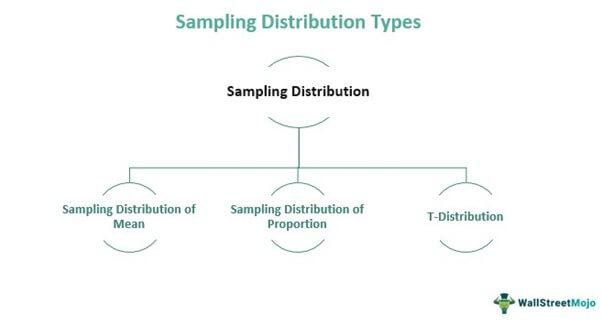

In the rapidly evolving world of finance, understanding statistical sampling methods and their application in algorithmic trading is imperative. Statistical samples, by design, assist in distilling complex datasets into more manageable representations, enabling traders to make informed decisions. Algorithmic trading relies heavily on the precision of data inputs to execute trades efficiently and profitably. It uses computer algorithms to analyze vast amounts of financial data in real time, implementing trades based on predefined criteria with precision and speed. The effective integration of statistical sampling into this process ensures that the data guiding these algorithms is both representative and accurate.

Statistical samples are critical to forming the foundation for algorithmic trading strategies. By selecting a representative subset from a larger data population, traders can minimize the need to process entire datasets, optimizing computational resources and reducing time to decision. This approach not only aids in overcoming the impracticality of studying entire populations but also enhances the accuracy of predictions and decisions made by trading algorithms.



Algorithmic trading systems benefit significantly from the strategic application of statistical sampling. By ensuring data precision and reducing errors, traders can boost the efficiency of their algorithms. In particular, the synergy between statistical methodologies and trading algorithms helps traders navigate the complexities of financial markets with greater confidence. Embracing the principles of sampling in statistics becomes essential in maximizing the potential of algorithmic trading, ensuring that both the strategies and the underlying data are robust and effective.

## Table of Contents

## What Are Statistical Samples?

Statistical samples are subsets drawn from a larger population, used primarily for conducting analysis and research. The central idea behind sampling is to efficiently derive insights about a population without the need to study every individual component, which can often be impractical or impossible. Given the constraints of time, cost, and accessibility, sampling becomes a foundational technique in numerous disciplines, from social sciences to finance.

A well-constructed sample is characterized by its ability to accurately reflect the attributes and diversity of the larger population it represents. This manageability often involves ensuring the sample is representative, capturing the essential characteristics and variations found within the entire group. By doing so, analysts can make reliable estimations about population parameters, such as means and variances, based on the properties observed within the sample itself.

For example, if one were to conduct a study on the average height of individuals in a city, measuring every individual's height would be impractical. Instead, a statistically sound sample might be drawn from various neighborhoods in such a way that it reflects age, gender, and perhaps socio-economic diversity. From this sample, statistical inferences can be made about the city's population height distribution as a whole.

The efficacy of a sample in accurately portraying a population hinges on the method used for its selection. Randomized methods often ensure that the sample does not contain inherent biases, thus maintaining the integrity of the statistical inferences drawn. Conversely, if the sample is poorly selected, it could lead to skewed findings, misrepresenting the population's true characteristics.

Hence, the key takeaway is that the construction of a well-designed sample is pivotal for drawing valid and reliable conclusions about a population, making sampling an indispensable tool in the arsenal of researchers and analysts.

## Types of Sampling Methods

Sampling methods in [statistics](/wiki/bayesian-statistics) are crucial for accurately analyzing data and drawing valid conclusions about a population. These methods are broadly classified into two categories: probability sampling and non-probability sampling. Each category encompasses specific techniques that offer various advantages and are suited to different analysis scenarios.

### Probability Sampling

Probability sampling ensures each member of a population has a known and non-zero chance of being selected. This method allows researchers to make more reliable and generalizable inferences about the entire population.

- **Simple Random Sampling:** This fundamental technique gives every member of the population an equal chance of selection. It is akin to drawing names from a hat, where each selection is entirely random. Simple random sampling can be implemented using Python's `random.sample()` function, which helps ensure a representative sample size.

    ```python
    import random

    population = [1, 2, 3, 4, 5, 6, 7, 8, 9, 10]
    sample_size = 4
    sample = random.sample(population, sample_size)
    print(sample)
    ```

- **Systematic Sampling:** Here, a sample is drawn at regular intervals from an ordered population. If you have a list of 1000 records and need a sample of 100, you would select every 10th record. It requires only the starting point, which is chosen randomly.

- **Stratified Random Sampling:** This method involves dividing the population into distinct subgroups, or strata, that share similar characteristics. Samples are then drawn from each stratum proportionally. This technique improves the precision of sample estimates and ensures representation across key subgroups.

### Non-Probability Sampling

Non-probability sampling does not guarantee that every member has a known chance of selection, which can introduce bias. However, it is beneficial in exploratory research or when probability sampling is impractical.

- **Convenience Sampling:** As the name suggests, samples are drawn from the part of the population that is most accessible. This method is cost-effective and easy to implement, though it may not accurately represent the entire population.

- **Judgment Sampling:** Also known as purposive sampling, this technique involves the researcher using their expertise to select the sample. It is beneficial when dealing with a specific focus group or when expert opinion is vital.

Each sampling method has inherent strengths and weaknesses affecting the reliability and validity of conclusions drawn. Probability sampling methods generally provide more accurate and unbiased results, making them preferable for inferential statistics. However, non-probability sampling can be advantageous in specific contexts where practicality outweighs the need for representativeness. Understanding these methods allows researchers to select the most suitable approach for their particular study, ensuring their findings are robust and credible.

## Examples of Sampling Techniques

In statistical sampling, various techniques are employed to ensure that the sample accurately represents the overall population. Here, we explore three primary sampling techniques: simple random sampling, systematic sampling, and stratified sampling.

1. **Simple Random Sampling:**
   Simple random sampling is a fundamental sampling method where each member of the population has an equal probability of being selected. This technique is akin to drawing names from a hat, ensuring absolute fairness and randomness. It can be implemented using random number generators, which provide truly random selections. For example, in Python, the `random.sample()` function can be used to achieve this:

   ```python
   import random

   population = list(range(1, 101))  # A population of numbers from 1 to 100
   sample_size = 10
   sample = random.sample(population, sample_size)
   ```

   Here, `random.sample()` ensures a random selection of ten unique numbers from the population of 1 to 100.

2. **Systematic Sampling:**
   Systematic sampling involves selecting samples from an ordered population at regular intervals. This method requires the population to be listed in a particular sequence and begins with randomly [picking](/wiki/asset-class-picking) a starting point, then proceeding with the selection process at a fixed interval, $k$.

   The formula to determine the interval $k$ is:
$$
   k = \frac{\text{Population size}}{\text{Sample size}}

$$

   For example, if the population size is 1000 and the desired sample size is 100, $k = \frac{1000}{100} = 10$. Starting from a random point between 1 and 10, every 10th member is selected.

   Systematic sampling is practical when dealing with large datasets where simple random sampling may be cumbersome.

3. **Stratified Sampling:**
   Stratified sampling is a technique where the population is divided into distinct subgroups, known as strata, that share similar attributes. Samples are then drawn proportionally from each stratum. This method ensures that the sample represents all key subgroups of the population and reduces potential bias.

   For instance, if analyzing a population consisting of different age groups, stratified sampling would involve dividing the population into groups like 'young', 'middle-aged', and 'senior', and then randomly sampling within each group.

   In Python, stratified sampling can be implemented using libraries such as `pandas`:

   ```python
   import pandas as pd
   from sklearn.model_selection import train_test_split

   # Sample data
   data = {'Age': [23, 45, 12, 30, 60, 45, 28, 33, 21, 40],
           'Group': ['Young', 'Middle', 'Young', 'Middle', 'Senior', 'Middle', 'Middle', 'Middle', 'Young', 'Middle']}
   df = pd.DataFrame(data)

   # Stratified sampling based on 'Group'
   stratified_sample = df.groupby('Group', group_keys=False).apply(lambda x: x.sample(frac=0.5))
   ```

   This code snippet selects a stratified sample with half of the entries from each group.

These sampling techniques play a crucial role in statistical analysis, ensuring that conclusions drawn from samples can be generalized to the broader population with high confidence. Each method's selection depends on the study's objectives, population characteristics, and practical constraints.

## Algo Trading and Its Importance

Algorithmic trading uses computer algorithms to automate trading processes, executing trades based on predefined criteria such as timing, price, or market conditions. This approach aims to capitalize on profit opportunities at speeds and volumes beyond the capabilities of human traders. By leveraging technology, traders can eliminate emotional biases and fulfill trades with precision and efficiency.

Key strategies in [algorithmic trading](/wiki/algorithmic-trading) include trend-following, [arbitrage](/wiki/arbitrage), and [statistical arbitrage](/wiki/statistical-arbitrage). Trend-following strategies focus on identifying and following existing market trends, utilizing technical indicators to determine the optimal times for entering or exiting trades. Arbitrage strategies exploit price discrepancies of the same asset across different markets to achieve risk-free profits. Statistical arbitrage involves complex mathematical models to identify and exploit short-term mispricings between multiple securities.

Integrating statistical samples within algorithmic trading frameworks ensures data precision and enhances decision-making effectiveness. The use of well-designed samples helps in accurately estimating population parameters, thus minimizing errors and increasing the robustness of trading algorithms. By refining input data, traders can optimize algorithmic setups, leading to improved trading outcomes and strategy performance.

Moreover, statistical sampling contributes to error reduction and efficiency by providing a more accurate representation of market conditions. By employing representative data samples, algorithms can adapt to market dynamics swiftly and make informed trading decisions. This systematic approach not only enhances trading accuracy but also ensures that algorithms operate with minimal biases and errors, ultimately fostering a more reliable and effective trading environment.

## Applications of Statistical Sampling in Algo Trading

Statistical sampling plays a crucial role in enhancing the effectiveness of algorithmic trading systems. It greatly assists in refining the data inputs utilized by algorithms, thereby ensuring high-quality decision-making in trading processes. The proper application of statistical sampling techniques aids traders in achieving more accurate market predictions and developing robust trading strategies.

Accurate samples are indispensable for the [backtesting](/wiki/backtesting) of trading strategies. Backtesting, which involves running a trading strategy on historical data to assess its potential efficacy, is an essential component of algorithmic trading. By selecting representative samples of past market data, traders can simulate the performance of their strategies under various market conditions. This practice allows for the identification and correction of potential weaknesses in the strategy, leading to improved robustness and reliability. Moreover, stratified sampling is often employed to ensure that the samples reflect different market conditions and asset behaviors, providing a comprehensive analysis of the strategy's strengths and limitations.

Python code to perform a basic backtest using stratified sampling might look like this:

```python
import numpy as np
import pandas as pd
from sklearn.model_selection import train_test_split

# Load historical market data
data = pd.read_csv('historical_data.csv')

# Stratify the data based on different market conditions
# For example, by volatility levels
data['volatility_category'] = pd.qcut(data['volatility'], q=4, labels=False)

# Splitting the data to ensure stratification
train_data, test_data = train_test_split(data, test_size=0.2, stratify=data['volatility_category'])

# Define a simple moving average strategy
def moving_average_strategy(data, short_window, long_window):
    signals = pd.DataFrame(index=data.index)
    signals['signal'] = 0.0
    signals['short_mavg'] = data['close'].rolling(window=short_window, min_periods=1).mean()
    signals['long_mavg'] = data['close'].rolling(window=long_window, min_periods=1).mean()
    signals['signal'][short_window:] = np.where(signals['short_mavg'][short_window:] > signals['long_mavg'][short_window:], 1.0, 0.0)  
    return signals

# Backtest the strategy on test data
backtest_results = moving_average_strategy(test_data, 40, 100)

# Analyze the strategy performance
performance = backtest_results['signal'].sum()  # Example performance metric
print("Backtest Performance:", performance)
```
Stratifying samples using key financial metrics can also reveal hidden trading opportunities. For instance, by categorizing and analyzing data based on factors such as trading [volume](/wiki/volume-trading-strategy), price [volatility](/wiki/volatility-trading-strategies), or [liquidity](/wiki/liquidity-risk-premium), traders may detect patterns or anomalies that may not be apparent when assessing aggregated data. Grouping the data into relevant strata allows algorithms to adapt to the unique characteristics of each subset, improving the likelihood of uncovering profitable trades.

In summary, the application of statistical sampling in algorithmic trading is a powerful technique for optimizing data inputs and enhancing strategy development. By employing accurate and representative samples, traders can improve the robustness of their trading strategies and potentially discover new opportunities in financial markets.

## Challenges in Combining Sampling with Algo Trading

Combining statistical sampling with algorithmic trading presents several challenges that must be addressed to enhance trading accuracy and efficiency. Ensuring non-biased and representative samples is pivotal. In the context of financial markets, biases can lead to skewed insights, affecting trade decisions adversely. Non-representative data may mislead algorithms, causing inefficiencies or losses in trades.

One primary challenge in this integration is handling high-frequency data and processing it in real time. Financial markets generate vast amounts of data every second, necessitating sampling techniques that can efficiently process and provide insights at a comparable pace. Traditional sampling methods may not suffice due to their relatively slower speeds and potential for data loss in fast-paced environments.

To meet these demands, advanced statistical methodologies are crucial. Techniques such as adaptive sampling and streaming data analysis can provide more agile responses to high-frequency data changes. For example, adaptive sampling methods adjust the sampling frequency based on the data's volatility or importance, ensuring critical information is not missed during peaks or anomalies.

Python, commonly used in algorithmic trading, offers libraries such as Pandas and NumPy that are equipped to handle large datasets efficiently. Implementing advanced statistical methodologies can be facilitated by libraries like SciPy and Scikit-learn, which offer tools for more nuanced data analysis and sampling.

Here's an example of a Python function using random sampling with replacement, which can be useful for large datasets:

```python
import numpy as np

def bootstrap_sample(data, sample_size):
    """
    Generates a bootstrap sample with replacement

    Parameters:
    data (array-like): The input data array.
    sample_size (int): The size of the sample to generate.

    Returns:
    np.array: The generated sample.
    """
    indices = np.random.randint(0, len(data), sample_size)
    return data[indices]

# Example usage
data = np.array([10, 20, 30, 40, 50])
sample = bootstrap_sample(data, 3)
print(sample)
```

Addressing these challenges involves leveraging technology alongside statistical expertise to ensure that both the integrity and the speed of data processing are maintained. As the volume and velocity of market data continue to increase, adopting these sophisticated sampling techniques becomes even more critical.

## Conclusion

The integration of statistical samples with algorithmic trading creates a powerful combination that enhances the effectiveness and accuracy of financial trading systems. By understanding and applying various sampling methods, traders can refine their algorithmic strategies, thus increasing their precision and reliability. Statistical sampling allows traders to use a subset of data that accurately represents the entire market, optimizing analytical efficiency and reducing computational overhead.

As financial markets continue to evolve, the importance of these statistical tools remains pivotal. Maintaining an understanding of and adaptability to different types of sampling methods ensures that traders can effectively interpret market conditions, glean actionable insights, and thereby maintain a competitive advantage. By leveraging well-constructed samples, traders are better positioned to optimize backtesting processes, enhance strategy robustness, and uncover new trading opportunities that might otherwise remain obscured within large datasets.

In sum, the collaboration between statistical sampling and algorithmic trading is fundamental to developing a more responsive and dynamic trading framework. As technology and market demands grow in complexity, so too must the strategies and tools employed by market participants to meet these challenges.

## References & Further Reading

[1]: Bergstra, J., Bardenet, R., Bengio, Y., & Kégl, B. (2011). ["Algorithms for Hyper-Parameter Optimization."](https://papers.nips.cc/paper/4443-algorithms-for-hyper-parameter-optimization) Advances in Neural Information Processing Systems 24.

[2]: ["Advances in Financial Machine Learning"](https://www.amazon.com/Advances-Financial-Machine-Learning-Marcos/dp/1119482089) by Marcos Lopez de Prado

[3]: ["Evidence-Based Technical Analysis: Applying the Scientific Method and Statistical Inference to Trading Signals"](https://www.semanticscholar.org/paper/Evidence-Based-Technical-Analysis%3A-Applying-the-and-Aronson/3b33df8737f1772e9e14d66a08c9696f140a2ee1) by David Aronson

[4]: ["Machine Learning for Algorithmic Trading"](https://github.com/stefan-jansen/machine-learning-for-trading) by Stefan Jansen

[5]: ["Quantitative Trading: How to Build Your Own Algorithmic Trading Business"](https://www.amazon.com/Quantitative-Trading-Build-Algorithmic-Business/dp/1119800064) by Ernest P. Chan