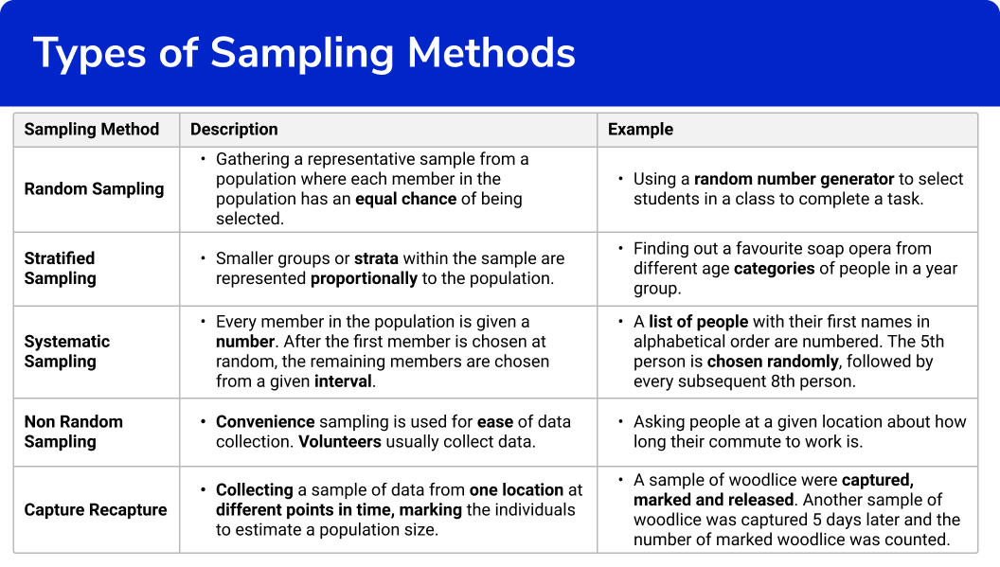

## Table of Contents

## What is a sample in statistics?

In statistics, a sample is a smaller group of people or items that is taken from a larger group, called a population. Researchers use samples because it's usually not possible to study everyone or everything in the population. By studying the sample, they can make guesses, or estimates, about what the whole population might be like.

For example, if you want to know what all the students in a big school think about a new lunch menu, you don't need to ask every single student. Instead, you can choose a smaller group of students to ask. This smaller group is your sample. If the sample is chosen carefully, it can give you a good idea of what all the students might think.

## Why is sampling important in statistical analysis?

Sampling is important in statistical analysis because it allows researchers to study a smaller group of people or items instead of the whole population. This makes research more manageable and less expensive. For example, if a company wants to know what people think about a new product, they don't need to ask everyone in the country. They can ask a smaller group, or sample, and still get useful information.

Another reason sampling is important is that it can give accurate results if done correctly. When a sample is chosen carefully to represent the whole population, the findings from the sample can be used to make good guesses about the entire group. This is called making inferences. For instance, if a sample of voters in a city shows a certain trend, researchers can use that information to predict what all voters in the city might do.

In summary, sampling helps make research easier and more affordable, and it can provide reliable information about a larger group if the sample is chosen well. This is why sampling is a key part of statistical analysis.

## What are the different types of sampling methods?

There are several types of sampling methods, and each has its own way of choosing who or what to include in the sample. One common method is random sampling, where every member of the population has an equal chance of being chosen. This can be done by picking names out of a hat or using a computer to select people at random. Another type is stratified sampling, which involves dividing the population into smaller groups, or strata, based on certain characteristics like age or income, and then taking a random sample from each group. This helps make sure the sample includes people from all the different groups in the population.

Another sampling method is cluster sampling, where the population is divided into clusters, like neighborhoods or schools, and then a few of these clusters are chosen at random. Everyone in the chosen clusters is included in the sample. This method is useful when it's hard to get a list of everyone in the population. There's also systematic sampling, where you choose every nth person from a list, like every 10th person. This is easier than random sampling but still gives everyone a chance to be picked.

Lastly, there are non-probability sampling methods, like convenience sampling and purposive sampling. In convenience sampling, you just choose people who are easy to reach, like people in a shopping mall. Purposive sampling involves picking people who have certain characteristics or knowledge that you need for your study. These methods are quicker and easier but might not give you a sample that represents the whole population as well as the probability methods do.

## How do you determine the sample size for a study?

Determining the right sample size for a study is important to make sure your results are reliable and useful. One way to figure out the sample size is by thinking about how much error you're willing to accept. This is called the margin of error. If you want your results to be very accurate, you'll need a bigger sample. You also need to think about how much the thing you're studying varies in the population. If it varies a lot, you'll need a bigger sample to capture that variation accurately. 

Another thing to consider is the confidence level, which is how sure you want to be that your sample results reflect the whole population. A common confidence level is 95%, which means you're 95% sure your results are correct. The higher the confidence level, the bigger the sample size you need. There are also formulas and online calculators that can help you figure out the right sample size based on these factors. By using these tools and thinking about your study's specific needs, you can choose a sample size that will give you good, reliable results.

## What is the difference between a sample and a population?

A sample is a smaller group of people or things that is taken from a bigger group, which is called the population. Think of it like this: if you want to know what all the kids in a big school think about a new game, you don't need to ask every single kid. Instead, you can ask a smaller group of kids, and that smaller group is your sample. The sample helps you guess what the whole school might think without having to ask everyone.

The population, on the other hand, is the entire group you're interested in. In the school example, the population would be all the kids in the school. When researchers study a population, they want to learn something about everyone in that group. But because it's often too hard or too expensive to study everyone, they use a sample to make educated guesses about the population. So, the main difference is that a sample is a part of the population, and it's used to learn about the whole population without having to study every single member.

## Can you explain simple random sampling with an example?

Simple random sampling is a way to pick a sample from a bigger group, or population, where every person or thing has the same chance of being chosen. Imagine you have a big jar full of different colored marbles, and you want to know what colors are in the jar without looking at all of them. You could shake the jar, close your eyes, and pick out a few marbles. Each marble has the same chance of being picked, no matter what color it is. That's simple random sampling.

Let's say you want to find out what students in a big school think about a new lunch menu. You have a list of all the students in the school, and you want to ask a smaller group of them. To use simple random sampling, you could put all the students' names in a hat, mix them up, and then pull out the names of the students you will ask. Each student has an equal chance of being chosen, so the sample you get should give you a good idea of what all the students might think about the new lunch menu.

## What is stratified sampling and when should it be used?

Stratified sampling is a way of picking a sample from a bigger group, or population, where you first split the population into smaller groups, or strata, based on certain things like age, income, or where they live. Then, you pick a random sample from each of these smaller groups. This helps make sure your sample includes people from all the different groups in the population, so your results will be more accurate and fair.

You should use stratified sampling when you want to make sure your sample looks like the whole population in important ways. For example, if you're doing a survey about health and you know that men and women might have different health issues, you would split your population into men and women, and then take a random sample from each group. This way, your sample will include both men and women in the right amounts, and your results will be more likely to show what's true for the whole population.

## How does cluster sampling work and what are its advantages?

Cluster sampling is a way to pick a sample from a bigger group, or population, by first dividing the population into smaller groups, called clusters. These clusters could be things like neighborhoods, schools, or cities. Instead of picking people one by one, you pick a few of these clusters at random and then include everyone in those chosen clusters in your sample. For example, if you want to study students in a big city, you could divide the city into different schools, pick a few schools at random, and then survey all the students in those schools.

One big advantage of cluster sampling is that it can save time and money. It's often easier and cheaper to study a whole cluster than to pick people one by one from the whole population. Another advantage is that it works well when you don't have a complete list of everyone in the population, which can happen a lot in big studies. By focusing on clusters, you can still get a good sample without needing to know about every single person in the population.

## What are the potential biases in sampling and how can they be minimized?

Sampling can sometimes lead to biases, which means the sample doesn't really show what the whole group, or population, is like. One common bias is selection bias, where some people have a better chance of being picked for the sample than others. For example, if you're doing a survey in a mall, you might only get people who like to shop there, and miss out on people who don't go to that mall. Another bias is non-response bias, where some people in your sample don't answer your survey, so the people who do answer might not be like the whole group. There's also undercoverage bias, where some parts of the population are left out of the sample, like if you only survey people who have phones and miss those who don't.

To minimize these biases, you can use different methods. For selection bias, using random sampling can help because it gives everyone an equal chance to be picked. To reduce non-response bias, you can try to follow up with people who don't answer at first, or offer rewards for answering. For undercoverage bias, you can make sure your sample includes people from all parts of the population, like using stratified sampling to make sure all groups are represented. By being careful and using the right methods, you can make your sample more accurate and fair.

## How do non-probability sampling methods like convenience sampling differ from probability sampling?

Non-probability sampling methods, like convenience sampling, are different from probability sampling because they don't give everyone in the population an equal chance of being chosen. In convenience sampling, you pick people who are easy to reach, like people walking by in a park or students in a classroom. This method is quick and easy, but it might not give you a sample that really shows what the whole group is like. For example, if you only ask people in a park, you might miss out on people who don't go to parks, so your results might not be accurate for everyone.

Probability sampling, on the other hand, makes sure that every person in the population has the same chance of being picked. Methods like simple random sampling, stratified sampling, and cluster sampling are all types of probability sampling. These methods help make sure your sample is more likely to be a good match for the whole population. For instance, in simple random sampling, you might use a computer to pick names at random from a list of everyone in the population. This way, you're more likely to get a sample that really shows what the whole group is like.

## What advanced techniques exist for ensuring representativeness in complex surveys?

In complex surveys, one advanced technique to make sure the sample represents the whole population is called multi-stage sampling. This method involves breaking down the population into smaller groups, or stages, and then picking samples from each stage. For example, you might first divide a country into regions, then pick some regions at random. Next, you divide those regions into smaller areas like cities or towns, and pick some of those at random too. Finally, you pick people from those chosen areas to be in your sample. This way, you can make sure you include people from different parts of the population, which helps your sample be more like the whole group.

Another technique is using weighting adjustments. This means that after you collect your data, you can give more importance, or weight, to some people in your sample to make it match the population better. For example, if older people are underrepresented in your sample, you can give their answers more weight to make up for it. This helps fix any imbalances in your sample and makes your results more accurate. By using these advanced techniques, researchers can make sure their samples are as representative as possible, even in very complex surveys.

## How can statistical software be used to analyze sample data effectively?

Statistical software can help you analyze sample data by doing calculations and making graphs for you. It can quickly figure out things like averages, how spread out the data is, and if different groups in your sample are different from each other. This saves you a lot of time and helps you avoid mistakes that can happen when you do the math by hand. For example, if you want to know if people in different age groups have different opinions about a new product, the software can do tests to see if there's a real difference or if it's just by chance.

Another way statistical software helps is by making it easy to see patterns in your data. It can create charts and graphs that show you what your data looks like, which can help you understand it better. For instance, you can make a bar chart to see how many people in your sample like or dislike the new product. The software can also help you do more advanced things, like predicting what might happen in the future based on your sample data. By using statistical software, you can make sure your analysis is thorough and accurate, and you can share your findings with others in a clear way.

## What are some examples of sampling techniques?

In statistical sampling, various techniques are employed to ensure that the sample accurately represents the overall population. Here, we explore three primary sampling techniques: simple random sampling, systematic sampling, and stratified sampling.

1. **Simple Random Sampling:**
   Simple random sampling is a fundamental sampling method where each member of the population has an equal probability of being selected. This technique is akin to drawing names from a hat, ensuring absolute fairness and randomness. It can be implemented using random number generators, which provide truly random selections. For example, in Python, the `random.sample()` function can be used to achieve this:

   ```python
   import random

   population = list(range(1, 101))  # A population of numbers from 1 to 100
   sample_size = 10
   sample = random.sample(population, sample_size)
   ```

   Here, `random.sample()` ensures a random selection of ten unique numbers from the population of 1 to 100.

2. **Systematic Sampling:**
   Systematic sampling involves selecting samples from an ordered population at regular intervals. This method requires the population to be listed in a particular sequence and begins with randomly [picking](/wiki/asset-class-picking) a starting point, then proceeding with the selection process at a fixed interval, $k$.

   The formula to determine the interval $k$ is:
$$
   k = \frac{\text{Population size}}{\text{Sample size}}

$$

   For example, if the population size is 1000 and the desired sample size is 100, $k = \frac{1000}{100} = 10$. Starting from a random point between 1 and 10, every 10th member is selected.

   Systematic sampling is practical when dealing with large datasets where simple random sampling may be cumbersome.

3. **Stratified Sampling:**
   Stratified sampling is a technique where the population is divided into distinct subgroups, known as strata, that share similar attributes. Samples are then drawn proportionally from each stratum. This method ensures that the sample represents all key subgroups of the population and reduces potential bias.

   For instance, if analyzing a population consisting of different age groups, stratified sampling would involve dividing the population into groups like 'young', 'middle-aged', and 'senior', and then randomly sampling within each group.

   In Python, stratified sampling can be implemented using libraries such as `pandas`:

   ```python
   import pandas as pd
   from sklearn.model_selection import train_test_split

   # Sample data
   data = {'Age': [23, 45, 12, 30, 60, 45, 28, 33, 21, 40],
           'Group': ['Young', 'Middle', 'Young', 'Middle', 'Senior', 'Middle', 'Middle', 'Middle', 'Young', 'Middle']}
   df = pd.DataFrame(data)

   # Stratified sampling based on 'Group'
   stratified_sample = df.groupby('Group', group_keys=False).apply(lambda x: x.sample(frac=0.5))
   ```

   This code snippet selects a stratified sample with half of the entries from each group.

These sampling techniques play a crucial role in statistical analysis, ensuring that conclusions drawn from samples can be generalized to the broader population with high confidence. Each method's selection depends on the study's objectives, population characteristics, and practical constraints.

## References & Further Reading

[1]: Bergstra, J., Bardenet, R., Bengio, Y., & Kégl, B. (2011). ["Algorithms for Hyper-Parameter Optimization."](https://papers.nips.cc/paper/4443-algorithms-for-hyper-parameter-optimization) Advances in Neural Information Processing Systems 24.

[2]: ["Advances in Financial Machine Learning"](https://www.amazon.com/Advances-Financial-Machine-Learning-Marcos/dp/1119482089) by Marcos Lopez de Prado

[3]: ["Evidence-Based Technical Analysis: Applying the Scientific Method and Statistical Inference to Trading Signals"](https://www.semanticscholar.org/paper/Evidence-Based-Technical-Analysis%3A-Applying-the-and-Aronson/3b33df8737f1772e9e14d66a08c9696f140a2ee1) by David Aronson

[4]: ["Machine Learning for Algorithmic Trading"](https://github.com/stefan-jansen/machine-learning-for-trading) by Stefan Jansen

[5]: ["Quantitative Trading: How to Build Your Own Algorithmic Trading Business"](https://www.amazon.com/Quantitative-Trading-Build-Algorithmic-Business/dp/1119800064) by Ernest P. Chan