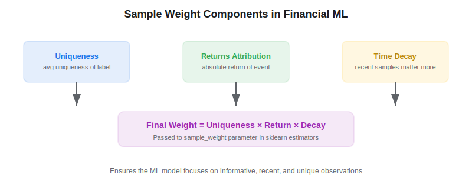
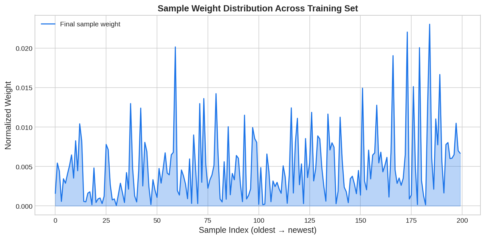

Sample weighting is a critical but often overlooked step in building machine learning models for trading. In *Advances in Financial Machine Learning* (2018), Marcos Lopez de Prado argues that not all training observations carry equal information — some labels overlap in time, some coincide with larger market moves, and more recent data is generally more relevant. Properly weighting samples ensures the ML model focuses on the most informative and unique observations.

## Why Sample Weights Matter

When using the [triple-barrier method](https://paperswithbacktest.com/wiki/triple-barrier-method) to label trading events, labels span multiple bars and often overlap. A model trained without weights treats every label equally, even though some labels share most of their underlying price data with neighboring labels. This redundancy inflates the effective sample size and leads to overfitting.



## Three Components of Sample Weights

### 1. Uniqueness Weight

The average uniqueness $\bar{u}_n$ of each label measures what fraction of its time span is not shared with other concurrent labels. Labels that overlap heavily with others receive lower uniqueness weights. This is the same concept used in [sequential bootstrapping](https://paperswithbacktest.com/wiki/sequential-bootstrapping):

$$\bar{u}_n = \frac{1}{|\tau_n|} \sum_{t \in \tau_n} \frac{1}{c_t}$$

where $\tau_n$ is the set of time indices spanned by label $n$ and $c_t$ is the number of concurrent labels at time $t$.

### 2. Return Attribution Weight

Not all labels are equally informative in terms of market impact. Labels associated with larger absolute returns contain more signal about what drives P&L. The return attribution weight is simply:

$$w_n^{\text{ret}} = |r_n|$$

where $r_n$ is the return achieved by the triple-barrier event. This ensures the model pays more attention to events that matter for portfolio performance.

### 3. Time Decay Weight

Financial markets are non-stationary — relationships that held a year ago may no longer apply. A time decay factor gives more weight to recent observations:

$$w_n^{\text{decay}} = d^{T - t_n}$$

where $d \in (0, 1]$ is the decay factor, $T$ is the most recent timestamp, and $t_n$ is the timestamp of label $n$. Setting $d = 1$ means no decay (all equally weighted).

### Final Combined Weight

$$w_n = \bar{u}_n \times w_n^{\text{ret}} \times w_n^{\text{decay}}$$

These weights are normalized to sum to the number of samples and passed to sklearn estimators via the `sample_weight` parameter.



## Python Implementation

```python
import numpy as np
import pandas as pd

def compute_sample_weights(label_ranges, returns, timestamps, decay=0.995):
    """
    Compute combined sample weights for financial ML.

    Parameters
    ----------
    label_ranges : list of (start, end) tuples
        Time span of each label.
    returns : np.ndarray
        Absolute return for each label event.
    timestamps : np.ndarray
        Entry timestamp index for each label.
    decay : float
        Time decay factor (0 < decay <= 1).

    Returns
    -------
    np.ndarray
        Normalized sample weights.
    """
    n = len(label_ranges)
    all_t = set()
    for s, e in label_ranges:
        all_t.update(range(s, e + 1))
    all_t = sorted(all_t)

    # Uniqueness weights
    uniqueness = np.zeros(n)
    for i, (s, e) in enumerate(label_ranges):
        span = list(range(s, e + 1))
        u_vals = []
        for t in span:
            concurrent = sum(1 for s2, e2 in label_ranges if s2 <= t <= e2)
            u_vals.append(1.0 / concurrent)
        uniqueness[i] = np.mean(u_vals)

    # Return attribution
    ret_weights = np.abs(returns)
    ret_weights /= ret_weights.mean() if ret_weights.mean() > 0 else 1

    # Time decay
    max_t = timestamps.max()
    decay_weights = decay ** (max_t - timestamps)

    # Combine
    weights = uniqueness * ret_weights * decay_weights
    weights *= n / weights.sum()  # normalize to sum = N
    return weights

# Example usage with sklearn
from sklearn.ensemble import RandomForestClassifier

# weights = compute_sample_weights(...)
# clf = RandomForestClassifier(n_estimators=500)
# clf.fit(X_train, y_train, sample_weight=weights)
```

## Key Parameters

| Parameter | Typical Range | Effect |
|---|---|---|
| Decay factor $d$ | 0.99 – 1.0 | Lower → stronger recency bias; 1.0 → no decay |
| Return scaling | Raw or log | Log scaling compresses extreme outliers |
| Uniqueness source | Indicator matrix | Requires label start/end timestamps |

## Limitations and Risks

Over-aggressive time decay can discard valuable long-term patterns. The return attribution weight can also create a feedback loop where the model overweights volatile periods that may not recur. It's best to validate weight configurations using [CPCV](https://paperswithbacktest.com/wiki/combinatorial-purged-cross-validation-cpcv) rather than standard train-test splits.

## Conclusion

Sample weights close the gap between "having enough data" and "having enough *independent* data." By combining uniqueness, return attribution, and time decay, you ensure that ML models for [systematic trading](https://paperswithbacktest.com/wiki/systematic-trading-strategies) are trained on what matters most — recent, unique, high-impact observations.

---

**Explore further on PapersWithBacktest:**
- Browse [backtested ML-driven strategies](https://paperswithbacktest.com/strategies) with Python code and performance metrics
- Access [clean historical market data](https://paperswithbacktest.com/datasets) for equities, crypto, and futures
- Take the [algo trading course](https://paperswithbacktest.com/course) — 60+ video lessons and notebooks
- Related wiki pages: [Sequential Bootstrapping](https://paperswithbacktest.com/wiki/sequential-bootstrapping) · [Triple-Barrier Method](https://paperswithbacktest.com/wiki/triple-barrier-method) · [CPCV](https://paperswithbacktest.com/wiki/combinatorial-purged-cross-validation-cpcv)
