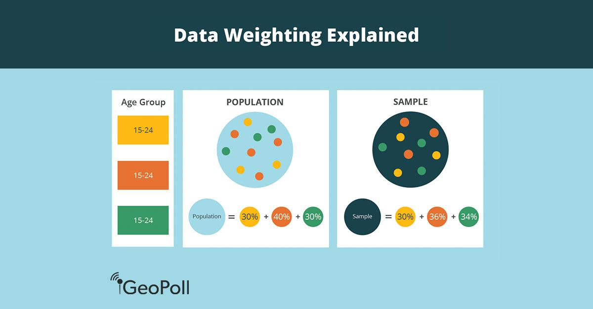

In algorithmic trading, the integration of machine learning and statistical methods to refine trading decisions is gaining traction among traders and financial analysts. These advanced technologies enable the development of sophisticated algorithms that can process vast amounts of data and extract meaningful insights, which are crucial for informed decision-making in dynamic markets. 

A key element in algorithmic strategy development is the use of sample weights. Sample weights are critical because they allow traders to assign importance to specific data points within a dataset, thereby emphasizing certain information over others. This differentiation is particularly valuable in trading environments where not all data is of equal relevance or quality. Sample weights help in directing the algorithm's focus towards the most pertinent data, potentially increasing the accuracy of predictions and the effectiveness of trading decisions.



As algorithmic trading becomes more mainstream, understanding the role and significance of sample weights is essential. These weights can be implemented through various methods, such as prioritizing recent data, accounting for variations in data quality, and adjusting for class imbalances. By appropriately weighting sample data, algorithms are better equipped to contend with complex market conditions, thereby enhancing their decision-making processes.

This article explores the importance of sample weights in algorithmic trading, looking at their implementation in trading algorithms and the benefits they provide. Through the strategic application of sample weights, traders can refine their models for improved accuracy and responsiveness to market changes, ultimately leading to more successful trading outcomes.

## Table of Contents

## Understanding Sample Weights

Sample weights are numerical values assigned to individual data points within a dataset, which modify their influence on the model's output. These weights play a crucial role in modeling, allowing for refined handling of data according to specific criteria and needs.

One of the primary uses of sample weights is to prioritize newer data. Financial markets are inherently dynamic, with recent information often being more predictive of current market conditions than older data. By assigning higher weights to recent data points, models can become more sensitive to the latest trends and changes.

In addition to prioritizing newer data, sample weights can account for variations in data quality. In datasets where some observations may be considered more reliable or accurate, weights can be adjusted to give those data points more influence, thus improving the overall quality of the predictions.

Another important application of sample weights is in adjusting for class imbalances. This is particularly relevant in trading when dealing with datasets where certain types of events or outcomes are rare compared to others. By assigning higher weights to the minority class, models can be trained to become more sensitive to these less frequent but potentially crucial events, thereby enhancing model robustness and prediction accuracy.

In [algorithmic trading](/wiki/algorithmic-trading), applying sample weights enables algorithms to better focus on market conditions that are most pertinent to the trading strategy. This ensures that the models are not only reactive to the latest data but are also adaptive to changes in market dynamics, improving the decision-making process in active trading environments.

## Sample Weights in Algorithm Design

In algorithmic trading, sample weights play a pivotal role in refining model predictions by effectively capturing and adjusting for dynamic market conditions. By assigning varying levels of importance to different data points, traders can ensure that their models are responsive to the constantly shifting landscape of financial markets.

One key technique used in this context is dynamic weight adjustment, which allows models to remain adaptive amidst abrupt changes in market conditions. This is crucial in scenarios where historical data may not fully capture the current market environment. Dynamic adjustments can be accomplished through various methods, one of the most common being time-decay weighting. This approach involves assigning more weight to recent observations, reflecting the assumption that newer data points are more indicative of current trends. Mathematically, time-decay weighting can be expressed as:

$$
w_t = \lambda^{T-t}
$$

where $w_t$ is the weight assigned to the data point at time $t$, $\lambda$ is the decay factor (0 < $\lambda$ < 1), and $T$ is the current time. This formula illustrates that the weight decreases exponentially for older data, emphasizing more recent market information.

Implementing sample weights effectively requires a careful balance. Traders must ensure that their models are not overly reactive to short-term fluctuations, which might introduce noise rather than enhance prediction. This is where statistical techniques and [machine learning](/wiki/machine-learning) algorithms, such as those available in Python libraries like `scikit-learn`, can be instrumental. These tools often support the inclusion of sample weights in model training processes, allowing for nuanced weighting schemes that can be adapted based on the specific trading strategy.

To further enhance model adaptability, traders may employ rolling window techniques alongside sample weights. By recalculating weights and model parameters over specific intervals, the model can remain particularly sensitive to recent market dynamics while retaining performance stability. Ultimately, the judicious use of sample weights in algorithmic trading can lead to improved model accuracy, better risk management, and more responsive trading strategies, adapting swiftly to real-time market conditions.

## Benefits of Using Sample Weights

Incorporating sample weights in algorithmic trading models offers significant advantages. One primary benefit is enhanced model generalization, which refers to a model's ability to perform well on unseen data. In volatile markets, where conditions rapidly fluctuate, models can struggle to maintain accuracy. Sample weights ensure that the model considers more relevant and current data, thereby increasing its robustness and predictive accuracy. This heightened focus on pertinent data minimizes the risk of model overfitting, where a model might otherwise become too tailored to historical data and perform poorly when faced with new conditions.

Sample weights are also effective in managing noise within the data. Noise, which comprises irrelevant or random fluctuations not representative of genuine market trends, can mislead a model's predictions if given undue priority. By using sample weights, algorithmic models can better prioritize meaningful patterns over such noise. This ability to emphasize significant data points aids in developing a more accurate model that can discern true market behaviors from anomalies.

Additionally, sample weights play a critical role in risk management. They allow a model to give greater importance to data from volatile periods or specific market regimes. Such periods may [carry](/wiki/carry-trading) vital insights for future trading decisions, reflecting either opportunities or threats that need careful consideration. By allocating weights to these distinct data points, traders can prepare more effectively for potential market shifts, improving decision-making processes and potential profitability while safeguarding against losses.

In practice, implementing sample weights requires careful statistical analysis to determine appropriate weight values, tailored to specific market conditions and trading strategies. This process often involves historical data analysis and computational simulations to optimize the balance between generalization and overfitting, thus enhancing model robustness. By doing so, traders harness the full potential of sample weights, enabling them to develop adaptive, responsive trading strategies that thrive under diverse market conditions.

## Practical Implementation of Sample Weights

Setting up sample weights in algorithmic trading requires a strategic approach to prioritize certain data points. This process involves defining the criteria that make specific data more valuable for model training and decision-making. 

Algorithm developers can utilize Python libraries such as `scikit-learn`, which provide built-in support for sample weights in various models. For instance, when fitting a linear model using `scikit-learn`, developers can pass an array of sample weights using the `sample_weight` parameter. This allows the model to give different importance to each data point during training. Example:

```python
from sklearn.linear_model import LinearRegression
import numpy as np

# Sample data
X = np.array([[1, 2], [2, 3], [3, 4], [4, 5]])
y = np.array([1, 2, 3, 4])
weights = np.array([0.1, 0.2, 0.3, 0.4])

# Create and fit the model
model = LinearRegression()
model.fit(X, y, sample_weight=weights)
```

In addition to leveraging existing libraries, employing statistical methods to define the weight values can significantly enhance model robustness. Statistical analysis might involve examining the variance, [volatility](/wiki/volatility-trading-strategies), or frequency of data points to assign weights that reflect their expected significance in predicting future market trends. A common technique is time-decay weighting, where more recent data points are assigned higher weights to reflect their increased relevance.

To ensure robustness and predictive power, developers may use cross-validation techniques and [backtesting](/wiki/backtesting) across different market conditions and time frames. This helps validate whether the weighting scheme effectively improves model performance without overfitting. 

Moreover, advanced implementations might incorporate machine learning techniques for learning optimal weights automatically. For instance, Bayesian optimization or grid search can be used to optimize the weighting parameters by evaluating model performance over a predefined metric, such as accuracy or Sharpe ratio.

In summary, the practical implementation of sample weights is a multi-faceted process that combines domain expertise with computational tools. It requires thoughtful analysis and validation to achieve improved model performance and adaptability to dynamic market conditions.

## Challenges and Considerations

Determining the appropriate sample weighting scheme in algorithmic trading can be challenging, as it requires a nuanced understanding of both market dynamics and the specific trading strategy being employed. Traders must carefully consider how different data points align with their strategic objectives and market hypotheses. Selecting an effective weighting scheme involves balancing the importance of recent and historical data, as well as accounting for variations in data quality and market conditions.

One critical risk in assigning sample weights is the potential for overfitting. Overfitting occurs when a model learns patterns that are too tightly tied to the historical dataset, resulting in high accuracy on past data but poor generalization to new, unseen data. This happens when weights disproportionately emphasize certain data points, leading the model to capture noise rather than genuine market patterns. For example, if a model uses heavy weights on data from a particular market condition that no longer applies, it may produce erroneous predictions when market conditions shift.

From a computational perspective, the introduction of sample weights increases the complexity of model training. Weighted datasets require more intricate calculations to ensure that the model optimally balances the weighted contributions of individual data points to its predictions. This can result in longer training times and higher resource requirements, especially in high-frequency trading scenarios where real-time decision-making is crucial. 

To address these challenges, traders must implement rigorous tuning and validation protocols. This includes cross-validation techniques that help assess the model's robustness across different data segments, preventing overfitting by ensuring that the performance improvements are genuine and not a result of spurious correlations. Moreover, sensitivity analyses can be employed to understand the impact of various weighting schemes on model performance. Through iterative testing and adjustment, traders can refine their models to find an optimal balance that enhances predictive accuracy while maintaining computational feasibility.

In summary, while sample weights offer significant advantages in refining trading models, their implementation requires careful consideration and a strategic approach. Understanding market context and mitigating the risks of overfitting and increased computational load are essential for harnessing the full potential of sample weighting in algorithmic trading.

## Conclusion

Sample weights are instrumental for traders in fine-tuning their algorithmic models by emphasizing relevant data, thus ensuring more informed trading decisions. By utilizing sample weights, models can be made more accurate, which is crucial for navigating the ever-changing conditions of financial markets. This enhanced adaptability allows trading algorithms to better respond to both anticipated trends and unexpected changes, ultimately contributing to more successful trading outcomes.

The strategic implementation of sample weights provides traders with the capability to refine their algorithms with increased precision. This not only aids in managing the inherent noise within market data but also helps highlight important patterns that contribute to robust model predictions. For instance, models can emphasize recent, high-impact data, thereby adjusting for rapid market shifts which are typical in volatile environments.

Looking ahead, the ongoing evolution of algorithmic trading could witness the emergence of more sophisticated weighting schemes. These advancements hold the potential to further improve the predictive power and adaptability of trading models. With the integration of more nuanced sample weights, algorithms could become increasingly adept at identifying and acting on subtle market signals, ultimately driving innovation and effectiveness in the trading landscape.

## References & Further Reading

[1]: Bergstra, J., Bardenet, R., Bengio, Y., & Kégl, B. (2011). ["Algorithms for Hyper-Parameter Optimization."](https://proceedings.neurips.cc/paper/2011/file/86e8f7ab32cfd12577bc2619bc635690-Paper.pdf) Advances in Neural Information Processing Systems 24.

[2]: ["Advances in Financial Machine Learning"](https://www.amazon.com/Advances-Financial-Machine-Learning-Marcos/dp/1119482089) by Marcos Lopez de Prado

[3]: ["Evidence-Based Technical Analysis: Applying the Scientific Method and Statistical Inference to Trading Signals"](https://www.amazon.com/Evidence-Based-Technical-Analysis-Scientific-Statistical/dp/0470008741) by David Aronson

[4]: ["Machine Learning for Algorithmic Trading"](https://github.com/stefan-jansen/machine-learning-for-trading) by Stefan Jansen

[5]: ["Quantitative Trading: How to Build Your Own Algorithmic Trading Business"](https://books.google.com/books/about/Quantitative_Trading.html?id=j70yEAAAQBAJ) by Ernest P. Chan