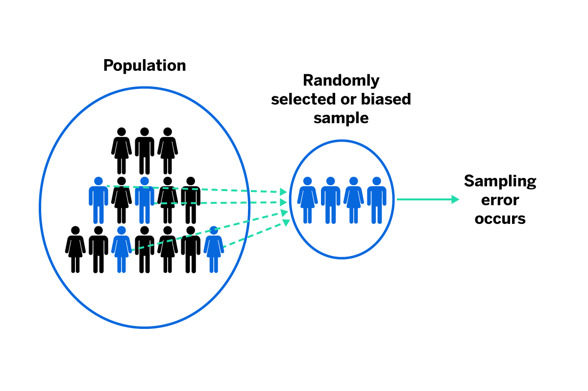

## Table of Contents

## What is sampling bias in the context of machine learning?

Sampling bias in machine learning happens when the data used to train a model does not represent the whole population it is supposed to predict for. This can lead to a model that works well on the training data but performs poorly on new, real-world data. Imagine you're trying to predict what kind of music people like, but you only ask teenagers. Your model might think everyone loves the same music as teenagers, which isn't true for all ages.

To avoid sampling bias, it's important to collect data that covers all the different groups your model will need to predict for. If you're building a model to predict health outcomes, you need data from people of all ages, genders, and backgrounds. By making sure your training data is diverse and representative, you can build a model that makes more accurate predictions for everyone.

## How does sampling bias affect the performance of machine learning models?

Sampling bias can really mess up how well a machine learning model works. When the data used to train the model doesn't include all the different kinds of people or situations the model will see in real life, the model learns to make predictions based on a limited view. For example, if you're trying to predict if someone will like a movie, but you only ask people who already like action movies, your model might think everyone loves action movies. This means when the model meets someone who likes romance movies, it might guess wrong because it was trained on biased data.

This problem can lead to the model making a lot of mistakes when it's used in the real world. If the model was trained on data that's not a good mix of everything out there, it won't be able to predict well for everyone. It's like trying to guess what all people in a city like to eat, but you only asked people in one neighborhood. The model might work great for that neighborhood but fail for the rest of the city. To fix this, you need to make sure your training data includes a good mix of everything, so your model can learn to predict for everyone, not just a small group.

## What are common sources of sampling bias in data collection?

One common source of sampling bias comes from how data is collected. If you only ask people in one place, like a city or a school, you might miss out on what people in other places think or do. For example, if you're trying to learn about what music people like and you only ask people at a rock concert, your data will be full of people who like rock music. This means your model might think everyone loves rock music, which isn't true.

Another source of bias can come from who chooses to respond to surveys or participate in studies. Sometimes, people who are really interested in a topic are more likely to answer a survey. If you're asking about health habits and only people who care a lot about health respond, your data won't include people who don't think about health as much. This can make your model think everyone is super healthy, which isn't right.

Lastly, bias can also come from the tools or methods used to collect data. If a website only tracks users who log in, you might miss out on what people who don't log in do. Or if you use a phone app to collect data, you might only get information from people who have smartphones. These methods can leave out big parts of the population, making your data biased and your model less accurate.

## Can you explain the difference between sampling bias and other types of bias in machine learning?

Sampling bias happens when the data used to train a [machine learning](/wiki/machine-learning) model doesn't include all the different kinds of people or situations the model will see in the real world. For example, if you're trying to predict what kind of food people like, but you only ask people in a fancy restaurant, your model might think everyone loves expensive food. This can make the model work well on the data it was trained on but fail when it meets new people or situations. To fix sampling bias, you need to make sure your training data includes a good mix of everything, so your model can learn to predict for everyone.

Another type of bias is measurement bias, which comes from how data is collected or measured. If you're using a scale that always shows weights a little heavier than they really are, your data will be off, and your model might think everyone is heavier than they are. This kind of bias can be fixed by using better tools or methods to collect data. Then there's algorithmic bias, which happens when the model itself has problems. For example, if a model is designed to predict job performance but it's based on old data that doesn't include women in certain roles, it might unfairly predict that women won't do well in those jobs. To fix algorithmic bias, you might need to change how the model works or use different data to train it.

Both sampling bias and these other types of bias can make a machine learning model less accurate and fair. But they come from different places. Sampling bias is about who or what is included in the data, measurement bias is about how the data is collected, and algorithmic bias is about problems in the model itself. Understanding these differences can help you find and fix the right kind of bias to make your model better.

## What are some real-world examples where sampling bias has significantly impacted machine learning outcomes?

One real-world example where sampling bias significantly impacted machine learning outcomes is in the development of facial recognition technology. Many early facial recognition systems were trained on datasets that were not diverse, often including mostly images of lighter-skinned individuals. As a result, these systems performed much worse at recognizing faces of people with darker skin tones. This led to issues like misidentification and higher error rates for certain groups, causing problems in applications like security and law enforcement.

Another example can be seen in the healthcare sector, particularly in the development of predictive models for disease risk. If a model is trained on data primarily collected from urban hospitals, it might not accurately predict disease risk for people living in rural areas. The urban data might not include enough cases of certain conditions that are more common in rural settings, leading the model to underestimate the risk for rural patients. This kind of bias can result in misdiagnosis or delayed treatment, which can have serious health consequences.

In the world of online advertising, sampling bias has also played a significant role. Advertisers often use machine learning models to target ads based on user data. If these models are trained on data from users who are more likely to click on ads (like younger, tech-savvy individuals), the model might not work well for older or less tech-savvy users. This can lead to ads being shown to the wrong audience, wasting money and reducing the effectiveness of advertising campaigns.

## How can one detect sampling bias in a dataset?

To detect sampling bias in a dataset, you need to look at who or what is included in your data and compare it to the whole group you want to predict for. Start by checking if your data includes different kinds of people or things. For example, if you're studying what people like to eat, make sure your data has information from people of different ages, places, and backgrounds. If your data only includes people from one city or one age group, it might be biased. You can use graphs or charts to see if certain groups are missing or over-represented in your data.

Another way to detect sampling bias is by using statistical methods. You can compare your dataset to known population [statistics](/wiki/bayesian-statistics). For instance, if you know that 50% of the population is female, but only 30% of your dataset is female, this might show sampling bias. You can use tools like histograms or pie charts to visually check these differences. If you want to get more technical, you can use statistical tests to see if the differences between your dataset and the population are significant. This can help you understand if your data is truly biased or if the differences are just by chance.

## What techniques can be used to mitigate or correct for sampling bias?

One way to fix sampling bias is by collecting more data to make your dataset more complete. If you notice that your data doesn't include enough people from certain groups, you can go out and gather more information from those missing groups. For example, if your data on music preferences only includes young people, you might want to ask older people too. This way, your model can learn about what everyone likes, not just a small group. Another technique is called stratified sampling, where you divide the population into different groups (or strata) and then make sure you collect data from each group in the right amounts. If you know that 20% of the population is over 60, you would make sure that 20% of your data comes from people over 60.

Another method to correct for sampling bias is by using weighting techniques. If you can't collect more data, you can adjust the importance of the data you already have. For instance, if you have too few older people in your dataset, you can give more weight to the data from older people to balance things out. This can be done using statistical weights, where you multiply the data from under-represented groups by a larger number to make them count more in the model. You can also use resampling methods like bootstrapping, where you take multiple samples from your dataset to create a new, more balanced dataset. By doing this, you can help your model make better predictions for everyone, not just the people who were well-represented in your original data.

## How does sampling bias relate to the concept of representativeness in statistics?

Sampling bias and representativeness are closely linked in statistics. Representativeness means that the sample you collect should mirror the larger population you're studying. If your sample is representative, it includes all the different kinds of people or things in the same proportions as they exist in the whole population. Sampling bias happens when your sample doesn't match the population well. For example, if you're trying to learn about what people like to eat, but you only ask people in a fancy restaurant, your sample won't be representative of everyone's food preferences. This can lead to wrong conclusions because your sample doesn't reflect the whole population.

To fix sampling bias and make your sample more representative, you need to carefully choose how you collect your data. One way is to use stratified sampling, where you divide the population into different groups and make sure you get data from each group in the right amounts. For instance, if 30% of the population is under 18, you should make sure 30% of your sample is also under 18. Another way is to weight the data you already have, giving more importance to under-represented groups. By doing these things, you can help make your sample more representative and reduce the impact of sampling bias on your results.

## What role does sampling bias play in the fairness and ethics of machine learning applications?

Sampling bias can make machine learning models unfair and cause ethical problems. When a model is trained on data that doesn't include everyone, it might make wrong guesses about certain groups of people. For example, if a model for predicting job success is trained only on data from men, it might not work well for women. This can lead to unfair decisions, like not giving women the same job opportunities as men. It's important for models to be fair to everyone, but sampling bias can stop this from happening.

To fix these problems, we need to make sure the data used to train models includes a good mix of everyone. This means collecting data from all different kinds of people and situations. If we do this, our models can make better and fairer predictions. It's not just about making the model work better; it's also about treating everyone fairly and making sure our technology helps everyone, not just a few. By paying attention to sampling bias, we can build machine learning applications that are more ethical and just.

## How can advanced statistical methods help in understanding and reducing sampling bias?

Advanced statistical methods can help us understand and reduce sampling bias by giving us tools to check if our data is a good mix of everything. One way is by using statistical tests to see if the people or things in our data match the whole group we want to study. For example, if we know that 50% of the population is female, we can use a test to see if our data has about the same percentage of females. If it doesn't, we know we have sampling bias. We can also use graphs and charts to see if certain groups are missing or over-represented in our data. By looking at these, we can spot where the bias is and start to fix it.

Another way advanced statistical methods help is by letting us adjust our data to make it more balanced. If we can't collect more data, we can use weighting techniques to give more importance to the data from groups that are not well-represented. For example, if older people are under-represented in our data, we can give their data more weight to balance things out. We can also use resampling methods like bootstrapping, where we take multiple samples from our dataset to create a new, more balanced dataset. By doing this, we can help our model make better predictions for everyone, not just the people who were well-represented in our original data.

## What are the implications of sampling bias in large-scale machine learning models, such as those used in deep learning?

Sampling bias can have big effects on large-scale machine learning models like those used in [deep learning](/wiki/deep-learning). These models often need a lot of data to learn well, but if the data has sampling bias, the model might learn the wrong things. For example, if a deep learning model for image recognition is trained mostly on pictures of dogs in parks, it might not recognize dogs in other places like homes or streets. This can make the model less useful and accurate in real life because it doesn't see the full range of situations it needs to predict for.

To fix this, it's important to make sure the data used to train these large models is a good mix of everything. If the data is biased, the model might make unfair decisions or wrong guesses about certain groups of people or things. For instance, if a model for predicting loan approvals is trained on data mostly from rich neighborhoods, it might not work well for people from poorer areas. By using advanced statistical methods to check and balance the data, we can help these models learn better and be fairer to everyone.

## How can ongoing monitoring and model updating help manage sampling bias over time?

Ongoing monitoring and model updating are key to managing sampling bias over time. As new data comes in, it's important to keep an eye on it to see if the mix of people or things is changing. If the data starts to include more of one group and less of another, this can introduce new biases. By checking the data regularly, you can spot these changes early and fix them before they mess up your model's predictions. This means your model stays accurate and fair, even as the world around it changes.

Updating the model with new, balanced data helps keep it working well. If you find that your data is becoming biased, you can add more data from under-represented groups to balance things out. This way, your model can keep learning about everyone, not just a few. By doing this, you make sure your model stays useful and fair over time, helping it to make better predictions for all kinds of people and situations.

## References & Further Reading

[1]: Friedman, J., Hastie, T., & Tibshirani, R. (2009). ["The Elements of Statistical Learning: Data Mining, Inference, and Prediction."](https://link.springer.com/book/10.1007/978-0-387-84858-7) Springer Series in Statistics.

[2]: Torres, R. (2020). ["The Impact of Dataset Characteristics on Deep Learning Models for Optical Character Recognition."](https://www.sciencedirect.com/science/article/pii/S2590005622000911) IEEE Access, 8.

[3]: Lum, K., & Isaac, W. (2016). ["To predict and serve?"](https://academic.oup.com/jrssig/article/13/5/14/7029190) Significance, 13(5), 14-19.

[4]: Suresh, H., & Guttag, J. V. (2021). ["A Framework for Understanding and Mitigating Machine Learning Bias."](https://arxiv.org/abs/1901.10002) Communications of the ACM, 64(8), 58-66.

[5]: Bolukbasi, T., Chang, K. W., Zou, J. Y., Saligrama, V., & Kalai, A. T. (2016). ["Man is to Computer Programmer as Woman is to Homemaker? Debiasing Word Embeddings."](https://arxiv.org/abs/1607.06520) Advances in Neural Information Processing Systems 29.

[6]: Buolamwini, J., & Gebru, T. (2018). ["Gender Shades: Intersectional Accuracy Disparities in Commercial Gender Classification."](https://www.media.mit.edu/publications/gender-shades-intersectional-accuracy-disparities-in-commercial-gender-classification/) Proceedings of the 1st Conference on Fairness, Accountability and Transparency.

[7]: Barocas, S., Hardt, M., & Narayanan, A. (2019). ["Fairness and Machine Learning: Limitations and Opportunities."](https://fairmlbook.org/) fairmlbook.org.