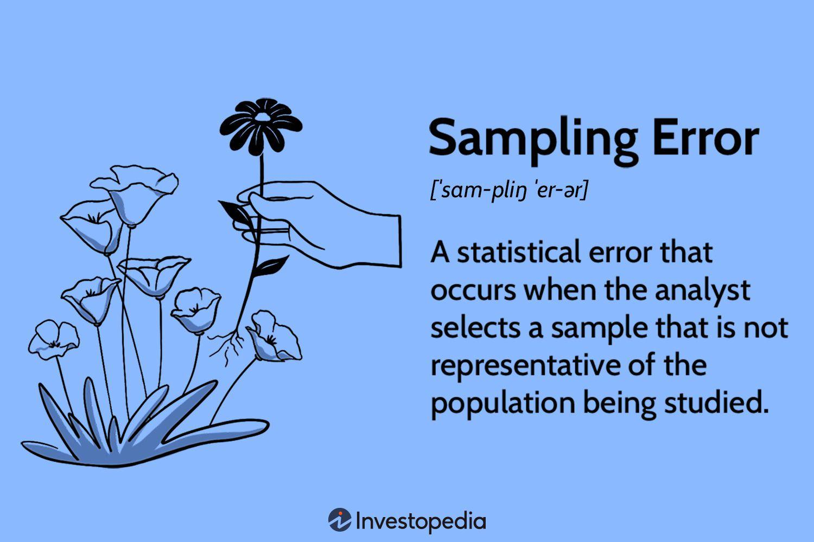

## Table of Contents

## What is a sampling error in statistics?

A sampling error is the difference between the results from a sample and the true results from the entire population. Imagine you want to know the average height of all students in a school, but it's too hard to measure everyone. So, you measure a smaller group, or sample, instead. If the average height of your sample is different from the true average height of all students, that difference is called a sampling error.

Sampling errors happen because a sample is just a part of the whole population, and it might not perfectly represent everyone. The size of the sample matters a lot. A larger sample usually gives a smaller sampling error because it's more likely to be a good representation of the whole population. But even with a big sample, there can still be some error because you're not measuring everyone.

## How does sampling error differ from non-sampling error?

Sampling error and non-sampling error are two types of errors that can happen when you're doing research or surveys. Sampling error is the difference between the results you get from a sample and the true results from the whole population. It happens because you're only looking at a part of the population, not everyone. For example, if you ask 100 people in a city of 1 million about their favorite food, the results might not perfectly match what everyone in the city likes. The bigger your sample, the smaller the sampling error usually is.

Non-sampling error, on the other hand, is any other kind of mistake that can happen during your research that isn't related to the size of your sample. These errors can come from things like mistakes in how you collect the data, like if people misunderstand the questions or if there are errors in recording the answers. They can also happen if some people in your sample don't respond, or if the sample isn't chosen in a fair way. Non-sampling errors can be tricky because they don't go away just by making your sample bigger; you need to be careful in how you design and [carry](/wiki/carry-trading) out your study to reduce them.

## What are the common causes of sampling errors?

Sampling errors happen mainly because the sample you choose might not be a perfect match for the whole group you're studying. Imagine you want to know what all the kids in a school think about a new playground. If you only ask the kids in one class, your sample might not represent what all the kids think. This can happen if you pick your sample in a way that leaves out some types of people or if your sample is too small to catch all the different opinions in the whole group.

Another reason for sampling errors is just random chance. Even if you pick your sample carefully, you might still get different results than if you asked everyone. It's like flipping a coin: even if it's fair, you might get more heads than tails in a small number of flips just by chance. The bigger your sample, the less likely these random differences are to cause big errors, but they can still happen.

## Can you explain the concept of a sampling frame and its relation to sampling errors?

A sampling frame is like a list that you use to pick people or things for your sample. Imagine you want to survey all the students in a school. Your sampling frame might be a list of all the students' names. If this list is complete and up-to-date, it helps you pick a sample that's a good match for the whole school. But if the list is missing some students or has old information, your sample might not be a good match, and this can lead to sampling errors.

Sampling errors happen when your sample doesn't perfectly represent the whole group you're studying. If your sampling frame is not right, it can make these errors bigger. For example, if your list of students only includes kids from one grade, your sample won't show what all the students in the school think. So, having a good sampling frame is important because it helps you pick a sample that's more likely to give you accurate results and reduce sampling errors.

## How does sample size affect the magnitude of sampling errors?

The size of your sample really matters when it comes to how big your sampling errors can be. A bigger sample usually means smaller sampling errors. This is because a larger sample is more likely to be a good match for the whole group you're studying. Imagine you want to know what everyone in your town thinks about a new park. If you only ask 10 people, your sample might not show what everyone thinks. But if you ask 1,000 people, your sample is more likely to be a good match for the whole town, and your results will be closer to the truth.

Even with a big sample, there can still be some sampling error because you're not asking everyone. But the error will usually be smaller than if you used a smaller sample. It's like flipping a coin: if you flip it 10 times, you might get more heads than tails just by chance. But if you flip it 1,000 times, the number of heads and tails will be closer to even. So, using a bigger sample helps make your results more accurate and reduces the chance of big mistakes.

## What is the role of random sampling in reducing sampling errors?

Random sampling is a way to pick people or things for your sample that gives everyone an equal chance of being chosen. When you use random sampling, it helps make your sample more likely to be a good match for the whole group you're studying. This is because random sampling doesn't leave out certain types of people on purpose, which can happen if you pick your sample in other ways. By giving everyone an equal chance, random sampling helps to spread out any differences between your sample and the whole group, making your results more accurate.

Using random sampling can reduce sampling errors because it helps make sure your sample is a fair representation of the whole group. If you don't use random sampling, you might accidentally pick a sample that's different from the whole group in important ways. For example, if you only ask people at a shopping mall, you might miss people who don't shop there. Random sampling helps avoid these kinds of mistakes, which means your sample is more likely to give you results that are close to the truth about the whole group.

## How can stratification help in minimizing sampling errors?

Stratification is a way to make sure your sample matches the whole group you're studying by dividing the group into smaller parts, called strata, and then [picking](/wiki/asset-class-picking) a sample from each part. Imagine you want to know what all the kids in a school think about a new playground. If you just pick kids at random, you might end up with too many from one grade and not enough from another. But if you divide the school into grades and pick a sample from each grade, your sample will be more like the whole school. This helps make your results more accurate because your sample is a better match for the whole group.

Using stratification helps reduce sampling errors because it makes sure that important parts of the group are included in your sample. If you know that different grades might think differently about the playground, stratification makes sure you hear from each grade. This way, your sample won't miss out on what some kids think just because they're in a smaller grade or because you picked them at random. By making sure all parts of the group are represented, stratification helps make your sample more like the whole group, which means your results will be closer to the truth.

## What statistical measures are used to quantify sampling errors?

To measure how big sampling errors might be, statisticians use something called the standard error. The standard error is like a guess of how much your sample results might differ from the true results of the whole group. If you imagine your sample results as a target, the standard error tells you how far off the center of the target your sample might be. The smaller the standard error, the more accurate your sample is likely to be. The size of your sample matters a lot here: bigger samples usually have smaller standard errors because they're more likely to match the whole group.

Another way to talk about sampling errors is with confidence intervals. A confidence interval is a range of numbers that you think the true result for the whole group is likely to fall within. It's like saying, "We're pretty sure the average height of all students is between 5 feet and 5 feet 2 inches." The confidence interval gives you an idea of how much your sample results might be off. If you want to be more sure, you can make the interval wider, but then it's less precise. The size of the confidence interval is linked to the standard error: smaller standard errors mean smaller confidence intervals, which means more precise guesses about the whole group.

## How do confidence intervals relate to sampling errors?

Confidence intervals are a way to show how sure you are about your sample results compared to the true results for the whole group. Imagine you measured the heights of some students and found the average height. A confidence interval would be a range of heights that you think the true average height of all students is likely to fall within. If your confidence interval is from 5 feet to 5 feet 2 inches, you're saying you're pretty sure the true average height for everyone is somewhere in that range. The size of this range depends on how big your sampling error might be. If the sampling error is small, your confidence interval will be smaller too, meaning your guess about the whole group is more precise.

The connection between confidence intervals and sampling errors is all about how much your sample results might differ from the true results. The sampling error is like a measure of how far off your sample might be. When you create a confidence interval, you're using the size of the sampling error to figure out how wide that interval should be. If you want to be more sure that your interval includes the true result, you might make it wider, but that makes your guess less precise. So, confidence intervals help you understand and show the possible impact of sampling errors on your results.

## What advanced techniques can be used to estimate and correct for sampling errors in complex surveys?

In complex surveys, one advanced technique to estimate and correct for sampling errors is using something called "design-based variance estimation." This method takes into account how the sample was chosen, which can be tricky in big surveys where you might use different ways to pick people from different groups. For example, if you're doing a survey across a whole country, you might pick people differently in cities than in rural areas. Design-based variance estimation helps you figure out how much your sample results might differ from the true results because of these different ways of picking people. By understanding this, you can make better guesses about how accurate your survey results are and even adjust them to be more correct.

Another technique is "model-assisted estimation," which uses math models to help with the sampling error. Imagine you're trying to guess the weight of all the fish in a lake. You catch some fish and weigh them, but you also know things like the size of the lake and the types of fish that live there. Model-assisted estimation uses this extra information to make your guesses more accurate. It's like using a map to help you find your way, not just wandering around. This method can help reduce sampling errors by giving you a better idea of what the whole group might look like, even if your sample isn't perfect.

## How does the Central Limit Theorem impact the understanding and management of sampling errors?

The Central Limit Theorem is like a magic rule in [statistics](/wiki/bayesian-statistics) that helps us understand and manage sampling errors. Imagine you're trying to guess the average height of all the kids in a school. You take samples of different groups of kids and find the average height for each sample. The Central Limit Theorem says that if you keep doing this and your samples are big enough, the averages from your samples will start to look like a normal bell-shaped curve, no matter what the actual heights of all the kids look like. This helps us because it means we can use this bell curve to predict how much our sample average might be off from the true average of all the kids. It's like having a map that shows us where our guesses might be wrong.

This theorem is super helpful for managing sampling errors because it lets us use the normal distribution to figure out things like the standard error and confidence intervals. If we know our sample averages follow a normal curve, we can calculate how likely it is that our sample results are close to the true results. This helps us decide how big our sample needs to be to get accurate results. For example, if we want our guess about the average height to be really close to the true average, we can use the Central Limit Theorem to figure out how many kids we need to measure. It's like having a tool that helps us make our guesses more reliable and understand how much we can trust our sample results.

## What are the latest research developments in reducing sampling errors in big data analytics?

In the world of big data analytics, one of the latest research developments to reduce sampling errors is the use of [machine learning](/wiki/machine-learning) algorithms. These algorithms can help pick samples that are more likely to match the whole group by learning from the data. For example, if you're studying a huge amount of customer data, machine learning can help you find patterns and choose a sample that includes all the different types of customers. This way, your sample is more like the whole group, which means your results will be more accurate and your sampling errors will be smaller. Researchers are working on making these algorithms better and faster so they can handle even bigger sets of data.

Another development is the use of adaptive sampling techniques. These methods change how they pick samples as they learn more about the data. Imagine you're trying to understand a big crowd of people. At first, you might pick people randomly, but as you learn more, you can start picking people in a smarter way to make sure you're not missing anyone important. Adaptive sampling helps make sure your sample keeps getting better and better as you go along, which reduces sampling errors. This is especially useful in big data where the data keeps changing, and researchers are finding new ways to make these techniques work even better.

## References & Further Reading

[1]: Bergstra, J., Bardenet, R., Bengio, Y., & Kégl, B. (2011). ["Algorithms for Hyper-Parameter Optimization."](https://papers.nips.cc/paper/4443-algorithms-for-hyper-parameter-optimization) Advances in Neural Information Processing Systems 24.

[2]: ["Advances in Financial Machine Learning"](https://www.amazon.com/Advances-Financial-Machine-Learning-Marcos/dp/1119482089) by Marcos Lopez de Prado

[3]: ["Evidence-Based Technical Analysis: Applying the Scientific Method and Statistical Inference to Trading Signals"](https://www.amazon.com/Evidence-Based-Technical-Analysis-Scientific-Statistical/dp/0470008741) by David Aronson

[4]: ["Machine Learning for Algorithmic Trading"](https://github.com/stefan-jansen/machine-learning-for-trading) by Stefan Jansen

[5]: ["Quantitative Trading: How to Build Your Own Algorithmic Trading Business"](https://www.amazon.com/Quantitative-Trading-Build-Algorithmic-Business/dp/1119800064) by Ernest P. Chan