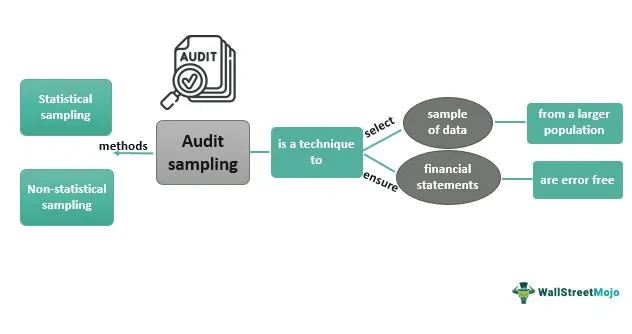

This article explores the interconnections between marketing, sampling, auditing, and algorithmic trading. These domains, though distinct, share a reliance on data-driven decision-making techniques. Understanding these interconnections is crucial, as the methodologies adopted within these sectors have profound implications for modern financial and trading strategies.

Sampling is a pivotal technique that links these domains by enabling efficient data analysis. It is used to select a representative subset from a larger population, allowing researchers and analysts to draw conclusions without the need for exhaustive data collection. In marketing, sampling helps companies gather insights into consumer preferences and behaviors, enabling them to tailor their products and strategies effectively. Similarly, auditors utilize sampling methods to examine financial records, enhancing the efficiency and accuracy of audits. In algorithmic trading, sampling is used to test and refine trading models, ensuring their effectiveness in varying market conditions. Different types of sampling, such as random, stratified, and systematic, serve specific purposes across these fields, highlighting its versatility.



Auditing plays a crucial role in algorithmic trading by ensuring transparency and reliability. With the increasing reliance on algorithms to execute trades, it is essential to maintain rigorous auditing practices. Audits help assess the accuracy of trading models, identify potential risks, and ensure compliance with financial regulations. This not only upholds the integrity of the trading process but also boosts investor confidence.

The integration of sampling and auditing into algorithmic trading forms the backbone of data-driven financial strategies. Effective sampling provides trading algorithms with reliable data, which is essential for developing robust models. Meanwhile, regular auditing ensures that these models operate transparently and adhere to regulations. Together, these elements contribute to the ongoing evolution of financial markets, fostering more accurate and responsible trading decisions. As a result, the convergence of these disciplines continues to shape a more informed and stable financial landscape.

## Table of Contents

## Understanding Sampling and Its Applications

Sampling is a statistical technique used to extract and analyze a subset of data from a larger population. This method enables researchers and analysts to gather insights without the need for complete data collection, making it a fundamental tool in various sectors like marketing, auditing, and algorithmic trading.

In marketing, sampling is instrumental in understanding consumer preferences and behaviors. Companies employ sampling methodologies, such as surveys and focus groups, to gather data on potential customer segments. These strategies allow firms to make informed decisions regarding product development, pricing, and promotional campaigns. For instance, a random sampling approach might be used to select participants for a survey, ensuring the results can be generalized to the larger target audience.

Auditors utilize sampling techniques to enhance the effectiveness and efficiency of their reviews of financial records. By focusing on a representative subset of financial transactions, auditors can assess the accuracy and integrity of financial statements without needing to examine every single transaction. This approach not only saves time but also ensures a high level of assurance is maintained in the auditing process. Techniques such as stratified sampling, where financial records are divided into distinct categories before sampling, help auditors focus on high-risk areas.

In [algorithmic trading](/wiki/algorithmic-trading), sampling is crucial for the development and testing of trading models. By using subsets of historical market data, developers can evaluate the performance of trading algorithms under various conditions, a process known as [backtesting](/wiki/backtesting). This ensures that the trading strategies are robust and capable of adapting to different market scenarios. Systematic sampling methods can also be applied to analyze large datasets, facilitating the optimization of trading algorithms.

Different types of sampling serve distinct purposes across these fields. Random sampling ensures that every member of the population has an equal chance of being selected, thus providing unbiased results. Stratified sampling divides the population into homogenous subgroups before sampling, guaranteeing that all subgroups are adequately represented. Systematic sampling selects every nth element from a list, providing a convenient and straightforward method for large datasets.

These sampling techniques, when correctly implemented, provide accurate insights and enhance decision-making across marketing, auditing, and algorithmic trading domains, ensuring that analyses are both efficient and reliable.

## The Role of Auditing in Algorithmic Trading

Auditing in algorithmic trading is crucial for maintaining the integrity and compliance of financial operations in line with established regulations. This process involves a range of methodologies, including audit sampling, which allows auditors to evaluate the effectiveness of trading algorithms and the internal controls that govern them. Through a comprehensive audit, potential risks and biases within these algorithms can be identified, ensuring that trading operations remain fair and transparent.

Audit sampling is a key tool employed by auditors to draw conclusions about a complete set of data based on a subset. This method is essential in the evaluation of algorithmic trading systems, where exhaustive data analysis might be impractical due to the sheer [volume](/wiki/volume-trading-strategy) of transactions and data involved. The method used in sampling significantly affects the outcomes of model evaluations, making the choice of sampling strategy critical to the accuracy of the trading models.

The sampling method's robustness plays a pivotal role in the accuracy of trading models. For instance, if a sample is not representative of the whole dataset, the conclusions drawn could lead to ineffective trading strategies. Statistical techniques like stratified sampling or systematic sampling can be utilized to ensure that the sample accurately reflects the diverse conditions under which trading algorithms operate.

Through auditing, firms can identify inherent risks such as model overfitting, where a trading algorithm performs well on historical data but fails under new market conditions. Detecting biases that may lead to skewed trading outcomes is also an essential audit function. An unbiased and comprehensive audit can highlight any discrepancies between expected and actual performance, thus safeguarding the fairness of trading activities.

Effective auditing contributes significantly to investor confidence. By assuring stakeholders that trading practices adhere to regulatory standards and that any anomalies are promptly addressed, the transparency of trading strategies is enhanced. This transparency not only builds trust but also encourages more stable financial environments, which is vital for the ongoing success of algorithmic trading operations in rapidly evolving markets.

## Marketing Insights Through Advanced Sampling Techniques

Sampling in marketing provides a robust foundation for developing strategies aimed at specific customer segments. By employing diverse sampling techniques, businesses can gain a comprehensive understanding of consumer behavior and preferences, which in turn influences product design and marketing strategies.

Random sampling is widely utilized in marketing to ensure that every individual in a population has an equal chance of being selected. This technique helps eliminate bias, ensuring the representativeness of the sample. For instance, a company launching a new beverage might use random sampling to select a group of potential consumers for taste testing. By collecting feedback from this sample, the company can infer the broader population's preferences.

Stratified sampling offers an additional layer of granularity by dividing the population into distinct subgroups or strata, based on shared characteristics such as age, income, or buying habits. Each subgroup is then sampled independently. This technique ensures that specific segments are adequately represented, providing a deeper understanding of different demographic groups. For instance, a business may use stratified sampling to gather data on a product's appeal among different age groups, enabling them to tailor marketing messages to each segment more effectively.

Advanced sampling techniques, such as cluster sampling and systematic sampling, further enhance the ability to derive actionable insights from raw data. Cluster sampling involves dividing the population into clusters, typically based on geographic regions or other natural groupings. Systematic sampling selects every nth item from a list, providing a straightforward and efficient means of obtaining a sample. These methods can streamline data collection and analysis processes, making strategic marketing campaigns more focused and impactful.

Ultimately, the insights gained from these sampling techniques can be transformative. By accurately gauging consumer needs, firms can design products and create marketing messages that align closely with market demand. This precision reduces the risk of marketing errors and enhances the return on investment (ROI) for marketing initiatives. For example, a company that understands its customer base's preferences through thorough sampling will likely succeed in launching a product that meets consumer expectations. In today's competitive business landscape, such informed decision-making is essential for maintaining an edge.

In conclusion, sampling in marketing is a powerful tool that offers numerous benefits. By utilizing random and stratified sampling techniques, businesses can gather reliable data on consumer behavior. This information allows for the creation of products and marketing strategies that meet consumer needs, thereby enhancing customer satisfaction and improving ROI. Advanced sampling techniques transform data into actionable insights, ensuring the effectiveness and efficiency of marketing campaigns.

## Advancements in Algorithmic Trading

Algorithmic trading utilizes sophisticated mathematical models and computer algorithms to execute trades at high speeds and large volumes, fundamentally transforming financial markets. This approach facilitates rapid decision-making and capitalizes on fleeting market opportunities that may be imperceptible to human traders. A key element of successful algorithmic trading is the careful application of sampling methods, crucial for backtesting algorithms and validating their performance across various market conditions.

Sampling serves as a foundational tool in backtesting, which involves simulating a trading algorithm's historical performance using past market data. By selecting appropriate samples of data, traders can efficiently test and refine their algorithms, ensuring that they function effectively in different scenarios. For instance, systematic sampling, which involves selecting data points at regular intervals, can help in understanding how an algorithm might perform under a wide range of market conditions. This systematic approach broadens the analysis, allowing traders to identify potential weaknesses or biases and optimize their strategies accordingly.

Recent advancements in algorithmic trading have resulted in more sophisticated strategies that enhance market efficiencies. For example, [machine learning](/wiki/machine-learning) algorithms and [artificial intelligence](/wiki/ai-artificial-intelligence) (AI) are increasingly integrated into trading systems, enabling them to process vast volumes of real-time data and adapt to market changes with unprecedented speed. These innovations are particularly beneficial in high-frequency trading ([HFT](/wiki/high-frequency-trading-strategies)), where the ability to react to market movements in microseconds can significantly impact profitability.

The integration of real-time data through advanced sampling techniques further enhances the adaptability and responsiveness of trading algorithms. By continuously sampling live market data, algorithms can make data-driven decisions that reflect the current state of the market. This capability is vital for strategies such as statistical [arbitrage](/wiki/arbitrage), where identifying and exploiting brief pricing inefficiencies relies on accurate and immediate data analysis.

In Python, for instance, libraries like `pandas` and `numpy` aid in processing and analyzing large datasets, which is essential for effective backtesting and real-time trade execution. Here's a simple example of how one might implement systematic sampling in Python to analyze historical data:

```python
import pandas as pd

# Load historical market data
data = pd.read_csv('historical_market_data.csv')

# Systematic sampling: Select every 10th data point
sampled_data = data[::10]

# Use sampled data for backtesting or further analysis
# For example, calculating moving averages or other indicators
sampled_data['Moving_Average'] = sampled_data['Price'].rolling(window=5).mean()
```

These advancements indicate a shift towards more automated and reliable trading processes, where error reduction and performance improvement are continual goals. As algorithmic trading evolves, traders and developers must stay abreast of new techniques and technologies to maintain competitive advantage and ensure robust trading operations.

## Challenges and Best Practices

Bias in sampling methods poses significant challenges across various domains such as marketing, auditing, and algorithmic trading. Erroneous sampling techniques may lead to incorrect models that do not accurately reflect underlying realities, thereby resulting in inefficient strategies. For instance, if a sampling process is disproportionately skewed towards a specific demographic in market research, businesses might misjudge consumer preferences, leading to suboptimal product offerings.

To ensure the quality and representativeness of a sample, it is vital to employ rigorous sampling frameworks. This includes selecting appropriate sample sizes and methodologies—random, stratified, or systematic—to capture a comprehensive snapshot of the target population. The integrity of analyses hinges on accurate sample representation, reducing the risks associated with sampling bias.

Algorithmic trading, which depends heavily on historical data for model training, faces the risk of overfitting. Overfitting occurs when an algorithm is too finely tuned to its training data, capturing noise rather than the underlying market trends. This results in poor performance when applied to new, unseen data. The challenge is to balance complexity with generalization, ensuring that models perform reliably across varied market situations. A common approach to mitigating this risk is using cross-validation techniques during model development to evaluate its robustness.

Regular audits and updates to models are critical in addressing risks associated with evolving market dynamics. By routinely examining algorithmic systems, auditors can assess the performance, compliance, and fairness of algorithms. This process not only identifies potential biases or anomalies but also aligns the models with current financial regulations and market environments.

Employing best practices in sampling is essential for maintaining accuracy and reliability in marketing and trading activities. It involves adopting comprehensive sampling strategies, conducting thorough audits, and utilizing real-time data integration for ongoing model adjustment. By following these practices, organizations can enhance their decision-making processes, leading to improved outcomes across their operations.

To illustrate, consider a simple Python implementation that checks for sampling bias in a dataset:

```python
import numpy as np
from sklearn.model_selection import train_test_split
from sklearn.linear_model import LinearRegression
from sklearn.metrics import mean_squared_error

# Generate synthetic data
np.random.seed(42)
X = np.random.rand(100, 1) * 10  # Random feature
y = 2 * X.squeeze() + np.random.randn(100) * 2  # Linear relation with noise

# Introduce sampling bias by over-representing a segment
biased_indices = (X < 5).squeeze()
X_biased = np.vstack((X, X[biased_indices]))
y_biased = np.hstack((y, y[biased_indices]))

# Train-test split
X_train, X_test, y_train, y_test = train_test_split(X_biased, y_biased, 
                                                    test_size=0.2, random_state=42)

# Model training
model = LinearRegression()
model.fit(X_train, y_train)

# Predictions and error calculation
y_pred = model.predict(X_test)
error = mean_squared_error(y_test, y_pred)
print(f"Mean Squared Error: {error}")
```

This example demonstrates how a skewed dataset can lead to biased model predictions, emphasizing the need for unbiased, representative sampling and regular evaluation to maintain transparency and reliability.

## Conclusion

The convergence of sampling, auditing, and algorithmic trading is increasingly significant in shaping the future of financial markets. By utilizing precise sampling techniques, financial markets can achieve more accurate and responsible trading decisions. This precision not only enhances the efficacy of algorithmic models but also contributes to the development of robust trading strategies that can withstand diverse market conditions.

Moreover, ensuring transparency through rigorous auditing practices bolsters trust and stability within algorithmic trading environments. Audits play a critical role in verifying the integrity of trading algorithms and ensuring they comply with regulatory standards. This fosters a trustworthy ecosystem that can attract investor confidence and promote sustainable trading operations.

In the marketing sector, systematic sampling offers deeper insights into consumer trends. By accurately capturing consumer preferences and behavior, businesses can tailor their products and marketing strategies to better meet market demands. This targeted approach not only improves the return on investment for marketing initiatives but also minimizes the risk of strategic errors.

As these techniques continue to evolve, they promise to create a more efficient, informed, and reliable financial landscape. The integration of advanced sampling, auditing, and algorithmic trading methodologies is set to enhance market operations, promote transparency, and ensure that financial systems operate at their optimum potential. The ongoing development in these fields heralds a future where financial markets are more resilient and adaptive to dynamic economic environments.

## References & Further Reading

[1]: Thompson, S. K. (2012). [Sampling (3rd ed.)](https://onlinelibrary.wiley.com/doi/book/10.1002/9781118162934). Wiley.

[2]: Cochran, W. G. (1977). [Sampling Techniques (3rd ed.)](https://archive.org/details/samplingtechniqu0000coch_t4x6). Wiley.

[3]: [Audit Sampling: An Introduction to Sampling in Auditing](https://www.amazon.com/Audit-Sampling-Introduction-Statistical-Auditing/dp/0471574627) by the International Federation of Accountants (IFAC).

[4]: Goodhart, C., & Pradhan, M. (2020). [The future of technology in auditing](https://onlinelibrary.wiley.com/doi/10.1111/ecaf.12437). Journal of Financial Services.

[5]: Pardo, R. (2008). [The Evaluation and Optimization of Trading Strategies (2nd ed.)](https://onlinelibrary.wiley.com/doi/book/10.1002/9781119196969). Wiley.

[6]: Montgomery, D. C., & Runger, G. C. (2014). [Applied Statistics and Probability for Engineers (6th ed.)](https://books.google.com/books/about/Applied_Statistics_and_Probability_for_E.html?id=_f4KrEcNAfEC). Wiley.

[7]: Patel, S. S. (2020). [Algorithmic Trading and Quantitative Strategies](https://www.taylorfrancis.com/books/mono/10.1201/9780429183942/algorithmic-trading-quantitative-strategies-raja-velu). Packt Publishing.

[8]: [Implementing the Market Approach to Valuation](https://etonvs.com/valuation/market-approach-valuation-method-per-asc820/) by the CFA Institute.

[9]: Varian, H. R. (2014). [Big Data: New Tricks for Econometrics](https://pubs.aeaweb.org/doi/pdfplus/10.1257/jep.28.2.3). Journal of Economic Perspectives.