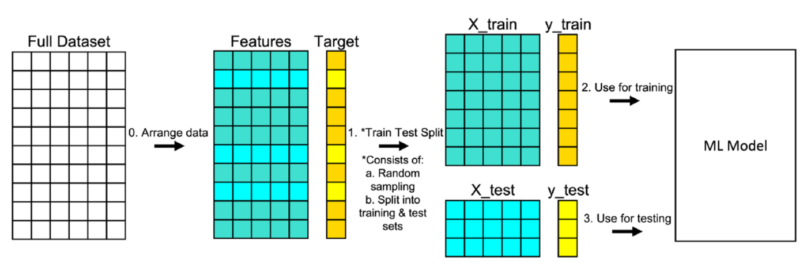

## Table of Contents

## What is sampling with replacement in the context of machine learning?

Sampling with replacement is a method used in machine learning and statistics where you take samples from a dataset, and each time you pick an item, you put it back into the dataset before picking the next item. This means that the same item can be chosen more than once in a single sample. Imagine you have a bag of colored balls and you want to pick some balls. If you pick a ball, note its color, and then put it back into the bag before picking the next one, you are sampling with replacement. This technique is useful when you want to create many different samples from the same dataset, which can help in understanding the data better or in training models more effectively.

In machine learning, sampling with replacement is often used in techniques like bootstrapping. Bootstrapping involves creating many smaller datasets (or bootstrap samples) from the original dataset to estimate the variability of a statistic or to improve the performance of a model. For example, if you have a dataset of 1000 observations, you can create a bootstrap sample by randomly selecting 1000 observations with replacement from this dataset. This means some observations might appear multiple times in the bootstrap sample, while others might not appear at all. This method helps in making more robust predictions and understanding the stability of your model's performance.

## How does sampling with replacement differ from sampling without replacement?

Sampling with replacement and sampling without replacement are two different ways to take samples from a dataset. When you sample with replacement, you pick an item from your dataset, note it down, and then put it back into the dataset. This means you can pick the same item more than once in your sample. It's like drawing a card from a deck, writing down what it is, and then putting it back into the deck before drawing the next card. This method is useful when you want to create many different samples from the same data, which can help in understanding how stable your results are or in training machine learning models more effectively.

On the other hand, when you sample without replacement, you pick an item from your dataset and do not put it back. This means each item can only be chosen once in your sample. It's like drawing a card from a deck, writing down what it is, and then setting it aside so you can't draw it again. This method is used when you want to ensure that every item in your dataset has an equal chance of being chosen, and it's often used when you want to make sure you get a unique set of samples. For example, if you're conducting a survey and want to make sure you get responses from different people, you would sample without replacement.

Both methods have their uses in different scenarios. Sampling with replacement is commonly used in techniques like bootstrapping, which helps estimate how much your results might vary if you took different samples from your data. Sampling without replacement is often used in situations where you need to ensure that your sample represents the whole population without any duplicates, like in random surveys or experiments.

## Why is sampling with replacement used in machine learning algorithms?

Sampling with replacement is used in [machine learning](/wiki/machine-learning) algorithms because it helps create many different versions of a dataset from the same original data. This is important for techniques like bootstrapping, where you want to see how stable your results are. By taking samples with replacement, you can make many small datasets, each a bit different from the others. This lets you see if your model's predictions change a lot or stay the same when you use different samples. It's like testing your model many times to make sure it works well, no matter which part of the data you use.

Another reason is that sampling with replacement can help improve the performance of some machine learning models. For example, in algorithms like Random Forests, each tree in the forest is built using a different sample of the data, taken with replacement. This makes the trees more diverse, which can lead to better overall predictions. By using different samples, the model can learn from various parts of the data and become more robust. This way, the model can handle new data better because it has seen many different versions of the training data.

## Can you explain how sampling with replacement is applied in the bootstrap method?

The bootstrap method uses sampling with replacement to create new datasets from the original data. Imagine you have a jar with many marbles, and you want to see how the average size of marbles might change if you took different samples. You reach into the jar, pick a marble, write down its size, and then put it back into the jar. You do this many times until you have a new sample of marbles. Because you put each marble back, you might pick the same marble more than once. This is sampling with replacement, and it lets you create many different samples from the same jar of marbles.

In machine learning, the bootstrap method works the same way. If you have a dataset with 1000 observations, you can create a new sample by randomly [picking](/wiki/asset-class-picking) 1000 observations from your dataset, but you put each observation back after you pick it. This means some observations might show up more than once in your new sample, while others might not show up at all. You can do this many times to create many different samples. By training your model on these different samples, you can see how much your model's performance might change with different data. This helps you understand how reliable your model is and how it might perform with new data.

## What are the advantages of using sampling with replacement in model training?

Sampling with replacement in model training helps create many different versions of your data. This is useful because it lets you see how well your model works with different sets of data. Imagine you're trying to predict the weather, and you want to make sure your prediction is good no matter what day it is. By using different samples, you can test your model many times and see if it gives good predictions each time. This makes your model more reliable because it has been tested with many different pieces of data.

Another advantage is that it can make your model perform better. For example, in a method called Random Forests, each tree in the forest is built using a different sample of the data, taken with replacement. This makes each tree a bit different, which can lead to better overall predictions. It's like having many friends help you solve a problem. If each friend looks at the problem a bit differently, together they might come up with a better solution than if they all looked at it the same way. So, by using different samples, your model can learn from various parts of the data and become more robust.

## How does sampling with replacement affect the bias and variance of a model?

Sampling with replacement, used in techniques like bootstrapping, can help you understand the bias and variance of your model. Bias is how far off your model's predictions are from the true values, on average. Variance is how much your model's predictions change if you train it on different samples of data. When you use sampling with replacement, you create many different samples from your original data. This lets you train your model on these different samples and see how much its predictions change. If the predictions change a lot, your model has high variance. If they stay pretty much the same, your model has low variance. By doing this, you can see if your model is too sensitive to the specific data it's trained on or if it's more stable.

Using sampling with replacement can also help you estimate the bias of your model. If you train your model on many different samples and the average of all those predictions is far from the true values, then your model has high bias. It means your model is consistently off, no matter what sample you use. On the other hand, if the average of all those predictions is close to the true values, then your model has low bias. So, by using sampling with replacement, you can get a better idea of how well your model will perform on new data, and whether it needs to be adjusted to reduce bias or variance.

## In what scenarios would sampling with replacement be particularly beneficial?

Sampling with replacement is especially helpful when you want to see how well your model works with different pieces of data. Imagine you're trying to predict something, like how many people will buy a new toy. If you use sampling with replacement, you can make many different groups of data and see if your prediction stays the same or changes a lot. This helps you know if your model is reliable because it's been tested with many different sets of data. It's like checking if your guess is good no matter which kids you ask about the toy.

Another scenario where sampling with replacement is useful is when you're trying to make your model better. For example, in a method called Random Forests, you make many small decision trees, each one using a different group of data taken with replacement. This makes each tree a bit different, which can lead to better overall predictions. It's like having many friends help you solve a problem. If each friend looks at the problem a bit differently, together they might come up with a better solution than if they all looked at it the same way. So, by using different samples, your model can learn from various parts of the data and become more robust.

## How can sampling with replacement help in dealing with imbalanced datasets?

When you have an imbalanced dataset, it means that some categories of data appear much more often than others. For example, if you're trying to predict whether an email is spam or not, you might have way more "not spam" emails than "spam" emails. Sampling with replacement can help by creating more samples of the less common category. You can take the smaller group and keep picking samples from it, putting each one back after you pick it. This way, you can make more examples of the less common category without changing the original data. By doing this, you can balance out the dataset and make sure your model learns from both categories equally well.

This technique can be particularly useful in machine learning algorithms that need balanced data to perform well. For instance, if you're using a Random Forest, you can use sampling with replacement to create more balanced subsets of your data for each tree. This helps the model to not be biased towards the more common category and to make better predictions for the less common one. By using sampling with replacement, you can improve the performance of your model on imbalanced datasets and make sure it's fair and accurate for all types of data.

## What are the potential drawbacks or limitations of using sampling with replacement?

One potential drawback of using sampling with replacement is that it can sometimes lead to overfitting. When you create many samples from the same data, you might end up training your model on very similar data over and over again. This can make your model too good at predicting the data it has seen but not as good at predicting new data. It's like practicing the same math problem so many times that you can solve it perfectly, but then you struggle with a slightly different problem on a test.

Another limitation is that sampling with replacement can be time-consuming and computationally expensive. If you need to create many different samples to train your model, it can take a lot of time and computer power. This might be a problem if you're working with a large dataset or if you don't have a powerful computer. It's like trying to cook a big meal for a lot of people; it takes more time and effort than cooking for just a few.

## How does sampling with replacement impact the performance of ensemble methods like Random Forests?

Sampling with replacement plays a big role in making Random Forests work well. In a Random Forest, you build many small decision trees, and each tree uses a different sample of the data, taken with replacement. This means some pieces of data might show up more than once in one tree's sample, while other pieces might not show up at all. By doing this, each tree ends up being a bit different from the others. When you combine all these different trees, they can make better predictions together because they've learned from different parts of the data. It's like having a team of friends where each friend looks at a problem a bit differently, and together they come up with a better solution.

However, there can be some downsides to using sampling with replacement in Random Forests. Sometimes, if the samples are too similar, the trees might all learn the same things and not be as diverse as they should be. This can lead to overfitting, where the Random Forest is really good at predicting the data it's been trained on but not as good with new data. Also, creating many different samples can take a lot of time and computer power, especially if you're working with a big dataset. So, while sampling with replacement can make Random Forests more powerful, it's important to balance it carefully to avoid these issues.

## Can you discuss any advanced techniques that leverage sampling with replacement for optimizing machine learning models?

One advanced technique that uses sampling with replacement is called Bagging, short for Bootstrap Aggregating. In Bagging, you make many different versions of your dataset by sampling with replacement, and then you train a model on each version. After that, you combine all the models' predictions to make a final prediction. This helps reduce the chance that your model is overfitting to the specific data it's trained on because each model sees a slightly different set of data. It's like having a group of friends vote on the best answer to a question; even if one friend gets it wrong, the group's combined answer is usually better.

Another technique is called Boosting, which also uses sampling with replacement but in a different way. In Boosting, you start with a model trained on the whole dataset. Then, you create a new sample with replacement, but you make sure to include more of the data points that the first model got wrong. You train another model on this new sample, and you keep doing this, focusing more on the hard-to-predict data each time. By the end, you have a series of models that work together, each one helping to correct the mistakes of the previous ones. This can make your final model much better at predicting new data because it has learned to handle the tricky cases.

Both Bagging and Boosting can be used to make your models more accurate and reliable. They take advantage of sampling with replacement to create diverse sets of data, which helps the models learn from different perspectives. By combining these models, you can get better predictions and a more robust machine learning system.

## What research or studies have been conducted to evaluate the effectiveness of sampling with replacement in various machine learning applications?

Researchers have studied how sampling with replacement helps in machine learning, especially in methods like bootstrapping and ensemble learning. One important study looked at how bootstrapping can help estimate the performance of a model. They found that by using sampling with replacement to create many different samples, they could see how much a model's predictions might change with different data. This helped them understand if the model was reliable or if it might give very different answers with new data. The study showed that sampling with replacement can make models more stable and give a better idea of how they will work in real life.

Another study focused on how sampling with replacement improves ensemble methods like Random Forests. They found that by creating different samples of data for each tree in the forest, the trees learn different things and can make better predictions together. The research showed that this method reduces the chance of overfitting, where a model is too good at predicting the data it's trained on but not good with new data. They also found that sampling with replacement can help deal with imbalanced datasets by creating more examples of the less common category, making the model fairer and more accurate for all types of data.

## References & Further Reading

[1]: Efron, B., & Tibshirani, R. J. (1993). ["An Introduction to the Bootstrap."](https://www.semanticscholar.org/paper/An-Introduction-to-the-Bootstrap-Efron-Tibshirani/85a8a97f614b2b6823e035bcc9abcb0f3d27be4d) Chapman & Hall/CRC.

[2]: Breiman, L. (2001). ["Random Forests."](https://link.springer.com/article/10.1023/A:1010933404324) Machine Learning, 45(1), 5-32.

[3]: Friedman, J., Hastie, T., & Tibshirani, R. (2009). ["The Elements of Statistical Learning: Data Mining, Inference, and Prediction."](https://link.springer.com/book/10.1007/978-0-387-84858-7) Springer.

[4]: Hastie, T., Tibshirani, R., & Friedman, J. (2009). ["The Elements of Statistical Learning: Data Mining, Inference, and Prediction, Second Edition."](https://link.springer.com/book/10.1007/978-0-387-84858-7) Springer.

[5]: Thomas, M. C., & Hettmansperger, T. P. (2001). ["Bootstrapping the Test for Symmetry about an Unknown Median."](https://www.taylorfrancis.com/books/mono/10.1201/b10451/robust-nonparametric-statistical-methods-thomas-hettmansperger-joseph-mckean) Communications in Statistics - Simulation and Computation.