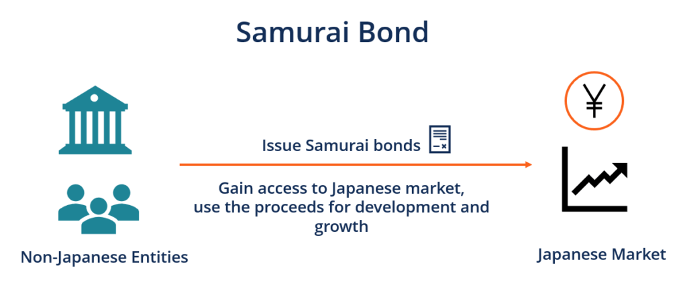

Samurai Bonds are a pivotal instrument within the financial landscape, serving as a critical component of foreign investment in Japan. Introduced in the late 1970s, these are yen-denominated bonds issued in Japan by non-Japanese entities. Their significance is deeply rooted in providing foreign issuers with access to Japan's substantial pool of capital while offering Japanese investors diversification opportunities without currency exchange risks.

The allure of Samurai Bonds stems from the convergence of global financial practices with specific Japanese regulatory frameworks. The Japanese debt market, one of the largest and most liquid in the world, presents attractive opportunities for foreign issuers seeking to diversify their funding sources. At the same time, it appeals to Japanese investors who are keen on exploring non-domestic issuances while managing currency exposure effectively.

Japan's economic environment presents a unique cultural and financial backdrop, characterized by its influential debt market. In 2022, Japan held over $12 trillion in government bonds, underscoring its prominence on the global financial stage. The issuance of Samurai Bonds aligns with this economic setting, enabling foreign entities to strategically penetrate this market, thereby facilitating cross-border capital flows and fostering economic connectivity.

Moreover, Samurai Bonds provide numerous benefits to both investors and issuers. For investors, these bonds offer access to high-quality global credit without currency conversion costs, thus serving as an effective investment vehicle amidst Japan’s low-interest-rate environment. For issuers, Samurai Bonds present a platform to raise funds in yen, which can be particularly advantageous for those with business interests or obligations in Japan.

The regulatory framework established by the Japanese Financial Services Agency ensures that Samurai Bonds comply with specific standards that maintain market stability and investor confidence. This regulatory rigor enhances the reliability and attractiveness of Samurai Bonds to global investors and issuers seeking secure yet flexible investment avenues.

In summary, Samurai Bonds represent a dynamic bridge between international financial entities and the Japanese debt market. Their role in facilitating foreign investment is underscored by the blend of global financial practices with the stability and opportunity inherent in Japan’s economic environment. As such, Samurai Bonds are not just a financial product, but a vital component in the tapestry of global investment strategies.

## Table of Contents

## Understanding Samurai Bonds

Samurai Bonds are a distinctive form of bond issued in Japan, denominated in Japanese yen, and specifically targeted at the domestic investor market. These financial instruments are utilized by foreign entities to tap into Japan's robust capital market. Unlike Eurobonds, which are issued outside the jurisdiction of any single country, Samurai Bonds are subject to the regulatory framework and market norms of Japan. Their issuance provides an attractive entry point for global investors eager to diversify their portfolios with Japanese debt instruments.

The primary advantage of Samurai Bonds lies in their ability to offer foreign issuers access to Japan's vast pool of savings and established financial market infrastructure. Japan, being one of the world's largest economies, boasts a mature capital market with a deep and liquid customer base. The issuance of Samurai Bonds allows foreign entities to gain visibility and credibility in this substantial market while attracting Japanese investors who prefer the yen denomination and the associated stability.

Access to Japan's capital market via Samurai Bonds also enables issuers to potentially benefit from lower interest rates. Historically, Japan's interest rates have been relatively low compared to global averages, offering an appealing opportunity for issuers to reduce their borrowing costs.

Regulatory oversight of Samurai Bonds is provided by the Japanese Financial Services Agency (FSA), which enforces a rigorous set of requirements to ensure transparency and integrity in the market. Issuers must adhere to these guidelines, which include detailed disclosure mandates, compliance with tax regulations, and meeting specific rating thresholds. These measures are in place to protect investors and maintain market stability. 

One of the pivotal requirements by the FSA is that issuers must fully disclose their financial standing and the specifics of the bond offering in a prospectus that aligns with Japanese standards. This prospectus also needs to undergo approval processes to ensure it meets all regulatory criteria. The adherence to these strict protocols not only protects the investors but also instills a sense of trust and reliability in the Samurai Bond market.

In summary, Samurai Bonds present an effective channel for foreign entities to leverage Japan's financial markets, offering advantages in terms of market access, investor appeal, and potentially lower financing costs. The stringent regulatory framework set by the Japanese FSA further underpins the market's credibility, making Samurai Bonds a strategically valuable instrument in the global financial landscape.

## The Appeal of Samurai Bonds for Foreign Investors

Samurai Bonds present a compelling opportunity for foreign investors aiming to diversify their portfolios and access one of the world's most substantial capital markets. These yen-denominated bonds are issued in Japan by foreign entities, making them an attractive option for investors seeking currency diversification. Currency diversification is achieved as these bonds allow the inclusion of yen-based assets, potentially mitigating risks associated with fluctuations in other currencies. This is particularly beneficial in the context of global exchange rate [volatility](/wiki/volatility-trading-strategies), where holding yen-denominated, Samurai Bonds can act as a hedge.

Additionally, the low-[interest rate](/wiki/interest-rate-trading-strategies) environment in Japan enhances the appeal of Samurai Bonds. Japan's interest rates have been historically low, driven by the Bank of Japan's accommodative monetary policies. These low rates reduce the cost of borrowing in yen, enabling foreign issuers to finance their operations at favorable terms. Investors benefit from the opportunity to invest in a stable currency within a low-interest rate regime, potentially optimizing returns relative to other international markets with higher borrowing costs.

Samurai Bonds also facilitate access to a broad and diverse Japanese investor base. The Japanese bond market is one of the largest globally, characterized by robust demand from institutional investors, including life insurance companies, banks, and pension funds. These institutions often seek stable, international investment opportunities, positioning Samurai Bonds as a viable option. By issuing Samurai Bonds, foreign entities can efficiently tap into this established investor network, enhancing their global reach and capital access.

From a strategic standpoint, Samurai Bonds offer regulatory benefits that further enhance their attractiveness. The Japanese Financial Services Agency (FSA)'s regulatory framework provides clear guidelines for the issuance of Samurai Bonds, promoting transparency and investor protection. This regulatory environment instills confidence among foreign issuers and investors, aligning international financial practices with Japanese standards. The FSA's oversight ensures that both issuers and investors operate within a secure and well-regulated market, reducing potential uncertainties associated with bond issuance.

In conclusion, the appeal of Samurai Bonds to foreign investors lies in their ability to offer currency diversification, exploit Japan's low-interest rates, and access a mature investor base, all underpinned by a robust regulatory framework. These features collectively position Samurai Bonds as a strategically advantageous tool for foreign entities aiming to optimize their investment portfolios while navigating the complexities of global financial markets.

## Algorithmic Trading in Japanese Bond Markets

Algorithmic trading has increasingly become a cornerstone in the execution of bond transactions worldwide, including Japan's Samurai Bonds market. The integration of technology and sophisticated trading algorithms allows financial institutions to streamline processes, reduce transaction costs, and enhance the precision of execution strategies.

In the context of Samurai Bonds, [algorithmic trading](/wiki/algorithmic-trading) aids in handling the complexities associated with these yen-denominated instruments issued by foreign entities. The primary advantage lies in its ability to process large volumes of data and execute multiple trades in a fraction of a second, significantly improving market efficiency. This capability is particularly valuable in the Samurai Bonds market, where [liquidity](/wiki/liquidity-risk-premium) can be variable, and price discovery is crucial.

Algorithmic trading systems utilize a range of quantitative techniques to optimize trading strategies. These include statistical [arbitrage](/wiki/arbitrage), trend-following, and mean reversion strategies that are essential in determining the optimal buy and sell points within the bond market. For instance, by applying [machine learning](/wiki/machine-learning) algorithms, traders can predict market trends and identify profitable trading opportunities based on historical data and real-time market information.

The impact of these technological advancements extends to the liquidity of Samurai Bonds. Enhanced liquidity arises from the increased participation of algorithm-driven trading entities. These participants, often using high-frequency trading ([HFT](/wiki/high-frequency-trading-strategies)) strategies, continuously provide buy and sell orders, thus narrowing the bid-ask spread and making the market more attractive to investors.

Moreover, algorithmic trading platforms have made it easier for global investors to engage with the Samurai Bonds market despite potential language and regulatory barriers. By automating compliance procedures and integrating real-time regulatory updates, these platforms ensure that trades adhere to local regulatory requirements set by the Japanese Financial Services Agency (FSA).

Overall, the adoption of algorithmic trading in the Samurai Bonds market not only facilitates smoother transactions but also enhances market competitiveness. As technology continues to evolve, its role in market operations is expected to expand, benefiting issuers and investors through improved transparency, execution speed, and risk management capabilities.

## Assessing Risks and Mitigating Strategies

Investing in Samurai Bonds, yen-denominated bonds issued in Japan by non-Japanese entities, presents a unique set of risks that investors must navigate. A comprehensive understanding of these risks and the development of robust mitigation strategies are essential for maximizing the benefits of these financial instruments.

### Currency Risk

Currency risk is a primary concern for foreign investors holding Samurai Bonds. Since these bonds are denominated in Japanese yen, any fluctuations in the exchange rate between the yen and the investor's home currency can significantly impact investment returns. 

#### Mitigation Strategy: Currency Swaps
Investors often use currency swaps as a hedging mechanism against currency risk. A currency swap involves exchanging principal and interest payments in one currency for equivalent payments in another currency. By entering into a currency swap, investors can lock in a specific exchange rate, thereby minimizing the financial impact of currency volatility. For example, an investor from the United States can enter a currency swap to exchange the yen cash flows from Samurai Bonds for U.S. dollars, stabilizing returns despite exchange rate fluctuations.

### Credit Risk

Credit risk pertains to the issuer's ability to meet their financial obligations associated with the bond. Although Samurai Bonds are generally considered low-risk due to the stringent disclosure requirements enforced by Japan's Financial Services Agency (FSA), investors are still exposed to the possibility of issuer default.

#### Mitigation Strategy: Credit Enhancements
Credit enhancements, such as guarantees or insurance, can be employed to mitigate credit risk. These enhancements improve the credit profile of the bond, reassuring investors of the issuer's creditworthiness. For instance, a foreign corporation can seek a guarantee from a Japanese bank, ensuring the repayment of bond obligations and shielding investors from default risk.

### Interest Rate Fluctuations

Interest rate fluctuations are another significant [factor](/wiki/factor-investing) impacting Samurai Bonds. Changes in interest rates can affect the market value of these bonds and, consequently, investor returns. When interest rates rise, bond prices typically fall, leading to potential capital losses for investors who wish to sell the bonds before maturity.

#### Mitigation Strategy: Interest Rate Derivatives
To alleviate the impact of interest rate volatility, investors may resort to interest rate derivatives such as interest rate swaps or options. These instruments allow investors to manage and stabilize cash flows amidst fluctuating interest rates. An interest rate swap, for example, enables investors to exchange a fixed interest payment for a variable one, adjusting the bond's interest profile to mitigate losses arising from interest rate increases.

### Case Studies

One notable example is the issuance of Samurai Bonds by the Asian Development Bank (ADB). The ADB successfully used currency swaps to hedge the currency risk associated with its significant yen exposure. By locking in favorable exchange rates, the ADB ensured that unfavorable currency movements did not adversely impact its financial standing.

In another instance, a prominent multinational corporation issued Samurai Bonds with a Japanese bank's guarantee. This credit enhancement reassured investors of the corporation's creditworthiness, facilitating a successful bond issuance at competitive interest rates.

Overall, Samurai Bonds offer valuable opportunities for foreign investors, but they come with inherent risks that require careful management. By leveraging financial instruments such as currency swaps, credit enhancements, and interest rate derivatives, investors can mitigate these risks effectively, optimizing the potential returns from their investments in Japan's robust financial markets.

## Success Stories and Case Studies

Samurai Bonds have been instrumental for numerous international corporations looking to establish a footprint in Japanese financial markets. These yen-denominated bonds, issued in Japan by non-Japanese entities, offer several strategic advantages, as evidenced by past success stories.

A notable example is the 2015 issuance by the International Bank for Reconstruction and Development (IBRD), a branch of the World Bank Group. The IBRD issued a series of Samurai Bonds amounting to ¥150 billion. This strategic move was designed to raise funds in the Japanese market while providing Japanese investors the opportunity to contribute to global development projects. The issuance was well-received, largely due to the IBRD's strong credit rating and the demand for quasi-sovereign debt in Japan. This case underscores the importance of leveraging institutional credibility and aligning the bond's purpose with investor interests.

In another instance, General Electric Capital Corporation (GE Capital) tapped into the Samurai Bond market in 2010. GE Capital launched a ¥118 billion bond offer aimed at diversifying its funding sources and reducing dependency on the US market. This strategic issuance allowed GE Capital to benefit from Japan's favorable interest rates and broad investor base. Analyzing GE Capital's approach reveals that taking advantage of local market conditions and currency diversification can provide a robust framework for executing successful bond issues.

Moreover, the case of Anheuser-Busch InBev's 2016 Samurai Bond issuance demonstrates how non-Japanese entities can use this financing method to support significant corporate activities, such as mergers and acquisitions. The company issued ¥136 billion in Samurai Bonds to help finance its acquisition of SABMiller. This strategy highlighted the company's foresight in utilizing Japan's investor appetite for corporate bonds to fund global expansion objectives at competitive rates.

The lessons gleaned from these cases emphasize the criticality of aligning bond issuances with macroeconomic conditions, investor expectations, and corporate strategic objectives. Future investors can learn from these examples by conducting thorough market analysis, ensuring strong credit ratings, and clearly communicating the use of proceeds. 

Establishing a presence in the Samurai Bond market requires a deep understanding of Japanese investor preferences and maintaining transparency with potential stakeholders. By following these best practices, foreign corporations can effectively leverage Samurai Bonds to penetrate and expand within Japan's financial landscape.

## Future Outlook and Opportunities

Forecasting future trends in the Samurai Bond market, both issuers and investors are poised to navigate an evolving landscape shaped by various economic and financial dynamics. The Samurai Bond market offers a unique platform for foreign entities to issue yen-denominated bonds, gaining exposure to Japan's vast investor base. With global economic fluctuations, these bonds present both opportunities and challenges for strategic financial management.

The trajectory of the Samurai Bond market is closely linked to global economic conditions. Currency fluctuations, interest rate changes, and international trade dynamics all influence investor sentiment and market demands. For instance, a strong Japanese yen typically attracts more foreign issuers seeking to capitalize on favorable exchange rates, reducing the cost of issuing yen-denominated debt. Conversely, a weak yen might deter issuance unless hedging instruments are effectively employed. Investors must remain vigilant of these currency trends, as they play a critical role in the profitability and risk associated with Samurai Bonds.

The market is also experiencing shifts driven by broader geopolitical factors. Trade tensions, regulatory changes, and economic policies in major economies such as the United States and China can impact Japan's economic standing and, subsequently, the attractiveness of its debt instruments. As Japan maintains its position as one of the world's largest bond markets, strategic opportunities arise for issuers and investors who can adeptly maneuver these changes.

Innovative financial products are poised to forge new pathways in the Samurai Bond market. Among these, green Samurai Bonds are gaining traction. These bonds fund environmentally sustainable projects, aligning with global efforts toward sustainable investment. As awareness and demand for environmentally-focused financial products increase, green Samurai Bonds present a dual opportunity: meeting investor demand for sustainability while providing issuers with a platform to enhance their corporate social responsibility profile.

The issuance of green Samurai Bonds is expected to rise, driven by regulatory support for green finance and the increasing emphasis on Environmental, Social, and Governance ([ESG](/wiki/esg-investing)) criteria among institutional investors. Japanese policymakers and financial institutions are actively promoting green finance initiatives, creating a conducive environment for the growth of such financial products. This focus aligns with global trends in sustainable finance, offering a vital avenue for capitalizing on modern investment themes.

As the Samurai Bond market evolves, issuers and investors must adopt a proactive approach to seize opportunities. This involves leveraging advancements in financial technologies, such as blockchain for efficient bond issuance and settlement, which could further enhance market liquidity and appeal. By embracing innovation and maintaining a keen awareness of economic indicators, both issuers and investors can position themselves strategically within the Samurai Bond market's future growth trajectory.

## Conclusion

Samurai Bonds play an essential role in the global investment landscape, offering a unique intersection between international finance and Japanese markets. These yen-denominated bonds issued in Japan by foreign entities provide unparalleled access to one of the world's largest capital markets. They allow issuers to tap into a well-established and diverse investor base, while offering investors appealing opportunities for currency diversification and participation in Japan's stable economic environment.

For international investors, Samurai Bonds present strategic advantages. The regulatory framework governed by the Japanese Financial Services Agency is robust yet flexible, providing a neutral ground where global financial practices and local regulations converge. The currency diversification offered by Samurai Bonds is invaluable, especially for those looking to hedge against currency risk amidst fluctuating global economic conditions. Furthermore, low-interest rates in Japan present a cost-effective financing option for issuers, enhancing their appeal.

Investors should carefully assess the associated risks, such as currency exchange rate fluctuations, credit risks, and interest rate changes. Strategies like currency swaps and credit enhancements are essential tools that can effectively mitigate these risks. Real-world examples and case studies have demonstrated that with proper risk management and strategic planning, Samurai Bonds can significantly contribute to the broader investment portfolio of global corporations.

Looking forward, innovative financial products, such as green Samurai Bonds, are poised to create new opportunities in line with global sustainability trends. As global economic conditions evolve, the Samurai Bond market is likely to experience shifts that can open fresh avenues for both issuers and investors.

In conclusion, the strategic value of Samurai Bonds for foreign investors is substantial. By tapping into Japanese financial markets, investors can achieve diversification, stability, and potential growth. Consideration of the unique benefits and challenges discussed throughout this article will be crucial for making informed investment decisions in this dynamic market.

## References & Further Reading

[1]: Buchanan, B. G., & Cao, H. H. (2011). ["Quantitative Investment: Algorithms, Analytics, Data, and Applications."](https://www.turing.ac.uk/sites/default/files/2019-04/artificial_intelligence_in_finance_-_turing_report_0.pdf) Oxford University Press.

[2]: Bank of Japan. (2022). ["Japanese Government Bonds."](https://www.boj.or.jp/en/statistics/boj/other/mei/release/2022/index.htm) 

[3]: Financial Services Agency of Japan. ["Regulatory Framework for Financial Instruments."](https://www.fsa.go.jp/en/policy/ofrsf/)

[4]: Moreno, A. D., & Muñoz, F. J. (2018). ["International Debt Issuance in the Bond Markets: Use or Abuse?"](https://laesperanza.vcu.edu/publications/) The North American Journal of Economics and Finance.

[5]: Cortes, F. (2016). ["Analysing the Samurai Bond Market: A Quantitative Analysis."](https://www.cambridge.org/core/journals/journal-of-economic-history/article/abs/samurai-bond-credit-supply-market-access-and-structural-transformation-in-prewar-japan/2CC0F6864294FB6A838AE392265A33D6) Springer Publishing.

[6]: Campbell, J. Y. (2003). ["The Bond Market and Interest Rate Risk."](https://onlinelibrary.wiley.com/doi/abs/10.1046/j.1540-6261.2003.00607.x) Journal of Finance.