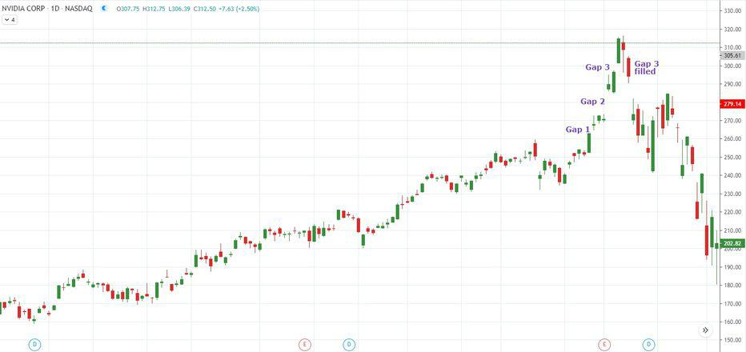

Technical analysis offers a diverse array of tools and patterns, one of which is the Sanku, or Three Gaps Pattern, originating from Japanese candlestick charts. This distinctive pattern is identified by three successive gaps in an ongoing trend, each representing a significant shift in market sentiment. The Sanku pattern is pivotal for traders aiming to predict market behavior, as it provides clues to potential trend reversals or continuations.

In this article, we aim to elucidate the mechanics of the Sanku pattern, illustrating how traders can interpret these gaps within a trend to make informed trading decisions. The significance of this pattern in trading is underscored by its ability to signal trend exhaustion, a crucial insight for proactive traders seeking to optimize their positions.



Moreover, integrating the Sanku pattern into algorithmic trading strategies presents opportunities for traders to automate their responses to these market signals. By constructing algorithms that recognize these patterns and execute trades based on predefined criteria, traders can potentially enhance their trading efficiency and outcomes.

To maximize the effectiveness of the Sanku pattern, it is essential to combine it with other technical tools, creating a comprehensive trading strategy. The pattern, while insightful, is part of a broader analytical framework that incorporates additional indicators and risk management protocols.

The ultimate goal of this piece is to equip readers with actionable insights on leveraging the Sanku pattern to boost trading performance. By understanding this pattern and its implications in market dynamics, traders can better navigate the complexities of financial markets, potentially leading to more profitable ventures.

## Table of Contents

## Understanding the Sanku (Three Gaps) Pattern

The Sanku, or Three Gaps Pattern, is a formation within Japanese candlestick charting used by traders to interpret market sentiment and predict potential reversals. Characterized by three distinct price gaps along a prevailing trend, the Sanku pattern provides valuable insights into the momentum driving that trend, whether it is ascending or descending.

Each gap within the Sanku pattern signifies a notable shift in price, typically propelled by strong market forces of buying or selling. The first gap in the sequence often marks the beginning or the reinforcement of a trend, indicating a decisive move by traders that sets the direction. This gap is frequently accompanied by increased trading [volume](/wiki/volume-trading-strategy), suggesting a reinforcement of conviction among market participants.

The subsequent second and third gaps not only highlight continued market strength but also serve as indicators of sustained [momentum](/wiki/momentum) behind the current trend. These gaps reinforce the initial directional move, showing that market participants are firmly aligned with the ongoing trend, pushing prices further in the same direction.

However, it is the third gap that often commands the most attention from traders. This final gap is seen as a potential signal of trend exhaustion. It usually occurs when the buying or selling enthusiasm reaches its peak, potentially leading to an inability of the market to sustain further moves in the same direction. As such, the third gap may herald an impending reversal, prompting traders to reassess their positions.

The Sanku pattern is particularly effective in highlighting exhaustion points in ongoing market trends. Traders utilize this pattern as part of a comprehensive technical analysis toolkit to anticipate changes in market direction and to strategize their entries and exits accordingly. While the Sanku pattern can emerge in any trend, its implications are best understood when combined with other technical indicators to corroborate the potential for reversal or continuation of the trend. Understanding the nuances of the Sanku allows for more informed trading decisions, balancing the risks and rewards inherent in market movements.

## The Mechanics of the Sanku Pattern

A valid Sanku pattern emerges within a well-defined trend and is characterized by three distinct, non-overlapping gaps. These gaps are significant indicators of market sentiment, reflecting strong demand or supply forces that move the price sharply in one direction. The occurrence of gaps in financial markets is often supported by increased trading volume, indicating a strong conviction among traders and investors about the prevailing trend.

The Sanku pattern, when observed correctly, can serve as an early warning system for potential trend exhaustion. The first gap signifies a robust initiation of the trend, possibly triggered by new information, economic data, or unexpected market developments. The second gap reinforces the existing trend, showing continued strength and momentum. However, traders should pay close attention to the third gap, as it often marks a critical juncture. At this point, the market may be overextended, and the forces driving the trend could weaken.

For traders aiming to capitalize on the Sanku pattern, it is crucial to consider additional technical indicators that might validate or challenge the pattern's implications. These can include moving averages, such as the simple moving average (SMA) or the exponential moving average (EMA), to assess trend direction and strength. Traders might also employ oscillators like the Relative Strength Index (RSI) or the Moving Average Convergence Divergence (MACD) to gauge momentum and potential reversals.

To illustrate, a Python script could automate the detection of the Sanku pattern by identifying non-overlapping gaps and analyzing accompanying volume changes:

```python
import pandas as pd

# Example dataframe
df = pd.DataFrame({
    'Open': [100, 105, 110, 120, 115],
    'Close': [105, 110, 120, 115, 122],
    'Volume': [1000, 1500, 2000, 2500, 3000]
})

# Function to detect gaps
def detect_gaps(df):
    gaps = []
    trend = ''
    for i in range(1, len(df)):
        if df['Open'][i] > df['Close'][i-1]:
            gaps.append((i, 'upward'))
        elif df['Open'][i] < df['Close'][i-1]:
            gaps.append((i, 'downward'))
        if len(gaps) == 3:
            trend = 'Trend with three gaps detected'
            break
    return trend, gaps

trend, detected_gaps = detect_gaps(df)
print(f"{trend}: {detected_gaps}")
```

By monitoring these gaps along with supplementary indicators and market conditions, traders can make informed decisions about entering or exiting positions. The appearance of the third gap should prompt readiness for market [volatility](/wiki/volatility-trading-strategies) or reversal, urging traders to keep stop-loss orders in place and be prepared to react to changing market dynamics. Notably, the Sanku pattern should be integrated with a comprehensive trading strategy to effectively manage risk and optimize returns.

## Strategizing with the Sanku Pattern in Algorithmic Trading

Incorporating the Sanku pattern into [algorithmic trading](/wiki/algorithmic-trading) strategies requires a systematic approach to identifying and processing this specific candlestick formation. The first step involves developing algorithms capable of flagging the pattern based on pre-determined criteria. This can be achieved by setting up rules that recognize the three distinct gaps in an ongoing trend. An example is using a Python script with the Pandas library to analyze historical price data and detect the pattern:

```python
import pandas as pd

def identify_sanku_pattern(data):
    """
    Identifies Sanku pattern in historical stock price data.
    Args:
        data (DataFrame): Historical price data with columns ['Open', 'High', 'Low', 'Close'].
    Returns:
        (bool): True if Sanku pattern is identified, else False.
    """
    gaps = [(data['Open'][i] > data['Close'][i-1]) for i in range(1, len(data))]
    sanku_pattern = sum(gaps) >= 3  # Identifies the occurrence of three gaps
    return sanku_pattern

# Example usage with historical data
historical_data = pd.DataFrame({
    'Open': [100, 105, 110, 115],
    'Close': [103, 107, 113, 112]
})

print(identify_sanku_pattern(historical_data))
```

Once the Sanku pattern is detected, traders can design entry and [exit](/wiki/exit-strategy) strategies based on subsequent market movements. A typical entry strategy involves initiating a position following the confirmation of the third gap. This confirmation period offers a crucial observation window where traders look for validation through continued volume support or complementary technical indicators like momentum oscillators.

Exit strategies might utilize the breach of established trendlines or emerging candlestick patterns suggestive of a reversal. Setting a trailing stop-loss just beyond the extremes of the third gap ensures that any adverse price movement is mitigated. This stop-loss strategy is a defensive measure to guard against unpredictable market shifts while allowing room for maximum favorable price development.

In algorithmically managing risks, it's vital to consider scenarios of extended trend movements where the pattern's exhaustion suggestion might not immediately lead to reversals. Here, a dynamically adjustable stop-loss using market volatility measurements, such as the Average True Range (ATR), helps in achieving optimal protection:

```python
def calculate_atr(data, period=14):
    """
    Calculates Average True Range (ATR) for risk management.
    Args:
        data (DataFrame): Historical price data with columns ['High', 'Low', 'Close'].
        period (int): The number of days over which ATR is calculated.
    Returns:
        (Series): ATR values.
    """
    data['True_Range'] = data[['High', 'Low', 'Close']].apply(lambda row: max(row['High'] - row['Low'],
                                                                              abs(row['High'] - row['Close']),
                                                                              abs(row['Low'] - row['Close'])), axis=1)
    atr = data['True_Range'].rolling(window=period).mean()
    return atr

atr_values = calculate_atr(historical_data)
```

Precision in identifying the entry/exit points and adaptive risk management fortify the robustness of algorithmic strategies centered on the Sanku pattern. By incorporating additional market analysis tools and metrics, traders can enhance the effectiveness of such algorithmic frameworks.

## The Sanku Pattern vs. Other Candlestick Patterns

The Sanku pattern, defined by its series of three gaps in a trend, primarily serves as an indicator of potential trend exhaustion. In contrast, the Three White Soldiers pattern is composed of three consecutive long-bodied candlesticks and is typically observed after a downtrend, signaling the possibility of a bullish reversal. While the Sanku pattern reflects potential weakening momentum within an ongoing trend, the Three White Soldiers imply a strong resurgence of buying interest, often marking the shift towards an upward movement.

The key differences can be attributed to the psychological implications each pattern represents. The Three White Soldiers pattern underscores a strong, sustained buying pressure, suggesting that bulls are decisively taking control after a period of decline. This pattern increases traders' confidence in a potential upward shift and serves as a reliable signal of a bullish turnaround.

Conversely, the Sanku pattern's trio of gaps suggests the market may be overextended. The initial gaps in the Sanku often indicate intense market emotions driving a trend, but as the third gap appears, it warns of possible market fatigue. Traders observing this pattern are generally cautious, anticipating a reversal or increased volatility.

For traders, the choice between leveraging the Sanku pattern or the Three White Soldiers heavily depends on the current market context. If a trader encounters an asset that has been in a prolonged downtrend and identifies the Three White Soldiers, it may be indicative of a solid buying opportunity. On the other hand, when three non-overlapping gaps appear in a well-established trend, the Sanku pattern advises a more cautious approach, potentially suggesting the need to protect existing profits or prepare for a reversal.

Selecting the appropriate pattern necessitates an understanding of the market environment and the specific conditions under which these patterns emerge. Analyzing supporting technical indicators, such as volume dynamics or resistance levels, further aids in making informed trading decisions. Therefore, recognizing the contextual applications of these patterns allows traders to tailor their strategies more effectively for distinct market scenarios.

## Limitations and Challenges of Using the Sanku Pattern

The Sanku, or Three Gaps Pattern, is a distinctive candlestick formation often seen as a predictive tool for trend reversals. However, its application in trading is not without challenges and limitations. A critical drawback is its occasional failure to signal a reversal, especially in robust markets where gaps continue to form, indicating sustained momentum rather than imminent exhaustion. The reliability of the Sanku pattern can be questionable, and traders must be cautious when assuming that the third gap will invariably lead to a reversal.

Additionally, the interpretation of the Sanku pattern involves a degree of subjectivity. Recognizing the exact formation requires discernment and an understanding of broader market conditions. Traders are advised to corroborate the Sanku pattern with other technical indicators and market analysis tools to avoid making decisions based solely on its presence. These may include moving averages, RSI (Relative Strength Index), or volume analysis, all of which can deliver additional insights into market sentiment and momentum.

Another challenge is the absence of definitive profit targets within the Sanku pattern framework. While the pattern might suggest a potential exhaustion of the current trend, it does not inherently specify when a reversal will occur or the extent of the subsequent price movement. Consequently, traders must adopt supplementary strategies to lock in profits. This often involves setting stop-loss orders above or below critical price levels and utilizing profit-taking strategies, such as trailing stops, to secure gains if the price moves favorably.

In summary, while the Sanku pattern offers valuable insights, it is imperative to approach it with an understanding of its limitations. By integrating the pattern with comprehensive market analysis and pragmatic risk management strategies, traders can enhance their decision-making processes and improve their potential trading outcomes.

## Conclusion

The Sanku pattern serves as an insightful representation of market behavior, particularly in identifying potential trend exhaustion. This candlestick configuration, by highlighting the market's momentum via gaps, sensitizes traders to signals indicating that a prevailing trend may be reaching its limits. Such awareness is integral for making more informed trading decisions, especially when navigating the volatility and unpredictability of financial markets.

To capitalize on the information provided by the Sanku pattern, traders should not consider it in isolation. Instead, it should be a component of a well-rounded trading strategy that incorporates various technical tools and comprehensive risk management practices. This multidisciplinary approach is crucial because relying solely on any single indicator or pattern increases the risk of misinterpretation and potential financial loss. Instead, leveraging additional data points such as volume analysis, moving averages, and other candlestick patterns can provide a clearer picture of market conditions and bolster the Sanku pattern's predictive power.

Moreover, as traders face complex and dynamic market environments, the strategic integration of the Sanku pattern can enhance trading opportunities. Knowledgeable application of this pattern, especially when aligned with technological advancements like algorithmic trading, can result in effective execution of trades with precision and speed. For instance, algorithmic trading platforms can be programmed to identify Sanku patterns and execute trades based on precedent conditions, thereby optimizing the timing and execution accuracy.

Ultimately, while the Sanku pattern is a powerful tool that offers insights into trend dynamics, its effectiveness is amplified when part of a comprehensive trading plan. Continuous learning and adaptation to evolving market conditions are essential to harness the full potential of the Sanku pattern, encouraging its thoughtful and strategic implementation in pursuit of significant trading opportunities.

## References & Further Reading

[1]: Nison, S. (1991). ["Japanese Candlestick Charting Techniques: A Contemporary Guide to the Ancient Investment Techniques of the Far East"](https://archive.org/details/japanesecandlest0000niso). Prentice Hall Press.

[2]: Murphy, J. J. (1999). ["Technical Analysis of the Financial Markets: A Comprehensive Guide to Trading Methods and Applications"](https://archive.org/details/technicalanalysi0000murp). New York Institute of Finance.

[3]: Bulkowski, T. (2008). ["Encyclopedia of Candlestick Charts"](https://onlinelibrary.wiley.com/doi/book/10.1002/9781119202288). Wiley Trading.

[4]: Pring, M. J. (2002). ["Technical Analysis Explained: The Successful Investor's Guide to Spotting Investment Trends and Turning Points"](https://www.amazon.com/Technical-Analysis-Explained-Fifth-Successful/dp/0071825177). McGraw-Hill Education.

[5]: Elder, A. (1993). ["Trading for a Living: Psychology, Trading Tactics, Money Management"](https://www.amazon.com/Trading-Living-Psychology-Tactics-Management/dp/0471592242). Wiley.