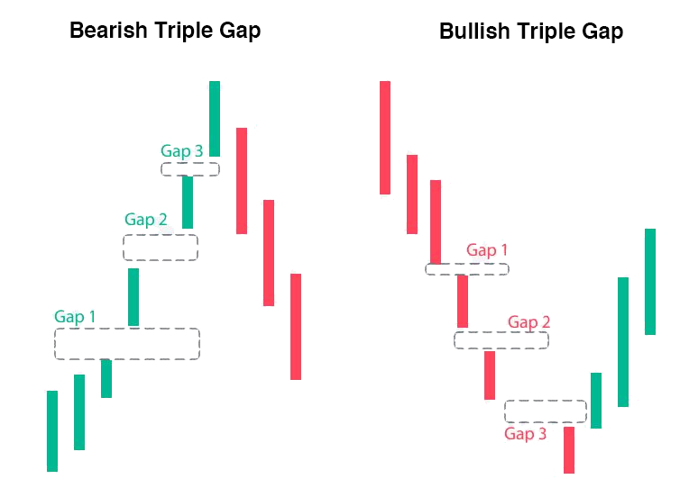

## Table of Contents

## What is the Sanku pattern in technical analysis?

The Sanku pattern is a technical analysis tool used in trading, especially in the Japanese candlestick charting method. It is also known as the "Three Gaps" pattern. This pattern helps traders identify potential trend reversals or continuations by looking at the gaps between candlesticks. A gap happens when the price of an asset opens significantly higher or lower than the previous close, creating a space on the chart.

There are two types of Sanku patterns: the Upward Sanku and the Downward Sanku. The Upward Sanku happens during a downtrend and signals a possible reversal to an uptrend. It occurs when there are three upward gaps in the price movement. On the other hand, the Downward Sanku happens during an uptrend and suggests a possible reversal to a downtrend. It is identified by three downward gaps in the price movement. Traders use these patterns to make decisions about entering or exiting trades.

## How does the Sanku pattern differ from other candlestick patterns?

The Sanku pattern is different from other candlestick patterns because it focuses on gaps between the candlesticks, rather than just the shapes of the candlesticks themselves. Many other patterns, like the Doji or Hammer, look at the body and wicks of individual candlesticks to predict market movements. The Sanku pattern, however, pays attention to the spaces that appear when the price jumps up or down significantly from one day to the next.

Another way the Sanku pattern stands out is by requiring three gaps to confirm the pattern. This makes it a bit more complex than simpler patterns that might only need one or two candlesticks to form. For example, the Engulfing pattern can be spotted with just two candlesticks, whereas the Sanku needs three distinct gaps to be valid. This can make the Sanku pattern a stronger signal of a trend change, but it also means traders might have to wait longer to see it fully develop.

## What are the three gaps in the Sanku pattern and their significance?

The Sanku pattern has three gaps that are important for traders. In the Upward Sanku, which happens during a downtrend, the first gap is when the price jumps up from a low point. This shows that buyers are starting to take control. The second gap comes after some more upward movement, showing that the buying pressure is still strong. The third gap is the final one, and it confirms that the trend is likely to reverse from down to up. These three gaps together tell traders that it might be a good time to buy.

In the Downward Sanku, which happens during an uptrend, the first gap is when the price drops down from a high point. This shows that sellers are starting to take over. The second gap comes after more downward movement, showing that the selling pressure is still strong. The third gap is the final one, and it confirms that the trend is likely to reverse from up to down. These three gaps together tell traders that it might be a good time to sell. By watching for these three gaps, traders can make better decisions about when to enter or [exit](/wiki/exit-strategy) trades.

## Can you explain the formation process of the Sanku pattern?

The Sanku pattern forms when there are three gaps in the price movement of a stock or asset. In an Upward Sanku, which happens during a downtrend, the price starts to go up and leaves a gap between the closing price of one day and the opening price of the next. This first gap shows that buyers are starting to take control. After some more upward movement, another gap appears, showing that the buying pressure is still strong. Finally, a third gap forms, confirming that the trend is likely to reverse from down to up. Traders look for these three gaps to decide if it's a good time to buy.

In a Downward Sanku, which happens during an uptrend, the price starts to go down and leaves a gap between the closing price of one day and the opening price of the next. This first gap shows that sellers are starting to take over. After some more downward movement, another gap appears, showing that the selling pressure is still strong. Finally, a third gap forms, confirming that the trend is likely to reverse from up to down. Traders look for these three gaps to decide if it's a good time to sell. By watching for these three gaps, traders can make better decisions about when to enter or exit trades.

## What are the key characteristics to identify a Sanku pattern on a chart?

To spot a Sanku pattern on a chart, you need to look for three gaps in the price movement. In an Upward Sanku, which happens when prices are going down, the first gap shows up when the price jumps up from a low point. This means buyers are starting to take control. The second gap comes after more upward movement, showing that the buying pressure is still strong. The third gap is the final one and it confirms that the trend is likely to change from down to up. When you see these three gaps, it might be a good time to buy.

In a Downward Sanku, which happens when prices are going up, the first gap shows up when the price drops down from a high point. This means sellers are starting to take over. The second gap comes after more downward movement, showing that the selling pressure is still strong. The third gap is the final one and it confirms that the trend is likely to change from up to down. When you see these three gaps, it might be a good time to sell. By watching for these three gaps, you can make better decisions about when to enter or exit trades.

## How reliable is the Sanku pattern in predicting market trends?

The Sanku pattern can be a helpful tool for traders, but it's not perfect. It looks for three gaps in the price movement, which can signal a trend change. When traders see these gaps, it might mean it's a good time to buy or sell. But, like all patterns in trading, the Sanku pattern doesn't always work. Sometimes, the market might not follow the pattern, and traders can lose money if they rely on it too much.

The reliability of the Sanku pattern can depend on many things, like how much the market is moving and how many people are trading. In quiet markets, the pattern might be more reliable because there are fewer surprises. But in busy markets, other things can affect prices, and the pattern might not work as well. So, traders should use the Sanku pattern along with other tools and information to make the best decisions.

## What are some common mistakes traders make when using the Sanku pattern?

One common mistake traders make when using the Sanku pattern is not waiting for all three gaps to form before making a trade. The Sanku pattern needs three gaps to be a strong signal, but some traders get too excited after seeing just one or two gaps and jump into a trade too early. This can lead to losses if the pattern doesn't fully form and the trend doesn't reverse as expected.

Another mistake is relying too much on the Sanku pattern without considering other market factors. The Sanku pattern is just one tool, and it doesn't always predict the market correctly. Traders should look at other indicators, news, and overall market conditions before making a decision. Ignoring these other pieces of information can lead to bad trades, even if the Sanku pattern seems to be forming correctly.

## Can you provide examples of the Sanku pattern in different market conditions?

In a quiet market, the Sanku pattern can be easier to spot. Let's say a stock has been going down for a while, but then one day it jumps up and leaves a gap. A few days later, it jumps up again and leaves another gap. Then, a third gap appears, showing that the stock is likely to keep going up. Traders who see these three gaps might decide it's a good time to buy the stock. Because the market is quiet, the pattern is more likely to work, and the stock might keep going up as expected.

In a busy market, the Sanku pattern can be trickier. Imagine a stock that's been going up, but suddenly it drops and leaves a gap. A few days later, it drops again and leaves another gap. Then, a third gap appears, showing that the stock is likely to keep going down. Traders who see these three gaps might decide it's a good time to sell the stock. But because the market is busy, other things can affect the stock's price, and the pattern might not work as well. The stock might go back up instead of continuing to go down, so traders need to be careful and look at other information too.

## How can the Sanku pattern be integrated into a broader trading strategy?

The Sanku pattern can be a helpful part of a bigger trading plan. Traders can use it to spot when a trend might change, but they shouldn't rely on it alone. They should also look at other things like moving averages, support and resistance levels, and what's happening in the news. By combining the Sanku pattern with these other tools, traders can make better decisions about when to buy or sell. For example, if the Sanku pattern shows a possible trend change, but the moving averages don't agree, it might be safer to wait and see what happens next.

In a trading strategy, the Sanku pattern can help traders decide when to enter or exit a trade. If they see an Upward Sanku during a downtrend, they might think about buying the stock, but only if other signs also point to a good time to buy. On the other hand, if they see a Downward Sanku during an uptrend, they might think about selling, but again, they should check other indicators too. By using the Sanku pattern along with other tools, traders can feel more confident in their decisions and manage their risks better.

## What are the psychological factors behind the formation of the Sanku pattern?

The Sanku pattern forms because of what people are thinking and feeling about the market. When the price jumps up and leaves a gap, it means that buyers are feeling more confident and excited. They think the price will keep going up, so they rush to buy the stock. This feeling can grow stronger after the second gap, making more people want to buy. By the time the third gap happens, everyone is sure that the price will keep going up, so they keep buying, which makes the Sanku pattern complete.

On the other hand, when the price drops and leaves a gap, it means that sellers are feeling more worried and scared. They think the price will keep going down, so they rush to sell the stock. This feeling can grow stronger after the second gap, making more people want to sell. By the time the third gap happens, everyone is sure that the price will keep going down, so they keep selling, which makes the Sanku pattern complete. The Sanku pattern shows how people's feelings can push the market to change direction.

## How does the Sanku pattern perform in various time frames, from intraday to long-term charts?

The Sanku pattern can show up on different time frames, like intraday, daily, weekly, or even monthly charts. On intraday charts, which look at prices over a few hours or a day, the Sanku pattern can be a bit trickier to spot because the market can move a lot in a short time. But if you do see the three gaps forming, it might mean a quick change in the trend. Traders who watch intraday charts need to be quick to act, but they also need to be careful because the market can be more unpredictable.

On longer time frames like daily or weekly charts, the Sanku pattern can be more reliable. Because these charts show bigger trends over days or weeks, the three gaps can be a stronger sign that the trend is about to change. Traders who look at these longer time frames might feel more confident about their decisions because they have more time to see the pattern develop. But they still need to check other things like news and other indicators to make sure it's a good time to buy or sell.

## What advanced techniques can be used to enhance the effectiveness of the Sanku pattern analysis?

To make the Sanku pattern work better, traders can use other tools and methods along with it. One way is to look at [volume](/wiki/volume-trading-strategy). If the volume goes up when the gaps happen, it can mean that more people are buying or selling, making the pattern more likely to be right. Another way is to use moving averages. If the Sanku pattern shows a trend change and the moving averages agree, it can give traders more confidence in their decisions. Also, looking at support and resistance levels can help. If the Sanku pattern forms near these levels, it might be a stronger sign that the trend will change.

Another advanced technique is to use different time frames to check the Sanku pattern. Traders can look at shorter time frames to see if the pattern is also showing up there, which can make it more reliable. They can also use longer time frames to see the bigger picture and make sure the pattern fits with the overall trend. Finally, traders can use risk management tools like stop-loss orders to protect themselves if the pattern doesn't work out as expected. By combining the Sanku pattern with these other methods, traders can make smarter and safer decisions.

## References & Further Reading

[1]: Nison, S. (1991). ["Japanese Candlestick Charting Techniques: A Contemporary Guide to the Ancient Investment Techniques of the Far East"](https://archive.org/details/japanesecandlest0000niso). Prentice Hall Press.

[2]: Murphy, J. J. (1999). ["Technical Analysis of the Financial Markets: A Comprehensive Guide to Trading Methods and Applications"](https://archive.org/details/technicalanalysi0000murp). New York Institute of Finance.

[3]: Bulkowski, T. (2008). ["Encyclopedia of Candlestick Charts"](https://onlinelibrary.wiley.com/doi/book/10.1002/9781119202288). Wiley Trading.

[4]: Pring, M. J. (2002). ["Technical Analysis Explained: The Successful Investor's Guide to Spotting Investment Trends and Turning Points"](https://www.amazon.com/Technical-Analysis-Explained-Fifth-Successful/dp/0071825177). McGraw-Hill Education.

[5]: Elder, A. (1993). ["Trading for a Living: Psychology, Trading Tactics, Money Management"](https://www.amazon.com/Trading-Living-Psychology-Tactics-Management/dp/0471592242). Wiley.