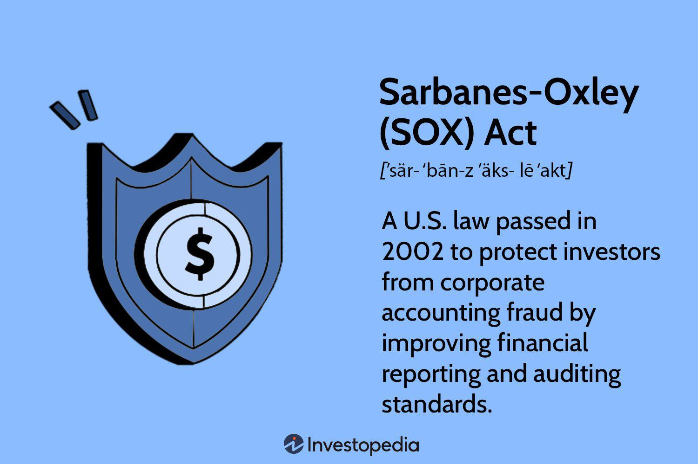

The Sarbanes-Oxley Act (SOX) of 2002 was enacted in the wake of significant financial scandals, such as those involving Enron and WorldCom, that severely undermined investor trust and highlighted deficiencies in corporate governance. Its primary aim is to protect investors by enhancing the reliability and transparency of corporate financial reporting. The act has become a pivotal component of financial regulation by imposing rigorous standards on corporations and their executives.

In this article, we explore SOX's key attributes, emphasizing its role in safeguarding investors and ensuring corporate accountability. We examine its broad implications for financial markets, offering insights into its transformative impact. Additionally, we discuss how SOX aligns with other regulatory frameworks and how it interacts with advanced trading mechanisms like algorithmic trading, which have introduced new dynamics in financial markets.



Understanding SOX is essential for investors, financial professionals, and companies as they navigate the intricate landscape of modern finance. By grasping the influence of SOX, stakeholders can better appreciate the act’s contribution to fostering investor confidence and maintaining market integrity.

## Table of Contents

## Understanding the Sarbanes-Oxley Act

The Sarbanes-Oxley Act (SOX) was enacted in 2002 as a direct response to egregious financial scandals involving prominent corporations such as Enron and WorldCom. These corporate failures highlighted extensive accounting fraud and misconduct, leading to a significant loss of investor confidence and underscoring the necessity for reinforced regulatory standards.

SOX is divided into several sections, but among the most crucial are sections 302, 404, and 802. Section 302 mandates that senior corporate officers personally certify the accuracy of financial statements, thus enhancing corporate responsibility. This provision aims to ensure that top executives are directly accountable for any discrepancies or misrepresentations in financial reporting. Failure to comply with these certifications can result in severe penalties, including substantial fines and imprisonment.

Section 404 is perhaps one of the most demanding components of SOX, requiring companies to establish and maintain adequate internal controls over financial reporting. It obligates management and external auditors to report on the effectiveness of these controls annually. While this has increased the reliability of financial reports, it has also imposed significant compliance costs on companies, especially smaller businesses.

Section 802 focuses on record-keeping integrity. This section establishes regulations for the handling and retention of corporate records, setting penalties for the alteration, destruction, or fabrication of financial documents. The mandates serve to preserve audit trails and facilitate comprehensive scrutiny of financial operations.

SOX's primary objective is to rebuild investor trust by imposing stringent regulatory frameworks on companies and their executives. Through robust corporate governance mechanisms, the act addresses both fraudulent and unethical practices, thus fostering a climate of transparency and accountability within the corporate sector. By realigning corporate incentives and reinforcing the role of oversight institutions, SOX has fundamentally reshaped financial reporting and auditing processes. This overhaul is instrumental in safeguarding against corporate fraud, ultimately aiming to protect investors and maintain market stability.

## The Role of SOX in Investor Protection

The Sarbanes-Oxley Act (SOX) plays a crucial role in enhancing investor protection by instituting measures that ensure accurate financial reporting and heightened transparency in corporate practices. One of the primary ways SOX achieves this is by establishing executive accountability for financial statements. Under Section 302, corporate executives, such as the CEO and CFO, must personally certify the accuracy and completeness of financial reports. This requirement reduces the likelihood of financial misrepresentation by ensuring that top-tier management is directly responsible for any discrepancies, thereby fostering a more reliable financial disclosure environment.

Moreover, SOX mandates the implementation of robust internal controls within companies to prevent fraud and errors in financial reporting. Section 404 obliges management to assess and report on the effectiveness of these internal controls annually. While this section has been critiqued for its compliance costs, it substantially elevates the standard of financial integrity, requiring companies to meticulously design and test their financial controls, thereby minimizing the risk of inaccuracies.

Whistleblower protections are another critical component of SOX that bolster investor confidence. The act contains provisions that safeguard those who report unethical or illegal practices, thereby encouraging the disclosure of fraudulent activities without fear of retaliation. This protection is vital in identifying and correcting issues that could potentially lead to misleading financial practices, hence strengthening the trust of investors.

The enforcement of SOX by the Public Company Accounting Oversight Board (PCAOB) underpins the act’s stringent audit standards. The PCAOB oversees external audits of public companies, ensuring that high accounting standards are maintained and that auditors remain independent and competent. This oversight is crucial for maintaining the integrity and reliability of financial reports, which in turn enhances investor protection by providing them with trustworthy data for making informed investment decisions.

In summary, through its emphasis on executive accountability, robust internal controls, whistleblower protections, and stringent audit standards, the Sarbanes-Oxley Act significantly fortifies investor protection, ensuring the transparency and reliability of corporate financial practices.

## Impact of SOX on Financial Regulation

The Sarbanes-Oxley Act (SOX) of 2002 has played a pivotal role in reshaping financial regulation, establishing a foundation for transparency and accountability that has been emulated globally. SOX's implementation has set a standard for corporate governance, influencing international frameworks designed to curb corporate fraud and financial misconduct.

One of the critical impacts of SOX is its contribution to creating rigorous transparency in financial disclosures. By imposing strict reporting requirements, SOX has significantly improved the accuracy and reliability of corporate financial statements. This enhanced disclosure has reduced incidents of corporate fraud, as companies are now compelled to adhere to stringent guidelines that ensure truthful representation of their financial status. The rigor of SOX requirements helps maintain market integrity and investor trust, essential components of a stable financial ecosystem.

Moreover, SOX complements existing financial regulations, weaving together a robust regulatory fabric that supports corporate governance. Its provisions work in tandem with other regulatory measures, such as the Dodd-Frank Wall Street Reform and Consumer Protection Act, to create a comprehensive environment for financial regulation. This synergy aids in closing loopholes and providing a unified approach to preventing corporate malfeasance.

Despite its effectiveness, SOX presents certain challenges, particularly regarding compliance costs. Section 404, which mandates internal control evaluations and reporting, is often cited for its financial and administrative burden on companies. Smaller firms, in particular, may struggle with the resources required to maintain compliance. This section requires firms to implement extensive internal audits and controls, which can be time-consuming and costly.

The following is an example of the typical costs associated with SOX compliance:

```python
# Example Python code to estimate SOX compliance costs

def estimate_sox_compliance_costs(revenue, multiplier=0.005):
    """
    Estimate the SOX compliance costs based on company revenue.
    Typically, SOX compliance costs can range from 0.01% to 1% of revenue.
    The multiplier here is set to 0.5% for demonstration purposes.

    Parameters:
    revenue (float): The company's annual revenue.
    multiplier (float): The fraction of revenue spent on compliance.

    Returns:
    float: Estimated SOX compliance cost.
    """
    return revenue * multiplier

# Example revenue data for a fictitious company in USD
company_revenue = 100000000  # $100 million
compliance_cost = estimate_sox_compliance_costs(company_revenue)
print(f"Estimated SOX compliance cost: ${compliance_cost}")
```

While the costs associated with maintaining SOX compliance can be substantial, advancements in technology and automation provide potential pathways for reducing these expenses. Modern compliance tools can streamline the process, allowing companies to fulfill regulatory requirements more efficiently and at a lower cost.

In conclusion, the Sarbanes-Oxley Act's influence on financial regulation is profound and far-reaching. Its adoption has reinforced investor confidence by ensuring corporate accountability and transparency. Though compliance costs present challenges, especially for smaller firms, SOX remains a foundational component of international corporate governance practices. Its ability to reduce fraud and improve financial disclosures continues to be a testament to its importance in the financial regulatory landscape.

## Algorithmic Trading and SOX Compliance

Algorithmic trading leverages advanced mathematical models and high-speed data analysis to execute trades in financial markets. This practice, characterized by rapid execution and automation, creates both challenges and opportunities regarding compliance with the Sarbanes-Oxley Act (SOX).

SOX mandates that financial reporting be both accurate and timely, which can be significantly enhanced by the data analytics capabilities inherent in [algorithmic trading](/wiki/algorithmic-trading) systems. Through sophisticated data processing and real-time analysis, these systems can improve the precision of financial disclosures, thus aligning with SOX’s objective to ensure that financial statements reflect the true financial position of a company.

However, the automation involved in algorithmic trading demands the establishment of robust internal controls. These controls are crucial to mitigating operational risks such as erroneous trades, system malfunctions, or malicious activities that could compromise the integrity of financial reports. To this end, companies must implement comprehensive risk management and compliance frameworks. This might include developing algorithms that continuously monitor trading activities and flag anomalies, or system checks that validate data accuracy before transactions are executed.

Integrating SOX principles into algorithmic trading processes not only bolsters investor confidence but also safeguards market integrity. By ensuring that trading strategies and their outcomes are consistent with established corporate governance and regulatory standards, companies reinforce their commitment to transparency and accountability. This alignment is particularly critical given the scrutiny on financial markets and the need for adherence to strict compliance obligations. 

Therefore, implementing effective SOX compliance in algorithmic trading involves creating a seamless integration of advanced technological capabilities with traditional regulatory frameworks, thus ensuring that financial operations are both innovative and compliant.

## Challenges and Criticisms of SOX

Critics argue that the Sarbanes-Oxley Act (SOX), while essential for enhancing transparency and accountability, imposes significant compliance costs, especially on smaller firms. The extensive resources required to establish and maintain internal controls under SOX can be burdensome. For instance, Section 404 mandates detailed assessment and attestation of internal control over financial reporting, demanding substantial investment in both personnel and technology.

Such stringent requirements may, according to some observers, stifle innovation and risk-taking within financial practices. The need to allocate considerable resources towards compliance efforts might deter companies from pursuing new ventures or adopting innovative financial strategies. The compliance process, particularly for smaller firms with limited financial and human resources, could redirect focus from growth-oriented activities, thereby impacting competitiveness.

However, proponents of SOX argue that the long-term benefits of fostering transparency and protecting investor interests ultimately outweigh these drawbacks. They assert that robust internal controls contribute to a more stable corporate environment, potentially reducing the incidence of financial fraud and misrepresentation. This transparency can enhance investor confidence, attract capital, and provide a level playing field for businesses.

Advancements in technology offer promising solutions to offset SOX compliance costs. Automation and data analytics tools can streamline the compliance process, improving efficiency and accuracy in monitoring and reporting financial activities. By automating certain compliance tasks, companies can reduce reliance on manual processes, thereby lowering operational expenses and minimizing the potential for human error.

The evolving regulatory landscape continues to present challenges in balancing SOX requirements with business agility. Companies must continually adapt to changes in regulatory frameworks and leverage technological advancements to meet compliance demands without compromising their growth objectives. This dynamic environment necessitates a strategic approach to compliance, ensuring that businesses can maintain flexibility while upholding the rigorous standards of investor protection set forth by SOX.

## Conclusion

The Sarbanes-Oxley Act (SOX) continues to be a fundamental component of financial regulation, serving a critical role in promoting transparency and safeguarding investors from corporate fraud. Its influence transcends U.S. borders, significantly impacting global standards for corporate governance. Notwithstanding the challenges associated with compliance—especially in light of rapid technological advancements and the complexity of algorithmic trading—SOX remains instrumental in fostering investor trust and ensuring market integrity.

The dynamic nature of financial markets necessitates ongoing assessment and modification of SOX practices to effectively meet compliance challenges and maintain their importance in a constantly changing financial environment. By embracing and implementing the principles established by SOX, corporations can adeptly navigate the intricacies of contemporary financial regulation while upholding strong investor confidence.

Moreover, the act has set a benchmark for accountability and accuracy in financial disclosures, reinforcing corporate responsibility. As companies integrate newer technologies into their operational frameworks, they must align with SOX requirements to balance innovation with regulatory compliance. This adaptation not only facilitates adherence to regulatory standards but also supports the sustainability of corporate governance practices.

In summary, the Sarbanes-Oxley Act remains an invaluable asset in the pursuit of ethical financial practice and corporate responsibility, securing its position as a transformative force in global finance.

## References & Further Reading

[1]: Rezaee, Z. (2007). ["Corporate Governance Post-Sarbanes-Oxley: Regulations, Requirements, and Integrated Processes."](https://www.researchgate.net/publication/288280757_Corporate_Governance_Post-Sarbanes-Oxley_Regulations_Requirements_and_Integrated_Processes) Wiley.

[2]: Coates, J. C. (2007). ["The Goals and Promise of the Sarbanes-Oxley Act."](https://www.aeaweb.org/articles?id=10.1257/jep.21.1.91) The Journal of Economic Perspectives, 21(1), 91-116.

[3]: Bainbridge, S. M. (2007). ["The Complete Guide to Sarbanes-Oxley."](https://archive.org/details/completeguidetos0000bain) The Economist.

[4]: Jain, P. K., & Rezaee, Z. (2006). ["The Sarbanes-Oxley Act of 2002 and Security Market Behavior: Early Evidence."](https://papers.ssrn.com/sol3/papers.cfm?abstract_id=498083) The Journal of Law and Economics, 49(2), 501-526.

[5]: Rittenberg, L. E. & Johnstone, K. M. (2011). ["Auditing: A Business Risk Approach."](https://archive.org/details/auditingriskbase0000john) Cengage Learning.