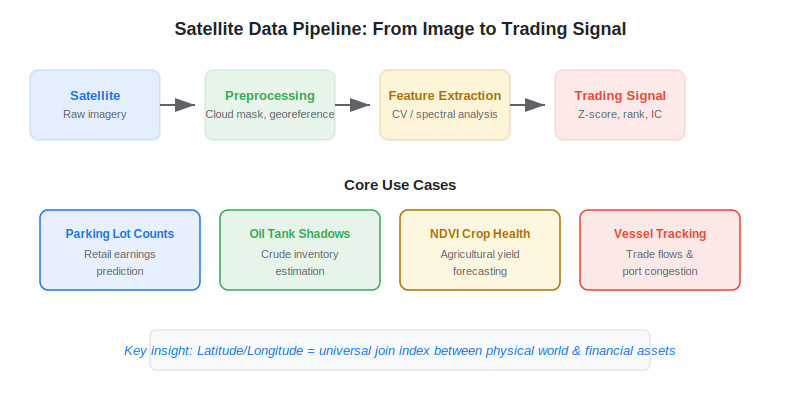
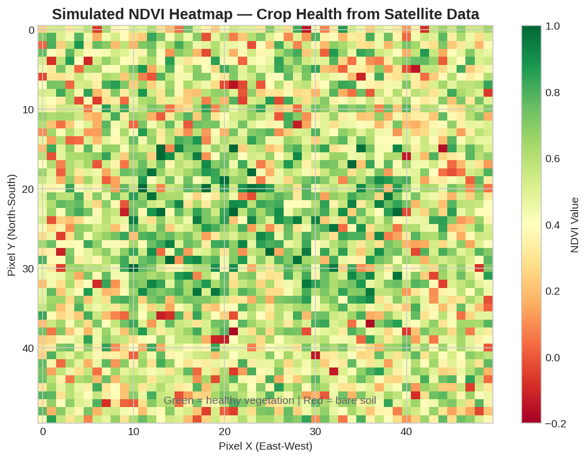

Satellite imagery has become one of the most powerful [alternative data](https://paperswithbacktest.com/wiki/best-alternative-data) sources in quantitative finance. By capturing physical-world activity from space — car counts in retail parking lots, crude oil storage levels, crop health, and shipping traffic — satellite data gives algo traders a near-real-time information edge that traditional financial data simply cannot match. This guide covers the main use cases, leading vendors, data processing pipelines, and Python code to get started.

## What Is Satellite Imagery Data in Trading?

Satellite imagery data for trading refers to geolocated images captured by Earth observation satellites, processed into structured quantitative signals that predict financial outcomes. The raw data comes from optical sensors (visible light, near-infrared) and synthetic aperture radar (SAR), which works through clouds and at night.

The key insight that makes satellite data valuable is **latitude/longitude as the universal join index**. Any physical asset — a factory, a farm, a port, an oil tank — has coordinates. Satellite imagery captures the state of that asset over time, and traders link those coordinates to public companies, commodities, or economic indicators.

The global Earth observation market has grown substantially, with dozens of satellite constellations now providing daily or sub-daily revisits of any point on the planet. For traders, this means high-frequency, objective measurements of economic activity before it shows up in quarterly earnings or government statistics.



## Core Use Cases for Algo Trading

### Retail Foot Traffic and Parking Lot Counts

The most well-known application: counting cars in retailer parking lots to predict same-store sales and earnings surprises. Orbital Insight pioneered this approach, using computer vision to count vehicles across thousands of locations and aggregate the results into a company-level signal.

The logic is straightforward: more cars in Walmart parking lots this quarter versus last quarter suggests higher revenue. Studies have shown that parking lot signals can predict earnings surprises 1–2 weeks before the announcement, offering a window for positioning.

### Oil and Commodity Storage Monitoring

Satellite imagery can measure crude oil storage levels by detecting the shadow cast inside floating-roof tanks. As the oil level drops, the roof sinks and the shadow pattern changes. Companies like Kayrros and Ursa Space Systems process SAR imagery to estimate global oil inventories weekly — far more frequently than the EIA's monthly reports.

This data is particularly valuable for commodity traders and macro funds. Discrepancies between satellite-estimated storage and official reports can signal supply surprises.

### Agricultural Crop Health (NDVI)

The Normalized Difference Vegetation Index (NDVI) uses near-infrared and red-light reflectance from satellite sensors to measure vegetation health:

$$NDVI = \frac{NIR - Red}{NIR + Red}$$

Where $NIR$ is near-infrared reflectance and $Red$ is visible red reflectance. NDVI ranges from -1 to 1, with values above 0.6 indicating healthy, dense vegetation. Traders use NDVI time series to forecast crop yields for corn, soybeans, wheat, and other agricultural commodities, often weeks before USDA reports.

### Maritime Traffic and Port Activity

Satellite imagery combined with AIS (Automatic Identification System) transponder data enables monitoring of global [shipping and supply chain](https://paperswithbacktest.com/wiki/transportation-alternative-data) activity. Traders count vessels in port, measure congestion, and track commodity flows to nowcast trade balances and industrial production.

## Key Satellite Data Vendors

| Vendor | Specialty | Data Type | Typical Clients |
|---|---|---|---|
| Planet Labs | Daily global imagery | Optical (3–5m resolution) | Agriculture, retail, infrastructure |
| Orbital Insight | Parking lots, oil storage | Processed analytics | Hedge funds, asset managers |
| Kayrros | Energy, emissions | SAR + optical | Commodity traders, energy funds |
| Descartes Labs | Platform for geospatial ML | Multi-source | Quant funds, agri-traders |
| Maxar | High-resolution (<0.5m) | Optical + SAR | Defense, intelligence, finance |
| Sentinel Hub (ESA) | Free EU satellite data | Optical + SAR (Sentinel-1/2/3) | Researchers, retail quants |

For algo traders on a budget, ESA's Sentinel-2 data is freely available and provides 10-meter resolution optical imagery with a 5-day revisit cycle — sufficient for agricultural and macro-level analysis.

## Python Implementation: NDVI from Sentinel-2

Here is a practical example of computing NDVI from Sentinel-2 satellite bands using Python:

```python
import numpy as np
import matplotlib
matplotlib.use("Agg")
import matplotlib.pyplot as plt

def compute_ndvi(nir_band: np.ndarray, red_band: np.ndarray) -> np.ndarray:
    """
    Compute NDVI from NIR and Red satellite bands.
    Both inputs should be numpy arrays of reflectance values.
    """
    nir = nir_band.astype(float)
    red = red_band.astype(float)
    denominator = nir + red
    # Avoid division by zero
    ndvi = np.where(denominator > 0, (nir - red) / denominator, 0.0)
    return ndvi

# Simulated Sentinel-2 bands for a 100x100 pixel tile
np.random.seed(42)
nir_band = np.random.uniform(0.2, 0.8, (100, 100))  # Band 8 (NIR)
red_band = np.random.uniform(0.05, 0.3, (100, 100))  # Band 4 (Red)

ndvi = compute_ndvi(nir_band, red_band)

print(f"NDVI range: [{ndvi.min():.3f}, {ndvi.max():.3f}]")
print(f"Mean NDVI: {ndvi.mean():.3f}")
# Mean NDVI above 0.5 → healthy vegetation → bullish for crop yields
```

For production use, you would download actual Sentinel-2 tiles via the Copernicus Open Access Hub API or use the `sentinelsat` Python package to automate retrieval.



## Building a Trading Signal from Satellite Data

The typical pipeline from raw satellite imagery to a tradeable signal follows five steps:

**1. Acquisition**: Download or subscribe to satellite imagery (Planet API, Sentinel Hub, vendor feed).

**2. Preprocessing**: Atmospheric correction, cloud masking, georeferencing. For optical data, clouds are the biggest obstacle — SAR data avoids this issue.

**3. Feature Extraction**: Apply computer vision or spectral analysis to extract quantitative features — car counts, NDVI values, tank shadow measurements, vessel counts.

**4. Normalization**: Convert raw features into comparable signals — year-over-year changes, z-scores relative to seasonal baselines, cross-sectional ranks across locations.

**5. Integration**: Merge satellite-derived signals with financial data (company tickers, commodity contracts) using the location-to-asset mapping, and feed into your alpha model alongside other [alternative data](https://paperswithbacktest.com/wiki/how-can-alternative-data-be-integrated-into-quantitative-trading) signals.

## Limitations and Risks

**Cloud cover** remains the primary obstacle for optical satellite data. Persistent cloud cover in tropical or monsoon regions can create gaps of weeks. SAR mitigates this but has lower spatial resolution and is harder to interpret.

**Latency** varies widely. Some vendors deliver processed analytics within hours; raw imagery can take days to process. For intraday trading, satellite data is too slow — it is best suited for horizons of days to weeks.

**Cost** is significant. Commercial high-resolution imagery from Planet or Maxar can run $50,000–$500,000+ per year for a meaningful data feed. Sentinel data is free but requires substantial in-house processing capability.

**Overfitting** is a real risk. With limited historical depth (most constellations launched after 2015) and many possible feature constructions, backtesting satellite signals requires careful out-of-sample validation.

## Conclusion

Satellite imagery is one of the most tangible forms of alternative data — literally observing the physical economy from space. For algo traders, the key is matching the data type to your investment universe: parking lot counts for retail equities, NDVI for agricultural commodities, oil tank shadows for energy, and vessel tracking for global macro. Start with freely available Sentinel-2 data to build your pipeline, then evaluate commercial vendors as your strategy matures.

---

**Explore further on PapersWithBacktest:**
- Browse [backtested satellite-informed strategies](https://paperswithbacktest.com/strategies) with Python code and performance metrics
- Access [clean historical market data](https://paperswithbacktest.com/datasets) for equities, crypto, and futures
- Take the [algo trading course](https://paperswithbacktest.com/course) — 60+ video lessons and notebooks
- Related wiki pages: [Best Alternative Data Sources](https://paperswithbacktest.com/wiki/best-alternative-data) · [Transportation Alternative Data](https://paperswithbacktest.com/wiki/transportation-alternative-data)
