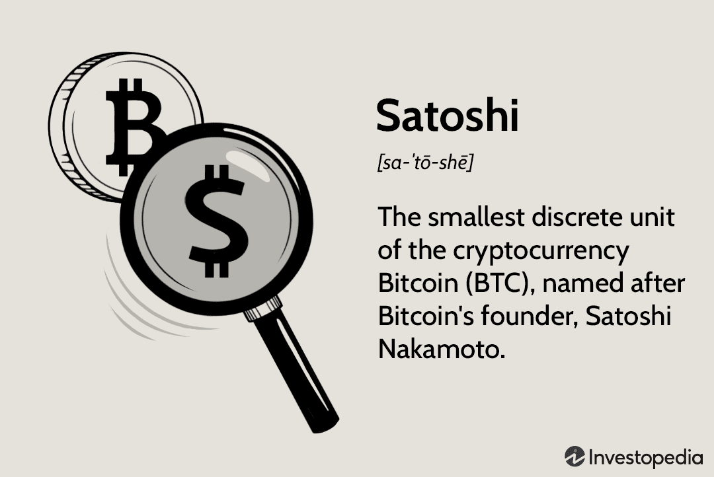

Cryptocurrencies have transformed the landscape of global finance, offering a new avenue for conducting financial transactions that challenge traditional banking systems. At the forefront of this revolution is Bitcoin, introduced by the pseudonymous Satoshi Nakamoto in 2009, marking the inception of a decentralized financial system. Bitcoin's innovative approach to digital currency has made it a prominent fixture in both financial and popular discourse.

Understanding Bitcoin requires an exploration of its underlying technologies and trading mechanisms. The blockchain technology, which serves as the backbone of Bitcoin, ensures transactional transparency and security through decentralized verification. Furthermore, Bitcoin trading has evolved significantly since its inception, with algorithmic trading becoming a key component of the market. Algorithmic trading involves the use of complex algorithms to automate and optimize trading decisions, capitalizing on Bitcoin's inherent volatility.



This article will discuss the fundamental aspects of Bitcoin, starting with the concept of a satoshi—the smallest denomination of Bitcoin—named after Nakamoto. We will analyze how these elements integrate into the broader cryptocurrency ecosystem, reshaping the modern financial landscape. Understanding these concepts is crucial for investors aiming to navigate the complexities of the cryptocurrency market effectively. By exploring these foundational aspects, we aim to highlight the transformative potential of Bitcoin and algorithmic trading in redefining finance globally.

## Table of Contents

## What is a Satoshi?

A satoshi is recognized as the smallest unit of Bitcoin, defined as one hundred millionth of a Bitcoin (0.00000001 BTC). This sub-division is named after Bitcoin's mysterious creator, Satoshi Nakamoto. The term satoshi serves as a tribute, acknowledging Nakamoto's pivotal role in the creation of the first cryptocurrency.

The significance of the satoshi denomination became apparent as the value of Bitcoin increased. By allowing transactions to be conducted in such minuscule fractions, satoshis ensure the flexibility and scalability of Bitcoin, enabling it to function effectively as a medium for both large and small financial exchanges. This division into smaller units permits users to transact amounts that would otherwise be impractical with whole Bitcoins, thus broadening Bitcoin's applicability and usability.

From a practical standpoint, the introduction and utilization of satoshis make Bitcoin transactions more manageable for consumers and merchants alike. As Bitcoin's value is subject to fluctuations, having such a small unit allows precise transactions that are crucial in both everyday purchases and microtransactions. The ability to transact in satoshis allows Bitcoin to appeal to a broader audience, enabling fractional ownership and accessible financial dealings across diverse economic landscapes.

## History of Satoshi

Satoshi, the smallest denomination of Bitcoin, was introduced in the formative years of Bitcoin's development, specifically in the original Bitcoin white paper published in 2008 by Satoshi Nakamoto. This seminal document laid the groundwork for Bitcoin's innovative framework and reusable concepts. At its inception, Bitcoin presented itself as a decentralized digital currency aimed at eliminating the necessity for trusted intermediaries in financial transactions.

As Bitcoin steadily gained prominence, it became increasingly evident that the inherent [volatility](/wiki/volatility-trading-strategies) in the [cryptocurrency](/wiki/cryptocurrency) market necessitated smaller transaction units. Initially, Bitcoin's smallest addressable unit was a single Bitcoin (BTC), but as its value surged, conducting transactions purely in whole Bitcoins posed challenges for precision and usability, particularly for everyday financial activities. The introduction of the satoshi concept emerged as a pragmatic solution, catering to the need for fractional transactions. The industry quickly recognized the utility of facilitating transactions with smaller units, which was essential given Bitcoin's fluctuating value in fiat currency terms.

The formal integration of satoshis within the Bitcoin ecosystem significantly improved the usability of Bitcoin, enabling more granular pricing models and transaction possibilities. A single Bitcoin is divisible into 100 million satoshis, allowing users to transact amounts corresponding precisely to fiat values, which is extremely beneficial for microtransactions and smaller purchases. This division has become increasingly relevant in a landscape where engaging with Bitcoin at larger scales might be financially prohibitive for some.

Overall, as Bitcoin continues to experience massive adoption and its value potentially escalates, the practicality and necessity of smaller denominations like satoshis underscore why they are vital. The satoshi not only functions as a crucial element in Bitcoin’s architecture but also enhances the currency’s integration into conventional financial systems, allowing it to be utilized in routine consumer transactions.

## Understanding Bitcoin Algorithmic Trading

Algorithmic trading, often referred to as algo trading, is a method of executing orders using automated pre-programmed trading instructions that account for variables such as time, price, and [volume](/wiki/volume-trading-strategy). In the context of Bitcoin and other cryptocurrencies, [algorithmic trading](/wiki/algorithmic-trading) becomes particularly advantageous due to the market's high volatility and continuous operation across different time zones.

Bitcoin algorithmic trading leverages strategies specifically designed to exploit the inherent volatility in cryptocurrency markets. This trading approach can execute trades at speeds and frequencies that are impossible for a human trader, thus potentially capitalizing on short-term market inefficiencies. Strategies include [arbitrage](/wiki/arbitrage), trend-following, [market making](/wiki/market-making), and [statistical arbitrage](/wiki/statistical-arbitrage), among others.

The automation present in algorithmic trading offers several benefits. Primarily, it increases trading efficiency by allowing traders to operate around the clock, accounting for the nonstop nature of cryptocurrency exchanges. This efficiency minimizes the likelihood of missing lucrative trading opportunities that could arise suddenly. Automated trading systems also reduce human error by executing trades based strictly on programmed criteria, thus eliminating emotional or psychological biases that might influence decision-making.

Furthermore, these systems enable the swift execution of complex strategies that, if done manually, might be too slow to capitalize on market conditions. For example, a simple algorithmic trading strategy could be based on a moving average crossover, where a short-term moving average (e.g., 50-day) crosses above a long-term moving average (e.g., 200-day), signaling a buying opportunity.

```python
# Example Python code for a basic moving average crossover strategy
import pandas as pd

def moving_average_crossover(data, short_window=50, long_window=200):
    signals = pd.DataFrame(index=data.index)
    signals['price'] = data['price']

    # Calculate the short and long moving averages
    signals['short_mavg'] = data['price'].rolling(window=short_window, min_periods=1).mean()
    signals['long_mavg'] = data['price'].rolling(window=long_window, min_periods=1).mean()

    # Create signals
    signals['signal'] = 0.0
    signals['signal'][short_window:] = np.where(signals['short_mavg'][short_window:] > signals['long_mavg'][short_window:], 1.0, 0.0)

    return signals[['price', 'short_mavg', 'long_mavg', 'signal']]

# Assuming `data` is a DataFrame with a 'price' column
```

Understanding the basics of trading algorithms provides a significant advantage to traders and investors in the cryptocurrency market. These skills can help identify various algorithmic trading strategies and implement them effectively. In the ever-evolving landscape of cryptocurrency trading, being equipped with algorithmic trading knowledge is crucial for staying competitive and maximizing investment returns.

## Advantages of Bitcoin Algorithmic Trading

Bitcoin algorithmic trading offers several distinct advantages that make it a valuable tool for cryptocurrency traders. One of the primary benefits is the improvement in trading efficiency achieved through automation. Unlike manual trading, where traders must monitor markets constantly and execute trades, algorithmic trading automates these processes. Algorithms can efficiently process vast amounts of data and execute trades with precision and speed based on pre-determined criteria.

Another significant advantage is the reduction of emotional and psychological influences on trading decisions. Human traders are often susceptible to emotions such as fear and greed, which can lead to impulsive decisions and inconsistent trading strategies. By relying on algorithms, these emotional factors are minimized, allowing for a more disciplined and objective approach to trading.

Algorithmic trading also facilitates back-testing, which involves running trading strategies on historical data to evaluate their effectiveness before deploying them in live markets. This process enables traders to refine their strategies based on past performance, increasing the likelihood of success in real-world trading scenarios. The ability to rigorously test and optimize strategies against historical data provides a critical edge in the volatile and rapidly changing cryptocurrency markets.

Moreover, algorithmic trading allows for the execution of complex trading strategies in real-time. These can include arbitrage, market making, and statistical arbitrage, which often require rapid analysis and execution that are impractical for human traders. With programming languages like Python, traders can develop sophisticated algorithms. For example, using the `pandas` library, traders can handle and analyze large datasets efficiently, while the `numpy` library can assist with complex mathematical operations. Here is a basic example of a Bitcoin algorithmic trading strategy using Python:

```python
import pandas as pd
import numpy as np

# Sample data loading
data = pd.read_csv('historical_btc_prices.csv')

# Simple moving average calculation
data['SMA_20'] = data['Close'].rolling(window=20).mean()
data['SMA_50'] = data['Close'].rolling(window=50).mean()

# Strategy: Buy when SMA_20 crosses above SMA_50, sell when it crosses below
data['Signal'] = np.where(data['SMA_20'] > data['SMA_50'], 1, 0)

# Generate trading orders
data['Position'] = data['Signal'].diff()

# Print first few rows to verify
print(data.head())
```

In the example above, the strategy generates buy signals when the 20-day simple moving average (SMA) crosses above the 50-day SMA, and sell signals when it crosses below. By automating such strategies, traders can efficiently capitalize on market opportunities, respond quickly to changes, and maintain a consistent approach, thus enhancing their overall trading performance.

## Challenges and Risks

Algorithmic trading in the cryptocurrency market offers numerous advantages, but it also comes with significant challenges and risks that must be acknowledged. Foremost among these is the necessity for a high level of technical expertise. Developing and maintaining trading algorithms requires a solid understanding of programming, financial markets, and the specific behaviors and characteristics of cryptocurrencies. As such, individuals and institutions without ample knowledge might find themselves at a disadvantage or encounter difficulties in effectively deploying these tools.

The inherent volatility of cryptocurrencies like Bitcoin amplifies these challenges. Although algorithm-based strategies can handle volatility to some extent, unpredictable market swings can still lead to substantial risks. Algorithmic systems are designed to execute trades based on predefined indicators and thresholds; however, extreme fluctuations may occur faster than the system can react. This could result in financial losses if the algorithms are not equipped to handle such rapid market changes or if they misinterpret signals due to unexpected price movements.

Another potential risk associated with algorithmic trading is the possibility of technical failures. Algorithms, essentially code written by humans, are vulnerable to bugs, glitches, and other technical issues. Such problems could cause erroneous trades that lead to significant losses. For example, latency issues, where there is a delay in executing trades, or unexpected system shutdowns can heavily impact trading outcomes. As a preventive measure, continuous monitoring and regular updates of systems are crucial to ensure their smooth operation.

Maintaining trust and security within algorithmic trading systems is essential in mitigating risks. Given the digital nature of cryptocurrencies, they are susceptible to hacking and fraud. Ensuring robust cybersecurity measures to protect trading algorithms and associated data from cyber threats is paramount. Furthermore, as algorithms often execute trades automatically, securing the data integrity and the privacy of transaction details becomes an important consideration to maintain confidence in these systems.

In summary, while algorithmic trading can enhance efficiency and capitalize on market opportunities, it demands substantial technical knowledge and presents challenges due to cryptocurrency volatility, potential technical issues, and the necessity for stringent security measures. Being aware of these risks and implementing strategies to address them is vital for anyone looking to engage in algorithmic trading of cryptocurrencies.

## Future of Satoshi and Bitcoin Trading

As Bitcoin continues its trajectory towards mainstream acceptance, the smallest unit of Bitcoin, known as a satoshi, will play a pivotal role in making everyday transactions seamless. Given Bitcoin's high value and its potential for appreciation, utilizing smaller denominations like satoshis allows for microtransactions, which are crucial for daily usage ranging from purchasing a cup of coffee to paying for digital services. This shift towards incorporating satoshis into daily financial activities is expected to render Bitcoin more accessible to a broader audience, encouraging its adoption across diverse economic backgrounds.

The landscape of Bitcoin trading is also undergoing a significant transformation, largely propelled by advancements in algorithmic trading. With the continuous development of powerful and intelligent algorithms, there is a growing potential for these tools to become more user-friendly and accessible to average investors. Future algorithmic trading platforms may offer intuitive interfaces, allowing individuals without deep technical know-how to effectively participate in the Bitcoin market. Moreover, [machine learning](/wiki/machine-learning) and [artificial intelligence](/wiki/ai-artificial-intelligence) could enable these algorithms to make more informed and nuanced trading decisions by analyzing vast datasets for patterns and trends.

Regulation will be a critical [factor](/wiki/factor-investing) influencing the evolution of Bitcoin trading and the use of satoshis. As governments and financial institutions increasingly acknowledge the importance and permanence of cryptocurrencies, regulatory frameworks are likely to evolve to provide clarity and security for investors. These regulations might address concerns over security, fraud, and market manipulation, creating a more stable and trustworthy environment for trading. A well-defined legal landscape could also encourage institutional investors to engage more heavily in Bitcoin trading, thereby enhancing market [liquidity](/wiki/liquidity-risk-premium) and stability.

Technological advancements will continuously refine Bitcoin trading mechanisms, offering enhanced security and efficiency. Blockchain technology, which underpins Bitcoin, is expected to evolve, incorporating features that facilitate quicker transactions and lower fees, essential for widespread adoption of satoshis in daily transactions. Innovations such as the Lightning Network, designed to facilitate fast and low-cost transactions, will likely become more prominent, supporting the effective use of satoshis.

In conclusion, the future of satoshis and Bitcoin trading is poised for growth, driven by advancements in technology and evolving regulatory landscapes. As these elements align, the use of Bitcoin in everyday transactions will rise, supported by sophisticated and accessible trading tools. Such developments promise a future where cryptocurrencies fulfill their potential as integral components of global finance.

## Conclusion

Satoshis have significantly enhanced the accessibility and practicality of Bitcoin in everyday financial transactions. By allowing Bitcoin to be divided into smaller units, satoshis make it feasible for people to engage in transactions of varying sizes, thus expanding the usability of Bitcoin across different economic demographics. This fractionalization not only caters to everyday users but also facilitates transactions in sectors where micro-payments are prevalent, such as content monetization and digital tipping.

Algorithmic trading has emerged as a powerful tool that introduces both opportunities and challenges in the cryptocurrency market. It is revolutionizing the trading landscape by automating decisions based on pre-defined algorithms, thereby enhancing trading efficiency and minimizing the impact of emotional biases. Algorithmic systems can swiftly capitalize on fleeting market opportunities, potentially leading to substantial gains. However, this approach also demands a robust understanding of market dynamics and algorithm development, which can be a barrier for some traders.

As the cryptocurrency ecosystem continues to evolve, the importance of staying informed and equipping oneself with the right analytical tools becomes paramount. Emerging technologies and regulatory changes could significantly influence Bitcoin trading dynamics, necessitating continuous learning and adaptation. Investors who embrace these innovations, while remaining vigilant of associated risks, stand to benefit from the evolving financial opportunities within the cryptocurrency market. Thus, being proactive and informed is essential for unlocking the potential financial gains that Bitcoin and algorithmic trading offer.

## References & Further Reading

[1]: Nakamoto, S. (2008). ["Bitcoin: A Peer-to-Peer Electronic Cash System."](https://nakamotoinstitute.org/library/bitcoin/) 

[2]: Peters, G. W., & Panayi, E. (2015). ["Understanding Modern Banking Ledgers through Blockchain Technologies: Future of Transaction Processing and Smart Contracts on the Internet of Money."](https://papers.ssrn.com/sol3/papers.cfm?abstract_id=2692487) ArXiv preprint arXiv:1511.05740.

[3]: Narayanan, A., Bonneau, J., Felten, E., Miller, A., & Goldfeder, S. (2016). ["Bitcoin and Cryptocurrency Technologies."](https://www.sciencedirect.com/science/article/pii/S1353485816300745) Princeton University Press.

[4]: Hasbrouck, J. (2007). ["Empirical Market Microstructure: The Institutions, Economics, and Econometrics of Securities Trading."](https://archive.org/details/empiricalmarketm0000hasb) Oxford University Press.

[5]: Avellaneda, M., & Lee, J. (2010). ["Statistical Arbitrage in the U.S. Equities Market."](https://papers.ssrn.com/sol3/papers.cfm?abstract_id=1153505) International Journal of Theoretical and Applied Finance, 13(01), 1-30.

[6]: Grier, K. B., & Lyon, M. (2019). ["Evidence against correlation neglect in the Bitcoin market."](https://gwern.net/doc/economics/2020-grier.pdf) Economics Letters, 179, 58-60.

[7]: Johnson, B., & Kriek, A. (2018). ["Financial Risk Management: Applications in Market Compliance."](https://www.researchgate.net/publication/330952938_Cooperative_Learning_The_Foundation_for_Active_Learning) Wiley.