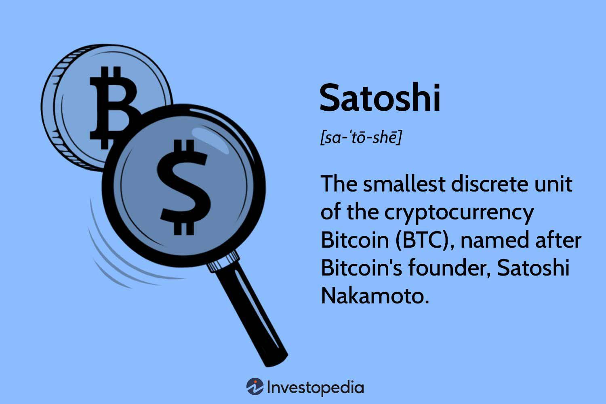

## Table of Contents

## What is Satoshi in the context of Bitcoin?

Satoshi is a unit of Bitcoin, similar to how cents are a unit of a dollar. One Bitcoin is made up of 100 million satoshis. This makes it easier to talk about smaller amounts of Bitcoin, especially as the value of one Bitcoin can be very high.

Satoshi is also the name used by the person or group of people who created Bitcoin. They used the name Satoshi Nakamoto when they released Bitcoin in 2009. No one knows who Satoshi Nakamoto really is, but their invention has changed the world of money and technology.

## How many Satoshis make up one Bitcoin?

One Bitcoin is made up of 100 million satoshis. This means if you have one Bitcoin, you can think of it as having 100 million tiny pieces called satoshis.

The name satoshi comes from the person or group who created Bitcoin. They used the name Satoshi Nakamoto when they introduced Bitcoin to the world in 2009. So, the smallest unit of Bitcoin is named after its mysterious creator.

## Why was the Satoshi created as a unit of Bitcoin?

The Satoshi was created as a unit of Bitcoin to make it easier to handle and talk about very small amounts of Bitcoin. One Bitcoin is worth a lot of money, so if you want to use Bitcoin for small purchases or to send tiny amounts, using Satoshis is helpful. One Bitcoin is made up of 100 million Satoshis, so it's like using cents instead of dollars for small transactions.

The name Satoshi also comes from the person or group who invented Bitcoin. They used the name Satoshi Nakamoto when they introduced Bitcoin to the world in 2009. By naming the smallest unit of Bitcoin after its creator, it honors the mysterious person or group behind this new kind of money.

## How can one acquire Satoshis?

You can get Satoshis by buying them with regular money. You can do this on special websites called cryptocurrency exchanges. You sign up, put in your money, and then use it to buy Bitcoin. Since one Bitcoin is made up of 100 million Satoshis, when you buy Bitcoin, you are also getting Satoshis. The price of Bitcoin changes all the time, so the number of Satoshis you get for your money will change too.

Another way to get Satoshis is by earning them. Some websites and apps give you Satoshis for doing small tasks, like watching videos or playing games. This is called "faucets" because it's like getting a little drip of Bitcoin. You can also get Satoshis by mining Bitcoin, which is when you use special computers to help keep the Bitcoin network running. Miners get paid in Bitcoin, which means they get Satoshis too.

## What is the smallest transaction amount possible in Bitcoin using Satoshis?

The smallest amount of Bitcoin you can send in a transaction is one Satoshi. One Satoshi is the tiniest piece of Bitcoin, and there are 100 million Satoshis in one Bitcoin. So, if you want to send the smallest possible amount, you would send just one Satoshi.

However, sending just one Satoshi can be tricky because of something called transaction fees. These are small amounts of Bitcoin you have to pay to send your Bitcoin to someone else. The fee depends on how busy the Bitcoin network is and how fast you want your transaction to go through. Sometimes, the fee to send one Satoshi might be more than one Satoshi itself, which makes it not worth it. So, while you can send one Satoshi, you need to think about the fees too.

## How do Satoshis affect the divisibility of Bitcoin?

Satoshis make Bitcoin very easy to divide into smaller pieces. One Bitcoin can be split into 100 million Satoshis. This means you can use Bitcoin for very small purchases, like buying a candy or a cup of coffee, because you can pay with just a few Satoshis instead of a whole Bitcoin.

Because Bitcoin can be divided into such small amounts, more people can use it every day. If you only have a little bit of money, you can still buy things with Satoshis. This makes Bitcoin useful for all kinds of transactions, big and small, and helps more people around the world use it.

## What are the practical uses of Satoshis in everyday transactions?

Satoshis make it easy to use Bitcoin for everyday things. Since one Bitcoin is worth a lot, you can use Satoshis to buy small things like a snack or a drink. Imagine you want to buy a candy bar that costs a few cents. Instead of using a whole Bitcoin, you can use just a few Satoshis. This makes Bitcoin useful for small purchases that you do every day.

You can also use Satoshis to send small amounts of money to friends or family. If you want to pay someone back for a small favor, like a cup of coffee, you can send them a few Satoshis. It's like sending a few cents, but it's done with Bitcoin. This makes it easy to share money with others without needing to send a big amount.

## How does the value of a Satoshi fluctuate with Bitcoin's price?

The value of a Satoshi goes up and down with the price of Bitcoin. Since one Bitcoin is made up of 100 million Satoshis, if the price of Bitcoin goes up, the value of each Satoshi goes up too. For example, if one Bitcoin is worth $10,000, then one Satoshi is worth $0.0001. If Bitcoin's price doubles to $20,000, then one Satoshi is worth $0.0002. So, the value of a Satoshi changes directly with Bitcoin's price.

This means that when you buy or sell Satoshis, you need to keep an eye on Bitcoin's price. If Bitcoin's price is going up, the Satoshis you own become more valuable. If Bitcoin's price goes down, then your Satoshis are worth less. It's important to understand this because it affects how much you can buy with your Satoshis and how much money you might make or lose if you decide to sell them.

## What role do Satoshis play in Bitcoin's microtransactions?

Satoshis make it possible to use Bitcoin for tiny purchases, which are called microtransactions. Since one Bitcoin is made up of 100 million Satoshis, you can use just a few Satoshis to buy small things, like a piece of candy or a cup of coffee. This is helpful because the price of one Bitcoin can be very high, so using Satoshis lets you spend just a little bit of Bitcoin at a time.

Microtransactions are important because they let people use Bitcoin for everyday things. If you want to pay for a small favor, like a friend buying you a snack, you can send them a few Satoshis. This makes Bitcoin useful for all kinds of small payments, making it easier for more people to use it every day.

## How are Satoshis used in Bitcoin's blockchain and transaction fees?

Satoshis are the smallest unit of Bitcoin, and they play a big role in how transactions work on the Bitcoin blockchain. When you send Bitcoin to someone, you're really sending a certain number of Satoshis. The smallest amount you can send is one Satoshi. The blockchain keeps track of all these transactions, making sure that every Satoshi is accounted for and moves from one place to another correctly.

Transaction fees on the Bitcoin network are also paid in Satoshis. When you want to send Bitcoin, you have to pay a small fee to the people who help keep the network running, called miners. This fee is usually a few Satoshis, and it helps make sure your transaction gets processed quickly. The exact fee can change depending on how busy the network is and how fast you want your transaction to go through. So, Satoshis are important for both sending Bitcoin and paying the fees that keep the whole system working smoothly.

## What are the implications of Satoshis for Bitcoin's scalability?

Satoshis help make Bitcoin more scalable by allowing it to be used for very small transactions. Since one Bitcoin can be split into 100 million Satoshis, people can use just a few Satoshis to buy small things like a candy bar or a cup of coffee. This means Bitcoin can be used for everyday purchases, not just big ones. By making it possible to handle tiny amounts, Satoshis help more people use Bitcoin, which can make the network grow and become more useful.

However, using Satoshis for lots of small transactions can also create challenges for Bitcoin's scalability. Each transaction, even if it's just for a few Satoshis, takes up space on the blockchain. If too many people are making these small transactions, the network can get very busy, and it might slow down. This is why people are always trying to find ways to make the Bitcoin network faster and able to handle more transactions at once. So, while Satoshis make Bitcoin more flexible, they also add to the work needed to keep the network running smoothly.

## How do Satoshis influence Bitcoin's potential as a global currency?

Satoshis make Bitcoin more useful as a global currency because they let people use Bitcoin for small everyday purchases. Since one Bitcoin is made up of 100 million Satoshis, you can use just a few Satoshis to buy things like a snack or a cup of coffee. This means people all over the world can use Bitcoin for regular things, not just big purchases. It makes Bitcoin more like the money we use every day, which can help more people start using it.

However, using Satoshis for lots of small transactions can also make the Bitcoin network busy. Each transaction, even if it's just for a few Satoshis, takes up space on the blockchain. If too many people are making these small transactions, the network can slow down. This is a challenge for Bitcoin's scalability, but people are working on ways to make the network faster and able to handle more transactions. So, while Satoshis help make Bitcoin more like a global currency, they also add to the work needed to keep the network running smoothly.

## References & Further Reading

[1]: Nakamoto, S. (2008). ["Bitcoin: A Peer-to-Peer Electronic Cash System."](https://nakamotoinstitute.org/library/bitcoin/) 

[2]: Peters, G. W., & Panayi, E. (2015). ["Understanding Modern Banking Ledgers through Blockchain Technologies: Future of Transaction Processing and Smart Contracts on the Internet of Money."](https://papers.ssrn.com/sol3/papers.cfm?abstract_id=2692487) ArXiv preprint arXiv:1511.05740.

[3]: Narayanan, A., Bonneau, J., Felten, E., Miller, A., & Goldfeder, S. (2016). ["Bitcoin and Cryptocurrency Technologies."](https://www.sciencedirect.com/science/article/pii/S1353485816300745) Princeton University Press.

[4]: Hasbrouck, J. (2007). ["Empirical Market Microstructure: The Institutions, Economics, and Econometrics of Securities Trading."](https://archive.org/details/empiricalmarketm0000hasb) Oxford University Press.

[5]: Avellaneda, M., & Lee, J. (2010). ["Statistical Arbitrage in the U.S. Equities Market."](https://papers.ssrn.com/sol3/papers.cfm?abstract_id=1153505) International Journal of Theoretical and Applied Finance, 13(01), 1-30.

[6]: Grier, K. B., & Lyon, M. (2019). ["Evidence against correlation neglect in the Bitcoin market."](https://gwern.net/doc/economics/2020-grier.pdf) Economics Letters, 179, 58-60.

[7]: Johnson, B., & Kriek, A. (2018). ["Financial Risk Management: Applications in Market Compliance."](https://www.researchgate.net/publication/330952938_Cooperative_Learning_The_Foundation_for_Active_Learning) Wiley.