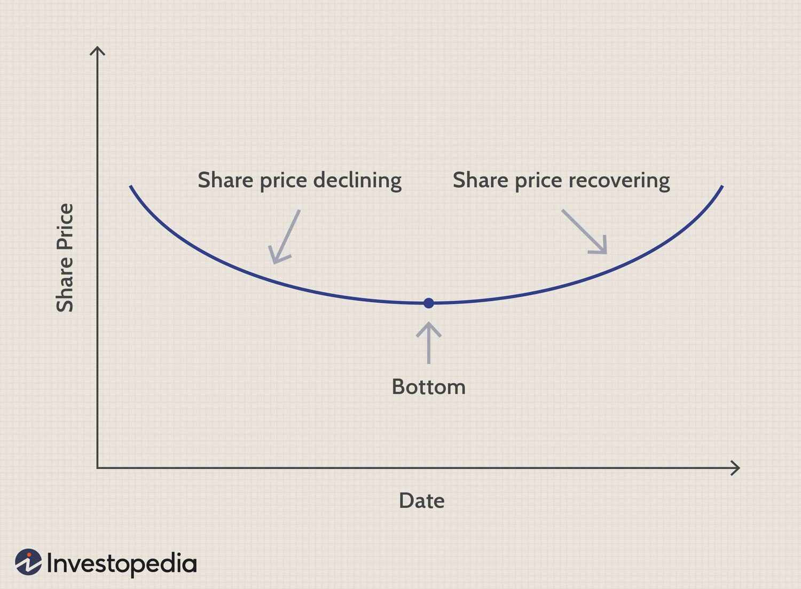

## Table of Contents

## What is a saucer pattern in trading?

A saucer pattern in trading is a type of chart pattern that looks like a shallow, rounded bottom. It forms over a longer period, usually several months, and indicates a slow and gradual shift from a bearish trend to a bullish trend. The pattern gets its name because it looks like a saucer or a shallow bowl when you look at the price chart.

When you see a saucer pattern, it means that the price of the stock or asset has been going down slowly, but then it starts to level out and eventually begins to rise again. This pattern is considered a bullish signal because it shows that the sellers are losing control and the buyers are starting to take over. Traders often wait for the price to break above the resistance level at the top of the saucer before they decide to buy, as this confirms the pattern and the potential for an upward trend.

## How does a saucer pattern differ from other chart patterns?

A saucer pattern is different from other chart patterns because it takes a long time to form, often several months. It looks like a big, shallow U on the chart. Other patterns, like the head and shoulders or the double bottom, form much quicker and have sharper turns. The saucer pattern shows a slow change from a downward trend to an upward trend, while other patterns might show quick changes or different shapes.

Another way the saucer pattern is different is how it shows a gradual shift in who is in control of the market. In a saucer pattern, sellers slowly lose power and buyers slowly gain it. This is different from patterns like the V-bottom, where the change happens fast and can be more surprising. The saucer pattern's slow, smooth shape helps traders see that the market is changing in a steady way, which can make them feel more confident about buying when the pattern finishes.

## What are the key components of a saucer pattern?

The first key component of a saucer pattern is its shape. It looks like a big, shallow U on the chart. This shape shows that the price of the stock or asset has been going down slowly over time, but then it starts to level out and go up again. The saucer pattern takes a long time to form, usually several months, which is different from other patterns that happen faster.

The second key component is the change in who is in control of the market. At the start of the saucer, sellers are in charge and the price is going down. But as the pattern goes on, the sellers start to lose power and the buyers slowly take over. By the end of the pattern, the buyers are in control and the price starts to go up. Traders look for the price to break above the top of the saucer to confirm that the pattern is complete and it's a good time to buy.

## How long does it typically take for a saucer pattern to form?

A saucer pattern usually takes a long time to form, often several months. It's different from other patterns because it doesn't happen quickly. The slow formation of the saucer pattern shows that the price of the stock or asset is changing gradually, not suddenly.

The time it takes for a saucer pattern to fully develop can vary depending on the market and the specific stock or asset. But in general, you can expect it to take at least a few months. This slow and steady change helps traders see that the market is shifting from sellers to buyers in a smooth way.

## What are the bullish and bearish signals indicated by a saucer pattern?

The saucer pattern gives a bullish signal when it finishes. This means it's a good sign for people who want to buy the stock or asset. The pattern starts with the price going down slowly, but then it levels out and starts to go up. When the price breaks above the top of the saucer, it shows that buyers are now in control and the price might keep going up. Traders see this as a chance to buy because the pattern tells them the market is changing from a downward trend to an upward trend.

There is no direct bearish signal from a saucer pattern itself. But, if the price fails to break above the top of the saucer and instead goes back down, it could mean the pattern didn't work out. This might make traders think the market is still under the control of sellers and the price might keep going down. So, while the saucer pattern itself isn't bearish, not completing the pattern can be a bad sign for people hoping for a price increase.

## How can traders identify the beginning and end of a saucer pattern?

Traders can spot the start of a saucer pattern when they see the price of a stock or asset slowly going down over a long time, usually several months. The price makes a big, shallow U shape on the chart. This slow drop shows that sellers are in charge at first, but the price is starting to level out. That's the beginning of the saucer, where the market is getting ready to change from sellers to buyers.

The end of the saucer pattern comes when the price starts to go up again after leveling out. Traders look for the price to break above the top of the saucer, which is the highest point before the price started to go down. When the price goes above this level, it means the buyers are now in control and the pattern is complete. This is a good time for traders to buy because it shows the market is shifting to an upward trend.

## What are the common entry and exit points when trading a saucer pattern?

Traders usually enter a trade when they see the price break above the top of the saucer pattern. This top is the highest point the price reached before it started to go down. When the price goes above this level, it shows that buyers are now in control and the price might keep going up. This is a good time to buy because it confirms the end of the saucer pattern and the start of an upward trend.

The common exit point for traders is when the price reaches a target that they set earlier. This target is often based on how deep the saucer is. Traders measure the distance from the bottom of the saucer to the top and add this distance to the breakout point. When the price gets to this target, it's a good time to sell and take profits. Another exit point can be if the price starts to go down again after breaking out, which might mean the upward trend is over.

## How reliable is the saucer pattern as a trading signal?

The saucer pattern can be a good sign for traders, but it's not perfect. It works well because it shows a slow change in the market from sellers to buyers over a long time. When the price breaks above the top of the saucer, it's a strong hint that the price might keep going up. But, like all patterns, it doesn't work every time. Sometimes the price might not go up as expected, and traders can lose money if they're not careful.

Traders need to use other tools and signals along with the saucer pattern to make better decisions. They should look at things like the overall market trend, other chart patterns, and trading volume to see if the saucer pattern is a good signal to follow. By combining different pieces of information, traders can feel more sure about when to buy or sell. So, while the saucer pattern can be helpful, it's best used with other tools to make trading safer and more reliable.

## Can saucer patterns be applied to different time frames and asset classes?

Saucer patterns can be used on different time frames, like daily, weekly, or monthly charts. On shorter time frames, like daily charts, the pattern might form over a few weeks or months. On longer time frames, like monthly charts, it can take even longer, sometimes a year or more. The key is to look for the same big, shallow U shape no matter what time frame you're using. This makes the saucer pattern flexible for traders who look at different time frames.

The saucer pattern can also be used for different types of assets, not just stocks. It can be seen in forex markets, commodities, and even cryptocurrencies. The idea is the same: the pattern shows a slow change from sellers to buyers over time. Traders can use the saucer pattern to spot potential buying opportunities in any market where they see this slow, gradual shift happening.

## What are some common mistakes traders make when interpreting saucer patterns?

One common mistake traders make when looking at saucer patterns is jumping into a trade too soon. They might see the price starting to go up a little and think the pattern is done, but it's not. They need to wait until the price breaks above the top of the saucer to be sure. If they buy too early, the price might go back down and they could lose money.

Another mistake is not using other tools to help them. The saucer pattern is good, but it's not perfect. Traders should also look at things like the overall market trend, other chart patterns, and how many people are trading the asset. By using more information, they can make better choices and feel more sure about their trades.

## How can technical indicators be used to confirm a saucer pattern?

Technical indicators can help traders feel more sure about a saucer pattern. One way to do this is by using volume. When the price breaks above the top of the saucer, traders should look for a big increase in volume. This means more people are buying the stock or asset, which makes the breakout stronger. Another good indicator is the moving average. If the price moves above a key moving average, like the 50-day or 200-day moving average, at the same time it breaks out of the saucer, it's a good sign that the upward trend is real.

Other indicators like the Relative Strength Index (RSI) and the Moving Average Convergence Divergence (MACD) can also help. If the RSI starts to go up from being oversold, it can show that the price is gaining strength. The MACD can give a buy signal if the line crosses above the signal line when the price breaks out of the saucer. By using these indicators along with the saucer pattern, traders can feel more confident that the pattern is real and the price is likely to keep going up.

## What advanced strategies can be employed to maximize profits from saucer patterns?

Traders can use advanced strategies to make more money from saucer patterns by combining them with other chart patterns and technical indicators. For example, if a saucer pattern forms at the same time as a bullish flag or a cup and handle pattern, it can make the signal even stronger. Traders can also use tools like the Relative Strength Index (RSI) or the Moving Average Convergence Divergence (MACD) to check if the price is gaining strength when it breaks out of the saucer. If these indicators show a buy signal at the same time, it can give traders more confidence to enter the trade.

Another way to make more money is by setting smart targets and using stop-loss orders. Traders can measure the depth of the saucer from the bottom to the top and add that distance to the breakout point to set a profit target. This helps them know when to sell and take their profits. They can also use a stop-loss order just below the breakout level to limit their losses if the price goes back down. By combining these strategies, traders can make the most of saucer patterns and improve their chances of making money.

## References & Further Reading

[1]: Bulkowski, T. N. (2005). ["Encyclopedia of Chart Patterns."](https://www.amazon.com/Encyclopedia-Chart-Patterns-Thomas-Bulkowski/dp/0471668265) John Wiley & Sons.

[2]: Murphy, J. J. (1999). ["Technical Analysis of the Financial Markets: A Comprehensive Guide to Trading Methods and Applications."](https://archive.org/details/technicalanalysi0000murp) New York Institute of Finance.

[3]: Pring, M. J. (2002). ["Technical Analysis Explained,"](https://www.amazon.com/Technical-Analysis-Explained-Fifth-Successful/dp/0071825177) McGraw-Hill Education.

[4]: Chan, E. P. (2009). ["Quantitative Trading: How to Build Your Own Algorithmic Trading Business."](https://github.com/egorpe/EPChan-QuantitativeTrading/blob/master/example7_6.m) John Wiley & Sons.

[5]: Jansen, S. (2020). ["Machine Learning for Algorithmic Trading: Predictive Models to Extract Signals from Market and Alternative Data for Systematic Trading Strategies with Python."](https://www.amazon.com/Machine-Learning-Algorithmic-Trading-alternative/dp/1839217715) Packt Publishing.

[6]: Kaufman, P. J. (2013). ["Trading Systems and Methods."](https://onlinelibrary.wiley.com/doi/book/10.1002/9781119202561) John Wiley & Sons.

[7]: Lopez de Prado, M. (2018). ["Advances in Financial Machine Learning."](https://www.amazon.com/Advances-Financial-Machine-Learning-Marcos/dp/1119482089) John Wiley & Sons.