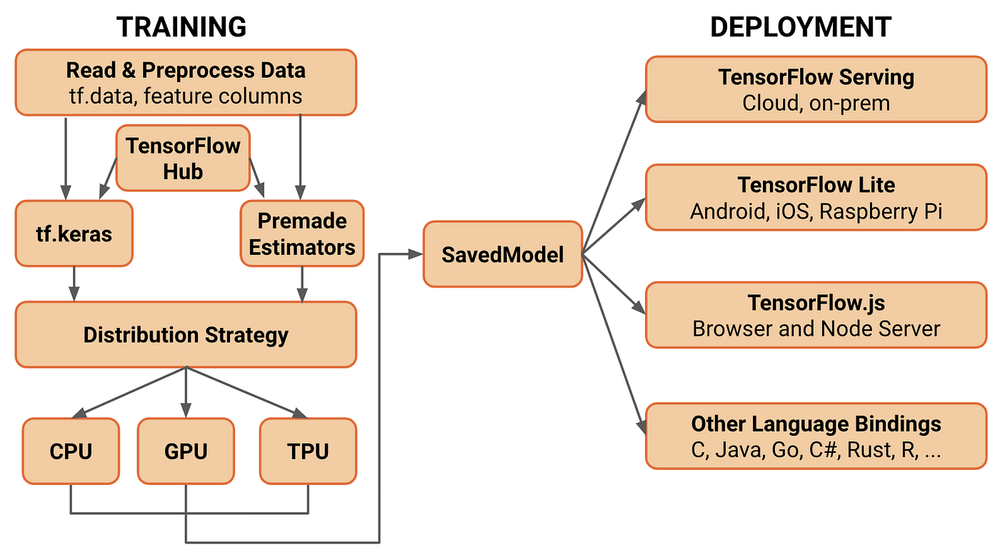

## Table of Contents

## What is a SavedModel in machine learning?

A SavedModel in machine learning is a way to save and load machine learning models. It is like taking a snapshot of your model so you can use it later or share it with others. SavedModel is used a lot in TensorFlow, which is a popular tool for building and training machine learning models. When you save your model as a SavedModel, it includes everything needed to run the model, like the weights, the architecture, and any other important parts.

Using a SavedModel is helpful because it makes it easy to move your model from one place to another. For example, you can train a model on your computer and then use it on a different computer or even on a server. This is really useful for deploying machine learning models in real-world applications. SavedModels are also good because they can be loaded quickly and work well with different versions of TensorFlow, making them very flexible and reliable.

## Why is SavedModel important for deploying machine learning models?

SavedModel is important for deploying machine learning models because it makes it easy to move the model from where it was trained to where it needs to be used. Imagine you trained a model on your computer. With SavedModel, you can save it and then use it on a different computer or even on a server. This is really helpful because it means you can train your model in one place and then use it in another place without any problems.

Another reason SavedModel is important is that it includes everything needed to run the model. This means the weights, the architecture, and any other important parts are all saved together. When you deploy your model, you don't have to worry about missing pieces or setting things up again. SavedModels also work well with different versions of TensorFlow, so you can be sure your model will work reliably no matter where you use it.

## How do you create a SavedModel in TensorFlow?

To create a SavedModel in TensorFlow, you first need to have a trained model. Once your model is ready, you can use the `tf.saved_model.save` function to save it. This function takes two main arguments: the model you want to save and the path where you want to save it. For example, if you have a model called `my_model` and you want to save it in a folder called `saved_model`, you would use the code `tf.saved_model.save(my_model, 'saved_model')`. This command will create a folder with all the necessary files to use your model later.

After you run this code, TensorFlow will create a directory with several files inside it. These files include a saved model protocol buffer (saved_model.pb), which contains the model's architecture, and one or more variables subdirectories that hold the model's weights. You can then use this SavedModel to load and use your model in different environments. To load the model, you can use the `tf.saved_model.load` function, specifying the path to the saved model directory. For example, `loaded_model = tf.saved_model.load('saved_model')` will load your model back into memory, ready to use.

## What are the key components of a SavedModel?

A SavedModel in TensorFlow has a few important parts that make it work well. The main part is the saved model protocol buffer, which is a file called saved_model.pb. This file holds the model's architecture, which is like a blueprint that shows how the model is built. It also includes information about the model's inputs and outputs, so you know how to use the model correctly.

Another key part of a SavedModel is the variables folder. This folder holds the model's weights, which are the numbers that the model learned during training. These weights are really important because they are what make the model work the way it does. When you save a model, TensorFlow puts these weights in a special format that can be loaded quickly and used in different places.

Together, the saved_model.pb file and the variables folder make up the SavedModel. They include everything needed to use the model later or share it with others. This makes SavedModels very useful for moving models between different computers or servers, and for using them in real-world applications.

## Can you explain the difference between SavedModel and other model formats like ONNX or PMML?

SavedModel is a format used by TensorFlow to save and load [machine learning](/wiki/machine-learning) models. It includes everything needed to run the model, like the model's architecture and weights. This makes it easy to move the model from one place to another, like from your computer to a server. SavedModel works well with different versions of TensorFlow, so you can be sure it will work reliably no matter where you use it.

ONNX, which stands for Open Neural Network Exchange, is a format that can be used with many different machine learning tools, not just TensorFlow. It's like a common language that different tools can understand. This makes it easier to move models between different tools, but it might not include everything that a specific tool needs. PMML, or Predictive Model Markup Language, is another format that is used to represent models in a way that can be understood by different tools. It's often used for simpler models and is good for sharing models with people who might not use the same tools as you.

In summary, SavedModel is specific to TensorFlow and includes everything needed to run the model within that ecosystem. ONNX and PMML are more general formats that can be used across different tools, but they might not include all the details that a specific tool needs. Choosing the right format depends on what you need to do with your model and what tools you are using.

## How does SavedModel handle versioning and backward compatibility?

SavedModel in TensorFlow is designed to handle versioning and backward compatibility well. When you save a model as a SavedModel, TensorFlow includes information about the version of TensorFlow used to create it. This helps make sure that the model can still be used even if you update TensorFlow to a newer version. If you load a SavedModel with a newer version of TensorFlow, it will try to use the features from the older version to keep the model working correctly. This means you can keep using your model without having to change it, even if you update TensorFlow.

Backward compatibility is important because it lets you use your old models with new versions of TensorFlow. If there are any changes in TensorFlow that might affect how your model works, the SavedModel format has ways to handle these changes. For example, if a new version of TensorFlow adds a new feature that your old model doesn't use, the SavedModel will ignore that feature and just use the parts that your model needs. This way, you can be sure that your model will keep working the way it should, even as TensorFlow gets updated.

## What are the best practices for optimizing SavedModel for performance?

When you save your model as a SavedModel, there are some good ways to make it work faster. One way is to use quantization. This means you can change the numbers in your model to use less space, which can make it run quicker. Another way is to use model pruning, where you remove parts of the model that don't help much. This can make your model smaller and faster. Also, you can use TensorFlow's built-in tools like `tf.lite` to make your model smaller and faster for mobile devices.

Another important thing to do is to think about how you will use your model. If you know it will be used on a server, you can save it in a way that works best for servers. If it will be used on a phone, you might want to save it in a different way. You can also use TensorFlow's `tf.saved_model.save` function with options that help make your model run faster. For example, you can set the `signatures` argument to make sure the model is saved in a way that is easy to use and fast to load.

By following these simple steps, you can make your SavedModel work better and faster. This will help your model run smoothly no matter where you use it, whether it's on a computer, a server, or a mobile device.

## How can you serve a SavedModel using TensorFlow Serving?

To serve a SavedModel using TensorFlow Serving, you first need to make sure your model is saved as a SavedModel. Once you have your SavedModel ready, you can use TensorFlow Serving to make it available for others to use. TensorFlow Serving is like a special server that can load your model and use it to make predictions. You can start TensorFlow Serving by using a command like ```bash
tensorflow_model_server --port=8500 --rest_api_port=8501 --model_name=my_model --model_base_path=/path/to/saved_model
``` This command tells TensorFlow Serving to start a server that listens on port 8500 for gRPC requests and port 8501 for REST API requests, and it will load your model from the specified path.

Once TensorFlow Serving is running, you can send requests to it to use your model. You can do this using either gRPC or REST API. For example, if you want to use the REST API, you can send a POST request to `http://localhost:8501/v1/models/my_model:predict` with the data you want to predict. TensorFlow Serving will then use your SavedModel to make the prediction and send the results back to you. This makes it easy to use your model in different applications without having to load and run the model yourself.

## What tools and libraries can be used to inspect and analyze a SavedModel?

To inspect and analyze a SavedModel, you can use TensorFlow's built-in tools like `tf.saved_model.load` and `tf.saved_model.analyze_saved_model`. When you load a SavedModel with `tf.saved_model.load`, you can see the model's architecture and weights. This helps you understand how the model is built and what it learned during training. The `tf.saved_model.analyze_saved_model` function gives you a detailed report about the SavedModel, showing you things like the model's inputs, outputs, and any signatures it has. This can be really helpful if you want to check if the model is saved correctly or if you need to know more about how to use it.

Another useful tool is Netron, which is a visualizer for machine learning models. You can use Netron to open your SavedModel and see a graphical view of the model's architecture. This makes it easier to understand how the different parts of the model are connected. If you want to do more advanced analysis, you can use libraries like TensorFlow Model Analysis (TFMA). TFMA lets you evaluate your model's performance on different datasets and gives you detailed metrics and visualizations. This can help you see how well your model is working and where it might need improvements.

## How do you convert a SavedModel to other formats for different deployment environments?

To convert a SavedModel to other formats for different deployment environments, you can use tools like TensorFlow Lite for mobile devices. If you want to use your model on a phone or a tablet, you can convert your SavedModel to TensorFlow Lite format. You do this by using the `tf.lite.TFLiteConverter` in TensorFlow. For example, you can use code like ```python
converter = tf.lite.TFLiteConverter.from_saved_model('saved_model_path')
tflite_model = converter.convert()
``` This will change your SavedModel into a TensorFlow Lite model that can run on mobile devices. This is helpful because mobile devices have less power than computers, so using a lighter version of your model makes it work better.

If you need to use your model with other machine learning tools, you can convert your SavedModel to ONNX format. ONNX is a common format that many different tools can use. To convert your SavedModel to ONNX, you can use the `tf2onnx` tool. You can do this with a command like ```bash
python -m tf2onnx.convert --saved-model saved_model_path --output model.onnx
``` This command will create an ONNX file from your SavedModel. This is useful because it lets you use your model with tools like PyTorch or Microsoft's machine learning tools. By converting your SavedModel to different formats, you can make sure it works well in different places.

## What are common challenges and solutions when working with SavedModel in production?

When working with SavedModel in production, one common challenge is ensuring that the model is compatible with different versions of TensorFlow. As TensorFlow gets updated, changes in the API or internal structure can break your model. To solve this, always check the version compatibility and use TensorFlow's built-in tools for backward compatibility. For example, when saving your model, you can specify the `tf_version` argument to ensure it works with older versions. Another challenge is optimizing the model for performance. SavedModels can be large and slow if not optimized correctly. To address this, you can use techniques like quantization and pruning. Quantization reduces the precision of the model's weights, making it smaller and faster, while pruning removes unnecessary parts of the model.

Another issue you might face is deploying the SavedModel across different environments, like from a development computer to a production server. This can be tricky because different environments might have different hardware or software setups. To solve this, you can use tools like Docker to create consistent environments. Docker allows you to package your model and all its dependencies into a container that can run the same way everywhere. Additionally, when serving the model, you might encounter problems with scaling and managing requests. TensorFlow Serving can help here by providing a scalable way to serve your model. You can start TensorFlow Serving with a command like ```bash
tensorflow_model_server --port=8500 --rest_api_port=8501 --model_name=my_model --model_base_path=/path/to/saved_model
``` This command sets up a server that can handle many requests efficiently, making it easier to use your model in a production environment.

## How can advanced techniques like quantization and pruning be applied to SavedModel?

Quantization is a way to make your SavedModel smaller and faster. When you quantize a model, you change the numbers in the model to use less space. This means the model takes up less memory and can run quicker, which is really helpful for using the model on devices like phones or tablets. In TensorFlow, you can quantize your SavedModel using the `tf.lite.TFLiteConverter` tool. For example, you can use code like ```python
converter = tf.lite.TFLiteConverter.from_saved_model('saved_model_path')
converter.optimizations = [tf.lite.Optimize.DEFAULT]
tflite_quantized_model = converter.convert()
``` This will create a quantized version of your model that is smaller and faster.

Pruning is another way to make your SavedModel better. When you prune a model, you remove parts of it that don't help much. This makes the model smaller and can make it run faster too. In TensorFlow, you can use the `tfmot.sparsity.keras.prune_low_magnitude` function to prune your model. After pruning, you need to save the model as a SavedModel. For example, you can use code like ```python
import tensorflow_model_optimization as tfmot
pruned_model = tfmot.sparsity.keras.prune_low_magnitude(model)
pruned_model.fit(...)  # Train the model
tf.saved_model.save(pruned_model, 'pruned_saved_model')
``` This will create a pruned version of your model, which is smaller and can be used in your SavedModel.