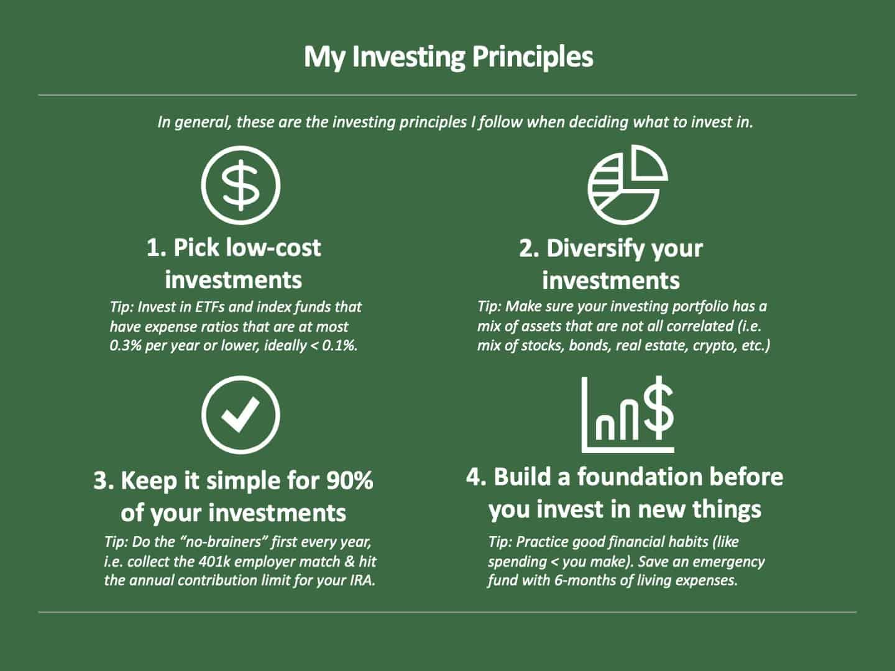

In the rapidly-changing world of finance, understanding the key components of successful financial planning is crucial. Financial planning is a multifaceted discipline involving strategies for saving, investment, and risk management. Each component, from saving strategies to algorithmic trading, plays an integral role in creating a stable financial future. Savvy financial planning not only secures immediate financial stability but also paves the way for long-term investment growth and wealth accumulation.

This article will guide you through the essentials of building a robust investment portfolio. The journey begins with strategic saving methods, where the importance of disciplined saving habits and setting up automatic savings is emphasized. Understanding different savings vehicles such as savings accounts, certificates of deposit (CDs), and money market accounts sets the foundation for more advanced financial strategies.



Incorporating effective financial planning involves tactical allocation of financial resources towards future goals, emphasizing the creation of a comprehensive budget that accommodates both investment and savings. The guidance of a financial advisor and the development of an Investment Policy Statement (IPS) prove to be invaluable in this context, offering personalized strategies and risk minimization techniques through diversification and insurance.

The construction of an investment portfolio is another cornerstone of financial planning. It involves key steps such as asset allocation across stocks, bonds, exchange-traded funds (ETFs), and commodities. Portfolio management—whether active or passive—requires mindful rebalancing to adapt to market changes and personal circumstances.

Adding to the mix is the innovative world of algorithmic trading, which is transforming modern investment strategies. This Includes various trading strategies such as arbitrage, trend-following, and market-making. Algorithmic trading brings the benefits of automation, allowing for high-frequency trades and minimizing human errors. The integration of artificial intelligence and machine learning marks the future of this innovative approach.

By integrating these components—saving strategies, financial planning, investment management, and algorithmic trading—investors can optimize their financial outcomes, achieving both stability and growth in their personal finances. This holistic approach allows for enhanced decision-making, strategic risk management, and the ability to capitalize on market opportunities. As we explore these elements, it becomes clear how they collectively empower individuals to achieve long-term financial security.

## Table of Contents

## Saving Strategies

The foundation of all financial planning begins with effective saving strategies. Establishing automatic savings is a practical approach that ensures a portion of income is immediately set aside before it can be spent. This can be achieved through direct deposit arrangements where a specified amount or percentage of income is transferred directly to a savings account, certificate of deposit (CD), or money market account upon receipt.

Savings accounts are a traditional and accessible way to store funds with the potential for [earning](/wiki/earning-announcement) interest, albeit typically at lower rates compared to other investment vehicles. They offer [liquidity](/wiki/liquidity-risk-premium) and safety, making them suitable for short-term savings goals or emergencies. CDs, on the other hand, offer higher interest rates in exchange for keeping money deposited for a fixed term, which can range from a few months to several years. Money market accounts present a middle ground with competitive interest rates and check-writing capabilities, providing both flexibility and earning potential.

A key principle in saving is the concept of 'paying yourself first.' This strategy emphasizes prioritizing savings by treating deposits into savings accounts or investment portfolios as the first 'expense' in a budget. Implementing this approach helps in accumulating wealth systematically without conscious effort each month. It aligns with the philosophy of living below one's means and can significantly impact long-term financial health.

Building an emergency fund is also paramount. Financial advisors commonly recommend setting aside three to six months' worth of living expenses to cushion against unexpected events such as job loss or medical emergencies. This fund ensures that an individual's financial plan remains intact without the need to liquidate investments under unfavorable conditions.

Disciplined saving habits are crucial for successful long-term financial planning. Consistency in saving, whether facilitated through automation or mindful budgeting, cultivates stability and resilience against financial uncertainties. Over time, these accumulated savings can be funneled into investments, furthering growth and securing financial objectives.

In conclusion, integrating automatic savings mechanisms, embracing the 'pay yourself first' ideology, and diligently maintaining an emergency fund are foundational components of a sound saving strategy. They provide the groundwork for achieving broader financial goals and engender a disciplined approach that can endure through various phases of economic life.

## Financial Planning

Financial planning is the strategic allocation of financial resources toward achieving future goals and ensuring long-term financial security. A key component of effective financial planning is the creation of a comprehensive budget that accommodates both savings and investment opportunities. This involves systematically tracking income and expenses to identify potential areas for cost reduction and resource reallocation. A well-structured budget facilitates disciplined saving and prudent investment, laying the foundation for a stable financial future.

The process of budgeting requires careful assessment of monthly income streams and necessary expenditures. By categorizing expenses into fixed and variable costs, individuals can prioritize essential spending while setting achievable targets for discretionary spending. This approach not only enhances savings potential but also provides clarity on available funds for potential investments. For instance, setting a fixed percentage of monthly income dedicated to savings and investments ensures that financial goals are consistently pursued.

The involvement of a financial advisor can significantly enhance financial planning. Financial advisors provide expertise in crafting strategies that align with individual goals, risk tolerance, and time horizons. A critical tool developed by financial advisors is the Investment Policy Statement (IPS). The IPS outlines an investor's objectives, risk preferences, and investment guidelines, serving as a framework for making informed decisions. This document is crucial for maintaining discipline and consistency in investment strategy, particularly during market [volatility](/wiki/volatility-trading-strategies).

Risk management is another vital aspect of financial planning, with diversification and insurance playing key roles in minimizing potential losses. Diversification involves spreading investments across various asset classes, such as stocks, bonds, and real estate, to reduce exposure to any single market or sector. This can be mathematically represented by calculating the portfolio's overall risk using the formula for portfolio variance:

$$
\sigma^2_p = \sum w_i^2 \sigma_i^2 + \sum \sum w_i w_j \sigma_{i,j}
$$

where $\sigma^2_p$ is the portfolio variance, $w_i$ and $w_j$ are the weights of the assets in the portfolio, $\sigma_i^2$ is the variance of asset $i$, and $\sigma_{i,j}$ is the covariance between assets $i$ and $j$.

Insurance products offer an additional layer of protection by transferring specific risks to insurers. Health, life, and property insurance policies mitigate the financial impact of unforeseen events, safeguarding assets and ensuring financial stability. By integrating these risk management strategies into financial planning, individuals can protect their wealth and achieve their long-term objectives more effectively.

In conclusion, strategic financial planning requires diligent budgeting, expert advice, and comprehensive risk management. By meticulously allocating financial resources and leveraging diversification and insurance, individuals can proactively pursue their financial goals while mitigating potential risks.

## Investment Portfolio Construction

Constructing a diversified investment portfolio is a strategic endeavor that involves careful consideration of asset allocation and management styles. The objective is to strike a balance between risk and return, tailored to the investor's financial goals and risk tolerance. 

**Importance of Asset Allocation**

Asset allocation refers to distributing investments across various asset classes, including stocks, bonds, ETFs, and commodities. This strategy is foundational because different assets react differently to market conditions. Stocks generally offer higher potential returns but come with increased volatility. Bonds, on the other hand, are typically more stable but offer lower returns. ETFs provide access to a broad spectrum of markets and often serve as a low-cost option for diversification. Commodities like gold or oil can act as a hedge against inflation and market downturns.

The asset allocation decision is driven by the investor's time horizon, risk tolerance, and investment goals. A younger investor with a long-term perspective may allocate a higher percentage of their portfolio to stocks to capitalize on growth opportunities, whereas a retiree might favor bonds to preserve capital and generate steady income.

**Active vs Passive Management**

Investment portfolios can be managed actively or passively. Active management involves making investment decisions based on analytical research, forecasts, and the manager’s judgment. The goal is to outperform market benchmarks by taking advantage of short-term price fluctuations. This approach often incurs higher fees due to frequent trading and managerial interventions.

Passive management, alternatively, aims to match the performance of a market index. This style is exemplified by index funds and ETFs that replicate the composition of indices like the S&P 500. Passive portfolios generally involve lower costs and are based on the efficient market hypothesis, which suggests that it is difficult to consistently outperform the market.

**Portfolio Rebalancing**

Rebalancing is the process of realigning the weightings of a portfolio's assets to maintain a desired risk level. Over time, some investments may outperform others, causing the portfolio to drift from its original asset allocation. For example, if stocks perform well, their proportion in the portfolio might swell beyond the intended allocation, increasing risk exposure.

Regular rebalancing—typically quarterly or annually—ensures that the portfolio remains aligned with the investor’s risk tolerance and investment objectives. This can be achieved by selling high-performing assets and buying under-performing ones, thereby adhering to the principle of “buy low, sell high.”

**Consistent Review and Adjustments**

Investment portfolios require ongoing review and adjustments to account for market changes and personal circumstances. Market conditions are dynamic, influenced by economic shifts, geopolitical events, and technological advancements. Additionally, an investor’s financial situation, goals, and risk tolerance may evolve over time. 

Regular performance reviews enable investors to assess whether their portfolio aligns with their financial objectives. Adjustments may include altering asset allocations, modifying management styles, or adopting new investment strategies. A disciplined approach to reviewing and adjusting a portfolio can mitigate risks and capitalize on market opportunities, thereby enhancing the potential for optimized financial outcomes.

Investors who diligently construct, manage, and adjust diversified portfolios position themselves to achieve stability and growth, navigating the complexities of the financial markets effectively.

## Algorithmic Trading

Algorithmic trading, a cornerstone of contemporary investment strategies, uses computer algorithms to execute trades based on predetermined criteria, such as timing, price, or [volume](/wiki/volume-trading-strategy). These sophisticated programs can quickly analyze vast data sets, enabling traders to capitalize on fleeting market opportunities that would be impossible to detect manually.

One popular strategy is [arbitrage](/wiki/arbitrage), which exploits price discrepancies across different markets or financial instruments. For instance, if a stock is undervalued on one exchange compared to another, an algorithm can swiftly execute simultaneous buy and sell orders to lock in profits, all within fractions of a second.

Trend-following is another prevalent strategy, where algorithms identify and capitalize on market trends. By analyzing historical data and moving averages, these systems can predict upward or downward patterns, executing trades accordingly. This method operates on the principle that current market trends will likely continue, optimizing entry and [exit](/wiki/exit-strategy) points to maximize returns.

Market-making involves providing liquidity to markets by simultaneously offering to buy and sell a particular financial instrument. Algorithms in market-making ensure that there is always a willing buyer or seller, profiting from the difference between the bid and ask prices, known as the spread.

The automation of these trading strategies offers significant benefits, including the ability to execute high-frequency trades at lightning speed, far beyond human capabilities. This efficiency reduces transaction costs and minimizes human errors, as algorithms operate without fatigue or emotional bias.

The future of [algorithmic trading](/wiki/algorithmic-trading) is closely tied to advances in [artificial intelligence](/wiki/ai-artificial-intelligence) and [machine learning](/wiki/machine-learning). These technologies enhance algorithms' learning and predictive capabilities, enabling them to adapt to changing market conditions and uncover complex patterns. For example, machine learning models can refine their strategies by continuously analyzing new market data and outcomes of past trades, improving decision-making processes over time.

Python, a popular programming language for algorithmic trading, offers libraries like NumPy and Pandas for data manipulation, and sklearn for machine learning. A simple example of an algorithmic trading script in Python could look like:

```python
import pandas as pd
import numpy as np
from sklearn.linear_model import LinearRegression

# Load historical stock data
data = pd.read_csv('stock_data.csv')
data['Moving_Average'] = data['Close'].rolling(window=50).mean()

# Define features and target
features = data[['Open', 'High', 'Low', 'Moving_Average']].dropna()
target = data['Close'].shift(-1).dropna()

# Train a simple linear regression model
model = LinearRegression().fit(features[:-1], target)

# Predict next day's closing price
predicted_price = model.predict(features.iloc[-1].values.reshape(1, -1))
print(f"Predicted next day's closing price: {predicted_price[0]}")
```

This script loads stock data, calculates a moving average, and uses a basic linear regression model to predict future prices, showcasing a rudimentary trend-following approach.

As technology continues to evolve, algorithmic trading will likely become more integral to modern finance, driving the need for investors to stay abreast of these advancements to maintain a competitive edge in the marketplace.

## Integration and Synergy

In the dynamic landscape of finance, the integration of saving strategies, financial planning, investment portfolios, and algorithmic trading forms a comprehensive strategy that enhances financial outcomes. This synergy facilitates informed decision-making, effective risk management, and the ability to capitalize on market opportunities, ultimately leading to optimized financial results.

Saving strategies provide the bedrock for financial security. Regular deposits into savings accounts, Certificates of Deposit (CDs), and money market accounts enable individuals to accumulate wealth over time. By automating savings, investors ensure consistent contributions that form a safety net for future investments. These savings techniques correlate with the concept of "paying yourself first," which fosters disciplined financial habits vital for long-term planning.

Financial planning deepens this foundation by allocating resources to meet future goals. It involves crafting a budget that accommodates both savings and investments, ensuring a balance between expenditure and wealth accumulation. A comprehensive financial plan often includes developing an Investment Policy Statement (IPS), which outlines an individual's investment goals and risk tolerance. By diversifying investments, risks can be minimized, and potential returns can be maximized, leveraging the insights of financial advisors when necessary.

Investment portfolio construction is the next step, focusing on asset allocation that aligns with the investor's risk profile and financial objectives. A diversified portfolio might include stocks, bonds, Exchange-Traded Funds (ETFs), and commodities. Active management involves frequent buying and selling to outperform benchmarks, while passive management focuses on tracking market indices. Portfolio rebalancing is crucial to maintaining the desired asset mix, especially in response to market fluctuations or changes in personal circumstances.

Algorithmic trading introduces an advanced dimension to investment strategies. It employs mathematical models and algorithms to execute trades at high speeds and volumes, optimizing the entry and exit points for each transaction. Strategies such as arbitrage, which exploits price discrepancies, trend-following, and market-making enhance the efficiency of executing trades while reducing human errors. The potential of algorithmic trading is amplified by developments in artificial intelligence and machine learning, which refine the strategies based on data-driven predictions.

The intersection of these components creates a robust financial strategy. For instance, a well-defined financial plan informed by saving strategies ensures that sufficient capital is available for investment portfolio diversification. Algorithmic trading enhances this by enabling quick adjustments to the portfolio in response to market changes, maximizing returns while managing risks.

A case study demonstrating successful integration is that of Ray Dalio's Bridgewater Associates. By employing a systematic approach that merges financial planning, diversified portfolios, and algorithmic trading analytics, Bridgewater effectively manages risks while capitalizing on global market opportunities. This synthesis allows for adaptive strategy adjustments, leading to sustained performance across varied economic conditions.

Through the cohesive integration of saving strategies, financial planning, investment portfolios, and algorithmic trading, individuals and firms alike can achieve a balanced and responsive financial approach. This synergy not only enhances decision quality and risk management but also uncovers opportunities for growth in an ever-evolving financial environment.

## Future Trends

The landscape of financial planning and investment strategies is continuously evolving, driven largely by technological advancements and the development of innovative financial products. A key area of transformation is the integration of artificial intelligence (AI) and machine learning (ML) into financial decision-making processes. These technologies enable more sophisticated data analysis and predictive modeling, allowing investors and financial advisors to make more informed decisions. AI algorithms can process vast amounts of data to identify trends and patterns that would be imperceptible to human analysts, thereby enhancing the accuracy of forecasts and investment strategies.

The introduction of new financial products and platforms is reshaping personal finance strategies. For example, the rise of robo-advisors—automated platforms that provide algorithm-driven financial planning services—offers a cost-effective alternative to traditional financial advisors. These platforms have democratized access to financial planning, empowering individuals with diverse levels of capital to engage in strategic investment activities. Additionally, the emergence of blockchain technology and cryptocurrencies introduces new asset classes, offering both a challenge and an opportunity for investors to diversify their portfolios.

As these technologies advance, they present both challenges and opportunities for investors in the evolving marketplace. One challenge is the increasing complexity of financial products, which can be difficult for individual investors to navigate without adequate knowledge and resources. On the opportunity side, technology enables greater accessibility to sophisticated financial tools and platforms, reducing barriers to entry for novice investors.

Future trends in the financial sector highlight the importance of adaptability and continuous learning. Investors and financial planners must remain nimble, leveraging technology to keep pace with market developments and capitalize on emerging opportunities. The potential for AI and ML to further transform financial decision-making, coupled with the advent of innovative financial products, sets the stage for significant evolution in personal finance strategies. As the marketplace continues to change, embracing these trends will be crucial for optimizing financial outcomes.

## Conclusion

The intricate process of successful financial planning rests upon the integration of several crucial elements: saving strategies, financial planning, investment portfolio construction, and algorithmic trading. A well-structured saving strategy serves as the bedrock of financial security, enabling individuals to build an emergency fund and lay the groundwork for future investments. Effective financial planning involves strategic budget allocation and risk management, establishing a robust framework for achieving future financial goals.

Constructing a diversified investment portfolio further enhances financial stability by balancing assets across stocks, bonds, and other commodities, thus mitigating risk and optimizing returns. Algorithmic trading introduces an innovative frontier, leveraging automation and technology to enhance investment strategies and capitalize on market movements efficiently.

By adopting these strategies, individuals are empowered to achieve long-term financial security. Continuous learning and adaptation are essential in this dynamic financial landscape. The integration of technological advancements such as artificial intelligence and machine learning is reshaping financial tools and strategies, necessitating a commitment to ongoing education.

For those eager to expand their knowledge, numerous resources offer deeper insights into financial planning and investing. Engaging with these materials can provide essential guidance, equipping readers to make informed decisions and successfully navigate the complexities of personal finance.

## References & Further Reading

[1]: Bergstra, J., Bardenet, R., Bengio, Y., & Kégl, B. (2011). ["Algorithms for Hyper-Parameter Optimization."](https://dl.acm.org/doi/10.5555/2986459.2986743) Advances in Neural Information Processing Systems 24.

[2]: ["Advances in Financial Machine Learning"](https://www.amazon.com/Advances-Financial-Machine-Learning-Marcos/dp/1119482089) by Marcos Lopez de Prado

[3]: ["Evidence-Based Technical Analysis: Applying the Scientific Method and Statistical Inference to Trading Signals"](https://books.google.com/books/about/Evidence_Based_Technical_Analysis.html?id=jbD47VkOHAEC) by David Aronson

[4]: ["Machine Learning for Algorithmic Trading"](https://github.com/stefan-jansen/machine-learning-for-trading) by Stefan Jansen

[5]: ["Quantitative Trading: How to Build Your Own Algorithmic Trading Business"](https://www.amazon.com/Quantitative-Trading-Build-Algorithmic-Business/dp/1119800064) by Ernest P. Chan