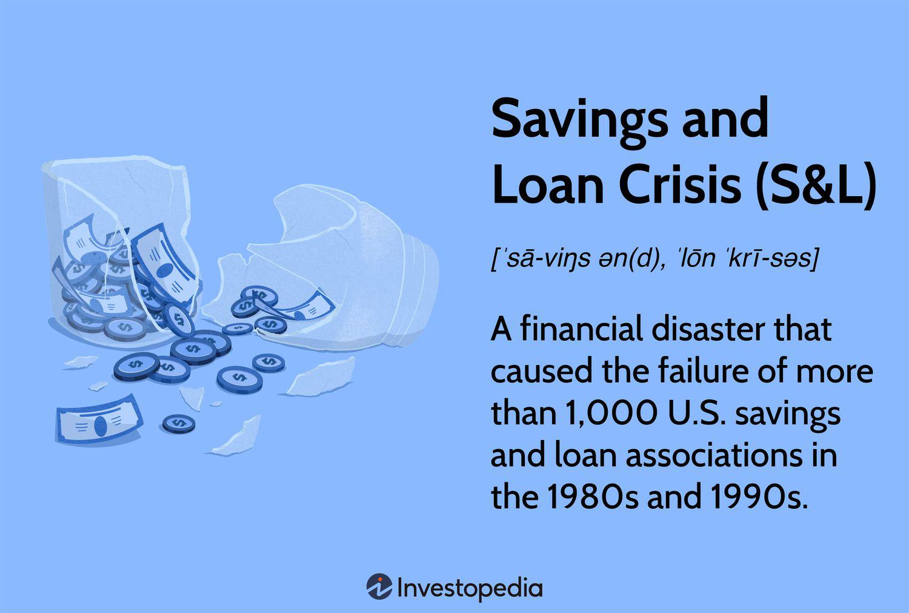

The Savings and Loan (S&L) Crisis was a major financial disaster during the 1980s, marked by the failure of numerous savings and loan associations in the United States. This crisis not only highlighted vulnerabilities within the financial system but also instigated substantial economic repercussions. S&Ls, also known as thrift institutions, were originally established to promote homeownership by providing affordable and accessible mortgage loans. During the crisis, a confluence of high interest rates, deregulation, and speculative lending practices led to widespread insolvency in these institutions.

The economic consequences of the S&L Crisis were significant, affecting various sectors and contributing to a broader economic downturn. The government's taxpayer-funded bailout underscored the gravity of the situation and necessitated regulatory reforms to stabilize the financial system, leaving a lasting impact on banking practices.



Understanding the S&L Crisis is critical for contemporary policymakers, investors, and economists, as it sheds light on the systemic risks and regulatory challenges faced by financial institutions. Furthermore, the lessons derived from the crisis have informed the development of modern financial practices, such as algorithmic trading. These innovations emphasize the importance of risk management and the need for robust regulatory frameworks to ensure financial stability.

A comprehensive analysis of the crisis is essential to appreciating its historical significance and relevance to current economic policies and strategies, guiding stakeholders in making informed decisions to anticipate and mitigate potential financial disruptions in the future.

## Table of Contents

## The Build-Up to the Savings and Loan Crisis

The Savings and Loan (S&L) crisis of the 1980s emerged from a complex interplay of regulatory and economic conditions that fostered an environment conducive to excessive lending and speculative investments. Several factors laid the groundwork for this financial disaster, most notably high interest rates, stagflation, and significant deregulation within the financial sector.

High interest rates were a pivotal [factor](/wiki/factor-investing) leading up to the S&L crisis. In the late 1970s and early 1980s, the U.S. Federal Reserve, under Chairman Paul Volcker, adopted a tight monetary policy to curb rampant inflation, a period known as stagflation characterized by stagnant economic growth and high inflation. The result was a significant increase in interest rates, with the Federal Funds Rate reaching levels upwards of 20% in 1981. This surge in interest rates negatively impacted the S&L institutions, which traditionally offered long-term, fixed-rate mortgages. As market interest rates climbed, the cost of deposit accounts increased, leading to a mismatch in income from long-term fixed-rate mortgage portfolios and the rising expenses from short-term deposits.

Deregulation played a critical role in exacerbating these vulnerabilities within the S&L industry. During this period, the U.S. government engaged in deregulating various sectors of the economy, including financial services, in an attempt to revitalize economic growth. Among the legislative measures was the Depository Institutions Deregulation and Monetary Control Act of 1980, which gradually lifted restrictions on the interest rates that S&Ls could offer depositors, coupled with the Garn-St. Germain Depository Institutions Act of 1982, which further deregulated the industry by allowing S&Ls to issue adjustable-rate mortgages, and participate in commercial loans and real estate lending.

The Garn-St. Germain Act, in particular, was significant in transforming the operational framework of S&Ls. It allowed these institutions to diversify their lending practices beyond the traditional confines of residential mortgage lending. However, this deregulation led to a relaxation of prudent lending practices and opened the door to speculative investments. The expanded latitude to engage in higher-risk ventures, coupled with inadequate oversight, created moral hazards where S&Ls pursued aggressive growth strategies, often at the expense of financial stability.

The combination of these factors—soaring interest rates, an inflationary environment, and sweeping deregulation—created a precarious financial landscape, encouraging high-risk behavior among S&Ls. These conditions ultimately set the stage for the numerous insolvencies and widespread financial turmoil that defined the Savings and Loan crisis. The lack of adequate regulatory oversight and the moral hazards introduced by legislative changes were instrumental in precipitating one of the most significant financial collapses in U.S. history, providing critical lessons for future regulatory and economic policy considerations.

## How the Crisis Unfolded

The Savings and Loan (S&L) crisis of the 1980s unfolded as a series of events primarily driven by risky lending practices, regulatory shifts, and widespread fraudulent activities. Initially, S&Ls engaged in aggressive and speculative business models, primarily influenced by deregulation such as the Garn-St. Germain Depository Institutions Act of 1982, which allowed these institutions to venture into riskier investments. High interest rates in the late 1970s and early 1980s led S&Ls to offer increasingly attractive savings rates, which in turn pressured them into high-risk, speculative investments to maintain profitability.

These institutions typically engaged in real estate lending, but as deregulation permitted broader asset portfolios, many ventured into volatile commercial real estate investments. This resulted in asset-liability mismatches and significant exposure to market fluctuations, notably impacting their solvency. S&Ls also frequently leaned on short-term deposits to fund long-term lending, a structure inherently prone to risk should interest rates fluctuate unfavorably.

Fraud played a pivotal role in exacerbating the crisis. Many S&Ls, enticed by deregulation and the lure of high returns, engaged in unsound accounting practices to camouflage losses. Fraudulent schemes emerged, like 'land flips'—where properties were sold back and forth between conspirators at inflated prices to create false paper profits. Notable cases included insider abuse, where bank executives authorized high-risk loans to entities in which they had personal investment interests. 

The sequence of fraudulent actions was not isolated to a few bad actors but extended across the sector, contributing significantly to the financial distress faced by S&Ls. The Federal Savings and Loan Insurance Corporation (FSLIC), tasked with insuring deposits, faced insurmountable claims as insolvencies rose, pushing a comprehensive response from the government.

In response to the escalating crisis, the federal government intervened through a taxpayer-funded bailout. The Financial Institutions Reform, Recovery, and Enforcement Act (FIRREA) of 1989 was enacted, leading to the dissolution of the FSLIC and the establishment of the Resolution Trust Corporation (RTC) to manage and liquidate failing S&L assets. This bailout is estimated to have cost taxpayers approximately $124 billion, though total costs, considering additional economic ripple effects, may have reached as high as $160 billion. 

Through FIRREA, regulatory measures were heightened, including increased capital requirements and tightened lending practices. Despite these efforts, the crisis irrevocably transformed the S&L landscape, causing a substantial contraction in the number of S&Ls from over 3,000 to around 1,645 by 1995 and shifting the residential mortgage market share significantly away from these institutions.

The S&L crisis, highlighted by risky financial practices and regulatory oversights, serves as a stark lesson in the consequences of unchecked financial innovation and regulatory inadequacy. It underscores the critical need for balanced regulations that safeguard economic stability while allowing for financial institution flexibility.

## Economic Impact and Aftermath

The Savings and Loan (S&L) Crisis had profound economic implications, contributing notably to the recession of 1990-91. This financial collapse resulted in the insolvency of numerous U.S. S&Ls, institutions traditionally focused on private consumer mortgage lending. In the wake of the crisis, the S&L sector's share in the residential mortgage market diminished significantly. Many S&Ls were either shut down or absorbed by healthier banks, leading to a restructuring of the mortgage industry where commercial banks and non-bank entities expanded their roles in mortgage lending. 

As the crisis unfolded, mortgage-backed securities (MBS) gained prominence as vehicles for home financing. This shift was catalyzed by advancements in financial markets, which made it easier to package and sell financial instruments tied to mortgage portfolios. Consequently, the mortgage industry transformed, with regulatory and financial innovations paving the way for increased participation by a broader array of financial entities.

A critical legislative response to the crisis was the enactment of the Financial Institutions Reform, Recovery, and Enforcement Act of 1989 (FIRREA). This law restructured the regulatory oversight of S&Ls, imposing increased capital requirements and tighter operational standards. FIRREA also established the Resolution Trust Corporation (RTC) to manage and dispose of the assets of failed institutions. These measures not only sought to stabilize and restore confidence in the S&L sector but also introduced structural changes aimed at preventing future financial calamities of similar magnitude. 

The long-term effects on the banking sector included a reevaluation of risk management practices, as the S&L crisis exposed vulnerabilities in financial regulation and institutional safeguards. Enhanced scrutiny and regulatory compliance became essential components of banking operations, influencing subsequent policies aimed at fortifying the stability of financial institutions against similar systemic failures.

## Lessons Learned: S&L Crisis to Modern Banking

The Savings and Loan (S&L) Crisis provided a compelling lesson on the importance of regulatory oversight to maintain financial stability. In response to the crisis, several regulatory measures were established to prevent similar situations from occurring in the future. One of the primary mechanisms was the introduction of increased capital requirements. These requirements aimed to ensure that financial institutions maintain a minimum level of equity capital relative to their assets, thus providing a more substantial buffer to absorb potential losses.

The Financial Institutions Reform, Recovery, and Enforcement Act (FIRREA) of 1989 was a critical piece of legislation enacted to address the shortcomings revealed by the S&L Crisis. FIRREA imposed stricter regulations on S&Ls, increased accountability, and reorganized the regulatory bodies overseeing the industry. It also established the Resolution Trust Corporation (RTC) to manage the assets of failed S&Ls, streamlining the process of liquidation and minimizing the burden on taxpayers.

Increased oversight and stricter compliance measures were also significant outcomes from the S&L Crisis. Regulatory bodies were strengthened, with enhanced powers to monitor and regulate the solvency and operational standards of financial institutions. This emphasis on oversight highlighted the importance of regulatory vigilance in maintaining the integrity of the banking system.

The lessons from the S&L Crisis were pivotal during the 2007-2008 financial crisis. One of the primary lessons was the need for a robust regulatory framework to prevent excessive risk-taking by financial institutions. The Basel III accords introduced after the financial crisis of 2008 emphasized higher capital requirements and the use of [liquidity](/wiki/liquidity-risk-premium) coverage ratios to ensure banks could withstand financial shocks.

Moreover, the importance of transparency and accountability, highlighted by the S&L experience, informed the creation of the Dodd-Frank Wall Street Reform and Consumer Protection Act in 2010. This legislation aimed to reduce risks in the financial system by increasing transparency, ending the "too big to fail" mentality, and protecting consumers.

The enduring legacy of the S&L Crisis underscores the necessity of prudent regulatory practices, increased oversight, and the establishment of a resilient financial framework to prevent future crises. As financial markets continue to evolve, these lessons remain pertinent in shaping policies and strategies to ensure economic stability.

## The Rise of Algorithmic Trading

Technological advancements have fundamentally reshaped trading practices, with [algorithmic trading](/wiki/algorithmic-trading) emerging as a prominent feature of modern financial markets. Algorithmic trading, also known as algo-trading, involves the use of complex algorithms to execute trades at speeds and frequencies that are not attainable by human traders. This evolution has been driven by the proliferation of high-speed internet, the exponential growth of computing power, and the development of sophisticated trading algorithms.

The principles learned from the Savings and Loan (S&L) crisis have informed risk management strategies in algorithmic trading. A key lesson from the S&L crisis is the importance of robust regulatory frameworks and oversight to mitigate excessive risk-taking and prevent systemic failures. In algorithmic trading, this translates into the need for stringent risk management procedures to control for issues like over-optimization, model risk, and the potential for algorithms to exacerbate market [volatility](/wiki/volatility-trading-strategies). Implementing real-time monitoring systems and stress testing algorithms against historical data are strategies developed to manage such risks.

For instance, in Python, traders can use libraries such as Pandas and NumPy to analyze and backtest their trading algorithms, ensuring they behave as expected under various market conditions:

```python
import pandas as pd
import numpy as np

# Load historical market data
data = pd.read_csv('market_data.csv')

# Define a simple moving average strategy
data['SMA_50'] = data['Close'].rolling(window=50).mean()
data['SMA_200'] = data['Close'].rolling(window=200).mean()

# Generate buy/sell signals
data['Signal'] = np.where(data['SMA_50'] > data['SMA_200'], 1, 0)

# Calculate returns
data['Returns'] = data['Close'].pct_change()
data['Strategy_Returns'] = data['Signal'].shift(1) * data['Returns']

# Evaluate strategy performance
cumulative_returns = (1 + data['Strategy_Returns']).cumprod() - 1
print("Cumulative Returns:", cumulative_returns[-1])
```

Regulations play a vital role in ensuring that trading practices remain fair and transparent amid rapid technological changes. Post-crisis regulatory measures have emphasized increased transparency, stricter capital and liquidity requirements, and enhanced accountability for financial institutions. The implementation of regulations such as the Markets in Financial Instruments Directive (MiFID II) in Europe and the Dodd-Frank Act in the United States exemplifies efforts to establish a more secure trading environment. These regulations mandate greater transparency in trading activities, impose limits on market-making algorithms, and require detailed reporting of algo-trading transactions to regulatory bodies.

As algorithmic trading continues to evolve, the interplay between technological innovation and regulatory oversight will be crucial in safeguarding market stability. The S&L crisis underscores the necessity for this balance, emphasizing that as financial systems become more advanced, regulatory practices must also adapt to address new risks and maintain the integrity of financial markets.

## Conclusion

The Savings and Loan (S&L) Crisis underscores the necessity of prudent regulatory practices and highlights the critical need for ongoing vigilance within the financial sector. As one of the most consequential financial events of the 20th century, the crisis offers enduring lessons on the importance of maintaining robust oversight mechanisms and establishing sound financial policies to safeguard economic stability.

Historical financial crises, such as the S&L debacle, provide valuable insights that significantly influence contemporary economic policies and investment strategies. The crisis exposed systemic vulnerabilities within the financial sector, emphasizing the dangers of insufficient regulation and oversight. It served as a catalyst for substantial regulatory reforms, exemplified by measures like the Financial Institutions Reform, Recovery, and Enforcement Act of 1989 (FIRREA). These regulations aimed to rectify the deficiencies that contributed to the crisis, fostering a more resilient banking system.

Learning from past mistakes is crucial for anticipating and mitigating future financial disruptions. The S&L crisis illustrated how speculative behaviors and inadequate regulatory frameworks can lead to profound economic consequences. By analyzing and understanding these historical events, policymakers and financial professionals can formulate more effective strategies to manage risk and promote stability.

Achieving ongoing financial security requires a commitment to continuous adaptation and vigilance in regulatory practices. Financial markets are continuously evolving, with advancements such as algorithmic trading introducing new complexities and risks. Continuous learning from past crises ensures that the financial sector remains vigilant, proactive, and capable of addressing emerging challenges. This adaptability, coupled with a commitment to prudent regulatory oversight, is essential for sustaining economic growth and stability in an increasingly interconnected global economy.

## References & Further Reading

[1]: Barth, J. R., Brumbaugh, R. D., & Yago, G. (2000). "The Savings and Loan Crisis: Lessons from a Regulatory Failure." In The World of Risk Management, Springer US.

[2]: Black, F., & Scholes, M. (1973). ["The Pricing of Options and Corporate Liabilities."](https://www.jstor.org/stable/1831029) Journal of Political Economy, 81(3), 637-654.

[3]: Curry, T., & Shibut, L. (2000). ["The Cost of the Savings and Loan Crisis: Truth and Consequences."](https://ypfsresourcelibrary.blob.core.windows.net/fcic/YPFS/Curry.pdf) FDIC Banking Review.

[4]: "The Financial Institutions Reform, Recovery, and Enforcement Act of 1989 (FIRREA)." Public Law 101-73, 101st Congress.

[5]: Jickling, M. (2005). ["The Enron Collapse: An Overview of Financial Issues."](https://digital.library.unt.edu/ark:/67531/metacrs4673/) Congressional Research Service Report for Congress.