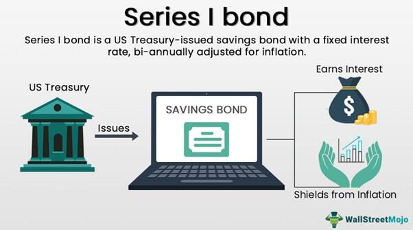

The financial landscape is constantly evolving, merging traditional instruments with cutting-edge technologies to optimize investment strategies. This intersection is particularly evident in how savings bonds, long a staple of conservative investment portfolios, are now being integrated with modern algorithmic trading approaches.

Savings bonds have traditionally been a method for individuals to incrementally grow their assets with minimal risk. Issued by governments, these bonds are considered one of the safest forms of investment, primarily due to their government backing. They serve as a reliable means to preserve capital and achieve steady returns over the long term, making them an integral part of many traditional investment plans. The predictable nature of savings bonds, including their set interest rates and maturity timelines, allows investors to plan effectively around them, providing a stable cornerstone around which other, more volatile investments can be arranged.



Algorithmic trading, on the other hand, represents a dynamic shift in how investments, including bonds, are managed. By leveraging algorithms, investors can automate trades based on predefined criteria, capitalizing on market movements with increased speed and precision. The primary advantage of algorithmic trading lies in its ability to process large datasets and execute trades at high velocities, a task beyond human capabilities. Its application in managing bond portfolios, including savings bonds, allows for optimization of investment timing and allocation, potentially enhancing returns while maintaining desired risk levels.

The integration of algorithmic trading in bond investments marks a significant evolution in financial management. Whereas traditional savings bonds provide stability, algorithmic trading offers efficiency and the potential for more strategic asset management. By utilizing algorithms, investors can target specific yield curves or duration strategies, dynamically adjusting their portfolios in response to market changes.

In summary, the synergy between savings bonds and algorithmic trading encapsulates both the security of conventional investment vehicles and the innovation of modern technology. This intersection allows for the crafting of sophisticated investment plans that benefit from the stability of bonds combined with the strategic advantages offered by algorithmic trading. As financial markets continue to develop, understanding and harnessing this synergy will be crucial for investors seeking robust, diversified portfolios.

## Table of Contents

## Understanding Savings Bonds

Savings bonds are a form of government debt securities provided by the U.S. Department of the Treasury, primarily aimed at personal investment. These bonds are highly regarded for their safety, ease of purchase, and tax advantages, making them an essential part of many conservative investment portfolios. Unlike other securities, savings bonds do not pay periodic interest. Instead, they accrue interest, compounded semi-annually, until they mature or are redeemed. 

### Types of Savings Bonds: Series EE and Series I

Savings bonds are primarily available in two series: Series EE and Series I. Each series features distinct characteristics tailored to different investment strategies:

**Series EE Bonds:** These are considered the standard savings bond. Purchased at face value, Series EE bonds promise to double in value over 20 years. If the bond has not doubled at its maturity date, the Treasury Department will make an adjustment to ensure it does. The interest accrued is compounded semi-annually and, if held for the full term of 30 years, continues to earn interest for an additional 10 years after maturity.

**Series I Bonds:** Series I bonds offer a combination of a fixed interest rate and a variable inflation-adjusted rate. The inflation rate is updated every six months, based on changes in the Consumer Price Index for All Urban Consumers (CPI-U). This feature helps protect against inflation, ensuring that the purchasing power of the initial investment is preserved.

### Bond Interest Accumulation and Tax Implications

Interest on savings bonds grows over time and is exempt from state and local taxes, offering a significant tax advantage compared to other investments. Federal taxes on both the original investment and earned interest are only due when the bonds are cashed in, or they reach maturity, aligning with an investor's financial planning needs.

Savings bonds also present an opportunity for tax benefits in qualifying education expenses. Through the Education Savings Bond Program, individuals can exclude all or part of the interest from income tax if the bonds are used for eligible tuition and fees at qualified educational institutions.

This tax deferral feature is advantageous for investors seeking efficient estate planning or those who anticipate being in a lower tax bracket in the future. By holding bonds until maturity or strategic redemption times, investors can manage their taxable income effectively, aligning it with broader financial goals.

## Creating a Savings Bonds Investment Plan

To create a savings bonds investment plan, it is essential to follow a structured approach that considers both the immediate and long-term benefits these financial instruments offer. Saving bonds, particularly U.S. Series EE and Series I bonds, are low-risk securities that can bolster an investment portfolio's stability and diversification.

### Step-by-Step Process of Setting Up a Savings Bonds Investment Plan

1. **Assess Financial Goals and Resources**: Before investing, identify your financial objectives. Savings bonds are ideal for goals with a long-term horizon due to their interest accumulation over time. Evaluate available resources to determine how much you can allocate to bonds.

2. **Research Bond Types**: Understand the distinguishing features of Series EE and Series I bonds. Series EE bonds offer a fixed interest rate and are guaranteed to double in value after 20 years. Series I bonds, on the other hand, provide a combination of a fixed rate and an inflation-adjusted rate, protecting against inflation.

3. **Procure Bonds Through TreasuryDirect**: Open an account on the TreasuryDirect website, the U.S. Department of the Treasury's platform for purchasing savings bonds. Follow the registration prompts, choose your preferred bond type, and select the amount to invest. Note that the annual purchase limit is $10,000 per bond type per Social Security Number.

4. **Track and Manage the Investment**: After purchasing, regularly check your bonds' progress through your TreasuryDirect account. Monitor interest accrual and consider reinvesting interest earnings to maximize future returns.

5. **Plan for Tax Implications**: Interest from savings bonds is subject to federal but not state or local taxes. Investors can report interest annually or defer until redemption or maturity, potentially utilizing the Education Savings Bond Program to exclude interest if used for qualified educational expenses.

### Benefits of Long-Term Savings with Bonds

Savings bonds are particularly advantageous for those with a long investment horizon due to the compounding nature of bond interest and protections like the guarantee that EE bonds will double in value if held for 20 years. Over time, investors benefit from steady growth and reduced exposure to market [volatility](/wiki/volatility-trading-strategies) typical of other investments.

### Diversification Through Savings Bonds

Incorporating savings bonds into a broader investment portfolio enhances diversification, offering a stable component amidst more volatile securities, such as stocks. Bonds act as a counterbalance, preserving wealth and mitigating risk during downturns in broader financial markets. By diversifying with savings bonds, investors can achieve a more balanced, resilient portfolio.

## Bond Interest: How It Works

Savings bonds are a popular investment vehicle, primarily due to the way interest is calculated and accrued over time. Understanding this mechanism is essential for investors seeking to maximize their returns.

### Mechanisms Behind Bond Interest Calculation

Savings bonds typically offer a predictable, albeit modest, rate of return. The interest calculation for these bonds varies depending on the type, with Series EE and Series I bonds being the most common.

**Series EE Bonds**:
Series EE bonds are purchased at face value and earn a fixed [interest rate](/wiki/interest-rate-trading-strategies) set at the time of purchase. The U.S. Department of the Treasury guarantees that these bonds will double in value after 20 years, providing an effective annual interest rate if held to that term. If the bond has not doubled in value by the 20-year mark, the Treasury will make a one-time adjustment to reach the promised doubling.

**Interest Formula**:
The interest for Series EE bonds compounds semi-annually. The formula for compound interest is:

$$
A = P \left(1 + \frac{r}{n}\right)^{nt}
$$

Where:
- $A$ is the amount of money accumulated after n years, including interest.
- $P$ is the principal amount (initial amount).
- $r$ is the annual interest rate (as a decimal).
- $n$ is the number of times that interest is compounded per year.
- $t$ is the time in years.

**Series I Bonds**:
Series I bonds are designed to protect against inflation. They earn interest for 30 years with a rate that combines a fixed rate (set at the time of purchase) and a variable inflation rate, which is adjusted every six months. This structure ensures that the bond yield keeps pace with inflation, preserving purchasing power.

### Application of Interest Over Time

**Series EE Bonds**:
Interest is earned monthly and compounded semi-annually, allowing the investor to benefit from the effects of compound growth over time. Since bonds must be held for a minimum of one year before they can be redeemed, and a three-month interest penalty applies if redeemed before five years, understanding these timelines is crucial for optimal returns.

**Series I Bonds**:
The interest is added to the bond's value every six months, meaning that bondholders will see the effect of inflation adjustments twice a year. The dual nature of the interest rate helps in periods of high inflation, though it also means that during periods of low inflation, the return may be modest.

### Strategies to Maximize Interest Earnings

1. **Holding Period**: Maximize your investment by holding bonds to maturity, thus avoiding penalties and ensuring full interest accrual.

2. **Laddering**: Consider using a bond ladder strategy, where bonds of different maturities are purchased. This approach provides regular access to cash, reducing interest rate risk and optimizing interest earnings.

3. **Reinvestment**: Use matured bonds to reinvest into new bonds, this secures compounding benefits and continuous yield accumulation, ideal for long-term wealth accumulation.

4. **Inflation Monitoring**: Especially for Series I bonds, keep an eye on inflation indicators to anticipate interest rate adjustments and time your investments or redemptions when more favorable.

5. **Tax Considerations**: Understand the tax implications, as interest on savings bonds is exempt from state and local taxes. Federal taxes can be deferred until redemption or maturity, allowing a strategy that considers current versus future tax scenarios. 

In conclusion, a solid understanding of how bond interest works is crucial for any investor with savings bonds. By strategically choosing the type of bond and planning the timing of purchase and redemption, investors can significantly enhance their bond investment returns.

 to Algorithmic Trading

Algorithmic trading, a critical development in modern finance, leverages computer algorithms to execute trading strategies with speed and precision. This method of trading replaces traditional manual trading by allowing for the execution of complex trading strategies at scales and speeds beyond human capability. Traders and financial institutions utilize [algorithmic trading](/wiki/algorithmic-trading) to capitalize on a variety of strategies, including [market making](/wiki/market-making), statistical [arbitrage](/wiki/arbitrage), and [trend following](/wiki/trend-following), thereby improving efficiency and reducing transaction costs.

The significance of algorithmic trading in modern finance cannot be overstated. It provides market participants with the tools to process large volumes of market data, identify patterns, and execute trades at optimal prices. By minimizing human intervention, algorithmic trading reduces the potential for human error and biases, contributing to more consistent trading outcomes.

Several key technologies enable the effective implementation of algorithmic trading strategies. At the core are high-frequency trading systems that process vast amounts of data in milliseconds to seek out and exploit fleeting market inefficiencies. These systems rely on ultra-low latency networks and proximity hosting, which position trading servers in close physical proximity to exchanges, thereby minimizing the time it takes for data to travel and ensuring rapid order execution.

Algorithmic trading strategies can be broadly categorized into a few primary types. Statistical arbitrage identifies pricing inefficiencies between related securities and capitalizes on the mean-reverting nature of these discrepancies. Market-making algorithms provide [liquidity](/wiki/liquidity-risk-premium) by offering simultaneous bid and ask prices, [earning](/wiki/earning-announcement) a profit from the spread. Trend-following strategies utilize moving averages and [momentum](/wiki/momentum) indicators to identify and ride long-term market trends. Other advanced strategies include [machine learning](/wiki/machine-learning) models that use historical data to forecast price movements and execute trades.

In terms of optimizing investment portfolios, algorithmic trading offers several advantages. It can systematically rebalance portfolios by dynamically adjusting the allocation of assets based on predefined criteria, thus maintaining desired risk and return profiles. Additionally, algorithms can enhance efficiency by executing large orders over time to minimize market impact, ensuring better pricing and reduced transaction costs.

Algorithmic trading also plays a role in risk management by employing algorithms that can trigger stop-loss orders or hedging strategies automatically, limiting downside risks and protecting portfolio value during volatile market conditions. Moreover, [backtesting](/wiki/backtesting), an essential component of algorithmic trading, allows strategies to be validated against historical data, providing insights into potential returns and risks before deployment in live markets.

In conclusion, algorithmic trading represents a transformative approach in modern finance, offering a more efficient and systematic method of executing trades and managing investment portfolios. Through the integration of cutting-edge technologies and quantitative strategies, it empowers market participants to achieve superior performance and maintain a competitive edge in today's fast-paced trading environment.

## Integrating Algorithmic Trading with Savings Bonds

Savings bonds, traditionally seen as low-risk, long-term investment vehicles, can play a strategic role in algorithmic trading. Integrating savings bonds into algorithmic trading involves leveraging technology to optimize bond purchase, selling, and management strategies. This integration is primarily focused on enhancing efficiency, optimizing returns, and managing risk.

**Inclusion of Savings Bonds in Algorithmic Strategies**

Savings bonds can become a part of algorithmic trading strategies by automating the processes of buying, managing, and selling these bonds based on pre-set conditions and market signals. Algorithms can be designed to monitor interest rate changes, inflation expectations, and policy announcements that might affect bond yields, thereby allowing traders to make timely decisions.

For instance, an algorithm could be designed to automatically purchase Series I bonds when inflation rates rise above a certain threshold, as these bonds are adjusted for inflation. Meanwhile, Series EE bonds could be included based on different market signals, such as a stable low-interest-rate environment, by setting algorithms to trigger purchases when these conditions are met.

**Benefits of Algorithmic Integration**

One significant advantage of using algorithmic trading with savings bonds is enhanced efficiency. Algorithms can conduct trades faster than human traders, reducing latency and taking advantage of small market inefficiencies that might occur momentarily. This speed is crucial as it allows traders to respond almost instantaneously to market movements that affect bond values.

Another benefit is optimization. Algorithmic trading can help manage a portfolio by applying sophisticated mathematical models to maximize returns on savings bonds. For example, algorithms can backtest historical bond performance data to identify the best times to sell or hold bonds, thus optimizing returns over the bond's lifetime.

Furthermore, risk management is inherently improved through algorithmic trading by diversifying investments across different bond types and maturity dates. Algorithms can be constructed to ensure that the investment in savings bonds does not exceed a certain percentage of the total portfolio, maintaining balance and reducing the risk of overexposure to any single asset class.

**Real-World Examples**

For an applied example, consider an algorithm written in Python that automatically analyzes and trades savings bonds based on Treasury yield curves and economic indicators like GDP growth or unemployment rates. Using libraries such as NumPy and Pandas, the algorithm processes data and employs strategies like mean reversion, where it analyses historical trends to predict future movements, adjusting positions in savings bonds accordingly.

```python
import numpy as np
import pandas as pd

def analyze_bond_market(treasury_yield_data, economic_indicators):
    # Load and preprocess data
    yield_df = pd.DataFrame(treasury_yield_data)
    economic_df = pd.DataFrame(economic_indicators)

    # Merge datasets
    merged_data = pd.merge(yield_df, economic_df, on='date')

    # Implement mean reversion strategy
    def mean_reversion_strategy(data):
        # Calculate moving averages
        data['ma_short'] = data['yield'].rolling(window=5).mean()
        data['ma_long'] = data['yield'].rolling(window=20).mean()

        # Generate signals
        data['signal'] = np.where(data['ma_short'] > data['ma_long'], 1, -1)

    mean_reversion_strategy(merged_data)

    # Trading logic based on signals
    positions = []
    for signal in merged_data['signal']:
        if signal == 1:
            positions.append("Buy Series I Bond")
        else:
            positions.append("Hold/Consider Selling")

    return positions

# Example usage
treasury_yield_data = [...]  # Example treasury yield data
economic_indicators = [...]  # Example economic indicator data
positions = analyze_bond_market(treasury_yield_data, economic_indicators)
print(positions)
```

By exploiting these computational strategies, financial institutions and individual traders are equipped to manage savings bond investments more effectively, positioning them to achieve consistent returns and protect against adverse market conditions. Through automation and precision, algorithmic trading bridges the gap between traditional investment methods and modern financial technology, making it a valuable approach in today’s dynamic economic environment.

## Challenges and Risks

Managing savings bonds through algorithmic trading introduces several challenges and risks. One significant challenge is the inherent complexity of integrating relatively stable and traditional financial instruments like savings bonds into a dynamic, algorithm-based trading environment. Savings bonds, especially Series EE and Series I bonds, are designed to be conservative, long-term investments with fixed interest formulas. In contrast, algorithmic trading thrives on market volatility and rapid trade execution, often prioritizing short-term gains. Thus, aligning these two fundamentally different financial ideologies requires sophisticated algorithms capable of balancing these disparate objectives.

The reliance on algorithms for bond investing inherently includes risks such as model errors, data inaccuracies, and unforeseen market conditions. Algorithms are built on historical data and statistical models, which may not always accurately predict future market movements. Model overfitting, where an algorithm becomes too tailored to past data and loses generality, is a prevalent risk. Additionally, since savings bonds are often held until maturity, their low liquidity could pose limitations on an algorithm's ability to execute trades efficiently.

To mitigate these risks, several strategies can be employed. Diversification remains a fundamental approach; combining savings bonds with other assets can reduce overall portfolio risk. Furthermore, algorithmic models can be enhanced with machine learning techniques to adapt to new data patterns, ensuring more robust trading decisions. Regular auditing and back-testing of algorithms are crucial to verify their performance against historical data and to adjust parameters as needed. Implementing stop-loss orders and setting risk limits within algorithms can also help in preventing excessive losses during market downturns.

Another important strategy includes maintaining a human oversight mechanism. Even though algorithmic systems can process vast amounts of data faster than humans, they lack the qualitative judgment and intuition that experienced investors can provide. Thus, incorporating a hybrid approach where human experts monitor algorithmic trading activities can add a layer of security and flexibility.

In conclusion, while incorporating savings bonds into algorithmic trading frameworks offers potential benefits of efficiency and optimization, it requires careful consideration of the associated challenges and risks. By employing rigorous testing, advanced mathematical models, and human oversight, investors can enhance the effectiveness and safety of their bond investment plans.

## Conclusion

The evolution of finance brings together time-tested instruments like savings bonds and cutting-edge technologies such as algorithmic trading, creating a dynamic synergy that benefits investors. Traditional savings bonds, valued for their stability and guaranteed returns, serve as a cornerstone in many investment portfolios. These low-risk financial vehicles offer predictability through fixed interest rates and government backing. However, managing bond investments effectively requires more than just understanding the bonds themselves; it necessitates integrating modern methodologies to maximize potential returns and efficiency.

Algorithmic trading introduces technological advancements that can revolutionize how we approach bond investment management. By leveraging sophisticated algorithms, investors can automate and optimize trading strategies, improving the speed and accuracy of transactions. These algorithms analyze vast amounts of financial data in real-time, identifying trends and making decisions that could outperform traditional investment strategies. When applied to savings bonds, algorithmic trading can enhance the execution of bond investment plans by determining the optimal timing and scale of purchases.

Understanding both investment methodologies is crucial. Grasping the foundational aspects of savings bonds provides a secure base, while embracing algorithmic trading ushers in a forward-thinking approach that can offer competitive advantages. Continuous learning and adaptation are paramount in the ever-evolving financial landscape. As new technologies are developed and market conditions change, staying informed and flexible allows investors to harness both traditional and innovative strategies efficiently.

In conclusion, the integration of traditional savings bonds with modern algorithmic trading reflects the natural progression of financial innovation. This synergy offers a comprehensive framework for managing bond investments that is both secure and adaptive. By continuously learning and adapting, investors can navigate the complexities of the financial markets with confidence and foresight, ensuring resilience and success in their investment endeavors.

## References & Further Reading

1. **Savings Bonds Overview**  
   - U.S. Department of the Treasury's official page on savings bonds: [TreasuryDirect Savings Bonds](https://www.treasurydirect.gov/indiv/products/products.htm)
   - "The Complete Beginner's Guide to Investing in Savings Bonds" by The Motley Fool: [The Motley Fool Guide](https://www.fool.com/investing/how-to-invest/stocks/savings-bonds/)

2. **Investment Planning & Portfolio Diversification**  
   - Investopedia's comprehensive guide to investment planning: [Investment Planning Guide](https://www.investopedia.com/articles/basics/06/investmentplan.asp)
   - "Diversifying Your Portfolio with Bonds" by Forbes: [Forbes Diversification Article](https://www.forbes.com/sites/investor/2020/01/08/diversifying-your-portfolio-with-bonds/)

3. **Bond Interest Calculations**  
   - Detailed explanation of bond interest mechanics on Investopedia: [Bond Interest Rates](https://www.investopedia.com/terms/b/bondinterest.asp)
   - Overview of U.S. Treasury's Series EE and Series I savings bonds with interest accumulation details: [TreasuryDirect Interest Info](https://www.treasurydirect.gov/indiv/research/indepth/ebonds/res_e_bonds.htm)

4. **Algorithmic Trading**  
   - Algorithmic trading introduction by Investopedia: [What is Algorithmic Trading?](https://www.investopedia.com/terms/a/algorithmictrading.asp)
   - "Introduction to Algorithmic Trading Strategies" by QuantStart: [QuantStart Algorithmic Trading Guide](https://www.quantstart.com/articles/What-is-Algorithmic-Trading/)

5. **Integration of Algorithmic Trading and Bonds**  
   - Case study on algorithmic trading applications in bond markets by the Journal of Trading: [Journal of Trading Case Study](https://www.iijournals.com/doi/full/10.3905/jot.2020.15.1.075)
   - Academic paper discussing the optimization of bond portfolios through algorithms: [Optimization in Bond Trading](https://www.sciencedirect.com/science/article/abs/pii/S1057521919303320)

6. **Risks and Challenges of Algorithmic Bond Trading**  
   - "The Risks of Automated Trading in Financial Markets" by the Federal Reserve Bank of New York: [FRB New York Report](https://www.newyorkfed.org/medialibrary/media/research/staff_reports/sr459.pdf)
   - Discussion on algorithmic risk management from the CFA Institute: [CFA Institute Article](https://www.cfainstitute.org/en/research/multimedia/2016/algorithmic-trading-and-its-risks)

These resources provide a comprehensive starting point for further exploration into the intricacies of savings bonds, investment planning, bond interest, and the modern application of algorithmic trading in managing bond portfolios.

