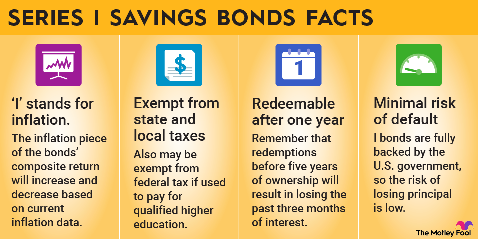

## Table of Contents

## What is a Savings Bond Plan?

A Savings Bond Plan is a way for people to save money by buying bonds from the government. These bonds are like loans that you give to the government, and in return, they promise to pay you back with interest after a certain period. It's a safe way to save because the government guarantees the repayment. People often use savings bonds to save for things like education, retirement, or other long-term goals.

When you buy a savings bond, you choose how long you want to keep it before it matures. The interest on the bond grows over time, and you can cash it in after a minimum period, usually one year. If you hold onto the bond until it fully matures, you get the full value plus all the interest earned. Savings bonds are popular because they are easy to buy, and you don't need a lot of money to start. They are a good choice for anyone looking to save money steadily over time.

## How does a Savings Bond Plan work?

A Savings Bond Plan is a way to save money by buying bonds from the government. When you buy a bond, you are lending money to the government. In return, the government promises to pay you back the money you lent, plus some extra money called interest. The interest grows over time, so the longer you keep the bond, the more money you can earn. You can buy these bonds with as little as $25, making it easy for anyone to start saving.

When you buy a savings bond, you decide how long you want to keep it before it matures. Most bonds have a minimum holding period of one year, but you can keep them for up to 30 years. If you need your money back before the bond matures, you can cash it in, but you might lose some of the interest if you do it too soon. If you wait until the bond fully matures, you get all your money back plus all the interest earned. This makes savings bonds a safe and steady way to save for the future.

## What are the different types of Savings Bonds available?

There are two main types of savings bonds that you can buy from the U.S. government: Series EE and Series I bonds. Series EE bonds are the most common type. When you buy a Series EE bond, it is guaranteed to double in value if you keep it for 20 years. This means if you buy a $50 bond, it will be worth at least $100 after 20 years. The interest rate on Series EE bonds changes every six months, but it's always based on the rate when you bought the bond.

Series I bonds are a bit different. They are designed to protect your savings from inflation, which is when the cost of things goes up. Series I bonds have two parts to their interest rate: a fixed rate that stays the same for the life of the bond, and an inflation rate that changes every six months. This means the interest you earn can go up if prices go up. Both types of bonds are safe because they are backed by the U.S. government, and you can buy them to save for things like education or retirement.

## Who is eligible to purchase Savings Bonds?

Anyone who lives in the United States, including U.S. citizens, U.S. residents, and people with a valid Social Security Number, can buy savings bonds. You don't need to be a certain age to buy them, but if you're under 18, you might need a parent or guardian to help you. You can buy savings bonds for yourself or as a gift for someone else.

You can buy savings bonds online through the TreasuryDirect website, or you can buy Series I bonds with your tax refund. There's a limit to how many you can buy each year. For Series EE bonds, you can buy up to $10,000 a year. For Series I bonds, you can buy up to $10,000 a year online and another $5,000 with your tax refund. This makes savings bonds a great way for many people to save money safely.

## How can someone buy a Savings Bond?

You can buy a savings bond online through the TreasuryDirect website. First, you need to create an account on the website. You'll need to provide your personal information, like your name, address, and Social Security Number. Once your account is set up, you can buy Series EE or Series I bonds. You can choose how much you want to spend, starting from as little as $25. You can pay using a bank account or debit card. After you buy the bond, it will be stored in your TreasuryDirect account until you decide to cash it in.

You can also buy Series I bonds with your tax refund. When you file your taxes, you can choose to use part or all of your refund to buy these bonds. You'll need to fill out Form 8888 with your tax return to do this. You can buy up to $5,000 in Series I bonds this way each year. This is a good option if you want to save some of your tax refund for the future. Both ways of buying savings bonds are easy and safe, and they help you save money over time.

## What are the benefits of investing in Savings Bonds?

Investing in savings bonds has many benefits. One big benefit is that they are very safe. Savings bonds are backed by the U.S. government, so you know you will get your money back. This makes them a good choice if you want to save money without taking big risks. Another benefit is that you can start saving with just a little bit of money. You can buy a bond for as little as $25, so anyone can start saving.

Savings bonds also help your money grow over time. They earn interest, which means you get more money back than you put in. With Series EE bonds, your money is guaranteed to double in 20 years. Series I bonds protect your savings from inflation, so your money keeps its value even if prices go up. These features make savings bonds a good way to save for long-term goals like education or retirement.

## What are the risks associated with Savings Bonds?

Savings bonds are very safe because they are backed by the U.S. government. This means you will get your money back, plus interest. But there are some risks you should know about. One risk is that you might need your money before the bond matures. If you cash in a bond within the first five years, you lose the last three months of interest. This means you get less money back than you might have expected.

Another risk is that the interest rates on savings bonds might be lower than other types of investments. If you want to earn more money quickly, savings bonds might not be the best choice. They are better for saving money slowly over a long time. So, while savings bonds are a safe way to save, you need to think about when you will need the money and if the interest rates are good enough for your goals.

## How is the interest on Savings Bonds calculated and paid?

Interest on savings bonds is calculated differently depending on whether you have a Series EE or Series I bond. For Series EE bonds, the interest rate is set when you buy the bond and changes every six months after that. The interest is added to the bond every month, but you don't get the money until you cash in the bond. The bond is guaranteed to double in value if you keep it for 20 years, so if you buy a $50 bond, it will be worth at least $100 after 20 years.

Series I bonds work a bit differently. They have two parts to their interest rate: a fixed rate and an inflation rate. The fixed rate stays the same for the life of the bond, while the inflation rate changes every six months. Like Series EE bonds, the interest is added to the bond every month, and you get all the interest when you cash in the bond. This means your money can grow faster if prices are going up. Both types of bonds let your savings grow over time, but they do it in slightly different ways.

## Can Savings Bonds be used as part of a broader investment strategy?

Yes, savings bonds can be a good part of a bigger plan for saving and investing money. They are very safe because they are backed by the U.S. government. This means you will get your money back, plus some extra money called interest. Savings bonds are good for saving money over a long time, like for things like education or retirement. They can be a steady part of your savings plan, helping you save money without taking big risks.

But savings bonds might not be the best choice if you want to grow your money fast. They usually have lower interest rates than other types of investments like stocks or mutual funds. So, a good plan might be to use savings bonds for the safe part of your savings, and then use other investments that might grow faster for other parts of your money. This way, you can have a mix of safe savings and investments that might give you more money over time.

## What are the tax implications of owning Savings Bonds?

When you own savings bonds, you have to think about taxes. The interest you earn on savings bonds is not taxed by the state or local governments. But, you do have to pay federal taxes on the interest. You can choose to pay the federal taxes on the interest every year, or you can wait until you cash in the bond or it matures. If you wait, you might have to pay a bigger tax bill all at once, but it can be easier because you don't have to worry about it every year.

There's a special rule for using savings bonds to pay for education. If you use the money from Series EE or Series I bonds to pay for college or other higher education costs, you might not have to pay any federal taxes on the interest. To do this, you need to meet some rules, like not earning too much money and using the money for things like tuition and fees. This can make savings bonds a good choice if you are saving for school.

## How can one redeem or cash in Savings Bonds?

To redeem or cash in your savings bonds, you can do it online if you bought them through TreasuryDirect. Just log into your account, find the bonds you want to cash in, and follow the steps to get your money. The money will go into the bank account you have linked to your TreasuryDirect account. It's easy and fast, but make sure you know that if you cash in a bond within the first five years, you will lose the last three months of interest.

If you have paper savings bonds, you can take them to your bank or a local financial institution. They will help you cash them in. You will need to show your ID and fill out some forms. The bank will give you the money, but again, if you cash in the bond before it's been five years, you will lose the last three months of interest. It's a good idea to wait until the bond has been held for at least five years to get all the interest you earned.

## What advanced strategies can be employed to maximize returns from Savings Bonds?

To get the most out of your savings bonds, you can use a few smart strategies. One good idea is to buy Series I bonds when inflation is high. These bonds have an interest rate that changes to keep up with inflation, so your money can grow faster when prices are going up. Another strategy is to buy Series EE bonds and hold them for at least 20 years. These bonds are guaranteed to double in value after 20 years, so if you can wait that long, you will get a lot more money back.

Another way to make the most of your savings bonds is to use them as part of a bigger plan for saving and investing. You can keep savings bonds as the safe part of your savings, and then use other investments like stocks or mutual funds to grow your money faster. This way, you have a mix of safe savings and investments that might give you more money over time. Also, think about when you will need the money. If you can wait a long time, savings bonds can be a good choice because they grow slowly but steadily.

## How does bond interest work?

Savings bonds are a popular investment vehicle, primarily due to the way interest is calculated and accrued over time. Understanding this mechanism is essential for investors seeking to maximize their returns.

### Mechanisms Behind Bond Interest Calculation

Savings bonds typically offer a predictable, albeit modest, rate of return. The interest calculation for these bonds varies depending on the type, with Series EE and Series I bonds being the most common.

**Series EE Bonds**:
Series EE bonds are purchased at face value and earn a fixed [interest rate](/wiki/interest-rate-trading-strategies) set at the time of purchase. The U.S. Department of the Treasury guarantees that these bonds will double in value after 20 years, providing an effective annual interest rate if held to that term. If the bond has not doubled in value by the 20-year mark, the Treasury will make a one-time adjustment to reach the promised doubling.

**Interest Formula**:
The interest for Series EE bonds compounds semi-annually. The formula for compound interest is:

$$
A = P \left(1 + \frac{r}{n}\right)^{nt}
$$

Where:
- $A$ is the amount of money accumulated after n years, including interest.
- $P$ is the principal amount (initial amount).
- $r$ is the annual interest rate (as a decimal).
- $n$ is the number of times that interest is compounded per year.
- $t$ is the time in years.

**Series I Bonds**:
Series I bonds are designed to protect against inflation. They earn interest for 30 years with a rate that combines a fixed rate (set at the time of purchase) and a variable inflation rate, which is adjusted every six months. This structure ensures that the bond yield keeps pace with inflation, preserving purchasing power.

### Application of Interest Over Time

**Series EE Bonds**:
Interest is earned monthly and compounded semi-annually, allowing the investor to benefit from the effects of compound growth over time. Since bonds must be held for a minimum of one year before they can be redeemed, and a three-month interest penalty applies if redeemed before five years, understanding these timelines is crucial for optimal returns.

**Series I Bonds**:
The interest is added to the bond's value every six months, meaning that bondholders will see the effect of inflation adjustments twice a year. The dual nature of the interest rate helps in periods of high inflation, though it also means that during periods of low inflation, the return may be modest.

### Strategies to Maximize Interest Earnings

1. **Holding Period**: Maximize your investment by holding bonds to maturity, thus avoiding penalties and ensuring full interest accrual.

2. **Laddering**: Consider using a bond ladder strategy, where bonds of different maturities are purchased. This approach provides regular access to cash, reducing interest rate risk and optimizing interest earnings.

3. **Reinvestment**: Use matured bonds to reinvest into new bonds, this secures compounding benefits and continuous yield accumulation, ideal for long-term wealth accumulation.

4. **Inflation Monitoring**: Especially for Series I bonds, keep an eye on inflation indicators to anticipate interest rate adjustments and time your investments or redemptions when more favorable.

5. **Tax Considerations**: Understand the tax implications, as interest on savings bonds is exempt from state and local taxes. Federal taxes can be deferred until redemption or maturity, allowing a strategy that considers current versus future tax scenarios. 

In conclusion, a solid understanding of how bond interest works is crucial for any investor with savings bonds. By strategically choosing the type of bond and planning the timing of purchase and redemption, investors can significantly enhance their bond investment returns.

 to Algorithmic Trading

Algorithmic trading, a critical development in modern finance, leverages computer algorithms to execute trading strategies with speed and precision. This method of trading replaces traditional manual trading by allowing for the execution of complex trading strategies at scales and speeds beyond human capability. Traders and financial institutions utilize [algorithmic trading](/wiki/algorithmic-trading) to capitalize on a variety of strategies, including [market making](/wiki/market-making), statistical [arbitrage](/wiki/arbitrage), and [trend following](/wiki/trend-following), thereby improving efficiency and reducing transaction costs.

The significance of algorithmic trading in modern finance cannot be overstated. It provides market participants with the tools to process large volumes of market data, identify patterns, and execute trades at optimal prices. By minimizing human intervention, algorithmic trading reduces the potential for human error and biases, contributing to more consistent trading outcomes.

Several key technologies enable the effective implementation of algorithmic trading strategies. At the core are high-frequency trading systems that process vast amounts of data in milliseconds to seek out and exploit fleeting market inefficiencies. These systems rely on ultra-low latency networks and proximity hosting, which position trading servers in close physical proximity to exchanges, thereby minimizing the time it takes for data to travel and ensuring rapid order execution.

Algorithmic trading strategies can be broadly categorized into a few primary types. Statistical arbitrage identifies pricing inefficiencies between related securities and capitalizes on the mean-reverting nature of these discrepancies. Market-making algorithms provide [liquidity](/wiki/liquidity-risk-premium) by offering simultaneous bid and ask prices, [earning](/wiki/earning-announcement) a profit from the spread. Trend-following strategies utilize moving averages and [momentum](/wiki/momentum) indicators to identify and ride long-term market trends. Other advanced strategies include [machine learning](/wiki/machine-learning) models that use historical data to forecast price movements and execute trades.

In terms of optimizing investment portfolios, algorithmic trading offers several advantages. It can systematically rebalance portfolios by dynamically adjusting the allocation of assets based on predefined criteria, thus maintaining desired risk and return profiles. Additionally, algorithms can enhance efficiency by executing large orders over time to minimize market impact, ensuring better pricing and reduced transaction costs.

Algorithmic trading also plays a role in risk management by employing algorithms that can trigger stop-loss orders or hedging strategies automatically, limiting downside risks and protecting portfolio value during volatile market conditions. Moreover, [backtesting](/wiki/backtesting), an essential component of algorithmic trading, allows strategies to be validated against historical data, providing insights into potential returns and risks before deployment in live markets.

In conclusion, algorithmic trading represents a transformative approach in modern finance, offering a more efficient and systematic method of executing trades and managing investment portfolios. Through the integration of cutting-edge technologies and quantitative strategies, it empowers market participants to achieve superior performance and maintain a competitive edge in today's fast-paced trading environment.

## References & Further Reading

1. **Savings Bonds Overview**  
   - U.S. Department of the Treasury's official page on savings bonds: [TreasuryDirect Savings Bonds](https://www.treasurydirect.gov/indiv/products/products.htm)
   - "The Complete Beginner's Guide to Investing in Savings Bonds" by The Motley Fool: [The Motley Fool Guide](https://www.fool.com/investing/how-to-invest/stocks/savings-bonds/)

2. **Investment Planning & Portfolio Diversification**  
   - Investopedia's comprehensive guide to investment planning: [Investment Planning Guide](https://www.investopedia.com/articles/basics/06/investmentplan.asp)
   - "Diversifying Your Portfolio with Bonds" by Forbes: [Forbes Diversification Article](https://www.forbes.com/sites/investor/2020/01/08/diversifying-your-portfolio-with-bonds/)

3. **Bond Interest Calculations**  
   - Detailed explanation of bond interest mechanics on Investopedia: [Bond Interest Rates](https://www.investopedia.com/terms/b/bondinterest.asp)
   - Overview of U.S. Treasury's Series EE and Series I savings bonds with interest accumulation details: [TreasuryDirect Interest Info](https://www.treasurydirect.gov/indiv/research/indepth/ebonds/res_e_bonds.htm)

4. **Algorithmic Trading**  
   - Algorithmic trading introduction by Investopedia: [What is Algorithmic Trading?](https://www.investopedia.com/terms/a/algorithmictrading.asp)
   - "Introduction to Algorithmic Trading Strategies" by QuantStart: [QuantStart Algorithmic Trading Guide](https://www.quantstart.com/articles/What-is-Algorithmic-Trading/)

5. **Integration of Algorithmic Trading and Bonds**  
   - Case study on algorithmic trading applications in bond markets by the Journal of Trading: [Journal of Trading Case Study](https://www.iijournals.com/doi/full/10.3905/jot.2020.15.1.075)
   - Academic paper discussing the optimization of bond portfolios through algorithms: [Optimization in Bond Trading](https://www.sciencedirect.com/science/article/abs/pii/S1057521919303320)

6. **Risks and Challenges of Algorithmic Bond Trading**  
   - "The Risks of Automated Trading in Financial Markets" by the Federal Reserve Bank of New York: [FRB New York Report](https://www.newyorkfed.org/medialibrary/media/research/staff_reports/sr459.pdf)
   - Discussion on algorithmic risk management from the CFA Institute: [CFA Institute Article](https://www.cfainstitute.org/en/research/multimedia/2016/algorithmic-trading-and-its-risks)

These resources provide a comprehensive starting point for further exploration into the intricacies of savings bonds, investment planning, bond interest, and the modern application of algorithmic trading in managing bond portfolios.

