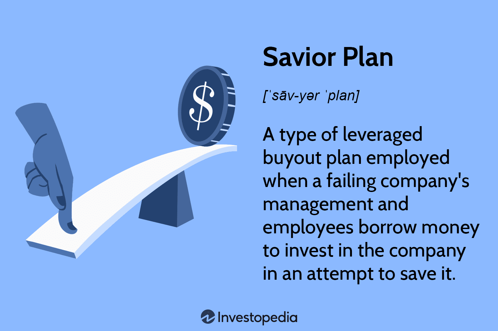

Algorithmic trading, often referred to as algo trading, involves the use of complex algorithms to automatically execute trades with enhanced efficiency and rapidity. These algorithms analyze numerous market variables, identify trading opportunities, and execute buy or sell orders at optimal timings. This technological innovation has transformed traditional trading practices by reducing the need for manual order placement, thus increasing the speed and accuracy of trade execution.

Strategic planning in algorithmic trading necessitates a thorough comprehension of the underlying trading objectives and market dynamics. It requires the alignment of technological tools with the overarching financial goals, ensuring that the algorithmic systems are designed not just for operational proficiencies but also for achieving targeted investment outcomes. The strategic elements encompass a careful assessment of market trends, liquidity conditions, and the chosen financial instruments, thus allowing traders to design algorithms that are responsive to market changes.



This article aims to provide an overview of strategic planning within the context of algorithmic trading, highlighting the significance of the Savior Plan, which serves as a strategic framework. The Savior Plan plays a crucial role in guiding the development of robust trading algorithms by focusing on sustainable and resilient financial strategies. Through its focus on strategic buyouts, it underscores the importance of converting financial setbacks into growth opportunities.

We will outline the essential steps involved in developing and implementing an effective algorithmic trading strategy. These steps include the formulation of precise computation models, backtesting through historical data to validate algorithm reliability, and the continuous optimization of strategies to adapt to real-time market conditions. A meticulous approach to these activities can bolster the effectiveness of trading systems and amplify financial performance.

By leveraging algorithmic trading systems, investors can optimize their financial outcomes while effectively managing potential risks. This involves executing trades based on predefined criteria and utilizing data-driven insights to maximize returns while minimizing exposure to market volatility. The strategic use of algorithms can therefore result in enhanced decision-making, enabling investors to achieve greater financial resilience and success. 

Through a structured approach to strategic planning in algo trading, this article seeks to equip investors and financial professionals with the knowledge to navigate the complexities of today’s financial markets.

## Table of Contents

## Understanding the Savior Plan

A Savior Plan is a strategic financial approach employed primarily as a leveraged buyout mechanism to rescue struggling companies. This strategy involves transforming these companies into employee-owned entities, thereby incentivizing both management and employees to contribute to the revitalization of the business. The crux of a Savior Plan hinges on the management and employees' ability to borrow adequate funds to reinvest in the enterprise. This reinvestment is intended to stabilize and turn around the company’s operations. 

The implementation of a Savior Plan, while potentially transformative, is fraught with challenges. One of the primary risks is the high cost of borrowing, as the loans required to purchase the company can introduce significant financial burden. Furthermore, there is the risk of inheriting the existing debts of the business, which can further complicate efforts to restore profitability and operational efficiency. The implications of these financial obligations necessitate a careful assessment of the company’s debt structure and potential cash flow to ensure sustainable operations post-buyout.

Despite these challenges, successful execution of Savior Plans can result in substantial benefits, particularly within startup environments. By aligning the interests of employees with the company’s success, there is often an increase in motivation, productivity, and innovation, leading to enhanced company performance. This transformation can revitalize the company, providing a clear pathway to improved profitability and operational efficiency. Moreover, this model empowers employees, fostering a culture of ownership and accountability, which can prove to be a crucial advantage in navigating the complexities and uncertainties of the modern business landscape.

## Strategic Planning for Algo Trading

Effective strategic planning for [algorithmic trading](/wiki/algorithmic-trading) begins with the identification of the target market. Understanding the market dynamics and selecting a niche allows traders to focus on specific financial instruments or market segments, enhancing precision and effectiveness. This involves analyzing historical data patterns, current market trends, and potential opportunities for [arbitrage](/wiki/arbitrage) or other strategic trades.

Developing unique trading strategies is a crucial next step. These strategies are formulated based on quantitative analysis and often involve mathematical models to predict market behavior. For instance, a trader might use mean reversion strategies, where they assume that the price of a financial instrument will revert to its historical mean. This can be mathematically represented by:

$$
P(t) = \mu + \epsilon(t)
$$

where $P(t)$ is the price at time $t$, $\mu$ is the mean price, and $\epsilon(t)$ is a random error term.

Assessing technical requirements is another essential component of strategic planning. This includes evaluating the computational and network infrastructure necessary to implement trading strategies effectively. Key considerations include the selection of programming languages like Python or C++ for their robust libraries and performance efficiency. Python, in particular, is favored for its extensive support for data manipulation and [machine learning](/wiki/machine-learning) through libraries such as NumPy, pandas, and scikit-learn. A simple example of using Python for data analysis in algorithmic trading is:

```python
import pandas as pd

# Load historical market data
data = pd.read_csv('market_data.csv')

# Calculate moving average
data['moving_average'] = data['price'].rolling(window=20).mean()

# Define trading signals
data['signal'] = 0
data.loc[data['price'] > data['moving_average'], 'signal'] = 1
data.loc[data['price'] < data['moving_average'], 'signal'] = -1
```

A comprehensive business plan is vital, acting as a roadmap that incorporates regulatory compliance, resource allocation, and monitoring of industry trends. This involves understanding the legal framework governing financial markets to ensure all trading activities adhere to regulatory standards. Additionally, the plan should delineate the resources needed, from technology infrastructure to human resources, ensuring that the trading operations are sustainable and scalable.

Successful algo trading strategies must be rigorously backtested and validated before being deployed in live markets. Backtesting involves using historical data to simulate trading strategies, providing insights into their potential effectiveness and pitfalls. An effective [backtesting](/wiki/backtesting) process typically follows steps such as parameter optimization, calibration, and robustness checks. Validation extends this by applying the strategy to out-of-sample data sets to ensure its adaptability to future market conditions.

In summary, strategic planning in algorithmic trading is an intricate process involving market analysis, strategic design, technical evaluation, and compliance adherence. By meticulously crafting each component of this plan, traders can enhance the performance and resilience of their algorithmic trading systems.

## Implementing Algorithmic Trading Systems

Implementing algorithmic trading systems requires careful selection of programming languages and robust risk management practices. Python is often the preferred language due to its rich ecosystem of libraries, such as NumPy, pandas, and SciPy, which facilitate data manipulation and analysis. Additionally, Python's extensive machine learning frameworks like TensorFlow and PyTorch allow traders to develop predictive models, enhancing their trading strategies through data-driven insights.

A critical element in algorithmic trading is setting precise entry and [exit](/wiki/exit-strategy) rules. These rules govern when to buy or sell assets and are typically based on quantitative indicators derived from historical data analysis. For example, traders might employ technical indicators, such as moving averages or RSI (Relative Strength Index), to define these rules. A simple moving average crossover strategy, where a short-term moving average crosses above a long-term moving average, could signal a buy, while a cross below could signal a sell.

Implementing solid risk management practices is crucial for preserving capital and optimizing trading performance. Key risk management techniques include setting stop-loss and take-profit orders, which automatically close positions when specific price levels are reached. This prevents excessive losses during adverse market movements. Position sizing, or determining the amount of capital allocated to each trade, is another vital component, often calculated using formulas like the Kelly Criterion, which optimizes bets based on probability and risk/reward ratios.

Maintaining updated technical infrastructure is paramount for effective algorithmic trading. This includes ensuring low-latency connections to trading platforms, access to real-time market data, and robust backtesting environments. Backtesting allows traders to simulate their strategies on historical data, gauging performance metrics such as Sharpe Ratio or maximum drawdown, and refining them before live deployment.

In summary, successful implementation of algorithmic trading systems requires the confluence of appropriate programming tools, well-defined trading rules, comprehensive risk management, and state-of-the-art technical setups. These components collectively enhance the robustness, efficiency, and profitability of trading operations.

## The Role of the Savior Plan in Trading Strategies

Savior Plans, traditionally utilized as leveraged buyout strategies to rescue failing companies by transforming them into employee-owned entities, offer valuable insights for algorithmic traders. These plans underscore the critical importance of strategic risk management and meticulous execution in financial operations. The adaptability and resilience required to successfully implement Savior Plans can directly inform algorithmic trading strategies, especially in addressing financial uncertainties.

Incorporating elements of strategic buyouts, as seen in Savior Plans, into algorithmic trading involves focusing on long-term sustainability and financial stability. Savior Plans are executed through high levels of debt to finance the buyout process, which necessitates careful risk management to ensure the company can withstand potential financial strains. This approach can be mirrored in algorithmic trading, where leveraging financial instruments often requires balancing potential high returns with significant risk exposure. Algorithmic traders can adopt similar risk assessment frameworks to evaluate the feasibility and potential outcomes of trading strategies effectively.

Adaptability is a cornerstone of the Savior Plan's success in turning companies around. This characteristic is equally essential for algorithmic traders who must adjust strategies in response to rapid market changes and economic conditions. Leveraging data analytics and advanced machine learning tools allows traders to adapt strategies in real-time, mirroring the agility demonstrated in effective Savior Plans. For instance, implementing machine learning algorithms that can process and analyze vast amounts of financial data helps identify emerging trends and market shifts promptly, allowing traders to modify their strategies accordingly.

Furthermore, the focus on stakeholder alignment in Savior Plans — particularly turning employees into owners, thus enhancing motivation and engagement — can inspire algorithmic traders to align their strategies with broader market or investor objectives. This alignment can be realized through developing trading frameworks that prioritize long-term growth over short-term gains, thereby fostering sustainable financial practices.

In essence, the principles derived from Savior Plans, including strategic risk management, adaptability, and stakeholder alignment, can significantly enhance algorithmic trading strategies. These elements ensure that trading activities are not only profitable but also resilient and sustainable, capable of navigating the complexities of modern financial markets.

## Challenges and Solutions in Algo Trading

Algorithmic trading, while offering the potential for high efficiency and speed, inherently faces the challenge of dealing with high market [volatility](/wiki/volatility-trading-strategies) and unpredictability. Market conditions can change rapidly due to geopolitical events, economic data releases, or shifts in investor sentiment, making it difficult for algorithms to consistently execute profitable trades. The inherent complexity of market dynamics demands robust solutions to maintain algo trading effectiveness.

One of the primary solutions for addressing these challenges is the continuous refinement of trading strategies. This involves regularly updating and optimizing algorithms to adapt to new market conditions, improving their predictive accuracy and responsiveness. A prevalent approach is leveraging advanced machine learning algorithms that can analyze vast datasets to identify patterns and trends not immediately apparent to human traders. Machine learning models can be trained to detect these subtle indicators and adjust trading strategies accordingly. For example, [reinforcement learning](/wiki/reinforcement-learning), a type of machine learning where an agent learns to make decisions by taking actions in an environment, can be employed to optimize trade execution over time.

```python
import numpy as np
import pandas as pd
from sklearn.ensemble import RandomForestRegressor

# Sample code for training a machine learning model on financial data
data = pd.read_csv('market_data.csv')
features = data[['price', 'volume', 'volatility', 'momentum']]
target = data['future_price']

# Instantiate and train a Random Forest model
model = RandomForestRegressor(n_estimators=100, random_state=42)
model.fit(features, target)

# Predict future prices based on current market conditions
predictions = model.predict(features)
```

Apart from strategy refinement and the incorporation of machine learning techniques, adapting to regulatory changes and technological advancements remains essential. Financial markets are heavily regulated to ensure fairness and protect investors, and compliance with these regulations is crucial for algorithmic trading entities. Periodic reviews of regulatory frameworks and constant updates to algorithms and software platforms ensure adherence to laws and standards. Additionally, staying abreast of technological innovations, such as improvements in data processing speeds and computational power, can further enhance the performance and competitiveness of trading algorithms.

In conclusion, addressing the challenges of high volatility and market unpredictability in algorithmic trading requires a multifaceted approach. Continuous strategy refinement, leveraging cutting-edge machine learning algorithms, and adapting to regulatory and technological changes are pivotal in ensuring compliance and maintaining a competitive edge in the financial trading sector.

## Conclusion

A well-crafted strategic planning framework is indispensable for successful algorithmic trading. The intricacies of this field demand a comprehensive approach that aligns financial planning with technological innovation to optimize trading outcomes. Algorithmic trading, by nature, relies heavily on efficient execution strategies, which require systematic planning and adaptive measures to thrive in volatile markets.

The Savior Plan offers valuable insights into leveraging strategic buyouts for sustained growth. Although traditionally associated with business turnarounds, the principles of a Savior Plan—such as employee engagement, risk management, and long-term sustainability—are equally applicable to trading strategies. By adopting these principles, algo traders can enhance their risk management processes, ensuring that their strategies are resilient against market fluctuations and poised for consistent performance.

Integrating financial planning, investment strategies, and algorithmic trading allows investors to achieve optimal financial outcomes. This integration involves developing algorithms tailored to specific investment goals while ensuring robust risk management protocols. Investors can harness data analytics and machine learning to adapt strategies dynamically, effectively responding to changing market conditions. This synergy between strategic planning and technology not only enhances trading efficiency but also positions investors for sustained growth and competitive advantage. Through this cohesive approach, algorithmic trading can be transformed from a technical endeavor into a strategic powerhouse, driving financial success in the ever-evolving trading landscape.

## Further Reading and Resources

To enhance your understanding and mastery of algorithmic trading strategies and investment planning, consider engaging in online courses and industry publications. Websites such as Coursera, edX, and Udacity offer specialized courses that focus on various aspects of algorithmic trading, from basic concepts to advanced strategies involving quantitative analysis and machine learning. These platforms often collaborate with top-tier universities and industry leaders, providing valuable insights and practical knowledge.

Staying updated with regulatory developments and technological innovations is crucial for maintaining a competitive edge in the rapidly evolving landscape of financial trading. The U.S. Securities and Exchange Commission (SEC) and the Financial Conduct Authority (FCA) provide crucial updates on regulatory changes and compliance requirements. Additionally, financial news portals such as Bloomberg, Reuters, and Financial Times offer timely information on market trends, financial policies, and technological advancements.

Engaging with communities and forums is a valuable way to exchange insights and experiences with fellow algorithmic traders and financial strategists. Platforms like QuantConnect, Quantopian, and the Algo Trading Reddit community serve as hubs for discussion, support, and collaboration. These forums allow traders to share code, discuss strategies, troubleshoot issues, and stay informed about the latest tools and technologies in algorithmic trading.

Incorporating these resources into your learning and practice routine will not only enhance your knowledge base but also keep you connected to a network of professionals and enthusiasts who are constantly pushing the boundaries of what's possible in algorithmic trading.

## References & Further Reading

[1]: ["Algorithms for Hyper-Parameter Optimization"](https://dl.acm.org/doi/10.5555/2986459.2986743) by Bergstra, J., Bardenet, R., Bengio, Y., & Kégl, B. (2011), Advances in Neural Information Processing Systems 24.

[2]: ["Advances in Financial Machine Learning"](https://www.amazon.com/Advances-Financial-Machine-Learning-Marcos/dp/1119482089) by Marcos Lopez de Prado.

[3]: ["Evidence-Based Technical Analysis: Applying the Scientific Method and Statistical Inference to Trading Signals"](https://www.amazon.com/Evidence-Based-Technical-Analysis-Scientific-Statistical/dp/0470008741) by David Aronson.

[4]: ["Machine Learning for Algorithmic Trading"](https://github.com/stefan-jansen/machine-learning-for-trading) by Stefan Jansen.

[5]: ["Quantitative Trading: How to Build Your Own Algorithmic Trading Business"](https://www.amazon.com/Quantitative-Trading-Build-Algorithmic-Business/dp/1119800064) by Ernest P. Chan.