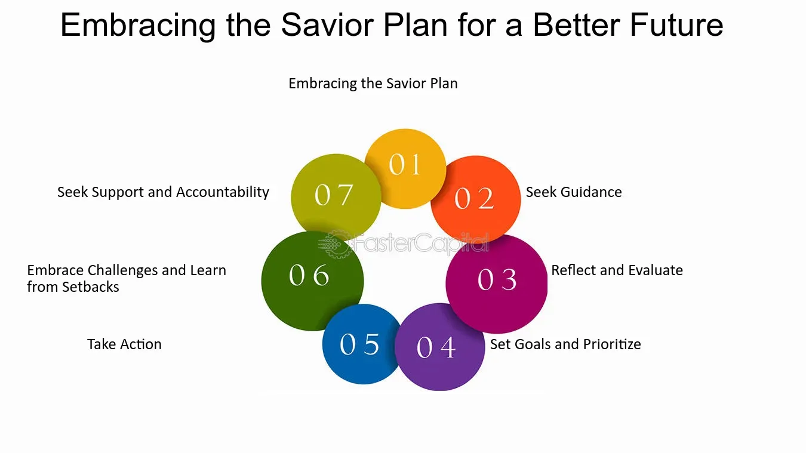

## Table of Contents

## What is the Savior Plan?

The Savior Plan is a religious belief held by members of The Church of Jesus Christ of Latter-day Saints, also known as Mormons. It is their understanding of God's plan for His children, which includes everyone on earth. According to this plan, before we were born, we lived with God as His spirit children. He wanted us to grow and become more like Him, so He created the earth as a place for us to live, learn, and make choices.

In the Savior Plan, Jesus Christ plays a central role. He is seen as the Savior of the world, sent by God to help us overcome sin and death. Through His teachings, example, and sacrifice, Jesus makes it possible for us to return to live with God after we die. This plan teaches that by following Jesus and keeping God's commandments, we can find happiness in this life and eternal life in the next.

## Who can benefit from the Savior Plan?

The Savior Plan is for everyone. It is God's plan to help all people, no matter who they are or where they come from. This plan says that before we were born, we lived with God as His children. He wanted us to grow and learn, so He made the earth for us to live on. Here, we can make choices and learn from them.

Jesus Christ is a big part of the Savior Plan. He is called the Savior because He helps us fix our mistakes and come back to God. By following Jesus and doing what God asks, we can be happy now and live with God forever after we die. So, anyone who wants to can benefit from the Savior Plan by trying to live like Jesus taught.

## How does the Savior Plan work?

The Savior Plan is like a big plan that God made for everyone. Before we were born, we lived with God as His kids. He wanted us to grow up and learn to be more like Him, so He made the earth for us to live on. On earth, we can make choices and learn from them. Some choices are good, and some are not so good. But the important thing is that we learn and grow.

Jesus Christ is a big part of the Savior Plan. He is called the Savior because He helps us fix our mistakes. He came to earth, taught us how to live, and even died for us. Because of what Jesus did, we can say sorry for our mistakes and try to do better. If we follow Jesus and do what God asks, we can be happy now and live with God forever after we die. So, the Savior Plan is all about learning, making choices, and getting help from Jesus to come back to God.

## What are the key components of the Savior Plan?

The Savior Plan is God's big plan for everyone. Before we were born, we lived with God as His kids. He wanted us to grow up and learn to be more like Him, so He made the earth for us to live on. On earth, we get to make choices and learn from them. Some choices are good, and some are not so good. But the important thing is that we learn and grow from what we do.

Jesus Christ is a very important part of the Savior Plan. He is called the Savior because He helps us fix our mistakes. Jesus came to earth, taught us how to live, and even died for us. Because of what Jesus did, we can say sorry for our mistakes and try to do better. If we follow Jesus and do what God asks, we can be happy now and live with God forever after we die. So, the Savior Plan is all about learning, making choices, and getting help from Jesus to come back to God.

## What are the eligibility criteria for the Savior Plan?

The Savior Plan is for everyone, no matter who they are or where they come from. It's God's plan to help all people. Before we were born, we lived with God as His children. He wanted us to grow and learn, so He made the earth for us to live on. Here, we can make choices and learn from them.

To be part of the Savior Plan, you just need to be willing to learn and try to follow Jesus. Jesus is called the Savior because He helps us fix our mistakes. By following Jesus and doing what God asks, we can be happy now and live with God forever after we die. So, anyone who wants to can benefit from the Savior Plan by trying to live like Jesus taught.

## How can someone enroll in the Savior Plan?

Enrolling in the Savior Plan is easy because it's for everyone. You don't need to fill out any forms or go to a special place. All you need to do is want to learn and try to follow Jesus. Jesus is called the Savior because He helps us fix our mistakes. By following Him and doing what God asks, we can be happy now and live with God forever after we die.

Before we were born, we lived with God as His children. He wanted us to grow and learn, so He made the earth for us to live on. Here, we can make choices and learn from them. The Savior Plan is God's way of helping us come back to Him. So, if you want to be part of it, just start by trying to live like Jesus taught.

## What are the costs associated with the Savior Plan?

The Savior Plan doesn't cost any money. It's a gift from God for everyone. All you need to do is want to learn and try to follow Jesus. Jesus is called the Savior because He helps us fix our mistakes. By following Him and doing what God asks, we can be happy now and live with God forever after we die.

Before we were born, we lived with God as His children. He wanted us to grow and learn, so He made the earth for us to live on. Here, we can make choices and learn from them. The Savior Plan is God's way of helping us come back to Him. So, if you want to be part of it, just start by trying to live like Jesus taught.

## What are the potential benefits of participating in the Savior Plan?

Participating in the Savior Plan can bring a lot of good things into your life. It helps you feel happy and at peace because you know that Jesus is there to help you fix your mistakes. When you follow Jesus and do what God asks, you learn to make better choices and become a better person. This can make your life more joyful and meaningful.

Another benefit is that the Savior Plan gives you hope for the future. It teaches that after we die, we can live with God forever if we follow Jesus. This hope can help you through tough times and give you something to look forward to. So, by being part of the Savior Plan, you can find happiness now and have a bright future ahead.

## How does the Savior Plan compare to other similar plans?

The Savior Plan is different from other plans because it's from The Church of Jesus Christ of Latter-day Saints, and it's for everyone. It says that before we were born, we lived with God as His kids. He made the earth for us to learn and grow. Jesus is a big part of this plan because He helps us fix our mistakes. We don't need to pay anything to be part of it; we just need to want to learn and follow Jesus.

Other plans might be from different religions or beliefs. Some might need you to do special things or pay money to join. They might not include the idea that we lived with God before we were born, or they might have different ideas about what happens after we die. The Savior Plan is simple and says that by following Jesus and doing what God asks, we can be happy now and live with God forever after we die.

## What are the long-term implications of the Savior Plan for participants?

The long-term implications of the Savior Plan for participants are all about finding happiness and peace in this life and the next. By following Jesus and trying to do what God asks, people can learn to make better choices and become better people. This can make their lives more joyful and meaningful. They also get help fixing their mistakes because Jesus is there to help them. So, the Savior Plan helps people live happier lives right now.

Another big implication is what happens after we die. The Savior Plan teaches that if we follow Jesus, we can live with God forever after we die. This hope can help people through tough times and give them something to look forward to. It's like knowing that no matter what happens here on earth, there's a bright future waiting for them. So, the Savior Plan gives people hope and a promise of eternal life with God.

## What are some common misconceptions about the Savior Plan?

One common misconception about the Savior Plan is that you have to be perfect to be part of it. But that's not true. The Savior Plan is for everyone, no matter what mistakes they've made. Jesus is called the Savior because He helps us fix our mistakes. So, you don't need to be perfect; you just need to want to learn and try to follow Jesus.

Another misconception is that the Savior Plan is only for people who belong to The Church of Jesus Christ of Latter-day Saints. But the plan is for everyone, no matter who they are or where they come from. Before we were born, we all lived with God as His children, and He made the earth for all of us to learn and grow. So, anyone who wants to can benefit from the Savior Plan by trying to live like Jesus taught.

## How can the effectiveness of the Savior Plan be measured and evaluated?

The effectiveness of the Savior Plan can be measured by looking at how it changes people's lives. When people follow Jesus and try to do what God asks, they often find more happiness and peace. They learn to make better choices and become better people. This can be seen in how they treat others and how they handle life's challenges. So, one way to evaluate the Savior Plan is by seeing how it helps people live more joyful and meaningful lives.

Another way to measure the effectiveness of the Savior Plan is by looking at the hope it gives people for the future. The plan teaches that if we follow Jesus, we can live with God forever after we die. This hope can help people through tough times and give them something to look forward to. So, another way to evaluate the Savior Plan is by seeing how it gives people hope and a promise of eternal life with God.

## What is Strategic Planning for Algo Trading?

Effective strategic planning for [algorithmic trading](/wiki/algorithmic-trading) begins with the identification of the target market. Understanding the market dynamics and selecting a niche allows traders to focus on specific financial instruments or market segments, enhancing precision and effectiveness. This involves analyzing historical data patterns, current market trends, and potential opportunities for [arbitrage](/wiki/arbitrage) or other strategic trades.

Developing unique trading strategies is a crucial next step. These strategies are formulated based on quantitative analysis and often involve mathematical models to predict market behavior. For instance, a trader might use mean reversion strategies, where they assume that the price of a financial instrument will revert to its historical mean. This can be mathematically represented by:

$$
P(t) = \mu + \epsilon(t)
$$

where $P(t)$ is the price at time $t$, $\mu$ is the mean price, and $\epsilon(t)$ is a random error term.

Assessing technical requirements is another essential component of strategic planning. This includes evaluating the computational and network infrastructure necessary to implement trading strategies effectively. Key considerations include the selection of programming languages like Python or C++ for their robust libraries and performance efficiency. Python, in particular, is favored for its extensive support for data manipulation and [machine learning](/wiki/machine-learning) through libraries such as NumPy, pandas, and scikit-learn. A simple example of using Python for data analysis in algorithmic trading is:

```python
import pandas as pd

# Load historical market data
data = pd.read_csv('market_data.csv')

# Calculate moving average
data['moving_average'] = data['price'].rolling(window=20).mean()

# Define trading signals
data['signal'] = 0
data.loc[data['price'] > data['moving_average'], 'signal'] = 1
data.loc[data['price'] < data['moving_average'], 'signal'] = -1
```

A comprehensive business plan is vital, acting as a roadmap that incorporates regulatory compliance, resource allocation, and monitoring of industry trends. This involves understanding the legal framework governing financial markets to ensure all trading activities adhere to regulatory standards. Additionally, the plan should delineate the resources needed, from technology infrastructure to human resources, ensuring that the trading operations are sustainable and scalable.

Successful algo trading strategies must be rigorously backtested and validated before being deployed in live markets. Backtesting involves using historical data to simulate trading strategies, providing insights into their potential effectiveness and pitfalls. An effective [backtesting](/wiki/backtesting) process typically follows steps such as parameter optimization, calibration, and robustness checks. Validation extends this by applying the strategy to out-of-sample data sets to ensure its adaptability to future market conditions.

In summary, strategic planning in algorithmic trading is an intricate process involving market analysis, strategic design, technical evaluation, and compliance adherence. By meticulously crafting each component of this plan, traders can enhance the performance and resilience of their algorithmic trading systems.

## References & Further Reading

[1]: ["Algorithms for Hyper-Parameter Optimization"](https://dl.acm.org/doi/10.5555/2986459.2986743) by Bergstra, J., Bardenet, R., Bengio, Y., & Kégl, B. (2011), Advances in Neural Information Processing Systems 24.

[2]: ["Advances in Financial Machine Learning"](https://www.amazon.com/Advances-Financial-Machine-Learning-Marcos/dp/1119482089) by Marcos Lopez de Prado.

[3]: ["Evidence-Based Technical Analysis: Applying the Scientific Method and Statistical Inference to Trading Signals"](https://www.amazon.com/Evidence-Based-Technical-Analysis-Scientific-Statistical/dp/0470008741) by David Aronson.

[4]: ["Machine Learning for Algorithmic Trading"](https://github.com/stefan-jansen/machine-learning-for-trading) by Stefan Jansen.

[5]: ["Quantitative Trading: How to Build Your Own Algorithmic Trading Business"](https://www.amazon.com/Quantitative-Trading-Build-Algorithmic-Business/dp/1119800064) by Ernest P. Chan.