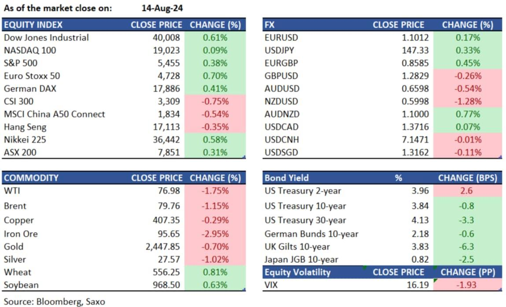

## Table of Contents

## What is Saxo Capital Markets?

Saxo Capital Markets is a company that helps people and businesses invest money. They offer different ways to invest, like trading stocks, forex, and other financial products. They use technology to make investing easier and more accessible for everyone.

The company was started in Denmark and now works all over the world. They focus on giving good service and using new technology to help their customers. Saxo Capital Markets wants to make sure that investing is simple and safe for everyone who uses their services.

## How does Saxo Capital Markets operate in 2024?

In 2024, Saxo Capital Markets continues to help people invest their money easily and safely. They offer different ways to invest, like trading stocks, forex, and other financial products. They use technology to make sure their platform is easy to use and works well for everyone. They also focus on keeping their customers' money and information safe with strong security measures.

Saxo Capital Markets operates all over the world, but they started in Denmark. They work hard to give good service to their customers no matter where they are. They keep updating their technology to make investing simpler and more accessible. This way, more people can use their services to grow their money.

Overall, Saxo Capital Markets in 2024 is all about making investing easy, safe, and available to everyone. They use the latest technology and focus on good customer service to help people reach their financial goals.

## What are the key financial products offered by Saxo Capital Markets in 2024?

In 2024, Saxo Capital Markets offers many key financial products to help people invest their money. They let you trade stocks, which means you can buy and sell parts of companies. They also offer forex trading, where you can exchange one country's money for another's. Another product they have is trading in commodities, like gold or oil. They also provide options for trading bonds, which are loans to governments or companies, and ETFs, which are baskets of different investments.

Saxo Capital Markets also offers more advanced products like futures and options. Futures let you agree to buy or sell something at a set price in the future, while options give you the right, but not the obligation, to do the same. They also have mutual funds, which pool money from many people to invest in different things. All these products are designed to help you grow your money in different ways, depending on what you're comfortable with and what your goals are.

Overall, Saxo Capital Markets aims to give you many choices for investing. Whether you want to trade stocks, forex, or other financial products, they have something for everyone. They use technology to make sure their platform is easy to use and secure, so you can focus on making your money grow.

## How has Saxo Capital Markets' market position changed from 2023 to 2024?

From 2023 to 2024, Saxo Capital Markets has grown its market position by focusing on making their services better and easier to use. They have added more financial products for people to invest in, like stocks, forex, and ETFs. They also use new technology to make their platform work faster and be easier to use. This has helped them attract more customers from all over the world.

In 2024, Saxo Capital Markets is seen as a leader in the online investing world. They keep working on making their customers happy by giving them good service and keeping their money safe. By doing this, they have become more popular and trusted, which has helped them grow their market position even more compared to 2023.

## What are the new trading platforms introduced by Saxo Capital Markets in 2024?

In 2024, Saxo Capital Markets introduced a new trading platform called SaxoTraderGO. This platform is designed to be easy to use, even for people who are new to trading. It works on your phone, tablet, and computer, so you can trade anytime and anywhere. SaxoTraderGO has a simple design that makes it easy to find what you need and start trading quickly.

Another new platform they introduced is SaxoTraderPRO. This one is for people who trade a lot and need more advanced tools. SaxoTraderPRO has lots of features that help you make smart trading decisions. It's fast and lets you customize how you use it, so you can set it up the way you like. Both platforms are made to help you trade better and reach your financial goals.

## How does Saxo Capital Markets ensure regulatory compliance in 2024?

In 2024, Saxo Capital Markets works hard to follow all the rules and laws in the countries where they do business. They make sure their customers' money is safe and that they are clear about how they handle it. They check their own work often to make sure everything is done right. They also work with government groups that watch over financial companies to make sure they are doing everything correctly.

Saxo Capital Markets also trains their employees to know the rules and follow them. They have special teams that keep an eye on new laws and changes, so they can update their ways of working quickly. This helps them stay compliant and keep their customers' trust. By doing all these things, Saxo Capital Markets makes sure they are always following the rules and keeping their business safe and honest.

## What are the major economic factors affecting Saxo Capital Markets in 2024?

In 2024, Saxo Capital Markets is affected by many big economic factors. One important factor is interest rates. When interest rates go up, it can make borrowing money more expensive, which might make people and businesses less likely to invest. This can affect how much trading happens on Saxo's platforms. Another factor is inflation. If prices are going up a lot, people might be more careful with their money and trade less. Saxo Capital Markets has to keep an eye on these things to help their customers make good choices.

Another big factor is the overall health of the global economy. If the economy is doing well, more people might want to invest and trade, which is good for Saxo. But if there's a recession or a big economic problem, people might pull their money out of investments, which can hurt Saxo's business. Also, changes in different countries' economies can affect forex trading, which is a big part of what Saxo offers. Saxo Capital Markets needs to understand these economic factors to help their customers and keep their business strong.

## How does Saxo Capital Markets' risk management strategy look in 2024?

In 2024, Saxo Capital Markets uses a strong risk management strategy to keep their customers' money safe. They watch the market closely and use special tools to spot any big risks. If they see something that could be dangerous, they act fast to protect their customers. They also make sure their customers don't take on too much risk by setting limits on how much they can trade. This helps keep everyone's money safe.

Saxo Capital Markets also trains their employees well so they know how to manage risk. They have teams that check their risk management plans all the time to make sure they are working well. They also use technology to help them manage risk better. By doing all these things, Saxo Capital Markets makes sure they can handle any problems that come up and keep their customers' investments safe.

## What technological advancements has Saxo Capital Markets adopted in 2024?

In 2024, Saxo Capital Markets has made their trading platforms even better with new technology. They introduced SaxoTraderGO, which is easy to use and works on phones, tablets, and computers. This means you can trade anytime and anywhere. They also made SaxoTraderPRO for people who trade a lot and need more advanced tools. Both platforms are fast and easy to use, so you can make smart trading choices quickly.

Saxo Capital Markets also uses new technology to make sure their customers' money and information are safe. They have strong security systems that watch for any problems all the time. They also use technology to manage risk better, so they can spot any big risks and act fast to keep everyone's money safe. By using these new technologies, Saxo Capital Markets helps their customers trade better and reach their financial goals.

## How does Saxo Capital Markets' performance compare to its competitors in 2024?

In 2024, Saxo Capital Markets is doing really well compared to its competitors. They have a lot of customers because they make trading easy and safe. Their new trading platforms, SaxoTraderGO and SaxoTraderPRO, are popular because they work well on phones, tablets, and computers. Saxo also offers many different ways to invest, like stocks, forex, and ETFs, which makes them a good choice for many people. They also use strong security to keep their customers' money safe, which makes people trust them more than some other companies.

Compared to other companies, Saxo Capital Markets is known for its good customer service. They help their customers a lot and make sure they are happy. This is different from some competitors who might not focus as much on service. Saxo also keeps up with new technology, which helps them stay ahead. Other companies might not update their platforms as often, which can make them less easy to use. Overall, Saxo Capital Markets is doing better than many of its competitors in 2024 because they focus on making trading simple, safe, and helpful for everyone.

## What are the expert predictions for Saxo Capital Markets' growth trajectory in 2024?

In 2024, experts think Saxo Capital Markets will keep growing. They believe Saxo will get more customers because their trading platforms are easy to use and work well on phones, tablets, and computers. Saxo also offers many ways to invest, like stocks, forex, and ETFs, which makes them a good choice for many people. Experts say that Saxo's focus on good customer service and strong security will help them attract even more people who want to invest their money safely.

Experts also predict that Saxo Capital Markets will do better than many of its competitors. They think Saxo will stay ahead because they keep updating their technology and making their platforms better. Other companies might not update their platforms as often, which can make them less easy to use. Saxo's focus on making trading simple, safe, and helpful for everyone will help them grow even more in 2024.

## What strategic initiatives has Saxo Capital Markets planned for the future beyond 2024?

Looking beyond 2024, Saxo Capital Markets plans to keep making their trading platforms even better. They want to add more features that help people trade easily and safely. They will also keep using new technology to make sure their platforms work well on phones, tablets, and computers. Saxo wants to offer more ways for people to invest, like new types of stocks, forex, and ETFs. By doing this, they hope to attract even more customers who want to grow their money.

Another big plan for Saxo Capital Markets is to grow in new countries. They want to help more people around the world invest their money. They will work hard to follow the rules in these new places and make sure their customers' money is safe. Saxo also plans to keep their customer service strong, so people feel good about using their services. By focusing on these things, Saxo Capital Markets aims to keep growing and helping more people reach their financial goals in the future.

## References & Further Reading

[1]: Bergstra, J., Bardenet, R., Bengio, Y., & Kégl, B. (2011). ["Algorithms for Hyper-Parameter Optimization."](https://proceedings.neurips.cc/paper/2011/file/86e8f7ab32cfd12577bc2619bc635690-Paper.pdf) Advances in Neural Information Processing Systems 24.

[2]: ["Advances in Financial Machine Learning"](https://www.amazon.com/Advances-Financial-Machine-Learning-Marcos/dp/1119482089) by Marcos Lopez de Prado

[3]: ["Evidence-Based Technical Analysis: Applying the Scientific Method and Statistical Inference to Trading Signals"](https://www.amazon.com/Evidence-Based-Technical-Analysis-Scientific-Statistical/dp/0470008741) by David Aronson

[4]: ["Machine Learning for Algorithmic Trading"](https://github.com/PacktPublishing/Machine-Learning-for-Algorithmic-Trading-Second-Edition) by Stefan Jansen

[5]: ["Quantitative Trading: How to Build Your Own Algorithmic Trading Business"](https://books.google.com/books/about/Quantitative_Trading.html?id=j70yEAAAQBAJ) by Ernest P. Chan