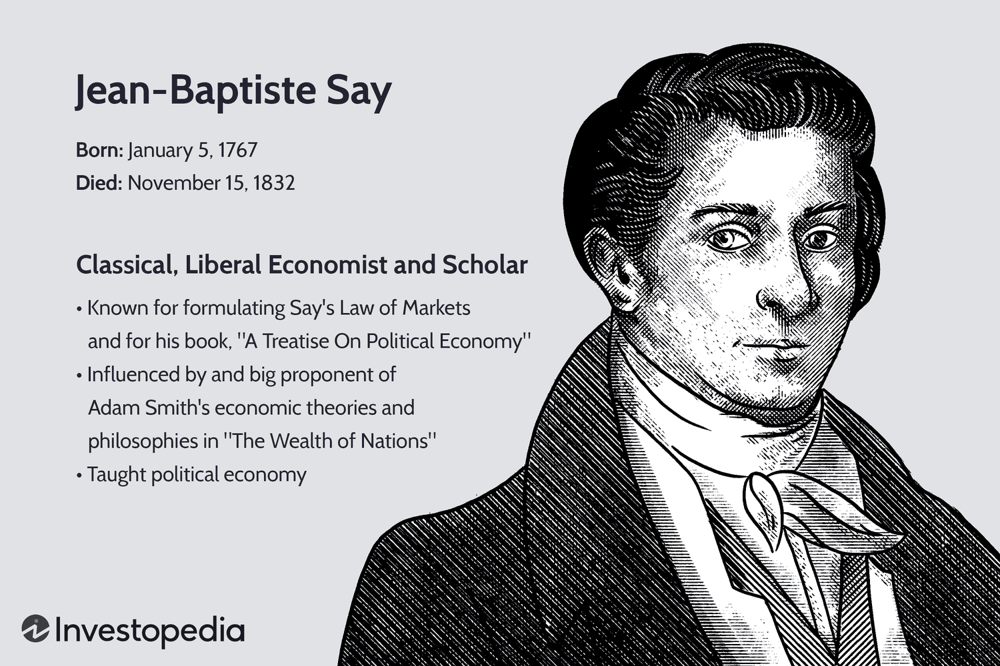

## Table of Contents

## What is Say's Law of Markets?

Say's Law of Markets, also known as Say's Law, is an economic theory named after the French economist Jean-Baptiste Say. The basic idea of Say's Law is that supply creates its own demand. This means that when people produce goods and services, they earn income from that production. With this income, they can then buy other goods and services produced by others. In other words, the act of producing something gives people the means to purchase other things, so there will always be enough demand to match the supply.

This theory suggests that overproduction or general gluts, where there are more goods produced than people want to buy, should not happen in an economy. According to Say, if there is a surplus of one type of good, it means that resources are not being used efficiently and should be moved to produce something else that people do want. Say's Law has been a topic of debate among economists, with some arguing that it does not account for situations like recessions, where demand can fall short of supply due to factors like lack of consumer confidence or high levels of debt.

## Who was Jean-Baptiste Say and why is he important for this theory?

Jean-Baptiste Say was a French economist born in 1767. He is famous for coming up with Say's Law of Markets. Say lived during a time when many big changes were happening in the economy, like the Industrial Revolution. He wrote a lot about how economies work and became well-known for his ideas.

Say's Law is important because it says that when people make things, they also create the money needed to buy other things. This idea is called "supply creates its own demand." Say thought that if there were too many of one thing, people should just start making something else that others want. His theory has been talked about a lot by other economists, even though not everyone agrees with it. It's still an important idea in economics because it helps us think about how production and buying things are connected.

## Can you explain Say's Law in simple terms?

Say's Law is an idea about how the economy works. It says that when people make things, they also create the money they need to buy other things. So, if you make a product and sell it, you get money. With that money, you can buy things that other people made. This means that the stuff people make (supply) will always be bought by someone else (demand).

Sometimes, there might be too much of one thing, like too many apples. But Say's Law says this is okay because people can just start making something else, like oranges, that others want to buy. The important thing is that as long as people are making things, there will be enough money going around for everyone to buy what they need.

## What are the main assumptions behind Say's Law?

Say's Law assumes that when people make things, they earn money from selling those things. This money then allows them to buy other things that other people made. So, the law assumes that making things (supply) will always create enough money for people to buy things (demand). It also assumes that if there is too much of one thing, like too many shoes, people will just start making something else, like hats, that others want to buy.

Another assumption is that the economy always works smoothly without big problems. Say's Law thinks that there won't be times when lots of things are made but no one wants to buy them, like during a recession. It believes that money and goods will always move around well, so everyone can keep making and buying things.

## How does Say's Law relate to supply and demand?

Say's Law is all about how making things (supply) leads to people having money to buy things (demand). It says that when people make stuff and sell it, they get money. With that money, they can buy other stuff that other people made. So, the idea is that making things creates the demand for other things because it gives people money to spend.

This means Say's Law thinks that supply and demand will always balance out. If there are too many of one thing, like too many apples, people will just start making something else, like oranges, that others want to buy. Say's Law assumes that the economy will always work this way, without big problems like recessions where lots of things are made but no one wants to buy them.

## What are the criticisms of Say's Law?

Some people don't agree with Say's Law because they think it doesn't explain what happens during bad times in the economy, like recessions. They say that even if people are making things, there might not be enough demand for those things. For example, if people are worried about losing their jobs, they might not spend their money, even if they have it. This can lead to a lot of things being made but not sold, which goes against Say's idea that supply always creates its own demand.

Another criticism is that Say's Law doesn't think about how money works in the economy. If people keep their money instead of spending it, this can cause problems. Also, if people borrow a lot of money and can't pay it back, it can make the economy slow down. Critics say that Say's Law is too simple and doesn't look at these real problems that can mess up the balance between making things and buying them.

## How has Say's Law influenced economic policy?

Say's Law has had a big impact on how some people think about making economic rules. People who believe in Say's Law think that if the government stays out of the way, the economy will fix itself. They say that if there's too much of one thing, people will just start making something else that others want to buy. This idea has led some leaders to make policies that focus on letting businesses do what they want without too much control from the government. They believe that if people are making things, there will always be enough money going around for everyone to buy what they need.

But not everyone agrees with this way of thinking. Critics of Say's Law say that during bad times, like a recession, the government might need to step in to help. They argue that if people are scared and not spending money, the government could spend money on projects to create jobs and get the economy moving again. This has led to different kinds of economic policies where the government tries to balance out the ups and downs of the economy. So, while Say's Law has influenced some policies, it's also caused a lot of debate about the best way to run an economy.

## Can you provide examples of Say's Law in action?

Imagine a small town where everyone makes something different. One person makes bread, another makes shoes, and someone else makes furniture. According to Say's Law, when the bread maker sells his bread, he gets money. He can use that money to buy shoes or furniture. The same goes for the shoe maker and the furniture maker. They all make things and use the money they earn to buy what they need. This shows how making things (supply) creates the money needed to buy things (demand), just like Say's Law says.

Now think about a bigger example. A factory makes cars and sells them to people. The money from selling the cars goes to the workers and the owners of the factory. Those people then use their money to buy other things, like food, clothes, and maybe even more cars. If there are too many cars and not enough buyers, Say's Law suggests that the factory should start making something else, like bikes or scooters, that people want to buy. This way, the factory keeps making things, and the workers keep [earning](/wiki/earning-announcement) money to spend, keeping the economy moving.

## How does Say's Law differ from Keynesian economics?

Say's Law and Keynesian economics have different ideas about how the economy works. Say's Law says that when people make things, they earn money to buy other things. This means that making stuff (supply) always creates enough want for that stuff (demand). So, Say's Law thinks the economy will fix itself if there's too much of one thing because people can just make something else that others want. It believes the government should not get too involved and let the economy work on its own.

Keynesian economics, on the other hand, says that sometimes the economy can get stuck, and people might not spend their money even if they have it. This can happen during bad times like a recession. Keynesians think the government should step in to help by spending money on projects to create jobs and get people spending again. They believe that demand can be too low, and just making more things won't fix the problem if people aren't buying. So, while Say's Law focuses on supply creating demand, Keynesian economics focuses on making sure there's enough demand to keep the economy going.

## What are the modern interpretations of Say's Law?

Modern interpretations of Say's Law still focus on the idea that making things creates the money needed to buy other things. But today, economists understand that this idea might not always work perfectly. They see that in real life, there can be times when people don't want to spend their money, even if they have it. This can happen during tough economic times, like a recession, when people are worried about the future. So, while Say's Law says supply creates its own demand, modern thinkers know it's not that simple and that other factors, like people's confidence in the economy, play a big role.

Some economists today use Say's Law as a starting point but add more details to it. They look at how money moves around in the economy and how people's choices affect things. They know that if people save too much money instead of spending it, it can slow down the economy. Also, if businesses can't sell what they make, they might have to lay off workers, which can make the problem worse. So, modern interpretations of Say's Law try to balance the old idea with new understanding about how the economy can get stuck and what can be done to help it.

## How does Say's Law apply to international trade?

Say's Law can be used to understand international trade too. It says that when a country makes things, it can sell those things to other countries. When it sells its goods, it gets money. That money can then be used to buy things from other countries. So, just like in a single country, making things in one country creates the money needed to buy things from other countries. This means that if a country is good at making cars, it can sell those cars to other countries and use the money to buy things like electronics or food that it might not make as well.

But, in the real world, international trade can be more complicated. Sometimes, countries might not want to buy as much from other countries as they sell. This can happen if people in one country are saving their money instead of spending it, or if they are worried about their economy. Also, if a country sells too much of one thing and can't sell it all, it might need to start making something else that other countries want to buy. So, while Say's Law gives a simple idea about how international trade could work, it doesn't always explain everything that can happen in the real world of global trade.

## What are the implications of Say's Law for economic growth and employment?

Say's Law suggests that when people make things, they earn money to buy other things. This means that making stuff (supply) creates the money needed to buy stuff (demand). If this idea is true, then making more things should help the economy grow. When a factory makes more cars, for example, it needs more workers to help. These workers get paid and then spend their money on other things, like food and clothes. This spending helps other businesses grow too, which can lead to even more jobs. So, Say's Law says that if people keep making things, the economy will keep growing, and more people will have jobs.

But, in real life, things can be different. Sometimes, even if people are making things, they might not spend their money. This can happen if they are worried about losing their jobs or if they want to save their money instead. If people don't spend, businesses might not sell all the things they make, and they might have to lay off workers. This can slow down the economy and make it hard for people to find jobs. So, while Say's Law says making things should help the economy grow and create jobs, it doesn't always work that way in the real world.

## References & Further Reading

[1]: Say, J. B. (1855). ["A Treatise on Political Economy: or the Production, Distribution, and Consumption of Wealth."](https://archive.org/details/treatiseonpoliti00sayj) G.P. Putnam's Sons.

[2]: Keynes, J. M. (1936). ["The General Theory of Employment, Interest, and Money."](https://www.files.ethz.ch/isn/125515/1366_KeynesTheoryofEmployment.pdf) Macmillan Cambridge University Press.

[3]: Brock, W. A., & Hommes, C. H. (1997). ["A Rational Route to Randomness."](https://www.researchgate.net/publication/4898656_A_Rational_Route_to_Randomness) Econometrica, 65(5), 1059-1095.

[4]: DeLong, J. B., & Summers, L. H. (1986). ["The Demand for Refrigerators in Europe and the United States."](https://www.brookings.edu/wp-content/uploads/2012/03/2012a_DeLong.pdf). National Bureau of Economic Research Working Paper (No. 177).

[5]: Lyons, R. K. (2001). ["The Microstructure Approach to Exchange Rates."](https://direct.mit.edu/books/monograph/2004/The-Microstructure-Approach-to-Exchange-Rates) MIT Press.